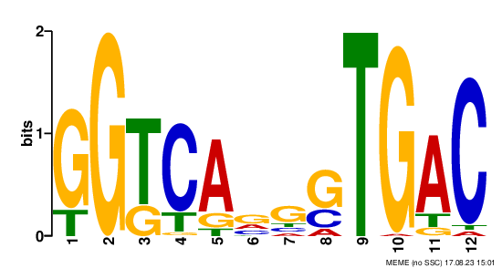
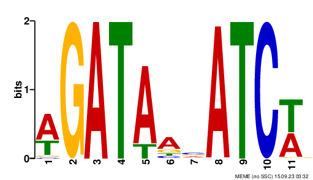
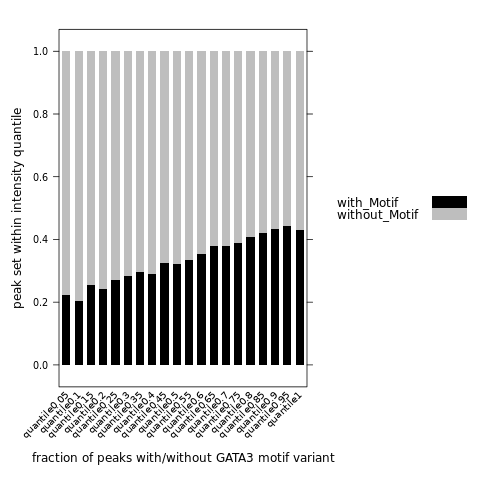

# ChIP-seq experiments

ChIP-seq measures protein abundance on DNA and one can quantify
protein modifications if an antibody to the modification is
available. 

# ChIP-seq experimental design

Controls are important.  An IgG (or mock) IP is superior to input as
a control. I am happy to discuss the design of ChIP-seq experiments 
with you **before** you generate any data. It is much easier to design
the proper experiments and controls and analyze the data compared to
the alternative of trying to salvage poorly controlled experiments.

# Info about this experiment

MCF7 cells with the dTAG-GATA3 (clone522) grow in charcoal stripped media (ER deprived) are treated under 3 conditions: 1) CC: null+null; 2) CE: null+ E2; 3) dE: dTAG+E2. \
Cells are ChIPed with IgG, CTCF, GATA3, ER, respectively; plus an parallel-ChiP of CTCF and ER.

# ChIP-seq processing

## Convert and Rename Data
**Convert form**
```{r engine='bash', eval=F, echo=TRUE}
#Transfer SampleSheet.csv to *_AHVTG3BGXN directory
cd 230922_NB551647_0109_AHTHMJBGXT
module load bcl2fastq
nohup bcl2fastq --runfolder-dir ./ --output-dir ./Data/Intensities/BaseCalls/ --no-lane-splitting
```

**Rename file**
We want to name the experiments with the trailing name being `PE1` or
`PE2` for paired end data. 

```{r engine='bash', eval=F, echo=TRUE}
for i in *_S*R1_001.fastq.gz
do
    nm=$(echo $i | awk -F"/" '{print $NF}' | awk -F"_S" '{print $1}')
    echo $nm
	two=$(echo $i | awk -F"/" '{print $NF}' | awk -F"R1_001.fastq.gz" '{print $1}')
	mv $i ${nm}_PE1.fastq.gz
	mv ${two}R2_001.fastq.gz ${nm}_PE2.fastq.gz
done
```

## check fastq file quality

```{r engine='bash', eval=F, echo=TRUE}
#!/bin/bash
#SBATCH --job-name=fastqc.sh     
#SBATCH -N 1                  
#SBATCH -n 1                 
#SBATCH -c 32                  
#SBATCH -p general           
#SBATCH --qos=general       
#SBATCH --mem=32G               
#SBATCH --mail-type=ALL 
#SBATCH --mail-user=ssun@uchc.edu
#SBATCH -o fastqc.sh_%j.out
#SBATCH -e fastqc.sh_%j.err

#mkdir fastqc_out
#cd fastqc_out
module load fastqc 

for i in ../*fastq.gz
do
  echo $i
  fastqc $i 
done
```
## Cut off the adapter with `cutadapt`

In our daily workflow in the lab we use
`cutadapt` to remove adapter sequences. The options we use below are:

- `-j` for the number of cores to use
- `-m` specifies the minimal length of a read to keep after adapter sequence removal
- `-O` is the number of bases to trim off the end of the read if it overlaps with the adapter sequence 
- `-a` adapter sequence of PE1 reads 
- `-A` adapter sequence of PE2 reads
- `-o` PE1 output file 
- `-p` PE2 output file

If the genome contains 25% of each base, then you would expect one quarter of the
reads that have no adapter to have the trailing base
trimmed. Likewise, approximately 1/16 of the remaining
reads without the adapter will have the final two bases
trimmed. Technically these values are not exact, because the reads with
matches to longer trailing k-mers (in this case 19-mers) would be
removed first, then 18-mer matches removed, etcetera...  \

The `-a` and `-A`
options are the adapter sequences of the PE1 and PE2 reads.  The
output file is `-o` (PE1) and `-p` PE2. The last two positional
areguments are the input `fastq` files. We save the output
to a log file.

```{r engine='bash', eval=F, echo=TRUE}
module load cutadapt
for i in *PE1.fastq.gz
do
    name=$(echo $i | awk -F"/" '{print $NF}' | awk -F"_PE1" '{print $1}')
	echo $name
	echo unzipping $i
	gunzip $i
	echo unzipping ${name}_PE2.fastq.gz
	gunzip ${name}_PE2.fastq.gz
	cutadapt -a AGATCGGAAGAGCACACGTCTGAACTCCAGTCA -A AGATCGGAAGAGCGTCGTGTAGGGAAAGAGTGT -j 8 -m 10 -O 1 -o ${name}_PE1_no_adapt.fastq -p ${name}_PE2_no_adapt.fastq ${name}_PE1.fastq ${name}_PE2.fastq 2>&1 | tee ${name}_cutadapt.log
done
```

## Align to the human genome

First we want to generate a folder in the convenient directory and name it as Genome. We will save all the genome files here. `cd` to this working directory, we are getting reference genome and chrom.sizes file from the USCS genome server, and build the genome index with `bowtie2-build`.

```{r engine='bash', eval=F, echo=TRUE}
#! /bin/sh

#SBATCH --job-name=getrefgenome.sh     # name for job
#SBATCH -N 1
#SBATCH -n 1
#SBATCH -c 32
#SBATCH -p general
#SBATCH --qos=general
#SBATCH --mem=32G
#SBATCH --mail-type=ALL
#SBATCH --mail-user=ssun@uchc.edu
#SBATCH -o getrefgenome.sh_%j.out
#SBATCH -e getrefgenome.sh_%j.err

module load genometools/1.5.10
module load bowtie2
export PATH=$PATH:/home/FCAM/ssun/packages

wget https://hgdownload.cse.ucsc.edu/goldenpath/hg38/bigZips/hg38.fa.gz
gunzip hg38.fa.gz
bowtie2-build hg38.fa hg38

wget https://hgdownload-test.gi.ucsc.edu/goldenPath/hg38/bigZips/hg38.chrom.sizes
```

Now we are aligning to the `hg38.fa` genome. The difference between ChIPseq data and PRO is that the ChIP libraries are paired end. Note the `-1` and
`-2` options for the respective paired-end `fastq` files. There is no
need to save the output `sam` file, so the output is piped to
`samtools` to convert to `bam`, then sorted by name (`-n`) so paired
end reads are adjacent in the file, then piped to `samtools fixmate`
which adds information about the fragment length by comparing the PE1
and PE2 coordinates, then the files are sorted by coordinate, then
piped to `samtools markdup` to remove duplicate reads. Duplicate reads
have the same PE1 and PE2 ends. This is very unlikely to happen by
chance unless you sequence to very high read depth, so these reads are
considered PCR amplicon duplicates. The `fixmate` step is necessary to
pipe to `markdup`. We use the entire DNA fragment for making the
browser tracks, which is accomplished by converted the paired-end
`bam` file to a `bed12` and taking out discordant reads. We also
normalize to read depth. \
```{r engine='bash', eval=F, echo=TRUE}
#!/bin/bash
#SBATCH --job-name=chip_alignment_230925.sh     # name for job
#SBATCH -N 1                  
#SBATCH -n 1                 
#SBATCH -c 32                  
#SBATCH -p amd           
#SBATCH --qos=general       
#SBATCH --mem=32G               
#SBATCH --mail-type=ALL 
#SBATCH --mail-user=ssun@uchc.edu
#SBATCH -o chip_alignment_230925.sh_%j.out
#SBATCH -e chip_alignment_230925.sh_%j.err

hostname

name=230925

# I have seqOutBias and other packages export to my Path
export PATH=$PATH:/home/FCAM/ssun/packages/

module load samtools/1.16.1
module load genometools/1.5.10
module load ucsc_genome/2012.05.22
module load rust
module load bowtie2
module load bedtools


sizes=/home/FCAM/ssun/Genome/hg38.chrom.sizes

genome=/home/FCAM/ssun/Genome/hg38.fa
genome_index=/home/FCAM/ssun/Genome/hg38_bt2/hg38
ncore=32 
tallymer=hg38.tal_42.gtTxt.gz

bowtie2 -p $ncore --maxins 800 -x $genome_index -1 ${name}_PE1_no_adapt.fastq -2 ${name}_PE2_no_adapt.fastq | samtools sort -@ $ncore -n -o ${name}.bw.bam
gzip ${name}_PE1_no_adapt.fastq
gzip ${name}_PE2_no_adapt.fastq
gzip ${name}_PE2.fastq
gzip ${name}_PE1.fastq
samtools fixmate -m ${name}.bw.bam - | samtools sort -@ $ncore - | samtools markdup -s -r - ${name}.hg38.bam
seqOutBias ${genome} ${name}.hg38.bam --shift-counts --no-scale \
                                      --bw=${name}.bigWig --read-size=42 --tallymer=$tallymer 2>&1 | tee ${name}_seqOutBias.log
samtools sort -@ $ncore -n -o ${name}.sorted.bam ${name}.hg38.bam
# the above samtools -n is sorting files by queryname, which is important for the next bedtools bamtobed command with the -bedpe flag; 
# the bedtools bamtobed -bedpe is generating warning signs:
# *****WARNING: Query {...} is marked as paired, but its mate does not occur next to it in your BAM file.  Skipping.
# This might due to some single end sequences, I checked the fraction of these not paired sequences, it is <1.5%, so we don't need to worry.
bedtools bamtobed -i ${name}.sorted.bam -bedpe > ${name}_bed12.bed

awk '$1==$4 {print $0}' ${name}_bed12.bed | awk '{OFS="\t";} {print $1, $2, $6}' | awk '$1!="." && $3>$2 && (($3 - $2)<2000) {print $0}' | sort -k1,1 -k2,2n > ${name}_read_span.bed
genomeCoverageBed -bg -i ${name}_read_span.bed -g $sizes > ${name}.bedGraph
depth=`awk -F'\t' '{sum+=$5;}END{print sum;}' ${name}.hg38_not_scaled.bed`
echo "depth is " $depth
scaled=$(bc <<< "scale=3 ; 10000000 / $depth")
echo "scale is " $scaled
awk -v scaled="$scaled" '{OFS="\t";} {print $1, $2, $3, $4*scaled}' ${name}.bedGraph > ${name}_normalized.bedGraph
wigToBigWig -clip ${name}_normalized.bedGraph $sizes ${name}_normalized.bigWig
echo "complete"
```

## Run the previous chunk in parallel 

Now we are generating tallymer files and table use `seqOutBias` outside the loop, and then run the previous chunk in parallel. \
We need to know the read size of our library. Here the read size is 42.\
```{r engine='bash', eval=F, echo=TRUE}
#Compute mappability for the given read length and the k-mer that corresponds to each possible read alignment position
#time-consuming but only need to run this one time
seqOutBias seqtable hg38.fa --read-size=42


file=chip_alignment_230718.sh 
for i in *_PE1.fastq
do
    nm=$(echo $i | awk -F"/" '{print $NF}' | awk -F"_PE1.fastq" '{print $1}')
    fq=$(echo $i | rev | cut -f 1 -d '/' | rev)
    echo $nm
    echo $fq
    sed -e "s/230925/${nm}/g" "$file" > chip_alignment_${nm}.sh
    sbatch chip_alignment_${nm}.sh
    sleep 1
done

```

### extract the read depth and scale factor from the analysis
```{r engine='bash', eval=F, echo=TRUE}
for i in *chip_alignment*.out
do
  name=$(echo $i | awk -F".sh" '{print $1}')
  echo $name
  echo "scale factor"
  scalee=$(cat $i | tail -1)
  echo $scalee
  echo "read depth"
  depth=$(bc <<< "scale=1 ; 10000000 / $scalee")
  echo $depth
done 2>&1 | tee read_depth.txt
```

```{r engine='bash', eval=F, echo=F}
chip_alignment_MCF7_dTAGGATA522_CTCF_CC_rep1 29411764.7
chip_alignment_MCF7_dTAGGATA522_CTCF_CC_rep2 41152263.3
chip_alignment_MCF7_dTAGGATA522_CTCF_CE_rep1 34722222.2
chip_alignment_MCF7_dTAGGATA522_CTCF_dE_rep1 49751243.7
chip_alignment_MCF7_dTAGGATA522_CTER_CE_rep1 40816326.5
chip_alignment_MCF7_dTAGGATA522_CTER_dE_rep1 47393364.9
chip_alignment_MCF7_dTAGGATA522_ER_CE_rep1 34722222.2
chip_alignment_MCF7_dTAGGATA522_ER_CE_rep2 41152263.3
chip_alignment_MCF7_dTAGGATA522_ER_dE_rep1 36363636.3
chip_alignment_MCF7_dTAGGATA522_GATA_CC_rep1 30581039.7
chip_alignment_MCF7_dTAGGATA522_GATA_CC_rep2 28985507.2
chip_alignment_MCF7_dTAGGATA522_GATA_CC_rep3 30769230.7
chip_alignment_MCF7_dTAGGATA522_GATA_CE_rep1 44642857.1
chip_alignment_MCF7_dTAGGATA522_GATA_dE_rep1 29761904.7

```

<!--
alternative methods:
```{r engine='bash', eval=F, echo=F}
#  average coverage for all covered regions
samtools depth  *bamfile*  |  awk '{sum+=$3} END { print "Average = ",sum/NR}'

# include regions that were not covered in this calculation
samtools depth -a  *bamfile*  |  awk '{sum+=$3} END { print "Average = ",sum/NR}'

# get average X coverage: divide by total size of the genome, instead of dividing by NR in the command above.
samtools view -H *bamfile* | grep -P '^@SQ' | cut -f 3 -d ':' | awk '{sum+=$1} END {print sum}' > totalsize # The total size
samtools depth  *bamfile*  |  awk '{sum+=$3} END { print "Average = ",sum/${totalsize}}'
samtools depth -a *bamfile*  |  awk '{sum+=$3} END { print "Average = ",sum/${totalsize}}'
```
-->

### extract the alignment rate from the analysis
```{r engine='bash', eval=F, echo=TRUE}
for i in *chip_alignment*.err
do
  name=$(echo $i | awk -F".sh" '{print $1}')
  echo $name
  alignrate=$(cat $i | grep "overall alignment rate")
  echo $alignrate
done 2>&1 | tee alignment_rate.txt
```

```{r engine='bash', eval=F, echo=F}
chip_alignment_MCF7_dTAGGATA522_CTCF_CC_rep1
99.19% overall alignment rate
chip_alignment_MCF7_dTAGGATA522_CTCF_CC_rep2
99.12% overall alignment rate
chip_alignment_MCF7_dTAGGATA522_CTCF_CE_rep1
99.09% overall alignment rate
chip_alignment_MCF7_dTAGGATA522_CTCF_dE_rep1
99.11% overall alignment rate
chip_alignment_MCF7_dTAGGATA522_CTER_CE_rep1
99.02% overall alignment rate
chip_alignment_MCF7_dTAGGATA522_CTER_dE_rep1
98.92% overall alignment rate
chip_alignment_MCF7_dTAGGATA522_ER_CE_rep1
98.96% overall alignment rate
chip_alignment_MCF7_dTAGGATA522_ER_CE_rep2
98.96% overall alignment rate
chip_alignment_MCF7_dTAGGATA522_ER_dE_rep1
98.82% overall alignment rate
chip_alignment_MCF7_dTAGGATA522_GATA_CC_rep1
98.88% overall alignment rate
chip_alignment_MCF7_dTAGGATA522_GATA_CC_rep2
98.82% overall alignment rate
chip_alignment_MCF7_dTAGGATA522_GATA_CC_rep3
98.98% overall alignment rate
chip_alignment_MCF7_dTAGGATA522_GATA_CE_rep1
98.97% overall alignment rate
chip_alignment_MCF7_dTAGGATA522_GATA_dE_rep1
98.54% overall alignment rate

```

# Combining replicates for Genome Browser

Usually we combine replicates into a single track for visualization
and we compare the tracks between conditions. It is important that we
read-depth normalize before we combine the signal from each
replicate. Otherwise, we would be weighting replicates differently;
for example, if a library is sequenced to twice the read depth and we
combine first then read depth normalize, then the more high coverage
data is weighted twice as much in the final visualization. All the
relevant track files are here:
[http://guertinlab.cam.uchc.edu/znf143_hub/](http://guertinlab.cam.uchc.edu/znf143_hub/)

```{r engine='bash', eval=F, echo=TRUE}
#!/bin/bash
#SBATCH --job-name=combine_rep.sh     # name for job
#SBATCH -N 1                  
#SBATCH -n 1                 
#SBATCH -c 32                  
#SBATCH -p general           
#SBATCH --qos=general       
#SBATCH --mem=32G               
#SBATCH --mail-type=ALL 
#SBATCH --mail-user=ssun@uchc.edu
#SBATCH -o combine_rep.sh_%j.out
#SBATCH -e combine_rep.sh_%j.err

module load ucsc_genome/2012.05.22
sizes=/home/FCAM/ssun/Genome/hg38.chrom.sizes

for i in *MCF*rep1_PE1.fastq.gz
do
    nm=$(echo $i | awk -F"/" '{print $NF}' | awk -F"_PE1.fastq.gz" '{print $1}')
    name=$(echo $nm | awk -F"_rep1" '{print $1}')
    echo $name
    reps=$(ls ${name}_rep*normalized.bigWig | wc -w | bc)
	echo $reps
    files=$(ls ${name}_rep*normalized.bigWig)
	echo $files
    bigWigMerge $files tmp.bg
    scaleall=$(bc <<< "scale=4 ; 1.0 / $reps")
    echo scale:
    echo $scaleall
    awk -v scaleall="$scaleall" '{OFS="\t";} {print $1, $2, $3, $4*scaleall}' tmp.bg > ${name}_normalized.bedGraph
	rm tmp.bg
	wigToBigWig ${name}_normalized.bedGraph $sizes ${name}.bigWig
    awk -v var="$name" 'BEGIN {  print "browser position chr11:5,289,521-5,291,937"; print "track type=bedGraph name=\"" var "\" description=\"" var "_bedGraph\" visibility=full autoScale=on alwaysZero=on color=0,0,0"}  { print $0}' ${name}_normalized.bedGraph > ${name}_header_normalized.bedGraph
    gzip ${name}_header_normalized.bedGraph
done

# side note: only few files has replicates: CTCF_CC (2 reps), ER_CE (2 reps), and GATA_CC (3reps)
```

```{r engine='bash', eval=F, echo=TRUE}
# we have single replicate for IgG_dE, IgG_CE, and IgG_CC. Here I am trying to merge the three IgG files together

#!/bin/bash
module load ucsc_genome/2012.05.22
sizes=/home/FCAM/ssun/Genome/hg38.chrom.sizes
name=MCF7_dTAGGATA522_IgG
reps=3

files=$(ls ${name}*_normalized.bigWig)
echo $files

bigWigMerge $files tmp.bg
scaleall=$(bc <<< "scale=4 ; 1.0 / $reps")
echo scale:
echo $scaleall
awk -v scaleall="$scaleall" '{OFS="\t";} {print $1, $2, $3, $4*scaleall}' tmp.bg > ${name}_normalized.bedGraph
rm tmp.bg
wigToBigWig ${name}_normalized.bedGraph $sizes ${name}.bigWig
awk -v var="$name" 'BEGIN {  print "browser position chr11:5,289,521-5,291,937"; print "track type=bedGraph name=\"" var "\" description=\"" var "_bedGraph\" visibility=full autoScale=on alwaysZero=on color=0,0,0"}  { print $0}' ${name}_normalized.bedGraph > ${name}_header_normalized.bedGraph
gzip ${name}_header_normalized.bedGraph

```

```{r engine='bash', eval=F, echo=TRUE}
for i in *MCF*PE1.fastq.gz
do
    name=$(echo $i | awk -F"/" '{print $NF}' | awk -F"_PE1.fastq.gz" '{print $1}')
    mkdir ${name}_files
	  mv ${name}* ./${name}_files
done
```

trackhub link for data merged by reps: http://guertinlab.cam.uchc.edu/GATA3_hub/hub.txt \

trackhub link for non-merged data: http://guertinlab.cam.uchc.edu/GATA3_nonmerge_hub/hub.txt \

# Peak calling

We want to call a set of universal peaks for the same ChIP factors. The reasons are: taking intersection of peaks between replicates/conditions will result in high false negative rates. We may lose important binding regions for transcription factor analysis. Here we are doing a compromise to call every peaks on all files and later in downstream analysis we will decide the functional peaks. \

We use `Macs3 callpeaks` to identify TF binding sites. It takes the treatment files against the control genomic input. \
`-t/--treatment FILENAME` takes your treatment file. If there is more than one alignment file, we can specify them as `-t A B C`. MACS will pool up all these files together. \
`-c/--control` takes the control file. Here we pool all the IgG file. \
`-n/--name` is the output name we give. \
`-f/--format FORMAT` we specify BAMPE format for the output. \
`-g/--gsize` is the mappable genome size or effective genome size. The actual mappable genome size is ~70% to 90% of the genome size due to the repetitive features on the chromosomes. Here we use the default hs --2.7e9 (for human genome). \
`-q/--qvalue` is the FDR cutoff to call signidicant regions. \

```{r engine='bash', eval=F, echo=TRUE}
#! /bin/sh
#SBATCH --job-name=chip_peak_calling.sh     # name for job
#SBATCH -N 1
#SBATCH -n 1
#SBATCH -c 2
#SBATCH -p general
#SBATCH --qos=general
#SBATCH --mem=32G
#SBATCH --mail-type=ALL
#SBATCH --mail-user=ssun@uchc.edu
#SBATCH -o chip_peak_calling.sh_%j.out
#SBATCH -e chip_peak_calling.sh_%j.err

hostname
module load macs3

mkdir temp_macs

# CTCF (merged from CTCF_CC_2files, CE, dE); my -c input: IgG (control, merged from IgG_dE,CE,CC)
macs3 callpeak --call-summits -t *_CTCF_*bam -c *IgG*bam -n CTCF_ChIP -g hs -q 0.01 --keep-dup all -f BAMPE --nomodel --tempdir temp_macs
# ER (merged from ER_CE_2files,dE)
macs3 callpeak --call-summits -t *_ER_*bam -c *IgG*bam -n ER_ChIP -g hs -q 0.01 --keep-dup all -f BAMPE --nomodel --tempdir temp_macs
# GATA (merged from GATA_CC,CE)
macs3 callpeak --call-summits -t *GATA_C*bam -c *IgG*bam -n GATActrl_ChIP -g hs -q 0.01 --keep-dup all -f BAMPE --nomodel --tempdir temp_macs
# GATA_degrade (gata_dE)
macs3 callpeak --call-summits -t *GATA_d*bam -c *IgG*bam -n GATAdegrade_ChIP -g hs -q 0.01 --keep-dup all -f BAMPE --nomodel --tempdir temp_macs
# GATA all (merged from GATA_CC,CE,dE)
macs3 callpeak --call-summits -t *_GATA_*bam -c *IgG*bam -n GATA_ChIP -g hs -q 0.01 --keep-dup all -f BAMPE --nomodel --tempdir temp_macs
# CTER
macs3 callpeak --call-summits -t *CTER_*bam -c *IgG*bam -n CTER_ChIP -g hs -q 0.01 --keep-dup all -f BAMPE --nomodel --tempdir temp_macs
```

## Removing peaks on contigs and within blacklisted regions

Google "blacklisted genomic regions" we can find a
set of region in the genome in `bed` format that have an over-representation of
reads regardless of the experiment. We also remove peaks on non-canonical chromosomes with
`grep -v`. \

All intervals in the summits file span one base, and we use `bedtools slop` to change boundaries by adding a fixed number of bases in each direction (`-b`). These 101 base intervals will be used as input for de novo motif analysis. The 401 base intervals will be used to calculate peak intensity. The rationale for a smaller window for motif analysis is the following: \
1) the motif is typically very close to the peak summit, \
2) larger window increases the computation time substantially, and \
3) the flanking sequence is less enriched for the relevant motifs and de novo motif analysis is less sensitive with higher noise relative to background. \

We use a standard window size to calculate peak intensity, but we use a much wider window because signal 200 bases up or downstream can result from signal. We could increase the window to 600 bases and that would be fine as well. You can vary this window systematically and determine if varying the window affects the relative peak intensity rank. We use the same window size for each peak because otherwise wider windows (note the narrowPeaks file outputs are variable width) would inherently have more reads. 

```{r engine='bash', eval=F, echo=TRUE}
#! /bin/sh
#SBATCH --job-name=remove_peak.sh     # name for job
#SBATCH -N 1
#SBATCH -n 1
#SBATCH -c 2
#SBATCH -p general
#SBATCH --qos=general
#SBATCH --mem=32G
#SBATCH --mail-type=ALL
#SBATCH --mail-user=ssun@uchc.edu
#SBATCH -o remove_peak.sh_%j.out
#SBATCH -e remove_peak.sh_%j.err
module load deeptools/3.5.0
module load bedtools
#wget https://github.com/Boyle-Lab/Blacklist/raw/master/lists/hg38-blacklist.v2.bed.gz
#gunzip hg38-blacklist.v2.bed.gz
blacklist=hg38-blacklist.v2.bed
sizes=/home/FCAM/ssun/Genome/hg38.chrom.sizes


for i in *_summits.bed
do
	name=$(echo $i | awk -F"/" '{print $NF}' | awk -F"_summits.bed" '{print $1}')
	echo $name
	grep -v "random" ${name}_summits.bed | grep -v "chrUn" | grep -v "chrEBV" | grep -v "chrM" | grep -v "alt" | intersectBed -v -a - -b $blacklist > ${name}_summits_final.bed
	slopBed -b 50 -i ${name}_summits_final.bed -g $sizes  | sort -k1,1 -k2,2n > ${name}_summit_100window.bed
  slopBed -b 200 -i ${name}_summits_final.bed -g $sizes  | sort -k1,1 -k2,2n > ${name}_summit_400window.bed
done
```

check peak numbers we called for each factor
```{r engine='bash', eval=F, echo=TRUE}
83228 CTCF_ChIP_summits_final.bed
   40993 CTER_ChIP_summits_final.bed
     127 ER_ChIP_summits_final.bed
   65904 GATA_ChIP_summits_final.bed
  # 78974 GATActrl_ChIP_summits_final.bed
  #   374 GATAdegrade_ChIP_summits_final.bed
```


# Check the top De novo motif analysis at universal peak set

De novo motif analysis uses tools like `MEME`, `TOMTOM`, `MAST` and `FIMO` to analyze binding site. The `MEME` analysis suite allows users to indentify (de novo) enriched motifs with a set of sequences, and compare to databases of known motifs; it also allow users to search for motifs of interest within a set of sequences... The user manual and more usage can be found here：https://meme-suite.org/meme/doc/meme.html \

## quality check
In this analysis, we will first convert the coordinate bed file to a sequence fasta file, then we perform de novo motif analysis with `meme`. But first, we want to do a quick quality check by manually looking at the top hit to ensure that it is a GATA motif variant for GATA peaks, and ER motif variant for ER peaks. \
## ER peaks:

Recall that ER set has fewer peaks: using q-value cutoff of 0.01 in `macs3--callpeak` and after removing redundant peaks we only get 127 peaks. So we will `meme` de novo motif analysis search on the entire set.

```{r engine='bash', eval=F, echo=TRUE}
name=ER_ChIP

fastaFromBed -fi $genome -bed ${name}_summit_100window.bed -fo ${name}_summit_100window.fasta
meme -p 16 -oc ${name}_motif.meme_output -nmotifs 1 -objfun classic -csites 20000 -searchsize 0 -minw 5 -maxw 15 -revcomp -dna -markov_order 3 -maxsize 100000000 ${name}_summit_100window.fasta # normal ER mortif is AGGTCA, minw can be set to 6

name=ER05_ChIP
fastaFromBed -fi $genome -bed ${name}_summit_100window.bed -fo ${name}_summit_100window.fasta
meme -p 16 -oc ${name}_motif.meme_output -nmotifs 1 -objfun classic -csites 20000 -searchsize 0 -minw 5 -maxw 15 -revcomp -dna -markov_order 3 -maxsize 100000000 ${name}_summit_100window.fasta
```

by searching ER peaks, we find the top motif match to the ER motif.
```{r  out.width = "100%", echo=F, fig.align = "center", fig.cap="First de novo identified motif matched to the ESR1 motif"}
library(knitr)
 
```

### FRiP for ER

FRiP (Fraction of Reads in Peaks), is another quality measurement for ChIP-seq experiment. It is the percentage of all reads that fall in peak regions mapped to the genome. It is important that we always use a universal peak set to calculate the FRiP score for each replicates, then compare between replicates. Usually, we will use the peak set that we generated previously from MACS3, since in that step we have called peaks using all replicates in bam format for the same ChIP factor. \
However, for calculating FRiP score for ER, we cannot use peaks we generated from MACS3 since we only have 127 peaks. We will do the following instead: \

1. get a set of ER-ChIP peaks on MCF7 cells from published works. Here we were using the previously published work from our lab (GEO-GSE54855).\
2. use UCSC-liftover to convert genome coordinates from hg19 to hg38.\
3. use the above published ER peaks as the universal peak set to count reads for each replicates in our exp.\
4. making a 400bp window around the summit; 

```{r, engine='R', eval=F, echo=TRUE}
# download the filtered ER peaks from published paper (https://journals.plos.org/plosgenetics/article?id=10.1371/journal.pgen.1004613#pgen.1004613.s002)
# ucsc-liftover to convert genome coordinates from hg19 to hg38
module load deeptools/3.5.0
module load bedtools
#wget https://github.com/Boyle-Lab/Blacklist/raw/master/lists/hg38-blacklist.v2.bed.gz
#gunzip hg38-blacklist.v2.bed.gz
blacklist=hg38-blacklist.v2.bed
sizes=/home/FCAM/ssun/Genome/hg38.chrom.sizes

i=hglft_genome_3b32d_275e10.bed

grep -v "random" $i | grep -v "chrUn" | grep -v "chrEBV" | grep -v "chrM" | grep -v "alt" | intersectBed -v -a - -b $blacklist > ER_published_summits_final.bed # filterred around 37 peaks

slopBed -b 200 -i ER_published_summits_final.bed -g $sizes  | sort -k1,1 -k2,2n > ER_published_summit_400window.bed

```

use `mapBed` from bedtools to count reads of the BED file from the seqOutBias output in the ER responsive peak regions; use `samtools` commands to count the number of paired end 1 reads that aligned in a concordant pair (the mate aligned nearby). The final output file contains these two values that we use to calculate FRiP.

```{r, engine='R', eval=F, echo=TRUE}
# module load bedtools
# module load samtools/1.12
peaks=ER_published_summit_400window.bed

for i in ../not_scaled_bed/*_not_scaled.bed
do
    nm=$(echo $i | awk -F"/" '{print $NF}' | awk -F"_not_scaled.bed" '{print $1}')
    sort -k1,1 -k2,2n $i > ${nm}_sorted.bed
    mapBed -null '0' -a $peaks -b ${nm}_sorted.bed > ${nm}_peak_counts.txt
done

for i in *_peak_counts.txt
do
    name=$(echo $i | awk -F"/" '{print $NF}' | awk -F"_peak_counts.txt" '{print $1}')
    echo $name > ${name}_FRiP.txt
    awk '{print $NF}' ${name}_peak_counts.txt > ${name}_peak_counts_only.txt
    RiP=$(awk '{sum+=$1;} END{print sum;}' ${name}_peak_counts_only.txt) # count the reads in each peak region (from the universal set)
    echo $name | cat - ${name}_peak_counts_only.txt > ${name}_peak_counts.txt
    aligned_reads=$(samtools view -c -f 0x42 ../bam/${name}.bam) # count the total aligned reads
    FRiP=$(echo "scale=2 ; $RiP / $aligned_reads" | bc)
    echo $FRiP >> ${name}_FRiP.txt
    rm ${name}_peak_counts_only.txt
done

echo -e "chr\tstart\tend\tname\tqvalue" | cat - $peaks | paste -d'\t' - *peak_counts.txt > Combined_ER_peak_counts.txt
echo -e "Name" > rowname.txt
echo -e "FrIP" >> rowname.txt
paste -d'\t' rowname.txt *.hg38_FRiP.txt > Combined_ER_FRiP.txt
rm rowname.txt
```

## GATA peaks
```{r engine='bash', eval=F, echo=TRUE}
module load deeptools/3.5.0
module load meme/5.4.1
module load bedtools
genome=/home/FCAM/ssun/Genome/hg38.fa
sizes=/home/FCAM/ssun/Genome/hg38.chrom.sizes

#GATA_ChIP_summit_100window.bed
#ER_ChIP_summit_100window.bed    
name=GATA_ChIP

# Just did the top 2000 GATA peaks to make it faster
sort -nrk5,5 ${name}_summit_100window.bed | head -n 2000 > ${name}_top2000_summit_100window.bed
name=${name}_top2000
fastaFromBed -fi $genome -bed ${name}_summit_100window.bed -fo ${name}_summit_100window.fasta
# MEME
meme -p 16 -oc ${name}_motif.meme_output -nmotifs 1 -objfun classic -csites 20000 -searchsize 0 -minw 5 -maxw 15 -revcomp -dna -markov_order 3 -maxsize 100000000 ${name}_summit_100window.fasta # normal GATA motif is GATAA, so minw can be set to 5
```

```{r engine='bash', eval=F, echo=TRUE}
name=GATA_ChIP

# did the top 10000 GATA peaks and search for top 5 motif
sort -nrk5,5 ${name}_summit_100window.bed | head -n 10000 > ${name}_top10000_summit_100window.bed
name=${name}_top10000
fastaFromBed -fi $genome -bed ${name}_summit_100window.bed -fo ${name}_summit_100window.fasta
# MEME
meme -p 16 -oc ${name}_motif.meme_output -nmotifs 5 -objfun classic -csites 20000 -searchsize 0 -minw 5 -maxw 15 -revcomp -dna -markov_order 3 -maxsize 100000000 ${name}_summit_100window.fasta # normal GATA motif is GATAA, so minw can be set to 5
```


By searching the top 10,000 most significant GATA peaks, we find the top 2 motif match to the GATA motif. \


<!--
# FIMO for GATA peaks

For GATA peak set we generated from MACS3, there are ~65904 peaks. These peaks might not all be useful for our study, so we want to discard most of them. One way is to do a FIMO analysis. FIMO measures the occurrence of a given motif in the given sequences, or whole genome. We want to keep peaks that has the GATA motif variants in them and discard peaks that only contains background motif occurrence. \

## de novo motif identification

In the previous de novo motif analysis part, we have identified top 2 motif are GATA3 variants. I will pull the two motif metrics out, and save each as its own file

```{r, engine='R', eval=F, echo=TRUE}
# cd to/where/you/save/meme/output
module load gcc meme/5.4.1

mkdir individual_memes
cd individual_memes
wget https://raw.githubusercontent.com/guertinlab/adipogenesis/master/motif_analysis/MEME_individual_from_db.py
python2.7 MEME_individual_from_db.py -i ../GATA_ChIP_top10000_motif.meme_output/meme.txt


#NWGATBTTATCWN_GATA_ChIP_top10000_motif_meme.txt  --motif1
#WGATAANVATCW_GATA_ChIP_top10000_motif_meme.txt  --motif2

```

## identify peaks with GATA3 motif variants

Now, I am going to use `fimo` to calculate occurrence of motif1 on entire genome, then intersect with my ChIP peak set. Do the same with motif2, and save peaks.\

```{r, engine='R', eval=F, echo=TRUE}
module load meme/5.4.1
module load bedtools

genome=/home/FCAM/ssun/Genome/hg38.fa
sizes=/home/FCAM/ssun/Genome/hg38.chrom.sizes

# search whole genome for motif1 occurrence 
fimo --max-strand --max-stored-scores 10000000 --oc GATA_functional_motif_functional.fimo_output NWGATBTTATCWN_GATA_ChIP_top10000_motif_meme.txt $genome # used default threshold 1e-4 and set 10M maximum number of motif occurrences to output all of the matches.

tail -n +2 GATA_functional_motif_functional.fimo_output/fimo.tsv | awk '{OFS="\t";} {print $2,$3,$4,$6,$7,$5}' | grep -v Individual| grep -v format | grep -v "max-stored-scores" | sort -k1,1 -k2,2n | tail -n +2 > fimo_GATA3_functional_round1.bed # skip 1st line; grab columns of "sequence_name(chr), start, stop, score, p-value, strand" from fimo.tsv, sort by coordinates and save as output file

# search whole genome for motif 2 occurrence
fimo --max-strand --max-stored-scores 10000000 --oc GATA_functional_motif_functional_second.fimo_output WGATAANVATCW_GATA_ChIP_top10000_motif_meme.txt $genome


tail -n +2 GATA_functional_motif_functional_second.fimo_output/fimo.tsv | awk '{OFS="\t";} {print $2,$3,$4,$6,$7,$5}' | grep -v Individual| grep -v format | grep -v "max-stored-scores" | sort -k1,1 -k2,2n | tail -n +2 > fimo_GATA3_functional_round2.bed

#wc -l fimo_GATA3_functional_round1.bed
#414692 
#wc -l fimo_GATA3_functional_round2.bed
#320861


# intersectBed
# -v	Only report those entries in A that have no overlap in B. Restricted by -f and -r.
# -wa	Write the original entry in A for each overlap.

intersectBed -wa -a ../GATA_ChIP_summit_100window.bed -b fimo_GATA3_functional_round1.bed fimo_GATA3_functional_round2.bed | sort -k1,1 -k2,2n | uniq >GATA_ChIP_summit_100window_func_motif1_motif2.bed


#wc -l GATA_ChIP_summit_100window_func_motif1_motif2.bed
#17074 
#wc -l ../GATA_ChIP_summit_100window.bed
#65904 

# 25.9% have either motif
# 488 peaks has both motif1 and motif2
```

Identify peaks without GATA3 motif variants 1 and 2 (use `-v` in `intersectBed`)
```{r, engine='R', eval=F, echo=TRUE}
intersectBed -wa -v -a ../GATA_ChIP_summit_100window.bed -b GATA_ChIP_summit_100window_func_motif1_motif2.bed | sort -k1,1 -k2,2n | uniq >GATA_ChIP_summit_100window_no_func_motif1_motif2.bed
```

## MEME on peaks without GATA3 motif variants

(MEME-classic) \
We will also run a MEME de novo motif search to the peak set that we did not find matches with GATA motif variant 1 or 2, to ensure that we are not missing any peaks that has GATA3 motifs.  
```{r, engine='R', eval=F, echo=TRUE}
module load meme/5.4.1
module load bedtools
genome=/home/FCAM/ssun/Genome/hg38.fa
sizes=/home/FCAM/ssun/Genome/hg38.chrom.sizes

# save peaks without GATA3 motif variants 1 and 2
fastaFromBed -fi $genome -bed GATA_ChIP_summit_100window_no_func_motif1_motif2.bed -fo GATA_ChIP_summit_100window_no_func_motif1_motif2.fasta

# MEME
meme -p 32 -oc noGATAmotif.meme_output -nmotifs 5 -objfun classic -csites 20000 -searchsize 0 -minw 5 -maxw 15 -revcomp -dna -markov_order 3 -maxsize 100000000 GATA_ChIP_summit_100window_no_func_motif1_motif2.fasta # normal GATA motif is GATAA, so minw can be set to 5
```

select the top 2000 peaks (ranked by intensity)
```{r, engine='R', eval=F, echo=TRUE}
#GATA_ChIP_summit_100window_no_func_motif1_motif2.bed
name=GATA_ChIP

# the top 2000 GATA peaks 
sort -nrk5,5 ${name}_summit_100window_no_func_motif1_motif2.bed | head -n 2000 > ${name}_top2000_summit_100window_no_func_motif1_motif2.bed

name=${name}_top2000
fastaFromBed -fi $genome -bed ${name}_summit_100window_no_func_motif1_motif2.bed -fo ${name}_summit_100window_no_func_motif1_motif2.fasta

# MEME-classic
meme -p 16 -oc noGATAmotif_top2000.memeClassic_output -nmotifs 3 -objfun classic -csites 20000 -searchsize 0 -minw 5 -maxw 15 -revcomp -dna -markov_order 3 -maxsize 100000000 ${name}_summit_100window_no_func_motif1_motif2.fasta 
```

By searching the top2000 peaks without GATA3 motif variant1 and 2, we found a new motif variant match to GATA3 motif family.
```{r, engine='R', eval=F, echo=TRUE}
library(knitr)
knitr::include_graphics("./noGATAmotif_top2000.memeClassic_output/logo.png") 
```


## identify peaks with the third GATA3 motif variants

isolate new motif metrics match to GATA3
```{r, engine='R', eval=F, echo=TRUE}
module load meme/5.4.1
module load bedtools

mkdir individual_memes_noGATAmotiftop2000
cd individual_memes_noGATAmotiftop2000
#wget https://raw.githubusercontent.com/guertinlab/adipogenesis/master/motif_analysis/MEME_individual_from_db.py
python2.7 ../MEME_individual_from_db.py -i ../noGATAmotif_top2000.memeClassic_output/meme.txt
#YYTTATCTB_meme.txt_meme.txt  --motif3
```

fimo

```{r, engine='R', eval=F, echo=TRUE}
# fimo
genome=/home/FCAM/ssun/Genome/hg38.fa
sizes=/home/FCAM/ssun/Genome/hg38.chrom.sizes

# cd /home/FCAM/ssun/GATA3_ChIP_PRO_July2023/ChIP1_Sathyan_MCF7_GATA3/5_motif_analysis/GATA/top10000/individual_memes
# search whole genome for motif3 occurrence 
fimo --max-strand --max-stored-scores 10000000 --oc GATA_functional_motif_functional_third.fimo_output individual_memes_noGATAmotiftop2000/YYTTATCTB_meme.txt_meme.txt $genome # used default threshold 1e-4 and set 10M maximum number of motif occurrences to output all of the matches.

tail -n +2 GATA_functional_motif_functional_third.fimo_output/fimo.tsv | awk '{OFS="\t";} {print $2,$3,$4,$6,$7,$5}' | grep -v Individual| grep -v format | grep -v "max-stored-scores" | sort -k1,1 -k2,2n | tail -n +2 > fimo_GATA3_functional_round3.bed # skip 1st line; grab columns of "sequence_name(chr), start, stop, score, p-value, strand" from fimo.tsv, sort by coordinates and save as output file


# intersect
intersectBed -wa -a ../GATA_ChIP_summit_100window.bed -b fimo_GATA3_functional_round1.bed fimo_GATA3_functional_round2.bed fimo_GATA3_functional_round3.bed | sort -k1,1 -k2,2n | uniq >GATA_ChIP_summit_100window_func_motif1_motif2_motif3.bed

#wc -l GATA_ChIP_summit_100window_func_motif1_motif2_motif3.bed
#24142
# after including the third GATA3 moitif variants we got ~36.6% peaks with GATA3 putative binding sites

```

another round of motif checking for the remaining peaks (without GATA3 fimo_motif 1,2,3)
```{r, engine='R', eval=F, echo=TRUE}
# save peaks without GATA3 motif variants 1, 2 and 3
intersectBed -wa -v -a ../GATA_ChIP_summit_100window.bed -b GATA_ChIP_summit_100window_func_motif1_motif2_motif3.bed | sort -k1,1 -k2,2n | uniq > GATA_ChIP_summit_100window_no_func_motif1_motif2_motif3.bed #41753

#GATA_ChIP_summit_100window_no_func_motif1_motif2_motif3.bed
name=GATA_ChIP

# the top 2000 GATA peaks 
sort -nrk5,5 ${name}_summit_100window_no_func_motif1_motif2_motif3.bed | head -n 2000 > ${name}_top2000_summit_100window_no_func_motif1_motif2_motif3.bed

name=${name}_top2000
fastaFromBed -fi $genome -bed ${name}_summit_100window_no_func_motif1_motif2_motif3.bed -fo ${name}_summit_100window_no_func_motif1_motif2_motif3.fasta

# MEME-classic
meme -p 16 -oc noGATAmotif_top2000.memeClassic_output2 -nmotifs 3 -objfun classic -csites 20000 -searchsize 0 -minw 5 -maxw 15 -revcomp -dna -markov_order 3 -maxsize 100000000 ${name}_summit_100window_no_func_motif1_motif2_motif3.fasta 
```

The output from this last round of meme de novo motif search returns three motifs, and the last motif match to GATA3. \
We will repeat the previous steps: isolate GATA3 motif variants meme metrics; FIMO to find peak with or without the new variants; run MEME-classic to verify the remaining peaks (see if there are no GATA3 motif output); ... \

```{r, engine='R', eval=F, echo=TRUE}
# isolate the forth MEME motif metrics (that match to GATA3)
module load meme/5.4.1
module load bedtools

mkdir individual_memes_noGATAmotiftop2000_2
cd individual_memes_noGATAmotiftop2000_2
python2.7 ../MEME_individual_from_db.py -i ../noGATAmotif_top2000.memeClassic_output2/meme.txt #ATCTBYHMATCT_meme.txt_meme.txt --motif4

# fimo
genome=/home/FCAM/ssun/Genome/hg38.fa
sizes=/home/FCAM/ssun/Genome/hg38.chrom.sizes
fimo --max-strand --max-stored-scores 10000000 --oc GATA_functional_motif_functional_forth.fimo_output individual_memes_noGATAmotiftop2000_2/ATCTBYHMATCT_meme.txt_meme.txt $genome 

tail -n +2 GATA_functional_motif_functional_forth.fimo_output/fimo.tsv | awk '{OFS="\t";} {print $2,$3,$4,$6,$7,$5}' | grep -v Individual| grep -v format | grep -v "max-stored-scores" | sort -k1,1 -k2,2n | tail -n +2 > fimo_GATA3_functional_round4.bed 


# intersect
intersectBed -wa -a ../GATA_ChIP_summit_100window.bed -b fimo_GATA3_functional_round1.bed fimo_GATA3_functional_round2.bed fimo_GATA3_functional_round3.bed fimo_GATA3_functional_round4.bed | sort -k1,1 -k2,2n | uniq >GATA_ChIP_summit_100window_func_motif1_motif2_motif3_motif4.bed

#wc -l GATA_ChIP_summit_100window_func_motif1_motif2_motif3_motif4.bed
#28136


# meme on peaks without GATA3 motif1,2,3,4

intersectBed -wa -v -a ../GATA_ChIP_summit_100window.bed -b GATA_ChIP_summit_100window_func_motif1_motif2_motif3_motif4.bed | sort -k1,1 -k2,2n | uniq > GATA_ChIP_summit_100window_no_func_motif1_motif2_motif3_motif4.bed #37758

name=GATA_ChIP

# the top 2000 GATA peaks 
sort -nrk5,5 ${name}_summit_100window_no_func_motif1_motif2_motif3_motif4.bed | head -n 2000 > ${name}_top2000_summit_100window_no_func_motif1_motif2_motif3_motif4.bed

name=${name}_top2000
fastaFromBed -fi $genome -bed ${name}_summit_100window_no_func_motif1_motif2_motif3_motif4.bed -fo ${name}_summit_100window_no_func_motif1_motif2_motif3_motif4.fasta

# MEME-classic
meme -p 16 -oc noGATAmotif_top2000.memeClassic_output3 -nmotifs 5 -objfun classic -csites 20000 -searchsize 0 -minw 5 -maxw 15 -revcomp -dna -markov_order 3 -maxsize 100000000 ${name}_summit_100window_no_func_motif1_motif2_motif3_motif4.fasta
```

round5 \
```{r, engine='R', eval=F, echo=TRUE}
# isolate the forth MEME motif metrics (that match to GATA3)
module load meme/5.4.1
module load bedtools

mkdir individual_memes_noGATAmotiftop2000_3
cd individual_memes_noGATAmotiftop2000_3
python2.7 ../MEME_individual_from_db.py -i ../noGATAmotif_top2000.memeClassic_output3/meme.txt #WGATBNHDNWGATAA_meme.txt_meme.txt --motif5

# fimo
genome=/home/FCAM/ssun/Genome/hg38.fa
sizes=/home/FCAM/ssun/Genome/hg38.chrom.sizes
fimo --max-strand --max-stored-scores 10000000 --oc GATA_functional_motif_functional_fifth.fimo_output individual_memes_noGATAmotiftop2000_3/WGATBNHDNWGATAA_meme.txt_meme.txt $genome 

tail -n +2 GATA_functional_motif_functional_fifth.fimo_output/fimo.tsv | awk '{OFS="\t";} {print $2,$3,$4,$6,$7,$5}' | grep -v Individual| grep -v format | grep -v "max-stored-scores" | sort -k1,1 -k2,2n | tail -n +2 > fimo_GATA3_functional_round5.bed 


# intersect
intersectBed -wa -a ../GATA_ChIP_summit_100window.bed -b fimo_GATA3_functional_round1.bed fimo_GATA3_functional_round2.bed fimo_GATA3_functional_round3.bed fimo_GATA3_functional_round4.bed fimo_GATA3_functional_round5.bed | sort -k1,1 -k2,2n | uniq >GATA_ChIP_summit_100window_func_motif1_motif2_motif3_motif4_motif5.bed

#wc -l GATA_ChIP_summit_100window_func_motif1_motif2_motif3_motif4_motif5.bed
#31420


# meme on peaks without GATA3 motif1,2,3,4,5

intersectBed -wa -v -a ../GATA_ChIP_summit_100window.bed -b GATA_ChIP_summit_100window_func_motif1_motif2_motif3_motif4_motif5.bed | sort -k1,1 -k2,2n | uniq > GATA_ChIP_summit_100window_no_func_motif1_motif2_motif3_motif4_motif5.bed #34473

name=GATA_ChIP

# the top 2000 GATA peaks 
sort -nrk5,5 ${name}_summit_100window_no_func_motif1_motif2_motif3_motif4_motif5.bed | head -n 2000 > ${name}_top2000_summit_100window_no_func_motif1_motif2_motif3_motif4_motif5.bed

name=${name}_top2000
fastaFromBed -fi $genome -bed ${name}_summit_100window_no_func_motif1_motif2_motif3_motif4_motif5.bed -fo ${name}_summit_100window_no_func_motif1_motif2_motif3_motif4_motif5.fasta

# MEME-classic
meme -p 16 -oc noGATAmotif_top2000.memeClassic_output4 -nmotifs 5 -objfun classic -csites 20000 -searchsize 0 -minw 4 -maxw 15 -revcomp -dna -markov_order 3 -maxsize 100000000 ${name}_summit_100window_no_func_motif1_motif2_motif3_motif4_motif5.fasta
```
Note: when doing FIMO search for motif occurrence across genome, the program default searching threshold is: 1e-4. In other words, it will only report motif occurrences with a p-value less than 1e-4. \

This time, the five top motifs found by searching the remaining peaks (without GATA motif variants 1,2,3,4,5) are not matching to GATA3. I will do another check using MEME-Chip to the remaining peaks. \
Meme-chip compared to classic meme are more sensitive in finding short and centered motif \
```{r, engine='R', eval=F, echo=TRUE}
module load meme/5.4.1
module load bedtools
genome=/home/FCAM/ssun/Genome/hg38.fa
sizes=/home/FCAM/ssun/Genome/hg38.chrom.sizes

fastaFromBed -fi $genome -bed GATA_ChIP_summit_100window_no_func_motif1_motif2_motif3_motif4_motif5.bed -fo GATA_ChIP_summit_100window_no_func_motif1_motif2_motif3_motif4_motif5.fasta

# MEME-chip for all (peaks without GATA variant 12345)
meme-chip -oc noGATAmotif_nofunall.memeChip_output_2 -minw 4 -maxw 15 -dna GATA_ChIP_summit_100window_no_func_motif1_motif2_motif3_motif4_motif5.fasta
```

The meme-chip has identified several single site DBDs for GATA3. \
round 6 \
```{r, engine='R', eval=F, echo=TRUE}
module load meme/5.4.1
module load bedtools

# isolate individual stream.txt
mkdir individual_stream_noGATAmotif12345
cd individual_stream_noGATAmotif12345

python2.7 ../MEME_individual_from_db.py -i ../noGATAmotif_nofunall.memeChip_output_2/streme_out/streme.txt 
cd ..
mkdir individual_streme_GATA
cp individual_stream_noGATAmotif12345/STREME-3_streme.txt_meme.txt individual_streme_GATA/
...
#STREME-3_streme.txt_meme.txt
#STREME-5_streme.txt_meme.txt
#STREME-12_streme.txt_meme.txt
#STREME-18_streme.txt_meme.txt
#STREME-28_streme.txt_meme.txt
#STREME-31_streme.txt_meme.txt
#STREME-54_streme.txt_meme.txt


# fimo
genome=/home/FCAM/ssun/Genome/hg38.fa
sizes=/home/FCAM/ssun/Genome/hg38.chrom.sizes
no=6

for i in individual_streme_GATA/*.txt
do
  fimo --max-strand --max-stored-scores 10000000 --oc GATA_functional_motif_functional_${no}.fimo_output $i $genome 
  tail -n +2 GATA_functional_motif_functional_${no}.fimo_output/fimo.tsv | awk '{OFS="\t";} {print $2,$3,$4,$6,$7,$5}' | grep -v Individual| grep -v format | grep -v "max-stored-scores" | sort -k1,1 -k2,2n | tail -n +2 > fimo_GATA3_functional_round${no}.bed 
  no=$(bc <<< "scale=0 ; $no +1 ")
done


# intersect
intersectBed -wa -a ../GATA_ChIP_summit_100window.bed -b *round*.bed | sort -k1,1 -k2,2n | uniq >GATA_ChIP_summit_100window_func_motif1to12.bed

#wc -l GATA_ChIP_summit_100window_func_motif1to12.bed
#37790


# meme on peaks without GATA3 motif1 to 12
intersectBed -wa -v -a ../GATA_ChIP_summit_100window.bed -b GATA_ChIP_summit_100window_func_motif1to12.bed | sort -k1,1 -k2,2n | uniq > GATA_ChIP_summit_100window_no_func_motif1to12.bed #28097


module load meme/5.4.1
module load bedtools
genome=/home/FCAM/ssun/Genome/hg38.fa
sizes=/home/FCAM/ssun/Genome/hg38.chrom.sizes

name=GATA_ChIP
# the top 2000 GATA peaks 
sort -nrk5,5 ${name}_summit_100window_no_func_motif1to12.bed | head -n 2000 > ${name}_top2000_summit_100window_no_func_motif1to12.bed

name=${name}_top2000
fastaFromBed -fi $genome -bed ${name}_summit_100window_no_func_motif1to12.bed -fo ${name}_summit_100window_no_func_motif1to12.fasta

# MEME-classic
meme -p 16 -oc noGATAmotif_top2000.memeClassic_output5 -nmotifs 5 -objfun classic -csites 20000 -searchsize 0 -minw 4 -maxw 15 -revcomp -dna -markov_order 3 -maxsize 100000000 ${name}_summit_100window_no_func_motif1to12.fasta


fastaFromBed -fi $genome -bed GATA_ChIP_summit_100window_no_func_motif1to12.bed -fo GATA_ChIP_summit_100window_no_func_motif1to12.fasta

# MEME-chip for all (peaks without GATA variant 1to12)
meme-chip -oc noGATAmotif_nofunall.memeChip_output_3 -minw 4 -maxw 15 -dna GATA_ChIP_summit_100window_no_func_motif1to12.fasta
```


-->

# Finding motif - Exhaustive MEME
In the previous steps when running MEME-classic, we employ `-markov_order 3` in the command, which generate the markov model from input file. Taking into consideration that our GATA binding motifs are short (can be 4mer GATA or 3mer GAT), we might want to generate the markov model from genome to avoid a lot of 3mers 4 mers being canceled out as background. \

```{r, engine='R', eval=F, echo=TRUE}
module load meme/5.4.1
module load bedtools
module load R/4.1.2

genome=/home/FCAM/ssun/Genome/hg38.fa
sizes=/home/FCAM/ssun/Genome/hg38.chrom.sizes

fasta-get-markov -m 3 $genome > hg38_bkgrnd.txt
```

## MEME -MAST for GATA3

MEME -classic use the markov model from genome: 
```{r, engine='R', eval=F, echo=TRUE}
#name=GATA_ChIP
# sort out the top 5000 GATA peaks and search for top 1 motif
#sort -nrk5,5 ../../${name}_summit_100window.bed | head -n 5000 > ${name}_top5000_summit_100window.bed
#name=${name}_top5000
#fastaFromBed -fi $genome -bed ${name}_summit_100window.bed -fo ${name}_summit_100window.fasta
# MEME
#meme -p 16 -oc ${name}_motif.meme_output -nmotifs 1 -objfun classic -csites 20000 -searchsize 0 -minw 4 -maxw 20 -revcomp -dna -bfile hg38_bkgrnd.txt -maxsize 100000000 ${name}_summit_100window.fasta

name=GATA_ChIP
# sort out the top 10000 GATA peaks and search for top 1 motif
sort -nrk5,5 ../../${name}_summit_100window.bed | head -n 10000 > ${name}_top10000_summit_100window.bed
name=${name}_top10000
fastaFromBed -fi $genome -bed ${name}_summit_100window.bed -fo ${name}_summit_100window.fasta
# MEME
meme -p 48 -oc ${name}_motif.meme_output -nmotifs 1 -objfun classic -csites 20000 -searchsize 0 -minw 4 -maxw 20 -revcomp -dna -bfile hg38_bkgrnd.txt -maxsize 100000000 ${name}_summit_100window.fasta
```

The top 10000 (ranked by intensity) peaks discovered the top de-novo motif match to GATA3. \
```{r  out.width = "100%", echo=F, fig.align = "center", fig.cap="de novo motif matched to the GATA3 motif in top 10000 peaks"}
#library(knitr)
 
```

Given a motif position weight matrix, one can search other for sequences for the occurrence of that motif. Usage: http://meme-suite.org/tools/mast \

**MAST_1** \

```{r, engine='R', eval=F, echo=TRUE}
############################### motif1
fastaFromBed -fi $genome -bed ../../GATA_ChIP_summit_100window.bed -fo GATA_ChIP_summit_100window.fasta
mast -hit_list -best GATA_ChIP_top10000_motif.meme_output/meme.txt GATA_ChIP_summit_100window.fasta > mast_GATA3_PSWM_in_peaks_round1.txt
Rscript /home/FCAM/ssun/scripts/parse_mast_to_coordinates.R mast_GATA3_PSWM_in_peaks_round1.txt
wc -l mast_GATA3_PSWM_in_peaks_round1.bed #8777

#peaks without motif1
intersectBed -v -a ../../GATA_ChIP_summit_100window.bed -b mast_GATA3_PSWM_in_peaks_round1.bed > without_motifs_1.bed #57127
fastaFromBed -fi $genome -bed without_motifs_1.bed -fo without_motifs_1.fasta
# select top 10000
sort -nrk5,5 without_motifs_1.bed | head -n 10000 > without_motifs_1_top10000.bed
fastaFromBed -fi $genome -bed without_motifs_1_top10000.bed -fo without_motifs_1_top10000.fasta
# MEME-classic
meme -p 48 -oc GATA3_without_motif1_top10000_output -nmotifs 1 -objfun classic -csites 20000 -searchsize 0 -minw 4 -maxw 20 -revcomp -dna -bfile hg38_bkgrnd.txt -maxsize 100000000 without_motifs_1_top10000.fasta 

############################### motif2
mast -hit_list -best GATA3_without_motif1_top10000_output/meme.txt without_motifs_1.fasta > mast_GATA3_PSWM_in_peaks_round2.txt
Rscript /home/FCAM/ssun/scripts/parse_mast_to_coordinates.R mast_GATA3_PSWM_in_peaks_round2.txt
wc -l mast_GATA3_PSWM_in_peaks_round2.bed #7884

#peaks without motif1 and motif2
intersectBed -v -a without_motifs_1.bed -b mast_GATA3_PSWM_in_peaks_round2.bed > without_motifs_12.bed #49243
fastaFromBed -fi $genome -bed without_motifs_12.bed -fo without_motifs_12.fasta
# select top 10000
sort -nrk5,5 without_motifs_12.bed | head -n 10000 > without_motifs_12_top10000.bed
fastaFromBed -fi $genome -bed without_motifs_12_top10000.bed -fo without_motifs_12_top10000.fasta
# MEME-classic
meme -p 64 -oc GATA3_without_motif12_top10000_output -nmotifs 1 -objfun classic -csites 20000 -searchsize 0 -minw 4 -maxw 20 -revcomp -dna -bfile hg38_bkgrnd.txt -maxsize 100000000 without_motifs_12_top10000.fasta 

############################### motif3
mast -hit_list -best GATA3_without_motif12_top10000_output/meme.txt without_motifs_12.fasta > mast_GATA3_PSWM_in_peaks_round3.txt
Rscript /home/FCAM/ssun/scripts/parse_mast_to_coordinates.R mast_GATA3_PSWM_in_peaks_round3.txt
wc -l mast_GATA3_PSWM_in_peaks_round3.bed #5433

#peaks without motif1 and motif2 and motif3
intersectBed -v -a without_motifs_12.bed -b mast_GATA3_PSWM_in_peaks_round3.bed > without_motifs_123.bed #43810
fastaFromBed -fi $genome -bed without_motifs_123.bed -fo without_motifs_123.fasta
# select top 10000
sort -nrk5,5 without_motifs_123.bed | head -n 10000 > without_motifs_123_top10000.bed
fastaFromBed -fi $genome -bed without_motifs_123_top10000.bed -fo without_motifs_123_top10000.fasta

############################### motif4--found FOX-like motif
# MEME-classic
meme -p 64 -oc GATA3_without_motif123_top10000_output -nmotifs 1 -objfun classic -csites 20000 -searchsize 0 -minw 4 -maxw 20 -revcomp -dna -bfile hg38_bkgrnd.txt -maxsize 100000000 without_motifs_123_top10000.fasta 

# getting FOX motif
```

coherence check
```{r, engine='R', eval=F, echo=TRUE}
mast -hit_list -best GATA_ChIP_top10000_motif.meme_output/meme.txt without_motifs_123.fasta | wc -l #---check if without_motifs_123.fasta contains motif1
mast -hit_list -best GATA3_without_motif1_top10000_output/meme.txt without_motifs_123.fasta | wc -l #---check if without_motifs_123.fasta contains motif2
mast -hit_list -best GATA3_without_motif12_top10000_output/meme.txt without_motifs_123.fasta | wc -l #---check if without_motifs_123.fasta contains motif3

# without_motifs_123.fasta do not contain motif1, 2, 3

```

the fraction of peaks with motif1, motif2, motif3 in each quantile:
```{r, engine='R', eval=F, echo=TRUE}
module load bedtools
dir="/home/FCAM/ssun/GATA3_ChIP_PRO_July2023/ChIP1_Sathyan_MCF7_GATA3/4_quantilebed/GATA_deseq/"

# quantile file is 1bp summit file, expanded to 100window

# quantile peaks with individual motif
for i in ${dir}*quantile*100window.bed
do
  nm=$(echo $i | awk -F $dir '{print $2}' | awk -F "_summits_100window.bed" '{print $1}')
  intersectBed -wa -a $i -b without_motifs_123.bed | sort -k1,1 -k2,2n | uniq >${nm}_without_motifs_123.bed
done


touch quantile.0916.sum.100window.txt
for i in *quantile*_without_motifs*.bed
do
 nm=$(echo $i | awk -F"_without_motifs_123.bed" '{print $1}')
 p=$(wc -l $i | awk '{OFS="\t";} {print $1}')
 totalp=$(wc -l ${dir}${nm}_summits.bed | awk '{OFS="\t";} {print $1}')
 withoutMotif=$(bc <<< "scale=4 ; $p / $totalp")
 withMotif=$(bc <<< "scale=4 ; ($totalp- $p) / $totalp")
 echo $nm "" $withoutMotif "" $withMotif>> quantile.0916.sum.100window.txt
done

module load R/4.1.2 
R 

library("lattice") 
library("reshape2")


df_sum=read.table('quantile.0916.sum.100window.txt', sep = "", header=FALSE)
colnames(df_sum)=c("quantile","without_Motif","with_Motif")
df_sum_long <- df_sum
# row: with motif stack --10 
# column: quantiles --20
df_sum_long <- melt(df_sum_long, id = "quantile")
df_sum_long$variable<- factor(df_sum_long$variable, levels = c("with_Motif", "without_Motif"))

png('0916 percent peaks with or without GATA3 motif variant.png')
my.settings <- list(
  superpose.polygon=list(col=c("black", "grey"), border="transparent"),
  strip.background=list(col="grey80", cex = 0.6),
  strip.border=list(col="black")
)
print(barchart(value ~ quantile,         
         data = df_sum_long,
         groups = variable,
         stack = TRUE,
         auto.key=list(space="right"),
         scales = list(x = list(rot = 45)),
         ylab = "peak set within intensity quantile",
         xlab = "fraction of peaks with/without GATA3 motif variant",
         par.settings = my.settings)
)
dev.off()
```
percent peaks with or without GATA3 motif variant 1,2,3:
```{r  out.width = "100%", echo=F, fig.align = "center", fig.cap="percent peaks with or without GATA3 motif variant 1,2,3"}
#library(knitr)
 
```

**MAST_2** \
```{r, engine='R', eval=F, echo=TRUE}
# isolate peaks that contains motif_FOX (from peaks without GATA-like motif1,2,3)
mast -hit_list -best GATA3_without_motif123_top10000_output/meme.txt without_motifs_123.fasta > mast_GATA3_PSWM_in_peaks_FOX.txt
Rscript /home/FCAM/ssun/scripts/parse_mast_to_coordinates.R mast_GATA3_PSWM_in_peaks_FOX.txt
wc -l mast_GATA3_PSWM_in_peaks_FOX.bed #5649

# From peaks (without motif1,2, 3), exclude peaks with motif FOX
intersectBed -v -a without_motifs_123.bed -b mast_GATA3_PSWM_in_peaks_FOX.bed > without_motifs_123FOX.bed # 38160
fastaFromBed -fi $genome -bed without_motifs_123FOX.bed -fo without_motifs_123FOX.fasta


############################### motif4--rerun, find second motif match to GATA
# MEME-classic
meme -p 64 -oc GATA3_without_motif123_top10000_output2 -nmotifs 2 -objfun classic -csites 20000 -searchsize 0 -minw 4 -maxw 20 -revcomp -dna -bfile hg38_bkgrnd.txt -maxsize 100000000 without_motifs_123_top10000.fasta 

wget https://raw.githubusercontent.com/guertinlab/adipogenesis/master/motif_analysis/MEME_individual_from_db.py
python2.7 MEME_individual_from_db.py -i GATA3_without_motif123_top10000_output2/meme.txt
# HWRAGYAAAYA_meme.txt_meme.txt --motif FOX
# NYTATCTNTHNATCT_meme.txt_meme.txt --motif4 (match to GATA)

# Mast find peaks with motif4
mast -hit_list -best NYTATCTNTHNATCT_meme.txt_meme.txt without_motifs_123FOX.fasta > mast_GATA3_PSWM_in_peaks_round4.txt
Rscript /home/FCAM/ssun/scripts/parse_mast_to_coordinates.R mast_GATA3_PSWM_in_peaks_round4.txt
wc -l mast_GATA3_PSWM_in_peaks_round4.bed #3482

# From peaks (without motif1, 2, 3 and motif FOX), exclude peaks with motif4
intersectBed -v -a without_motifs_123FOX.bed -b mast_GATA3_PSWM_in_peaks_round4.bed > without_motifs_1234FOX.bed #34678
fastaFromBed -fi $genome -bed without_motifs_1234FOX.bed -fo without_motifs_1234FOX.fasta
# select top 10000
sort -nrk5,5 without_motifs_1234FOX.bed | head -n 10000 > without_motifs_1234FOX_top10000.bed
fastaFromBed -fi $genome -bed without_motifs_1234FOX_top10000.bed -fo without_motifs_1234FOX_top10000.fasta

############################### motif5 -- found FOS::JUN-like motif--rerun, find second motif match to GATA
# MEME-classic
meme -p 64 -oc GATA3_without_motif1234FOX_top10000_output -nmotifs 1 -objfun classic -csites 20000 -searchsize 0 -minw 4 -maxw 20 -revcomp -dna -bfile hg38_bkgrnd.txt -maxsize 100000000 without_motifs_1234FOX_top10000.fasta 

# isolate peaks that contains motif_FOS::JUN from peaks (without GATA-like motif1,2,3,4 and motif_FOX)
mast -hit_list -best GATA3_without_motif1234FOX_top10000_output/meme.txt without_motifs_1234FOX.fasta > mast_GATA3_PSWM_in_peaks_FOSJUN.txt
Rscript /home/FCAM/ssun/scripts/parse_mast_to_coordinates.R mast_GATA3_PSWM_in_peaks_FOSJUN.txt
wc -l mast_GATA3_PSWM_in_peaks_FOSJUN.bed #3545

meme -p 64 -oc GATA3_without_motif1234FOX_top10000_output2 -nmotifs 2 -objfun classic -csites 20000 -searchsize 0 -minw 4 -maxw 20 -revcomp -dna -bfile hg38_bkgrnd.txt -maxsize 100000000 without_motifs_1234FOX_top10000.fasta 

python2.7 MEME_individual_from_db.py -i GATA3_without_motif1234FOX_top10000_output2/meme.txt
# MTGASTCAYHN_meme.txt_meme.txt --motif FOSJUN
# TYATCWBYNHVATCT_meme.txt_meme.txt --motif5 (match to GATA)


# From peaks (without motif1,2,3,4, motif_FOX), exclude peaks with motif_FOSJUN
intersectBed -v -a without_motifs_1234FOX.bed -b mast_GATA3_PSWM_in_peaks_FOSJUN.bed > without_motifs_1234FOX_FOSJUN.bed # 31132
fastaFromBed -fi $genome -bed without_motifs_1234FOX_FOSJUN.bed -fo without_motifs_1234FOX_FOSJUN.fasta

# Mast find peak with motif5
mast -hit_list -best TYATCWBYNHVATCT_meme.txt_meme.txt without_motifs_1234FOX_FOSJUN.fasta > mast_GATA3_PSWM_in_peaks_round5.txt
Rscript /home/FCAM/ssun/scripts/parse_mast_to_coordinates.R mast_GATA3_PSWM_in_peaks_round5.txt
wc -l mast_GATA3_PSWM_in_peaks_round5.bed #2613

# From peaks (without motif1,2,3,4 and motif FOX, FOSJUN), exclude peaks with motif5
intersectBed -v -a without_motifs_1234FOX_FOSJUN.bed -b mast_GATA3_PSWM_in_peaks_round5.bed > without_motifs_12345FOX_FOSJUN.bed #28518
fastaFromBed -fi $genome -bed without_motifs_12345FOX_FOSJUN.bed -fo without_motifs_12345FOX_FOSJUN.fasta

# select top 10000
sort -nrk5,5 without_motifs_12345FOX_FOSJUN.bed | head -n 10000 > without_motifs_12345FOX_FOSJUN_top10000.bed
fastaFromBed -fi $genome -bed without_motifs_12345FOX_FOSJUN_top10000.bed -fo without_motifs_12345FOX_FOSJUN_top10000.fasta

############################### motif6, getting a SP-like motif--re-run, find second motif match to GATA
meme -p 64 -oc GATA3_without_motifs_12345FOX_FOSJUN__top10000_output -nmotifs 1 -objfun classic -csites 20000 -searchsize 0 -minw 4 -maxw 20 -revcomp -dna -bfile hg38_bkgrnd.txt -maxsize 100000000 without_motifs_12345FOX_FOSJUN_top10000.fasta

# isolate peaks that contains motif_SP from peaks (without motif1,2,3,4,5,motif_FOX, motif_FOSJUN)
mast -hit_list -best GATA3_without_motifs_12345FOX_FOSJUN__top10000_output/meme.txt without_motifs_12345FOX_FOSJUN.fasta > mast_GATA3_PSWM_in_peaks_SP.txt
Rscript /home/FCAM/ssun/scripts/parse_mast_to_coordinates.R mast_GATA3_PSWM_in_peaks_SP.txt
wc -l mast_GATA3_PSWM_in_peaks_SP.bed #5634

meme -p 64 -oc GATA3_without_motifs_12345FOX_FOSJUN__top10000_output2 -nmotifs 2 -objfun classic -csites 20000 -searchsize 0 -minw 4 -maxw 20 -revcomp -dna -bfile hg38_bkgrnd.txt -maxsize 100000000 without_motifs_12345FOX_FOSJUN_top10000.fasta

python2.7 MEME_individual_from_db.py -i GATA3_without_motifs_12345FOX_FOSJUN__top10000_output2/meme.txt
#SSGSGGCGGSGGCSGSRGCG_meme.txt_meme.txt --motif SP
#CTTATCAG_meme.txt_meme.txt --motif6 (match to GATA)

# From peaks (without motif1,2,3,4,5,without motif_FOX, motif_FOSJUN), exclude peaks with motif_SP
intersectBed -v -a without_motifs_12345FOX_FOSJUN.bed -b mast_GATA3_PSWM_in_peaks_SP.bed > without_motifs_1234FOX_FOSJUN_SP.bed # 22880
fastaFromBed -fi $genome -bed without_motifs_1234FOX_FOSJUN_SP.bed -fo without_motifs_1234FOX_FOSJUN_SP.fasta

# MAST find peaks with motif6
mast -hit_list -best CTTATCAG_meme.txt_meme.txt without_motifs_1234FOX_FOSJUN_SP.fasta > mast_GATA3_PSWM_in_peaks_round6.txt
Rscript /home/FCAM/ssun/scripts/parse_mast_to_coordinates.R mast_GATA3_PSWM_in_peaks_round6.txt
wc -l mast_GATA3_PSWM_in_peaks_round6.bed #1229

# From peaks (without motif1,2,3,4,5 and motif FOX, FOSJUN, SP), exclude peaks with motif6
intersectBed -v -a without_motifs_1234FOX_FOSJUN_SP.bed -b mast_GATA3_PSWM_in_peaks_round6.bed > without_motifs_123456FOX_FOSJUN_SP.bed #21651
fastaFromBed -fi $genome -bed without_motifs_123456FOX_FOSJUN_SP.bed -fo without_motifs_123456FOX_FOSJUN_SP.fasta

# select top 10000
sort -nrk5,5 without_motifs_123456FOX_FOSJUN_SP.bed | head -n 10000 > without_motifs_123456FOX_FOSJUN_SP_top10000.bed
fastaFromBed -fi $genome -bed without_motifs_123456FOX_FOSJUN_SP_top10000.bed -fo without_motifs_123456FOX_FOSJUN_SP_top10000.fasta

############################### motif7, find a TFAP2-like motif--rerun, find second motif to be A-enriched repetitive (znf? srf?) sequence
meme -p 64 -oc GATA3_without_motifs_123456FOX_FOSJUN_SP_top10000_output -nmotifs 1 -objfun classic -csites 20000 -searchsize 0 -minw 4 -maxw 20 -revcomp -dna -bfile hg38_bkgrnd.txt -maxsize 100000000 without_motifs_123456FOX_FOSJUN_SP_top10000.fasta

meme -p 64 -oc GATA3_without_motifs_123456FOX_FOSJUN_SP_top10000_output2 -nmotifs 2 -objfun classic -csites 20000 -searchsize 0 -minw 4 -maxw 20 -revcomp -dna -bfile hg38_bkgrnd.txt -maxsize 100000000 without_motifs_123456FOX_FOSJUN_SP_top10000.fasta

meme -p 64 -oc GATA3_without_motifs_123456FOX_FOSJUN_SP_top10000_output3 -nmotifs 5 -objfun classic -csites 20000 -searchsize 0 -minw 4 -maxw 20 -revcomp -dna -bfile hg38_bkgrnd.txt -maxsize 100000000 without_motifs_123456FOX_FOSJUN_SP_top10000.fasta

```

**FOX peak set** \
For peaks with motif_FOX, how many peaks has FOX alone, how many peaks has GATA co-appear for same peak? \
```{r, engine='R', eval=F, echo=TRUE}
#mast -hit_list -best GATA3_without_motif123_top10000_output/meme.txt without_motifs_123.fasta > mast_GATA3_PSWM_in_peaks_FOX.txt
#Rscript /home/FCAM/ssun/scripts/parse_mast_to_coordinates.R mast_GATA3_PSWM_in_peaks_FOX.txt
#wc -l mast_GATA3_PSWM_in_peaks_FOX.bed #5649

# peaks with FOX
intersectBed -wa -a without_motifs_123.bed -b mast_GATA3_PSWM_in_peaks_FOX.bed > with_FOX.bed #5652
fastaFromBed -fi $genome -bed with_FOX.bed -fo with_FOX.fasta 

#NYTATCTNTHNATCT_meme.txt_meme.txt --motif4 (match to GATA)
#find motif4 in peaks with FOX
mast -hit_list -best individual_meme/NYTATCTNTHNATCT_meme.txt_meme.txt with_FOX.fasta > with_FOX_motif4.txt
Rscript /home/FCAM/ssun/scripts/parse_mast_to_coordinates.R with_FOX_motif4.txt
wc -l with_FOX_motif4.bed # there are 482 peaks contains both FOX and motif4

#meme check if there are other GATA motifs in this FOX peak set
meme -p 64 -oc GATA3_with_FOX_output -nmotifs 5 -objfun classic -csites 20000 -searchsize 0 -minw 4 -maxw 20 -revcomp -dna -bfile hg38_bkgrnd.txt -maxsize 100000000 with_FOX.fasta 
```

bar plot for visualization
```{r, engine='R', eval=F, echo=TRUE}
module load bedtools
dir="/home/FCAM/ssun/GATA3_ChIP_PRO_July2023/ChIP1_Sathyan_MCF7_GATA3/4_quantilebed/GATA_deseq/"

# quantile file is 1bp summit file, expanded to 100window

# quantile peaks with FOX
cd FOX_peak
for i in ${dir}*quantile*100window.bed
do
  nm=$(echo $i | awk -F $dir '{print $2}' | awk -F "_summits_100window.bed" '{print $1}')
  intersectBed -wa -a $i -b with_FOX.bed | sort -k1,1 -k2,2n | uniq >${nm}_with_FOX.bed #FOX
  intersectBed -wa -a $i -b with_FOX_motif4.bed | sort -k1,1 -k2,2n | uniq >${nm}_with_FOX_motif4.bed
done


touch quantile.0924.FOX.100window.txt
for i in *quantile*_with_FOX.bed
do
 nm=$(echo $i | awk -F"_with_FOX.bed" '{print $1}')
 p=$(wc -l $i | awk '{OFS="\t";} {print $1}')
 echo $nm """FOX_all""" $p >> quantile.0924.FOX.100window.txt
done

for i in *quantile*_with_FOX_motif4.bed
do
 nm=$(echo $i | awk -F"_with_FOX_motif4.bed" '{print $1}')
 p=$(wc -l $i | awk '{OFS="\t";} {print $1}')
 echo $nm "" "FOX_motif4" "" $p>> quantile.0924.FOX.100window.txt
done


module load R/4.1.2 
R 

library("lattice") 
library("reshape")
library("reshape2")


df_sum=read.table('quantile.0924.FOX.100window.txt', sep = "", header=FALSE)
colnames(df_sum)=c("quantile","enriched_Motif","number")

df_sum_wide <- df_sum
df_sum_wide = cast(df_sum_wide, quantile ~ enriched_Motif)
df_sum_wide$FOX = df_sum_wide$FOX_all - df_sum_wide$FOX_motif4
df_sum_long <- as.data.frame(df_sum_wide[,c(1,3,4)])
df_sum_long <- melt(df_sum_long, id.vars = "quantile")

df_sum_long$variable<- factor(df_sum_long$variable, levels = c("FOX_motif4","FOX"))

pdf('0924 FOX peaks.pdf', width=8,height=3)
my.settings <- list(
  superpose.polygon=list(col=c("red","light blue"), border="transparent"),
  strip.background=list(col="grey80", cex = 0.6),
  strip.border=list(col="black")
)
print(barchart(value ~ quantile,         
         data = df_sum_long,
         groups = variable,
         stack = TRUE,
         auto.key=list(space="right"),
         scales = list(x = list(rot = 45)),
         ylab = "peak set within intensity quantile",
         xlab = "FOX peak set",
         par.settings = my.settings)
)
dev.off()
```

**FOS::JUN peak set** \
For peaks with motif_FOS::JUN, how many peaks has FOS::JUN alone, how many peaks has GATA co-appear for same peak? \
```{r, engine='R', eval=F, echo=TRUE}
#mast -hit_list -best GATA3_without_motif1234FOX_top10000_output/meme.txt without_motifs_1234FOX.fasta > mast_GATA3_PSWM_in_peaks_FOSJUN.txt
#Rscript /home/FCAM/ssun/scripts/parse_mast_to_coordinates.R mast_GATA3_PSWM_in_peaks_FOSJUN.txt
#wc -l mast_GATA3_PSWM_in_peaks_FOSJUN.bed #3545

# peaks with FOS::JUN
intersectBed -wa -a without_motifs_1234FOX.bed -b mast_GATA3_PSWM_in_peaks_FOSJUN.bed > with_FOSJUN.bed #3546
fastaFromBed -fi $genome -bed with_FOSJUN.bed -fo with_FOSJUN.fasta 

#TYATCWBYNHVATCT_meme.txt_meme.txt --motif5 (match to GATA)
#find motif5 in peaks with FOS::JUN
mast -hit_list -best individual_meme/TYATCWBYNHVATCT_meme.txt_meme.txt with_FOSJUN.fasta > with_FOSJUN_motif5.txt
Rscript /home/FCAM/ssun/scripts/parse_mast_to_coordinates.R with_FOSJUN_motif5.txt
wc -l with_FOSJUN_motif5.bed # there are 278 peaks contains both FOS::JUN and motif5

#meme check if there are other GATA motifs in this FOS::JUN peak set
meme -p 64 -oc GATA3_with_FOSJUN_output -nmotifs 5 -objfun classic -csites 20000 -searchsize 0 -minw 4 -maxw 20 -revcomp -dna -bfile hg38_bkgrnd.txt -maxsize 100000000 with_FOSJUN.fasta 
```

bar plot for visualization
```{r, engine='R', eval=F, echo=TRUE}
module load bedtools
dir="/home/FCAM/ssun/GATA3_ChIP_PRO_July2023/ChIP1_Sathyan_MCF7_GATA3/4_quantilebed/GATA_deseq/"

# quantile file is 1bp summit file, expanded to 100window

# quantile peaks with FOSJUN
cd FOSJUN_peak
for i in ${dir}*quantile*100window.bed
do
  nm=$(echo $i | awk -F $dir '{print $2}' | awk -F "_summits_100window.bed" '{print $1}')
  intersectBed -wa -a $i -b with_FOSJUN.bed | sort -k1,1 -k2,2n | uniq >${nm}_with_FOSJUN.bed #FOX
  intersectBed -wa -a $i -b with_FOSJUN_motif5.bed | sort -k1,1 -k2,2n | uniq >${nm}_with_FOSJUN_motif5.bed
done


touch quantile.0924.FOSJUN.100window.txt
for i in *quantile*_with_FOSJUN.bed
do
 nm=$(echo $i | awk -F"_with_FOSJUN.bed" '{print $1}')
 p=$(wc -l $i | awk '{OFS="\t";} {print $1}')
 echo $nm """FOSJUN_all""" $p >> quantile.0924.FOSJUN.100window.txt
done

for i in *quantile*_with_FOSJUN_motif5.bed
do
 nm=$(echo $i | awk -F"_with_FOSJUN_motif5.bed" '{print $1}')
 p=$(wc -l $i | awk '{OFS="\t";} {print $1}')
 echo $nm "" "FOSJUN_motif5" "" $p>> quantile.0924.FOSJUN.100window.txt
done


module load R/4.1.2 
R 

library("lattice") 
library("reshape")
library("reshape2")


df_sum=read.table('quantile.0924.FOSJUN.100window.txt', sep = "", header=FALSE)
colnames(df_sum)=c("quantile","enriched_Motif","number")

df_sum_wide <- df_sum
df_sum_wide = cast(df_sum_wide, quantile ~ enriched_Motif)
df_sum_wide$FOSJUN = df_sum_wide$FOSJUN_all - df_sum_wide$FOSJUN_motif5
df_sum_long <- as.data.frame(df_sum_wide[,c(1,3,4)])
df_sum_long <- melt(df_sum_long, id.vars = "quantile")

df_sum_long$variable<- factor(df_sum_long$variable, levels = c("FOSJUN_motif5","FOSJUN"))

pdf('0924 FOSJUN peaks.pdf', width=8,height=3)
my.settings <- list(
  superpose.polygon=list(col=c("red","light blue"), border="transparent"),
  strip.background=list(col="grey80", cex = 0.6),
  strip.border=list(col="black")
)
print(barchart(value ~ quantile,         
         data = df_sum_long,
         groups = variable,
         stack = TRUE,
         auto.key=list(space="right"),
         scales = list(x = list(rot = 45)),
         ylab = "peak set within intensity quantile",
         xlab = "FOS::JUN peak set",
         par.settings = my.settings)
)
dev.off()
```
**SP peak set** \
For peaks with motif_SP, how many peaks has SP alone, how many peaks has GATA co-appear for same peak? \

```{r, engine='R', eval=F, echo=TRUE}
#mast -hit_list -best GATA3_without_motifs_12345FOX_FOSJUN__top10000_output/meme.txt without_motifs_12345FOX_FOSJUN.fasta > mast_GATA3_PSWM_in_peaks_SP.txt
#Rscript /home/FCAM/ssun/scripts/parse_mast_to_coordinates.R mast_GATA3_PSWM_in_peaks_SP.txt
#wc -l mast_GATA3_PSWM_in_peaks_SP.bed #5634

# peaks with SP
intersectBed -wa -a without_motifs_12345FOX_FOSJUN.bed -b mast_GATA3_PSWM_in_peaks_SP.bed > with_SP.bed #5646
fastaFromBed -fi $genome -bed with_SP.bed -fo with_SP.fasta 

#CTTATCAG_meme.txt_meme.txt --motif6 (match to GATA)
#find motif6 in peaks with SP
mast -hit_list -best individual_meme/CTTATCAG_meme.txt_meme.txt with_SP.fasta > with_SP_motif6.txt
Rscript /home/FCAM/ssun/scripts/parse_mast_to_coordinates.R with_SP_motif6.txt
wc -l with_SP_motif6.bed # there are 44 peaks contains both SP and motif6

#meme check if there are other GATA motifs in this SP peak set
meme -p 64 -oc GATA3_with_SP_output -nmotifs 5 -objfun classic -csites 20000 -searchsize 0 -minw 4 -maxw 20 -revcomp -dna -bfile hg38_bkgrnd.txt -maxsize 100000000 with_SP.fasta 

## no, 4 SP-like motifs and a
```
bar plot for visualization
```{r, engine='R', eval=F, echo=TRUE}
module load bedtools
dir="/home/FCAM/ssun/GATA3_ChIP_PRO_July2023/ChIP1_Sathyan_MCF7_GATA3/4_quantilebed/GATA_deseq/"

# quantile file is 1bp summit file, expanded to 100window

# quantile peaks with SP
cd SP_peak
for i in ${dir}*quantile*100window.bed
do
  nm=$(echo $i | awk -F $dir '{print $2}' | awk -F "_summits_100window.bed" '{print $1}')
  intersectBed -wa -a $i -b with_SP.bed | sort -k1,1 -k2,2n | uniq >${nm}_with_SP.bed #FOX
  intersectBed -wa -a $i -b with_SP_motif6.bed | sort -k1,1 -k2,2n | uniq >${nm}_with_SP_motif6.bed
done


touch quantile.0924.SP.100window.txt
for i in *quantile*_with_SP.bed
do
 nm=$(echo $i | awk -F"_with_SP.bed" '{print $1}')
 p=$(wc -l $i | awk '{OFS="\t";} {print $1}')
 echo $nm """SP_all""" $p >> quantile.0924.SP.100window.txt
done

for i in *quantile*_with_SP_motif6.bed
do
 nm=$(echo $i | awk -F"_with_SP_motif6.bed" '{print $1}')
 p=$(wc -l $i | awk '{OFS="\t";} {print $1}')
 echo $nm "" "SP_motif6" "" $p>> quantile.0924.SP.100window.txt
done


module load R/4.1.2 
R 

library("lattice") 
library("reshape")
library("reshape2")


df_sum=read.table('quantile.0924.SP.100window.txt', sep = "", header=FALSE)
colnames(df_sum)=c("quantile","enriched_Motif","number")

df_sum_wide <- df_sum
df_sum_wide = cast(df_sum_wide, quantile ~ enriched_Motif)
df_sum_wide$SP = df_sum_wide$SP_all - df_sum_wide$SP_motif6
df_sum_long <- as.data.frame(df_sum_wide[,c(1,3,4)])
df_sum_long <- melt(df_sum_long, id.vars = "quantile")

df_sum_long$variable<- factor(df_sum_long$variable, levels = c("SP_motif6","SP"))

pdf('0924 SP peaks.pdf', width=8,height=3)
my.settings <- list(
  superpose.polygon=list(col=c("red","light blue"), border="transparent"),
  strip.background=list(col="grey80", cex = 0.6),
  strip.border=list(col="black")
)
print(barchart(value ~ quantile,         
         data = df_sum_long,
         groups = variable,
         stack = TRUE,
         auto.key=list(space="right"),
         scales = list(x = list(rot = 45)),
         ylab = "peak set within intensity quantile",
         xlab = "SP peak set",
         par.settings = my.settings)
)
dev.off()
```
*stack bar plot* \
bar plot 
```{r, engine='R', eval=F, echo=TRUE}
# a bar plot showing how many peaks are have FOX, FOSJUN, SP, GATA, and other peaks
wc -l  *round*.bed
   #8777 mast_GATA3_PSWM_in_peaks_round1.bed
   #7884 mast_GATA3_PSWM_in_peaks_round2.bed
   #5433 mast_GATA3_PSWM_in_peaks_round3.bed
   #3482 mast_GATA3_PSWM_in_peaks_round4.bed
   #2613 mast_GATA3_PSWM_in_peaks_round5.bed
   #1229 mast_GATA3_PSWM_in_peaks_round6.bed
wc -l SP_peak/with_SP.bed 
   #5646 SP_peak/with_SP.bed
wc -l FOX_peak/with_FOX.bed 
   #5652 FOX_peak/with_FOX.bed
wc -l FOSJUN_peak/with_FOSJUN.bed
   #3546 FOSJUN_peak/with_FOSJUN.bed
wc -l without_motifs_123456FOX_FOSJUN_SP.bed 
   #21651 without_motifs_123456FOX_FOSJUN_SP.bed

#"bar1.csv"
module load R/4.1.2 
R 

library("lattice") 
bar1=read.csv('bar1.csv')
bar1$dum.x="peak number"
bar1$enriched_motif<- factor(bar1$enriched_motif, levels = c("GATA_1","GATA_2","GATA_3","GATA_4","GATA_5","GATA_6", "FOX-like","FOSJUN-like", "SP-like","other"))

pdf('0924 peak number with or without GATA3 motif variant.pdf', width=5,height=5)
my.settings <- list(
  superpose.polygon=list(col=c(colorRampPalette(c("red","pink"))(6),colorRampPalette(c("blue","light blue"))(3), "light grey"), border="transparent"),
  strip.background=list(col="grey80", cex = 0.6),
  strip.border=list(col="black")
)
print(barchart(peak_numbers ~ dum.x,         
         data = bar1,
         groups = enriched_motif,
         stack = TRUE,
         auto.key=list(space="right"),
         #scales = list(x = list(rot = 45)),
         ylab = "peak set within intensity quantile",
         xlab = "number of peaks with/without GATA3 motif variant",
         par.settings = my.settings)
)
dev.off()

```

fraction of peaks with motif in each quantile
```{r, engine='R', eval=F, echo=TRUE}
module load bedtools
dir="/home/FCAM/ssun/GATA3_ChIP_PRO_July2023/ChIP1_Sathyan_MCF7_GATA3/4_quantilebed/GATA_deseq/"

# quantile file is 1bp summit file, expanded to 100window

# quantile peaks with individual motif
for i in ${dir}*quantile*100window.bed
do
  nm=$(echo $i | awk -F $dir '{print $2}' | awk -F "_summits_100window.bed" '{print $1}')
  intersectBed -wa -a $i -b without_motifs_123456FOX_FOSJUN_SP.bed | sort -k1,1 -k2,2n | uniq >${nm}_without_motifs_123456FOX_FOSJUN_SP.bed
  intersectBed -wa -a $i -b FOX_peak/with_FOX.bed | sort -k1,1 -k2,2n | uniq >${nm}_with_FOX.bed #FOX
  intersectBed -wa -a $i -b FOSJUN_peak/with_FOSJUN.bed | sort -k1,1 -k2,2n | uniq >${nm}_with_FOSJUN.bed #FOS::JUN
  intersectBed -wa -a $i -b SP_peak/with_SP.bed | sort -k1,1 -k2,2n | uniq >${nm}_with_SP.bed #SP
done


touch quantile.0924.sum.100window.txt
for i in *quantile*_without_motifs_123456FOX_FOSJUN_SP.bed
do
 nm=$(echo $i | awk -F"_without_motifs_123456FOX_FOSJUN_SP.bed" '{print $1}')
 p=$(wc -l $i | awk '{OFS="\t";} {print $1}')
 totalp=$(wc -l ${dir}${nm}_summits.bed | awk '{OFS="\t";} {print $1}')
 withoutMotif=$(bc <<< "scale=4 ; $p / $totalp")
 echo $nm """other""" $withoutMotif >> quantile.0924.sum.100window.txt
done

for i in *quantile*_with_*.bed
do
 nm=$(echo $i | awk -F"_with_" '{print $1}')
 name=$(echo $i | awk -F"_with_" '{print $2}'| awk -F".bed" '{print $1}')
 p=$(wc -l $i | awk '{OFS="\t";} {print $1}')
 totalp=$(wc -l ${dir}${nm}_summits.bed | awk '{OFS="\t";} {print $1}')
 withMotif=$(bc <<< "scale=4 ; $p / $totalp")
 echo $nm "" $name "" $withMotif >> quantile.0924.sum.100window.txt
done


module load R/4.1.2 
R 

library("lattice") 
library("reshape")
library("reshape2")


df_sum=read.table('quantile.0924.sum.100window.txt', sep = "", header=FALSE)
colnames(df_sum)=c("quantile","enriched_Motif","fraction")

df_sum_wide <- df_sum
df_sum_wide = cast(df_sum_wide, quantile ~ enriched_Motif)
df_sum_wide$GATA_motifs = 1-rowSums(df_sum_wide)
df_sum_long <- as.data.frame(df_sum_wide)
df_sum_long <- melt(df_sum_long, id.vars = "quantile")

df_sum_long$variable<- factor(df_sum_long$variable, levels = c("GATA_motifs", "FOX","FOSJUN", "SP","other"))

pdf('0924 percent peaks with or without GATA3 motif variant.pdf', width=8,height=5)
my.settings <- list(
  superpose.polygon=list(col=c("#000000", "#53504D", "#6F6B66", "#8B8680","light grey"), border="transparent"),
  strip.background=list(col="grey80", cex = 0.6),
  strip.border=list(col="black")
)
print(barchart(value ~ quantile,         
         data = df_sum_long,
         groups = variable,
         stack = TRUE,
         auto.key=list(space="right"),
         scales = list(x = list(rot = 45)),
         ylab = "peak set within intensity quantile",
         xlab = "fraction of peaks with/without GATA3 motif variant",
         par.settings = my.settings)
)
dev.off()
```

**STREME** \
Percent peaks with or without GATA3 motif variant 1,2,3,4,5,6: \
STREME (Simple, Thorough, Rapid, Enriched Motif Elicitation) \
```{r, engine='R', eval=F, echo=TRUE}
module load meme/5.4.1

# perform STREME on peaks (without motif1,2,3,4,5,6 and motif FOX, FOSJUN, SP)
# streme --o streme_output --nmotifs 1 --objfun de --bfile hg38_bkgrnd.txt --dna --minw 4 --maxw 15 --p without_motifs_123456FOX_FOSJUN_SP_top10000.fasta
```


<!-- 
# MAST for GATA peaks

```{r, engine='R', eval=F, echo=TRUE}
#NWGATBTTATCWN_GATA_ChIP_top10000_motif_meme.txt  --motif1
#WGATAANVATCW_GATA_ChIP_top10000_motif_meme.txt  --motif2
module load meme/5.4.1
module load bedtools
module load R/4.1.2

genome=/home/FCAM/ssun/Genome/hg38.fa
sizes=/home/FCAM/ssun/Genome/hg38.chrom.sizes

############################### motif1
#slopBed -b 50 -i /home/FCAM/ssun/GATA3_ChIP_PRO_July2023/ChIP1_Sathyan_MCF7_GATA3/2_PeakCall/GATA_ChIP_summits_final.bed -g $sizes  | sort -k1,1 -k2,2n > GATA_ChIP_summit_100window.bed
fastaFromBed -fi $genome -bed ../../GATA_ChIP_summit_100window.bed -fo GATA_ChIP_summit_100window.fasta
mast -hit_list -best individual_motif_GATA/NWGATBTTATCWN_GATA_ChIP_top10000_motif_meme.txt GATA_ChIP_summit_100window.fasta > mast_GATA3_PSWM_in_peaks_round1.txt
Rscript /home/FCAM/ssun/scripts/parse_mast_to_coordinates.R mast_GATA3_PSWM_in_peaks_round1.txt
wc -l mast_GATA3_PSWM_in_peaks_round1.bed #8764

############################### motif2
mast -hit_list -best individual_motif_GATA/WGATAANVATCW_GATA_ChIP_top10000_motif_meme.txt GATA_ChIP_summit_100window.fasta > mast_GATA3_PSWM_in_peaks_round2.txt
Rscript /home/FCAM/ssun/scripts/parse_mast_to_coordinates.R mast_GATA3_PSWM_in_peaks_round2.txt
wc -l mast_GATA3_PSWM_in_peaks_round2.bed #7322

############################### motif3
intersectBed -v -a ../../GATA_ChIP_summit_100window.bed -b mast_GATA3_PSWM_in_peaks_round1.bed mast_GATA3_PSWM_in_peaks_round2.bed > without_motifs_12.bed #50186
fastaFromBed -fi $genome -bed without_motifs_12.bed -fo without_motifs_12.fasta
# select top 5000
sort -nrk5,5 without_motifs_12.bed | head -n 5000 > without_motifs_12_top5000.bed
fastaFromBed -fi $genome -bed without_motifs_12_top5000.bed -fo without_motifs_12_top5000.fasta

# MEME-classic
meme -p 16 -oc GATA3_without_motif12_top5000_output -nmotifs 3 -objfun classic -csites 20000 -searchsize 0 -minw 4 -maxw 15 -revcomp -dna -markov_order 3 -maxsize 100000000 without_motifs_12_top5000.fasta #first two motifs match to GATA3

wget https://raw.githubusercontent.com/guertinlab/adipogenesis/master/motif_analysis/MEME_individual_from_db.py
python2.7 MEME_individual_from_db.py -i GATA3_without_motif12_top5000_output/meme.txt
#cp HTTATCTNTHMATCT_meme.txt_meme.txt individual_motif_GATA/ --motif3
#cp BTTATCWGATB_meme.txt_meme.txt individual_motif_GATA/ --motif4
mast -hit_list -best individual_motif_GATA/HTTATCTNTHMATCT_meme.txt_meme.txt without_motifs_12.fasta > mast_GATA3_PSWM_in_peaks_round3.txt
Rscript /home/FCAM/ssun/scripts/parse_mast_to_coordinates.R mast_GATA3_PSWM_in_peaks_round3.txt
wc -l mast_GATA3_PSWM_in_peaks_round3.bed # 5039

############################### motif4
mast -hit_list -best individual_motif_GATA/BTTATCWGATB_meme.txt_meme.txt without_motifs_12.fasta > mast_GATA3_PSWM_in_peaks_round4.txt
Rscript /home/FCAM/ssun/scripts/parse_mast_to_coordinates.R mast_GATA3_PSWM_in_peaks_round4.txt
wc -l mast_GATA3_PSWM_in_peaks_round4.bed #3522

############################### motif5
intersectBed -v -a ../../GATA_ChIP_summit_100window.bed -b mast_GATA3_PSWM_in_peaks_round1.bed mast_GATA3_PSWM_in_peaks_round2.bed mast_GATA3_PSWM_in_peaks_round3.bed mast_GATA3_PSWM_in_peaks_round4.bed > without_motifs_1234.bed #42043
fastaFromBed -fi $genome -bed without_motifs_1234.bed -fo without_motifs_1234.fasta
# select top 5000
sort -nrk5,5 without_motifs_1234.bed | head -n 5000 > without_motifs_1234_top5000.bed
fastaFromBed -fi $genome -bed without_motifs_1234_top5000.bed -fo without_motifs_1234_top5000.fasta

# MEME-classic
meme -p 16 -oc GATA3_without_motif1234_top5000_output -nmotifs 3 -objfun classic -csites 20000 -searchsize 0 -minw 4 -maxw 15 -revcomp -dna -markov_order 3 -maxsize 100000000 without_motifs_1234_top5000.fasta 
python2.7 MEME_individual_from_db.py -i GATA3_without_motif1234_top5000_output/meme.txt
# cp CTTATCTB_meme.txt_meme.txt individual_motif_GATA/  --motif5

mast -hit_list -best individual_motif_GATA/CTTATCTB_meme.txt_meme.txt without_motifs_1234.fasta > mast_GATA3_PSWM_in_peaks_round5.txt
Rscript /home/FCAM/ssun/scripts/parse_mast_to_coordinates.R mast_GATA3_PSWM_in_peaks_round5.txt
wc -l mast_GATA3_PSWM_in_peaks_round5.bed #3595

################################ motif6
intersectBed -v -a ../../GATA_ChIP_summit_100window.bed -b mast_GATA3_PSWM_in_peaks_round1.bed mast_GATA3_PSWM_in_peaks_round2.bed mast_GATA3_PSWM_in_peaks_round3.bed mast_GATA3_PSWM_in_peaks_round4.bed mast_GATA3_PSWM_in_peaks_round5.bed > without_motifs_12345.bed #38448
fastaFromBed -fi $genome -bed without_motifs_12345.bed -fo without_motifs_12345.fasta
# select top 5000
sort -nrk5,5 without_motifs_12345.bed | head -n 5000 > without_motifs_12345_top5000.bed
fastaFromBed -fi $genome -bed without_motifs_12345_top5000.bed -fo without_motifs_12345_top5000.fasta

# MEME-classic
meme -p 16 -oc GATA3_without_motif12345_top5000_output -nmotifs 3 -objfun classic -csites 20000 -searchsize 0 -minw 4 -maxw 15 -revcomp -dna -markov_order 3 -maxsize 100000000 without_motifs_12345_top5000.fasta 
python2.7 MEME_individual_from_db.py -i GATA3_without_motif12345_top5000_output/meme.txt
#cp AGATKDWRVWGATAA_meme.txt_meme.txt individual_motif_GATA/  --motif6

mast -hit_list -best individual_motif_GATA/AGATKDWRVWGATAA_meme.txt_meme.txt without_motifs_12345.fasta > mast_GATA3_PSWM_in_peaks_round6.txt
Rscript /home/FCAM/ssun/scripts/parse_mast_to_coordinates.R mast_GATA3_PSWM_in_peaks_round6.txt
wc -l mast_GATA3_PSWM_in_peaks_round6.bed #3235

################################ motif?
intersectBed -v -a ../../GATA_ChIP_summit_100window.bed -b mast_GATA3_PSWM_in_peaks_round1.bed mast_GATA3_PSWM_in_peaks_round2.bed mast_GATA3_PSWM_in_peaks_round3.bed mast_GATA3_PSWM_in_peaks_round4.bed mast_GATA3_PSWM_in_peaks_round5.bed mast_GATA3_PSWM_in_peaks_round6.bed > without_motifs_123456.bed #35211
fastaFromBed -fi $genome -bed without_motifs_123456.bed -fo without_motifs_123456.fasta
# select top 5000
sort -nrk5,5 without_motifs_123456.bed | head -n 5000 > without_motifs_123456_top5000.bed
fastaFromBed -fi $genome -bed without_motifs_123456_top5000.bed -fo without_motifs_123456_top5000.fasta

# MEME-classic
meme -p 16 -oc GATA3_without_motif123456_top5000_output -nmotifs 3 -objfun classic -csites 20000 -searchsize 0 -minw 4 -maxw 15 -revcomp -dna -markov_order 3 -maxsize 100000000 without_motifs_123456_top5000.fasta 


################################ at this point, no GATA motif are found (top5000, three top motif don't match to GATA3)
################################ #increase the width to 200window

slopBed -i without_motifs_123456.bed -g $sizes -b 50 > without_motifs_123456_summit_200window.bed
fastaFromBed -fi $genome -bed without_motifs_123456_summit_200window.bed -fo without_motifs_123456_summit_200window.fasta
# select top 5000
sort -nrk5,5 without_motifs_123456_summit_200window.bed | head -n 5000 > without_motifs_123456_summit_200window_top5000.bed
fastaFromBed -fi $genome -bed without_motifs_123456_summit_200window_top5000.bed -fo without_motifs_123456_summit_200window_top5000.fasta
# MEME-classic
meme -p 16 -oc GATA3_without_motif123456_200window_top5000_output -nmotifs 3 -objfun classic -csites 20000 -searchsize 0 -minw 4 -maxw 15 -revcomp -dna -markov_order 3 -maxsize 100000000 without_motifs_123456_summit_200window_top5000.fasta

############################### #increase the width to 300window
slopBed -i without_motifs_123456.bed -g $sizes -b 100 > without_motifs_123456_summit_300window.bed
fastaFromBed -fi $genome -bed without_motifs_123456_summit_300window.bed -fo without_motifs_123456_summit_300window.fasta
# select top 5000
sort -nrk5,5 without_motifs_123456_summit_300window.bed | head -n 5000 > without_motifs_123456_summit_300window_top5000.bed
fastaFromBed -fi $genome -bed without_motifs_123456_summit_300window_top5000.bed -fo without_motifs_123456_summit_300window_top5000.fasta
# MEME-classic
meme -p 16 -oc GATA3_without_motif123456_300window_top5000_output -nmotifs 5 -objfun classic -csites 20000 -searchsize 0 -minw 4 -maxw 20 -revcomp -dna -markov_order 3 -maxsize 100000000 without_motifs_123456_summit_300window_top5000.fasta

```

MEME de novo motif analysis + MAST identified 6 different GATA3 motif variants: \
```{r, engine='R', eval=F, echo=TRUE}
cd individual_motif_GATA/
for i in *meme.txt
do
  name=$(echo $i | awk -F"_meme.txt" '{print $1}')
  ceqlogo -i $i -m $name -o ${name}.eps
done
```

### markov model for MEME
In the previous steps when running MEME-classic, we employ `-markov_order 3` in the command, which generate the markov model from input file. Taking into consideration that our GATA binding motifs are short (can be 4mer GATA or 3mer GAT), we might want to generate the markov model from genome to avoid a lot of 3mers 4 mers being canceled out as background. \
```{r, engine='R', eval=F, echo=TRUE}
module load meme/5.4.1
module load bedtools
module load R/4.1.2

genome=/home/FCAM/ssun/Genome/hg38.fa
sizes=/home/FCAM/ssun/Genome/hg38.chrom.sizes

fasta-get-markov -m 3 $genome > hg38_bkgrnd.txt

################################### motif7
meme -p 16 -oc new_MK_GATA3_without_motif123456_top5000_output -nmotifs 3 -objfun classic -csites 20000 -searchsize 0 -minw 4 -maxw 15 -revcomp -dna -bfile hg38_bkgrnd.txt -maxsize 100000000 without_motifs_123456_top5000.fasta 

python2.7 MEME_individual_from_db.py -i new_MK_GATA3_without_motif123456_top5000_output/meme.txt
#cp BKTTATCT_meme.txt_meme.txt individual_motif_GATA/  --motif7

mast -hit_list -best individual_motif_GATA/BKTTATCT_meme.txt_meme.txt without_motifs_123456.fasta > mast_GATA3_PSWM_in_peaks_round7.txt
Rscript /home/FCAM/ssun/scripts/parse_mast_to_coordinates.R mast_GATA3_PSWM_in_peaks_round7.txt
wc -l mast_GATA3_PSWM_in_peaks_round7.bed #988
# mast -hit_list -best individual_motif_GATA/BKTTATCT_meme.txt_meme.txt GATA_ChIP_summit_100window.fasta | wc -l #3006-3


################################### motif?
intersectBed -v -a ../../GATA_ChIP_summit_100window.bed -b mast_GATA3_PSWM_in_peaks_round1.bed mast_GATA3_PSWM_in_peaks_round2.bed mast_GATA3_PSWM_in_peaks_round3.bed mast_GATA3_PSWM_in_peaks_round4.bed mast_GATA3_PSWM_in_peaks_round5.bed mast_GATA3_PSWM_in_peaks_round6.bed mast_GATA3_PSWM_in_peaks_round7.bed > without_motifs_1234567.bed 
fastaFromBed -fi $genome -bed without_motifs_1234567.bed -fo without_motifs_1234567.fasta
# select top 5000
sort -nrk5,5 without_motifs_1234567.bed | head -n 5000 > without_motifs_1234567_top5000.bed
fastaFromBed -fi $genome -bed without_motifs_1234567_top5000.bed -fo without_motifs_1234567_top5000.fasta

# MEME-classic with new markov model
meme -p 16 -oc new_MK_GATA3_without_motif1234567_top5000_output -nmotifs 3 -objfun classic -csites 20000 -searchsize 0 -minw 4 -maxw 15 -revcomp -dna -bfile hg38_bkgrnd.txt -maxsize 100000000 without_motifs_1234567_top5000.fasta 


################################ at this point, no GATA motif are found (top5000, three top motif don't match to GATA3)
################################ #increase the width to 200window

slopBed -i without_motifs_1234567.bed -g $sizes -b 50 > without_motifs_1234567_summit_200window.bed
fastaFromBed -fi $genome -bed without_motifs_1234567_summit_200window.bed -fo without_motifs_1234567_summit_200window.fasta
# select top 5000
sort -nrk5,5 without_motifs_1234567_summit_200window.bed | head -n 5000 > without_motifs_1234567_summit_200window_top5000.bed
fastaFromBed -fi $genome -bed without_motifs_1234567_summit_200window_top5000.bed -fo without_motifs_1234567_summit_200window_top5000.fasta
# MEME-classic
meme -p 16 -oc GATA3_without_motif1234567_200window_top5000_output -nmotifs 5 -objfun classic -csites 20000 -searchsize 0 -minw 4 -maxw 15 -revcomp -dna -bfile hg38_bkgrnd.txt -maxsize 100000000 without_motifs_1234567_summit_200window_top5000.fasta

############################### #increase the width to 300window
slopBed -i without_motifs_1234567.bed -g $sizes -b 100 > without_motifs_1234567_summit_300window.bed
fastaFromBed -fi $genome -bed without_motifs_1234567_summit_300window.bed -fo without_motifs_1234567_summit_300window.fasta
# select top 5000
sort -nrk5,5 without_motifs_1234567_summit_300window.bed | head -n 5000 > without_motifs_1234567_summit_300window_top5000.bed
fastaFromBed -fi $genome -bed without_motifs_1234567_summit_300window_top5000.bed -fo without_motifs_1234567_summit_300window_top5000.fasta

# MEME-classic
meme -p 16 -oc GATA3_without_motif1234567_300window_top5000_output -nmotifs 5 -objfun classic -csites 20000 -searchsize 0 -minw 4 -maxw 20 -revcomp -dna -bfile hg38_bkgrnd.txt -maxsize 100000000 without_motifs_1234567_summit_300window_top5000.fasta

################################### MEME-Chip
```

This time, the five top motifs found by searching the remaining peaks (without GATA motif variants 1,2,3,4,5) are not matching to GATA3. I will do another check using MEME-Chip to the remaining peaks. \
Meme-chip compared to classic meme are more sensitive in finding short and centered motif \

```{r, engine='R', eval=F, echo=TRUE}
# confirm that without_motifs_1234567.fasta did not have any of the 7 motifs
for i in individual_motif_GATA/*meme.txt
do
  mast -hit_list -best $i without_motifs_1234567.fasta | wc -l
done

#3
```


```{r, engine='R', eval=F, echo=TRUE}
module load meme/5.4.1
module load bedtools
genome=/home/FCAM/ssun/Genome/hg38.fa
sizes=/home/FCAM/ssun/Genome/hg38.chrom.sizes

# MEME-chip for all (peaks without GATA variant 1234567)
meme-chip -oc noGATAmotif_nofunall.memeChip_output -minw 4 -maxw 15 -dna -bfile hg38_bkgrnd.txt without_motifs_1234567.fasta

```

coherence check\
mast 6 motifs each to the entire peak set

```{r, engine='R', eval=F, echo=TRUE}
# peaks with motif1
# peaks with motif2
# peaks with motif3
mast -hit_list -best individual_motif_GATA/HTTATCTNTHMATCT_meme.txt_meme.txt GATA_ChIP_summit_100window.fasta > mast_GATA3_PSWM_in_peaks_round3_1.txt
Rscript /home/FCAM/ssun/scripts/parse_mast_to_coordinates.R mast_GATA3_PSWM_in_peaks_round3_1.txt
wc -l mast_GATA3_PSWM_in_peaks_round3_1.bed # 3:5039 #3-1: 6095
# peaks with motif4
mast -hit_list -best individual_motif_GATA/BTTATCWGATB_meme.txt_meme.txt GATA_ChIP_summit_100window.fasta > mast_GATA3_PSWM_in_peaks_round4_1.txt
Rscript /home/FCAM/ssun/scripts/parse_mast_to_coordinates.R mast_GATA3_PSWM_in_peaks_round4_1.txt
wc -l mast_GATA3_PSWM_in_peaks_round4_1.bed # 4:3522 #4-1: 4620
# peaks with motif5
mast -hit_list -best individual_motif_GATA/CTTATCTB_meme.txt_meme.txt GATA_ChIP_summit_100window.fasta > mast_GATA3_PSWM_in_peaks_round5_1.txt
Rscript /home/FCAM/ssun/scripts/parse_mast_to_coordinates.R mast_GATA3_PSWM_in_peaks_round5_1.txt
wc -l mast_GATA3_PSWM_in_peaks_round5_1.bed #3595 #5-1: 6573
# peaks with motif6
mast -hit_list -best individual_motif_GATA/AGATKDWRVWGATAA_meme.txt_meme.txt GATA_ChIP_summit_100window.fasta > mast_GATA3_PSWM_in_peaks_round6_1.txt
Rscript /home/FCAM/ssun/scripts/parse_mast_to_coordinates.R mast_GATA3_PSWM_in_peaks_round6_1.txt
wc -l mast_GATA3_PSWM_in_peaks_round6_1.bed #3235  #6-1: 5877


################# There are peak with multiple motifs
```


# BAR graph of motif occurrence for all GATA3 peaks

### Counting reads in peaks use mapBed
We will first use the `mapBed` subcommand from `bedtools` to count the BED file from the seqOutBias output in the 400 base window peak summits file. \

the `mapBed` map overlapping features in a B file onto features in an A file and apply statistics to the features.\
By default, map computes the sum of the 5th column (the score field for BED format) for all intervals in B that overlap each interval in A.\
`-null` The value to print if no overlaps are found for an A interval. \
refer to: https://bedtools.readthedocs.io/en/latest/content/tools/map.html \

```{r, engine='R', eval=F, echo=TRUE}
#mkdir GATA_mapbed
#cd GATA_mapbed
module load bedtools

sort -k1,1 -k2,2n ../GATA_ChIP_summit_400window.bed > GATA_ChIP_summit_400window_sorted.bed
summitWin=GATA_ChIP_summit_400window_sorted.bed
for i in ../../6_FRiP/not_scaled_bed/*_not_scaled.bed
do
    nm=$(echo $i | awk -F"/" '{print $NF}' | awk -F"_not_scaled.bed" '{print $1}')
    sort -k1,1 -k2,2n $i > ${nm}_sorted.bed
    #mapBed -null '0' -a $summitWin -b ${nm}_sorted.bed > GATA_ChIP_summit_counts.bed
    mapBed -null '0' -a $summitWin -b ${nm}_sorted.bed > ${nm}_summit_counts.bed
done
#MCF7_dTAGGATA522_GATA_CC_rep1.hg38_summit_counts.bed
#MCF7_dTAGGATA522_GATA_CC_rep2.hg38_summit_counts.bed
#MCF7_dTAGGATA522_GATA_CC_rep3.hg38_summit_counts.bed
```
R and parse quantile
```{r, engine='R', eval=F, echo=TRUE}
module load R/4.1.2
R
#libraries
library(DESeq2)
library(lattice)
library(dplyr)
library(ggplot2)
library(limma)
library(bigWig)

peak.intensities1 = read.table('MCF7_dTAGGATA522_GATA_CC_rep1.hg38_summit_counts.bed', header =FALSE)
peak.intensities2 = read.table('MCF7_dTAGGATA522_GATA_CC_rep2.hg38_summit_counts.bed', header =FALSE)
peak.intensities3 = read.table('MCF7_dTAGGATA522_GATA_CC_rep3.hg38_summit_counts.bed', header =FALSE)

peak.intensities=cbind(peak.intensities1, peak.intensities2, peak.intensities3)[,c(1:6,12,18)]
peak.intensities$mean = rowMeans(peak.intensities[,6:8])

#peak.intensities = read.table('GATA_ChIP_summit_counts.bed', header =FALSE)

quantile(peak.intensities$mean, probs = seq(.05, 1.00, by = .05))
 #5%        10%        15%        20%        25%        30%        35% 
#  17.66667   21.00000   23.33333   25.33333   27.33333   29.66667   31.66667 
#       40%        45%        50%        55%        60%        65%        70% 
#  34.33333   37.33333   40.66667   44.66667   50.00000   56.66667   65.00000 
#       75%        80%        85%        90%        95%       100% 
#  76.33333   92.66667  116.33333  153.66667  233.00000 8498.66667 


chr = peak.intensities$V1
start = as.numeric(peak.intensities$V2)+200
end = as.numeric(peak.intensities$V3)-200
mean =peak.intensities$mean
peak.intensities.final=data.frame(chr, start, end, mean)

j =0 
q=seq(.05, 1.00, by = .05)
count=0
for (i in quantile(peak.intensities.final$mean, probs = seq(.05, 1.00, by =
.05)))
{
count = count +1

write.table(file = paste0('quantile', as.character(q[count]), '.bed'), peak.intensities.final[peak.intensities.final$mean > j & peak.intensities.final$mean <= i,], sep = '\t', quote=FALSE, col.names=FALSE, row.names=FALSE )
j = i
}
save.image('230827_GATA3_ChIP_mapbed.Rdata')
```

### Counting reads in peaks use DeSeq2
```{r, engine='R', eval=F, echo=TRUE}
# cd /home/FCAM/ssun/GATA3_ChIP_PRO_July2023/ChIP1_Sathyan_MCF7_GATA3/3_Sizefactor

#calculate the size factors of each library
module load samtools/1.12
for i in GATA
do
  echo $i
  > ${i}_header.txt
  > ${i}_reads.txt
  for j in MCF7_dTAGGATA522*_${i}_*.bam
  do
    echo $j
    name=$(echo $j | awk -F".sorted.bam" '{print $1}')
    echo $name | paste ${i}_header.txt - > ${i}_tmp.txt 
    mv ${i}_tmp.txt ${i}_header.txt
    reads=`samtools view -c -f 0x3 $j`
    echo $reads | paste ${i}_reads.txt - > ${i}_tmp.txt 
    mv ${i}_tmp.txt ${i}_reads.txt
  done  
  cat ${i}_header.txt ${i}_reads.txt > ${i}_tmp.txt
  mv ${i}_tmp.txt ${i}_reads.txt
  rm ${i}_header.txt
done 
```
R; load packages
```{r, engine='R', eval=F, echo=TRUE}
mkdir GATA_deseq
cd GATA_deseq
module load R/4.1.2 # this version of `R` on Xanadu has many of our libraries pre-installed. 

R 

#libraries
library(DESeq2)
library(lattice)
library(dplyr)
library(ggplot2)
library(limma)
library(bigWig)

#functions on github
source('https://raw.githubusercontent.com/mjg54/znf143_pro_seq_analysis/master/docs/ZNF143_functions.R')

#new functions
get.counts.interval <- function(df, path.to.bigWig, file.prefix = 'H') {
    vec.names = c()
    inten.df=data.frame(matrix(ncol = 0, nrow = nrow(df)))
    
    for (mod.bigWig in Sys.glob(file.path(path.to.bigWig, paste(file.prefix, "*.bigWig", sep ='')))) {
        factor.name = strsplit(strsplit(mod.bigWig, "/")[[1]][length(strsplit(mod.bigWig, "/")[[1]])], '.bigWig')[[1]][1]
        print(factor.name)
        vec.names = c(vec.names, factor.name)
        loaded.bw = load.bigWig(mod.bigWig)
        print(mod.bigWig)
        mod.inten = bed.region.bpQuery.bigWig(loaded.bw, df, abs.value = TRUE)
        inten.df = cbind(inten.df, mod.inten)
    }
    colnames(inten.df) = vec.names
    r.names = paste(df[,1], ':', df[,2], '-', df[,3], sep='')
    row.names(inten.df) = r.names
    return(inten.df)
}

ma.plot.lattice <- function(ma.df, filename = 'file.name', 
         title.main = "Differential ChIP-seq Accessibility", ymin = -4,
         ymax=4,
         col = c("grey90",  "grey60", "#ce228e" , "#2290cf"))
  {
  pdf(paste("MA_plot_", filename, ".pdf", sep=''), 
      useDingbats = FALSE, width=3.83, height=3.83);
  print(xyplot(ma.df$log2FoldChange ~ log(ma.df$baseMean, base=10),
               groups=ma.df$response,
               col= col, ylim=c(ymin,ymax),
                main=title.main, scales="free", aspect=1, pch=20, cex=0.5,
               ylab=expression("log"[2]~"ChIP-seq change"), 
               xlab=expression("log"[10]~"Mean of Normalized Counts"),
               par.settings=list(par.xlab.text=list(cex=1.1,font=2), 
                                 par.ylab.text=list(cex=1.1,font=2))));
  dev.off()
  }


categorize.deseq.df.repressed <- function(df, fdr = 0.1, log2fold = 0.0, treat
= 'Auxin') {

     df.activated = data.frame(matrix(nrow = 0, ncol = 0))
     df.repressed = data.frame(matrix(nrow = 0, ncol = 0))
	 df.unchanged = data.frame(matrix(nrow = 0, ncol = 0))
     df.dregs = data.frame(matrix(nrow = 0, ncol = 0))
     if (nrow(df[df$padj < fdr & !is.na(df$padj) & df$log2FoldChange > log2fold,]) != 0) {
     	df.activated = df[df$padj < fdr & !is.na(df$padj) & df$log2FoldChange > log2fold,]
	df.activated$response = paste(treat, 'Activated')
	}

     if (nrow(df[df$padj < fdr & !is.na(df$padj) & df$log2FoldChange < -log2fold,]) != 0) {
     	df.repressed = df[df$padj < fdr & !is.na(df$padj) & df$log2FoldChange < -log2fold,]
	df.repressed$response = paste(treat, 'Repressed')
	}
    
    if (nrow(df[df$padj > 0.5 & !is.na(df$padj) & abs(df$log2FoldChange) < 0.25,]) != 0) {
	df.unchanged = df[df$padj > 0.5 & !is.na(df$padj) & abs(df$log2FoldChange) < 0.25,]
    df.unchanged$response = paste(treat, 'Unchanged')
	}

    if (nrow(df[!(df$padj < fdr & !is.na(df$padj) & df$log2FoldChange > log2fold) &
                  !(df$padj < fdr & !is.na(df$padj) & df$log2FoldChange < -log2fold) &
                  !(df$padj > 0.5 & !is.na(df$padj) &
    		  abs(df$log2FoldChange) < 0.25), ]) != 0) {
	df.dregs = df[!(df$padj < fdr & !is.na(df$padj) & df$log2FoldChange > log2fold) &
                  !(df$padj < fdr & !is.na(df$padj) & df$log2FoldChange < -log2fold) &
                  !(df$padj > 0.5 & !is.na(df$padj) &
    		  abs(df$log2FoldChange) < 0.25), ]
	df.dregs$response = paste(treat, 'All Other Genes')
	}
	print(head(df.repressed))
	print(head(df.activated))
	print(head(df.dregs))
	print(head(df.unchanged))
    df.effects.lattice = df.repressed
    #rbind(df.activated, 
    #      df.unchanged, 
    #      df.repressed, 
    #      df.dregs)
	print(head(df.effects.lattice))
    #df.effects.lattice$response = factor(df.effects.lattice$response)
	#df.effects.lattice$response = relevel(df.effects.lattice$response, ref = paste(treat, 'Unchanged'))
	#df.effects.lattice$response = relevel(df.effects.lattice$response, ref = paste(treat, 'All Other Genes'))
    return(df.effects.lattice)
}

categorize.deseq.df.activated <- function(df, fdr = 0.1, log2fold = 0.0, treat
= 'Auxin') {

     df.activated = data.frame(matrix(nrow = 0, ncol = 0))
     df.repressed = data.frame(matrix(nrow = 0, ncol = 0))
	 df.unchanged = data.frame(matrix(nrow = 0, ncol = 0))
     df.dregs = data.frame(matrix(nrow = 0, ncol = 0))
     if (nrow(df[df$padj < fdr & !is.na(df$padj) & df$log2FoldChange > log2fold,]) != 0) {
     	df.activated = df[df$padj < fdr & !is.na(df$padj) & df$log2FoldChange > log2fold,]
	df.activated$response = paste(treat, 'Activated')
	}

     if (nrow(df[df$padj < fdr & !is.na(df$padj) & df$log2FoldChange < -log2fold,]) != 0) {
     	df.repressed = df[df$padj < fdr & !is.na(df$padj) & df$log2FoldChange < -log2fold,]
	df.repressed$response = paste(treat, 'Repressed')
	}
    
    if (nrow(df[df$padj > 0.5 & !is.na(df$padj) & abs(df$log2FoldChange) < 0.25,]) != 0) {
	df.unchanged = df[df$padj > 0.5 & !is.na(df$padj) & abs(df$log2FoldChange) < 0.25,]
    df.unchanged$response = paste(treat, 'Unchanged')
	}

    if (nrow(df[!(df$padj < fdr & !is.na(df$padj) & df$log2FoldChange > log2fold) &
                  !(df$padj < fdr & !is.na(df$padj) & df$log2FoldChange < -log2fold) &
                  !(df$padj > 0.5 & !is.na(df$padj) &
    		  abs(df$log2FoldChange) < 0.25), ]) != 0) {
	df.dregs = df[!(df$padj < fdr & !is.na(df$padj) & df$log2FoldChange > log2fold) &
                  !(df$padj < fdr & !is.na(df$padj) & df$log2FoldChange < -log2fold) &
                  !(df$padj > 0.5 & !is.na(df$padj) &
    		  abs(df$log2FoldChange) < 0.25), ]
	df.dregs$response = paste(treat, 'All Other Genes')
	}
	print(head(df.repressed))
	print(head(df.activated))
	print(head(df.dregs))
	print(head(df.unchanged))
    df.effects.lattice = df.activated
    #rbind(df.activated, 
    #      df.unchanged, 
    #      df.repressed, 
    #      df.dregs)
	print(head(df.effects.lattice))
    #df.effects.lattice$response = factor(df.effects.lattice$response)
	#df.effects.lattice$response = relevel(df.effects.lattice$response, ref = paste(treat, 'Unchanged'))
	#df.effects.lattice$response = relevel(df.effects.lattice$response, ref = paste(treat, 'All Other Genes'))
    return(df.effects.lattice)
}
```

DeSeq count read size and parse into different quantile
```{r, engine='R', eval=F, echo=TRUE}
# recall that these summit_XXXwindow.bed has the peak region info.
a =  read.table('../GATA_ChIP_summit_400window.bed', sep = "\t", header=FALSE)

#normalized signal
#GATA.signal.df= get.counts.interval(a, "../../3_Sizefactor/normalized_bw","MCF")
#non-normalized counts
GATA.counts.df= get.counts.interval(a, "../../3_Sizefactor/non_normalized_bw/non_merge","MCF")

GATA.analysis.regions=GATA.counts.df[,grepl("_GATA_",colnames(GATA.counts.df))] # non-normalized counts
# identical(rownames(GATA.analysis.regions),rownames(GATA.counts.df))
# [1] TRUE

sample.conditions = factor(sapply(strsplit(colnames(GATA.analysis.regions), '_rep'), '[', 1))
deseq.counts.table = DESeqDataSetFromMatrix(countData = GATA.analysis.regions, # DESeqDataSet needs countData to be non-negative integers; non-normalized counts are integer, normalized signals has decimals.
                colData = as.data.frame(sample.conditions),
                design = ~ sample.conditions)


GATA.SF <- read.table("../../3_Sizefactor/GATA_reads.txt", sep = '\t', header = TRUE)[,-1] # GATA size factors from read depth
GATA.size.factors = estimateSizeFactorsForMatrix(GATA.SF) # size factor transformed to smaller ratios

sizeFactors(deseq.counts.table) <- GATA.size.factors # assign to each column of the count matrix (deseq.counts.table) the size factor to bring each column to a common scale

dds <- DESeq(deseq.counts.table)
#resultsNames(dds)
#[1] "Intercept"                                                             
#[2] "sample.conditions_MCF7_dTAGGATA522_GATA_CE_vs_MCF7_dTAGGATA522_GATA_CC"
#[3] "sample.conditions_MCF7_dTAGGATA522_GATA_dE_vs_MCF7_dTAGGATA522_GATA_CC"

#DE.results = results(dds) # use `contrast` to compare any two groups: contrast = c("Condition", "Treatment", "Control")
#DE.results.dEvsCC= results(dds, contrast=c("sample.conditions", "MCF7_dTAGGATA522_GATA_dE", "MCF7_dTAGGATA522_GATA_CC"))
#DE.results.CEvsCC= results(dds, contrast=c("sample.conditions", "MCF7_dTAGGATA522_GATA_CE", "MCF7_dTAGGATA522_GATA_CC"))
#DE.results.dEvsCE= results(dds, contrast=c("sample.conditions", "MCF7_dTAGGATA522_GATA_dE", "MCF7_dTAGGATA522_GATA_CE"))

normalized.counts.GATA3 = counts(dds, normalized=TRUE)
peak.intensities = rowMeans(normalized.counts.GATA3[,1:3]) # we want to get the average read counts for CC groups

names(peak.intensities) = rownames(normalized.counts.GATA3)
chr = sapply(strsplit(names(peak.intensities), ":"), "[", 1)
rnge = sapply(strsplit(names(peak.intensities), ":"), "[", 2)
start = as.numeric(sapply(strsplit(rnge, "-"), "[", 1)) + 200
end = as.numeric(sapply(strsplit(rnge, "-"), "[", 2)) - 200

quantile(peak.intensities, probs = seq(.05, 1.00, by = .05))
#        5%        10%        15%        20%        25%        30%        35% 
#  19.34323   22.85521   25.41014   27.67490   29.88199   32.20554   34.64710 
#       40%        45%        50%        55%        60%        65%        70% 
#  37.41569   40.55411   44.23932   48.78775   54.42239   61.79010   70.94559 
#       75%        80%        85%        90%        95%       100% 
#  83.23443  101.02190  126.76258  167.58275  253.95065 9277.42699 

#summit quantile file
j =0 
q=seq(.05, 1.00, by = .05)
count=0
for (i in quantile(peak.intensities, probs = seq(.05, 1.00, by =
.05)))
{
count = count +1

write.table(file = paste0('quantile', as.character(q[count]), '_summits.bed'), data.frame(chr[peak.intensities > j & peak.intensities <= i], start[peak.intensities > j & peak.intensities <= i], end[peak.intensities > j & peak.intensities <= i], peak.intensities[peak.intensities > j & peak.intensities <= i]), sep = '\t', quote=FALSE, col.names=FALSE, row.names=FALSE )
j = i
}

# making 100 window quantile file
start1 = as.numeric(sapply(strsplit(rnge, "-"), "[", 1)) + 150
end1 = as.numeric(sapply(strsplit(rnge, "-"), "[", 2)) - 150

for (i in quantile(peak.intensities, probs = seq(.05, 1.00, by =
.05)))
{
count = count +1

write.table(file = paste0('quantile', as.character(q[count]), '_summits_100window.bed'), data.frame(chr[peak.intensities > j & peak.intensities <= i], start1[peak.intensities > j & peak.intensities <= i], end1[peak.intensities > j & peak.intensities <= i], peak.intensities[peak.intensities > j & peak.intensities <= i]), sep = '\t', quote=FALSE, col.names=FALSE, row.names=FALSE )
j = i
}

# making 400window quantile file
start2 = as.numeric(sapply(strsplit(rnge, "-"), "[", 1)) 
end2 = as.numeric(sapply(strsplit(rnge, "-"), "[", 2)) 

for (i in quantile(peak.intensities, probs = seq(.05, 1.00, by =
.05)))
{
count = count +1

write.table(file = paste0('quantile', as.character(q[count]), '_summits_400window.bed'), data.frame(chr[peak.intensities > j & peak.intensities <= i], start2[peak.intensities > j & peak.intensities <= i], end2[peak.intensities > j & peak.intensities <= i], peak.intensities[peak.intensities > j & peak.intensities <= i]), sep = '\t', quote=FALSE, col.names=FALSE, row.names=FALSE )
j = i
}
save.image('230827_GATA3_ChIP_deseq.Rdata') 
```

### visualize ChIP dynamic range
mapbed peak quantile (log10)
```{r, engine='R', eval=F, echo=TRUE}
# load("230827_GATA3_ChIP_mapbed.Rdata")
j =0 
q=seq(.05, 1.00, by = .05)
count=0
df.dr = data.frame(matrix(nrow = 0, ncol = 5))   
for (i in quantile(peak.intensities.final$mean, probs = seq(.05, 1.00, by =
.05)))
{
count = count +1

temp=peak.intensities.final[peak.intensities.final$mean > j & peak.intensities.final$mean <= i,]
temp$quantile=paste0('quantile', as.character(q[count]))
df.dr=rbind(df.dr, temp)
j = i
} 

df.dr$log10mean=log10(df.dr$mean)

pdf('ChIP dynamic range (log10 average intensity) bw plot (mapbed).pdf', width=8,height=5)
print(bwplot(log10mean ~ quantile,#do.out = FALSE, 
             data = df.dr,
             ylim=c(0,4),
             auto.key=list(space="top", columns=2),
             scales = list(x = list(rot = 45)),
             pch="|", 
             col="black", 
             cex=0.5
             ))
dev.off()

# for the quantile1
#  Min. 1st Qu.  Median    Mean 3rd Qu.    Max. 
#  233.3   271.0   328.7   417.5   446.2  8498.7 
```
deseq2 peak quantile
```{r, engine='R', eval=F, echo=TRUE}
j =0 
q=seq(.05, 1.00, by = .05)
count=0
df.dr = data.frame(matrix(nrow = 0, ncol = 5))   

for (i in quantile(peak.intensities, probs = seq(.05, 1.00, by =.05)))
{
count = count +1

temp=data.frame(chr[peak.intensities > j & peak.intensities <= i], start[peak.intensities > j & peak.intensities <= i], end[peak.intensities > j & peak.intensities <= i], peak.intensities[peak.intensities > j & peak.intensities <= i])
temp$quantile=paste0('quantile', as.character(q[count]))
df.dr=rbind(df.dr, temp)
j = i
}
colnames(df.dr)=c("chr","start","end", "intensity", "quantile")

pdf('ChIP dynamic range bw plot (deseq2).pdf', width=8,height=5)
print(bwplot(intensity ~ quantile,do.out = FALSE, 
             data = df.dr,
             ylim=c(0,800),
             auto.key=list(space="top", columns=2),
             scales = list(x = list(rot = 45)),
             pch="|", 
             col="black", 
             cex=0.5
             ))
dev.off()

# for the quantile1
#   Min. 1st Qu.  Median    Mean 3rd Qu.    Max. 
#  254.0   295.6   358.4   455.0   486.2  9277.4 
```

### visualize motif occurrence
```{r, engine='R', eval=F, echo=TRUE}
module load bedtools
dir="/home/FCAM/ssun/GATA3_ChIP_PRO_July2023/ChIP1_Sathyan_MCF7_GATA3/4_quantilebed/GATA_deseq/"


# quantile file is 1bp summit file, expanded to 100window
# flank summit 400window or 100window ? 100window is more reasonable for finding motif

# quantile peaks with individual motif
for i in ${dir}*quantile*100window.bed
do
  nm=$(echo $i | awk -F $dir '{print $2}' | awk -F "_summits_100window.bed" '{print $1}')
  intersectBed -wa -a $i -b without_motifs_1234567.bed | sort -k1,1 -k2,2n | uniq >${nm}_without_motifs_1234567.bed
done


touch quantile.0913.sum.100window.txt
for i in *quantile*_without_motifs*.bed
do
 nm=$(echo $i | awk -F"_without_motifs_1234567.bed" '{print $1}')
 p=$(wc -l $i | awk '{OFS="\t";} {print $1}')
 totalp=$(wc -l ${dir}${nm}_summits.bed | awk '{OFS="\t";} {print $1}')
 withoutMotif=$(bc <<< "scale=4 ; $p / $totalp")
 withMotif=$(bc <<< "scale=4 ; ($totalp- $p) / $totalp")
 echo $nm "" $withoutMotif "" $withMotif>> quantile.0913.sum.100window.txt
done

module load R/4.1.2 
R 

library("lattice") 
library("reshape2")


df_sum=read.table('quantile.0913.sum.100window.txt', sep = "", header=FALSE)
colnames(df_sum)=c("quantile","without_Motif","with_Motif")
df_sum_long <- df_sum
# row: with motif stack --10 
# column: quantiles --20
df_sum_long <- melt(df_sum_long, id = "quantile")
df_sum_long$variable<- factor(df_sum_long$variable, levels = c("with_Motif", "without_Motif"))

pdf('0913 percent peaks with or without GATA3 motif variant.pdf', width=8,height=5)
my.settings <- list(
  superpose.polygon=list(col=c("black", "grey"), border="transparent"),
  strip.background=list(col="grey80", cex = 0.6),
  strip.border=list(col="black")
)
print(barchart(value ~ quantile,         
         data = df_sum_long,
         groups = variable,
         stack = TRUE,
         auto.key=list(space="right"),
         scales = list(x = list(rot = 45)),
         ylab = "peak set within intensity quantile",
         xlab = "fraction of peaks with/without GATA3 motif variant",
         par.settings = my.settings)
)
dev.off()

```


```{r, engine='R', eval=F, echo=TRUE}
module load bedtools
intersectBed -wa -a ../../../GATA_ChIP_summit_100window.bed -b mast_GATA3_PSWM_in_peaks_round1.bed | sort -k1,1 -k2,2n | uniq > with_motif1.bed # 8764
intersectBed -wa -a ../../../GATA_ChIP_summit_100window.bed -b mast_GATA3_PSWM_in_peaks_round2.bed | sort -k1,1 -k2,2n | uniq > with_motif2.bed #7322
intersectBed -wa -a ../../../GATA_ChIP_summit_100window.bed -b mast_GATA3_PSWM_in_peaks_round3_1.bed | sort -k1,1 -k2,2n | uniq > with_motif3.bed #6095
intersectBed -wa -a ../../../GATA_ChIP_summit_100window.bed -b mast_GATA3_PSWM_in_peaks_round4_1.bed | sort -k1,1 -k2,2n | uniq > with_motif4.bed #4620
intersectBed -wa -a ../../../GATA_ChIP_summit_100window.bed -b mast_GATA3_PSWM_in_peaks_round5_1.bed | sort -k1,1 -k2,2n | uniq > with_motif5.bed
# 6573
intersectBed -wa -a ../../../GATA_ChIP_summit_100window.bed -b mast_GATA3_PSWM_in_peaks_round6_1.bed | sort -k1,1 -k2,2n | uniq > with_motif6.bed # 5879

#single 
# peaks with only motif1
sort with_motif1.bed with_motif2.bed | sort -k1,1 -k2,2n | uniq | sort with_motif3.bed
# peaks with only motif2
# peaks with only motif3
# peaks with only motif4
# peaks with only motif5
# peaks with only motif6

#pairs
# peaks with 1, 2
sort with_motif1.bed with_motif2.bed | uniq -d > peaks_with_motif12.bed #368
# peaks with 1, 3
sort with_motif1.bed with_motif3.bed | uniq -d > peaks_with_motif13.bed #557
# peaks with 1, 4
sort with_motif1.bed with_motif4.bed | uniq -d > peaks_with_motif14.bed #612
# peaks with 1, 5 
sort with_motif1.bed with_motif5.bed | uniq -d > peaks_with_motif15.bed #948
# peaks with 1, 6
sort with_motif1.bed with_motif6.bed | uniq -d > peaks_with_motif16.bed  #584
# peaks with 2, 3
# peaks with 2, 4
# peaks with 2, 5
# peaks with 2, 6
# peaks with 3, 4
# peaks with 3, 5
# peaks with 3, 6
# peaks with 4, 5
# peaks with 4, 6
# peaks with 5, 6

# peaks with motif 1, 2, 3
sort peaks_with_motif12.bed with_motif3.bed | uniq -d > peaks_with_motif123.bed #28
# peaks with motif 1, 2, 4
# peaks with motif 1, 2, 5
# peaks with motif 1, 2, 6
# peaks with motif 1, 3, 4
# peaks with motif 1, 3, 5
# peaks with motif 1, 3, 6
# peaks with motif 1, 4, 5
# peaks with motif 1, 4, 6
# peaks with motif 1, 5, 6
# peaks with motif 2, 3, 4
# peaks with motif 2, 3, 5
# peaks with motif 2, 3, 6
# peaks with motif 2, 4, 5
# peaks with motif 2, 4, 6
# peaks with motif 2, 5, 6
# peaks with motif 3, 4, 5
# peaks with motif 3, 4, 6
# peaks with motif 3, 5, 6
# peaks with motif 4, 5, 6

# peaks with motif 1, 2, 3, 4
sort peaks_with_motif123.bed with_motif4.bed | uniq -d > peaks_with_motif1234.bed #3
# peaks with motif 1, 2, 3, 5
# peaks with motif 1, 2, 3, 6
# peaks with motif 1, 2, 4, 5
# peaks with motif 1, 2, 4, 6
# peaks with motif 1, 2, 5, 6
# peaks with motif 1, 3, 4, 5
# peaks with motif 1, 3, 4, 6
# peaks with motif 1, 3, 5, 6
# peaks with motif 1, 4, 5, 6
# peaks with motif 2, 3, 4, 5
# peaks with motif 2, 3, 4, 6
# peaks with motif 2, 3, 5, 6
# peaks with motif 2, 4, 5, 6
# peaks with motif 3, 4, 5, 6

# peaks with motif 1, 2, 3, 4, 5
sort peaks_with_motif1234.bed with_motif5.bed | uniq -d | wc -l #0
# peaks with motif 1, 2, 3, 4, 6
sort peaks_with_motif1234.bed with_motif6.bed | uniq -d | wc -l #0
# peaks with motif 1, 2, 3, 5, 6
# peaks with motif 1, 2, 4, 5, 6
# peaks with motif 1, 3, 4, 5, 6
# peaks with motif 2, 3, 4, 5, 6

# peaks with motif 1,2,3,4,5,6 #0


```

```{r, engine='R', eval=F, echo=TRUE}
# isolate peaks with overlapped motifs
module load bedtools
intersectBed -wa -a ../../GATA_ChIP_summit_100window.bed -b mast_GATA3_PSWM_in_peaks_round1.bed | sort -k1,1 -k2,2n | uniq > with_motif1.bed # 8764
intersectBed -wa -a ../../GATA_ChIP_summit_100window.bed -b mast_GATA3_PSWM_in_peaks_round2.bed | sort -k1,1 -k2,2n | uniq > with_motif2.bed #7322
intersectBed -wa -a ../../GATA_ChIP_summit_100window.bed -b mast_GATA3_PSWM_in_peaks_round3.bed | sort -k1,1 -k2,2n | uniq > with_motif3.bed #5039
intersectBed -wa -a ../../GATA_ChIP_summit_100window.bed -b mast_GATA3_PSWM_in_peaks_round4.bed | sort -k1,1 -k2,2n | uniq > with_motif4.bed #3522
intersectBed -wa -a ../../GATA_ChIP_summit_100window.bed -b mast_GATA3_PSWM_in_peaks_round5.bed | sort -k1,1 -k2,2n | uniq > with_motif5.bed
# 3595
intersectBed -wa -a ../../GATA_ChIP_summit_100window.bed -b mast_GATA3_PSWM_in_peaks_round6.bed | sort -k1,1 -k2,2n | uniq > with_motif6.bed # 3238

# with (both) motif 1 and 2 # 368
#awk 'FNR==NR{lines[$0]=1;next} $0 in lines' with_motif1.bed with_motif2.bed
sort with_motif1.bed with_motif2.bed | uniq -d > with_motif1_motif2.bed

  # with motif 1 and 2 and 3 (within same peak) # 0 # sort with_motif1_motif2.bed with_motif3.bed | uniq -d
  # with motif 1 and 2 and 4 # 0
  # with motif 1 and 2 and 5 # 0
  # with motif 1 and 2 and 6 # 0
# with (both) motif 1 and 3
sort with_motif1.bed with_motif3.bed | uniq -d | wc -l #0
# with (both) motif 1 and 4
sort with_motif1.bed with_motif4.bed | uniq -d | wc -l#0
# with (both) motif 1 and 5
sort with_motif1.bed with_motif5.bed | uniq -d | wc -l#0
# with (both) motif 1 and 6
sort with_motif1.bed with_motif6.bed | uniq -d | wc -l#0
# with (both) motif 2 and 3
sort with_motif2.bed with_motif3.bed | uniq -d | wc -l #0
# with (both) motif 2 and 4
sort with_motif2.bed with_motif4.bed | uniq -d | wc -l#0
# with (both) motif 2 and 5
sort with_motif2.bed with_motif5.bed | uniq -d | wc -l#0
# with (both) motif 2 and 6
sort with_motif2.bed with_motif6.bed | uniq -d | wc -l#0
# with (both) motif 3 and 4
sort with_motif3.bed with_motif4.bed | uniq -d > with_motif3_motif4.bed #418
  #with motif 1 and 3 and 4 # 0 #sort with_motif3_motif4.bed with_motif1.bed | uniq -d | wc -l
  #with motif 2 and 3 and 4 # 0
  #with motif 5 and 3 and 4 # 0
  #with motif 6 and 3 and 4 # 0

# with (both) motif 3 and 5
sort with_motif3.bed with_motif5.bed | uniq -d | wc -l#0
# with (both) motif 3 and 6
sort with_motif3.bed with_motif6.bed | uniq -d | wc -l#0
# with (both) motif 4 and 5
sort with_motif4.bed with_motif5.bed | uniq -d | wc -l#0
# with (both) motif 4 and 6
sort with_motif4.bed with_motif6.bed | uniq -d | wc -l#0
# with (both) motif 5 and 6
sort with_motif5.bed with_motif6.bed | uniq -d > with_motif5_motif6.bed #1

# only motif1
awk 'FNR==NR {a[$0]++; next} !($0 in a)' with_motif1_motif2.bed with_motif1.bed > with_only_motif1.bed #8396
# only motif2
awk 'FNR==NR {a[$0]++; next} !($0 in a)' with_motif1_motif2.bed with_motif2.bed > with_only_motif2.bed #6954
# only motif3
awk 'FNR==NR {a[$0]++; next} !($0 in a)' with_motif3_motif4.bed with_motif3.bed > with_only_motif3.bed #4621
# only motif4
awk 'FNR==NR {a[$0]++; next} !($0 in a)' with_motif3_motif4.bed with_motif4.bed > with_only_motif4.bed #3104
# only motif5
awk 'FNR==NR {a[$0]++; next} !($0 in a)' with_motif5_motif6.bed with_motif5.bed > with_only_motif5.bed #3594
# only motif6
awk 'FNR==NR {a[$0]++; next} !($0 in a)' with_motif5_motif6.bed with_motif6.bed > with_only_motif6.bed #3237
```

We have parsed peaks (all peaks) into different quantile file, now we will visualize motif occurrence within each quantile.      
```{r, engine='R', eval=F, echo=TRUE}
module load bedtools
dir="/home/FCAM/ssun/GATA3_ChIP_PRO_July2023/ChIP1_Sathyan_MCF7_GATA3/4_quantilebed/GATA_deseq/"


# quantile file is 1bp summit file, expanded to 100window
# flank summit 400window or 100window ? 100window is more reasonable for finding motif

# quantile peaks with individual motif
for i in ${dir}*quantile*100window.bed
do
  nm=$(echo $i | awk -F $dir '{print $2}' | awk -F "_summits_100window.bed" '{print $1}')
  intersectBed -wa -a $i -b with_only_motif1.bed | sort -k1,1 -k2,2n | uniq >${nm}_with_only_motif1.bed
  intersectBed -wa -a $i -b with_only_motif2.bed | sort -k1,1 -k2,2n | uniq >${nm}_with_only_motif2.bed
  intersectBed -wa -a $i -b with_motif1_motif2.bed | sort -k1,1 -k2,2n | uniq >${nm}_with_motif1_motif2.bed
  intersectBed -wa -a $i -b with_only_motif3.bed | sort -k1,1 -k2,2n | uniq >${nm}_with_only_motif3.bed
  intersectBed -wa -a $i -b with_only_motif4.bed | sort -k1,1 -k2,2n | uniq >${nm}_with_only_motif4.bed
  intersectBed -wa -a $i -b with_motif3_motif4.bed | sort -k1,1 -k2,2n | uniq >${nm}_with_motif3_motif4.bed
  intersectBed -wa -a $i -b with_only_motif5.bed | sort -k1,1 -k2,2n | uniq >${nm}_with_only_motif5.bed
  intersectBed -wa -a $i -b with_only_motif6.bed | sort -k1,1 -k2,2n | uniq >${nm}_with_only_motif6.bed
  intersectBed -wa -a $i -b with_motif5_motif6.bed | sort -k1,1 -k2,2n | uniq >${nm}_with_motif5_motif6.bed
done


touch quantile.sum.100window.txt
for i in *quantile*motif*.bed
do
 nm=$(echo $i | awk -F"_with_" '{print $1}')
 name=$(echo $i | awk -F"_with_" '{print $2}'| awk -F".bed" '{print $1}')
 funcp=$(wc -l $i | awk '{OFS="\t";} {print $1}')
 totalp=$(wc -l ${dir}${nm}_summits.bed | awk '{OFS="\t";} {print $1}')
 withMotif=$(bc <<< "scale=4 ; $funcp / $totalp")
 echo $nm "" $name "" $withMotif>> quantile.sum.100window.txt
done


#touch quantile.sum.100window.txt
#for i in *quantile*motif3.bed
#do
# nm=$(echo $i | awk -F"_func_motif1_motif2_motif3.bed" '{print $1}')
# funcp=$(wc -l $i | awk '{OFS="\t";} {print $1}')
# totalp=$(wc -l ${dir}${nm}_summits.bed | awk '{OFS="\t";} {print $1}')
# withMotif=$(bc <<< "scale=2 ; $funcp / $totalp")
# noMotif=$(bc <<< "scale=2 ; 1- $withMotif")
# echo $nm "" $withMotif "" $noMotif >> quantile.sum.100window.txt
#done


#touch quantile.sum.400window.txt
#for i in *quantile*motif3_400window.bed
#do
# nm=$(echo $i | awk -F"_func_motif1_motif2_motif3_400window.bed" '{print $1}')
# funcp=$(wc -l $i | awk '{OFS="\t";} {print $1}')
# totalp=$(wc -l ${dir}${nm}_summits.bed | awk '{OFS="\t";} {print $1}')
# withMotif=$(bc <<< "scale=2 ; $funcp / $totalp")
# noMotif=$(bc <<< "scale=2 ; 1- $withMotif")
# echo $nm "" $withMotif "" $noMotif >> quantile.sum.400window.txt
#done
```

Identify CTCF peaks with GATA3 motif variants (control) 

```{r, engine='R', eval=F, echo=TRUE}
# intersect with CTCF peaks as a control
i="../../CTCF_ChIP_summit_100window.bed"
nm=CTCF_control
  intersectBed -wa -a $i -b with_only_motif1.bed | sort -k1,1 -k2,2n | uniq >${nm}_with_only_motif1.bed #310
  intersectBed -wa -a $i -b with_only_motif2.bed | sort -k1,1 -k2,2n | uniq >${nm}_with_only_motif2.bed #295
  intersectBed -wa -a $i -b with_motif1_motif2.bed | sort -k1,1 -k2,2n | uniq >${nm}_with_motif1_motif2.bed #4
  intersectBed -wa -a $i -b with_only_motif3.bed | sort -k1,1 -k2,2n | uniq >${nm}_with_only_motif3.bed #208
  intersectBed -wa -a $i -b with_only_motif4.bed | sort -k1,1 -k2,2n | uniq >${nm}_with_only_motif4.bed #141
  intersectBed -wa -a $i -b with_motif3_motif4.bed | sort -k1,1 -k2,2n | uniq >${nm}_with_motif3_motif4.bed #16
  intersectBed -wa -a $i -b with_only_motif5.bed | sort -k1,1 -k2,2n | uniq >${nm}_with_only_motif5.bed #171
  intersectBed -wa -a $i -b with_only_motif6.bed | sort -k1,1 -k2,2n | uniq >${nm}_with_only_motif6.bed #188
  intersectBed -wa -a $i -b with_motif5_motif6.bed | sort -k1,1 -k2,2n | uniq >${nm}_with_motif5_motif6.bed #0

for i in *CTCF_control*motif*.bed
do
 name=$(echo $i | awk -F"_with_" '{print $2}'| awk -F".bed" '{print $1}')
 funcp=$(wc -l $i | awk '{OFS="\t";} {print $1}')
 totalp=$(wc -l ../../CTCF_ChIP_summit_100window.bed | awk '{OFS="\t";} {print $1}')
 CTCF_withMotif=$(bc <<< "scale=4 ; $funcp / $totalp")
 echo "CTCF_all_contrl" "" $name "" $CTCF_withMotif >>quantile.sum.100window.txt
done

#intersectBed -wa -a $i -b *mast_GATA3_PSWM_in_peaks_round*.bed | sort -k1,1 -k2,2n | uniq >${nm}_with_all6_motifs.bed #698
#intersectBed -wa -a $i -b mast_GATA3_PSWM_in_peaks_round1.bed mast_GATA3_PSWM_in_peaks_round2.bed mast_GATA3_PSWM_in_peaks_round3.bed mast_GATA3_PSWM_in_peaks_round4.bed mast_GATA3_PSWM_in_peaks_round5.bed mast_GATA3_PSWM_in_peaks_round6.bed | sort -k1,1 -k2,2n | uniq >${nm}_with_all6_motifs.bed

#echo "CTCF_all_contrl" "" "with_all6_motifs" "" $CTCF_withMotif >>quantile.sum.100window.txt
#funcp=$(wc -l $i | awk '{OFS="\t";} {print $1}')
#echo $nm "" $name "" $funcp>> quantile.sum.peaknumber.100window.txt

```

Draw bar graph to show peaks with or without GATA3 motif variants in different intensity quantile.

```{r, engine='R', eval=F, echo=TRUE}
module load R/4.1.2 
R 

library("lattice") 
library("reshape2")


df_sum=read.table('quantile.sum.100window.txt', sep = "", header=FALSE)
colnames(df_sum)=c("quantile","Motif_nm","with_Motif")
df_sum_long <- df_sum
# row: with motif stack --10 
# column: quantiles --20
#df_sum_long <- melt(df_sum_long, id = c("quantile","Motif_nm"))

for (i in 1:length(unique(df_sum_long$quantile))){

  temp=data.frame(matrix(ncol = 3, nrow =1))
  colnames(temp)=colnames(df_sum_long)
  temp[1,1]=unique(df_sum_long$quantile)[i]
  temp[1,2]="no motif"
  temp[1,3]=1-sum(df_sum_long[df_sum_long$quantile==unique(df_sum_long$quantile)[i],]$with_Motif)
  df_sum_long=rbind(temp, df_sum_long)
}
df_sum_long$Motif_nm=as.factor(df_sum_long$Motif_nm)
df_sum_long$quantile=as.factor(df_sum_long$quantile)

df_sum_long$Motif_nm<- factor(df_sum_long$Motif_nm, levels = c("only_motif1", "only_motif2", "motif1_motif2", "only_motif3", "only_motif4", "motif3_motif4","only_motif5", "only_motif6", "motif5_motif6", "no motif"))


pdf('percent peaks with or without GATA3 motif variant.pdf', width=8,height=5)
my.settings <- list(
  superpose.polygon=list(col=c(colorRampPalette(c("red","pink"))(3),colorRampPalette(c("blue","light blue"))(3) ,colorRampPalette(c("orange","yellow"))(3), "grey"), border="transparent"),
  strip.background=list(col="grey80", cex = 0.6),
  strip.border=list(col="black")
)
print(barchart(with_Motif ~ quantile,         
         data = df_sum_long,
         groups = Motif_nm,
         stack = TRUE,
         auto.key=list(space="right"),
         scales = list(x = list(rot = 45)),
         ylab = "peak set within intensity quantile",
         xlab = "fraction of peaks with/without GATA3 motif variant",
         par.settings = my.settings)
)
dev.off()
```

# Calculate the fraction of reads in peaks (FRiP) score for:

## GATA peaks with motif

Here I am using peaks with GATA3 motif variants as the universal peak set to calculate the FRiP score for my GATA3 reps as well as other libraries. \

First intersect fimo peaks with GATA peaks(400 window) to get peaks contains either GATA3 motif variant 1 or 2 with 400 window flanked around the summit. \
```{r, engine='R', eval=F, echo=TRUE}
#cd /home/FCAM/ssun/GATA3_ChIP_PRO_July2023/ChIP1_Sathyan_MCF7_GATA3/6_FRiP/GATA_fimopeaks
module load bedtools
dir="/home/FCAM/ssun/GATA3_ChIP_PRO_July2023/ChIP1_Sathyan_MCF7_GATA3/5_motif_analysis/GATA/top10000/individual_memes/"

intersectBed -wa -a ../GATA_ChIP_summit_400window.bed -b ${dir}fimo_GATA3_functional_round1.bed ${dir}fimo_GATA3_functional_round2.bed | sort -k1,1 -k2,2n | uniq >GATA_ChIP_summit_400window_func_motif1_motif2.bed

#wc -l GATA_ChIP_summit_400window_func_motif1_motif2.bed 
#21695
# note: intersect with 100 window summit file gives 17074 peaks, intersect with 400window summit file gives 4621 more peaks
```

Use `mapBed` from bedtools to count reads of the BED file from the seqOutBias output in the ER responsive peak regions; use `samtools` commands to count the number of paired end 1 reads that aligned in a concordant pair (the mate aligned nearby). The final output file contains these two values that we use to calculate FRiP. \

```{r, engine='R', eval=F, echo=TRUE}
# module load bedtools
# module load samtools/1.12
peaks=GATA_ChIP_summit_400window_func_motif1_motif2.bed

for i in ../not_scaled_bed/*_not_scaled.bed
do
    nm=$(echo $i | awk -F"/" '{print $NF}' | awk -F"_not_scaled.bed" '{print $1}')
    sort -k1,1 -k2,2n $i > ${nm}_sorted.bed
    mapBed -null '0' -a $peaks -b ${nm}_sorted.bed > ${nm}_peak_counts.txt
done

for i in *_peak_counts.txt
do
    name=$(echo $i | awk -F"/" '{print $NF}' | awk -F"_peak_counts.txt" '{print $1}')
    echo $name > ${name}_FRiP.txt
    awk '{print $NF}' ${name}_peak_counts.txt > ${name}_peak_counts_only.txt
    RiP=$(awk '{sum+=$1;} END{print sum;}' ${name}_peak_counts_only.txt) # count the reads in each peak region (from the universal set)
    echo $name | cat - ${name}_peak_counts_only.txt > ${name}_peak_counts.txt
    aligned_reads=$(samtools view -c -f 0x42 ../bam/${name}.bam) # count the total aligned reads
    FRiP=$(echo "scale=2 ; $RiP / $aligned_reads" | bc)
    echo $FRiP >> ${name}_FRiP.txt
    rm ${name}_peak_counts_only.txt
done

echo -e "chr\tstart\tend\tname\tqvalue" | cat - $peaks | paste -d'\t' - *peak_counts.txt > Combined_GATA_peak_counts.txt
echo -e "Name" > rowname.txt
echo -e "FrIP" >> rowname.txt
paste -d'\t' rowname.txt *.hg38_FRiP.txt > Combined_GATA_FRiP.txt
rm rowname.txt

```

## GATA peaks without motif

make GATA peaks without motif (400 window) \
```{r, engine='R', eval=F, echo=TRUE}
#cd /home/FCAM/ssun/GATA3_ChIP_PRO_July2023/ChIP1_Sathyan_MCF7_GATA3/6_FRiP/GATA_fimopeaks_nomotif
module load bedtools

intersectBed -wa -v -a ../GATA_ChIP_summit_400window.bed -b ../GATA_fimopeaks/GATA_ChIP_summit_400window_func_motif1_motif2.bed | sort -k1,1 -k2,2n | uniq >GATA_ChIP_summit_400window_no_func_motif1_motif2.bed

#wc -l GATA_ChIP_summit_400window_no_func_motif1_motif2.bed 
#43077

```

calculate FRiP. \

```{r, engine='R', eval=F, echo=TRUE}
# module load bedtools
# module load samtools/1.12
peaks=GATA_ChIP_summit_400window_no_func_motif1_motif2.bed

for i in ../not_scaled_bed/*_not_scaled.bed
do
    nm=$(echo $i | awk -F"/" '{print $NF}' | awk -F"_not_scaled.bed" '{print $1}')
    sort -k1,1 -k2,2n $i > ${nm}_sorted.bed
    mapBed -null '0' -a $peaks -b ${nm}_sorted.bed > ${nm}_peak_counts.txt
done

for i in *_peak_counts.txt
do
    name=$(echo $i | awk -F"/" '{print $NF}' | awk -F"_peak_counts.txt" '{print $1}')
    echo $name > ${name}_FRiP.txt
    awk '{print $NF}' ${name}_peak_counts.txt > ${name}_peak_counts_only.txt
    RiP=$(awk '{sum+=$1;} END{print sum;}' ${name}_peak_counts_only.txt) # count the reads in each peak region (from the universal set)
    echo $name | cat - ${name}_peak_counts_only.txt > ${name}_peak_counts.txt
    aligned_reads=$(samtools view -c -f 0x42 ../bam/${name}.bam) # count the total aligned reads
    FRiP=$(echo "scale=2 ; $RiP / $aligned_reads" | bc)
    echo $FRiP >> ${name}_FRiP.txt
    rm ${name}_peak_counts_only.txt
done

echo -e "chr\tstart\tend\tname\tqvalue" | cat - $peaks | paste -d'\t' - *peak_counts.txt > Combined_GATA_peak_nofunc_counts.txt
echo -e "Name" > rowname.txt
echo -e "FrIP" >> rowname.txt
paste -d'\t' rowname.txt *.hg38_FRiP.txt > Combined_GATA_nofunc_FRiP.txt
rm rowname.txt
```

# Determine functional peaks for GATA

## integrated with PRO data

In the PRO-seq experiment, we have compared the treatment vs. control as below, and have identified activated/repressed genes, comparable genes that are unchanged but matched for the expression levels.

1) "control_E2"  vs. "control_NoE2": ER activity under control \
2) "dTAGV1_E2"  vs.  "dTAGV1_NoE2" : ER activity when GATA3 is depleted \   
3) "dTAGV1_E2" vs. "control_E2" : compare between with or without GATA3 (when ER is activated) \  
4) "dTAGV1_NoE2" vs. "control_NoE2": compare between with or without GATA3 (when ER is not activated) \ 

Here for GATA ChIP peaks, we want to use the activated/repressed genes identified from PRO in comparison 4) above, which compared degraded GATA3 with control in the ER-independent condition. This pair of data gives larger effective size as well as avoiding confounding influences from ER activity. \

We wll first concatenate the activated, repressed, and matched files from PRO comparison between "dTAGV1_NoE2" and "control_NoE2" into a list of activated and repressed genes. \
```{r, engine='R', eval=F, echo=TRUE}
#MCF7_GATA3_dTAGV1_NoE2_vs_control_NoE2_annotations.bed     (degrade GATA3 when ER is not activated)
cat dTAGV1_NoE2_vs_control_NoE2_activated_genes.bed dTAGV1_NoE2_vs_control_NoE2_activated_matched_genes.bed dTAGV1_NoE2_vs_control_NoE2_repressed_genes.bed dTAGV1_NoE2_vs_control_NoE2_repressed_matched_genes.bed > /home/FCAM/ssun/GATA3_ChIP_PRO_July2023/ChIP1_Sathyan_MCF7_GATA3/7_cdf/GATA_fimopeaks/MCF7_GATA3_dTAGV1_NoE2_vs_control_NoE2_annotations.bed
```

## Making CDF plots
load key packages
```{r, engine='R', eval=F, echo=TRUE}
#module load R/4.1.2 
#R

library(latticeExtra)
library(DESeq2)
library(lattice)
library(dplyr)
library(ggplot2)
library(limma)
library(bigWig)
#install.packages("gplots")
library(gplots)
source('https://raw.githubusercontent.com/guertinlab/seqOutBias/master/docs/R/seqOutBias_functions.R')
source('https://raw.githubusercontent.com/mjg54/znf143_pro_seq_analysis/master/docs/ZNF143_functions.R')

# cd your/package/directory
#wget https://github.com/arq5x/bedtools2/releases/download/v2.29.1/bedtools-2.29.1.tar.gz
#tar -zxvf bedtools-2.29.1.tar.gz
#cd bedtools2
#make

#source('https://raw.githubusercontent.com/guertinlab/genex/main/ChIP_analysis/cdf_functions.R')
bedTools.closest <- function(functionstring="/home/FCAM/ssun/packages/bedtools2/bin/closestBed",bed1,bed2,opt.string="") {
  
  options(scipen =99) # not to use scientific notation when writing out
  
  #write bed formatted dataframes to tempfile
  write.table(bed1,file= 'a.file.bed', quote=F,sep="\t",col.names=F,row.names=F)
  write.table(bed2,file= 'b.file.bed', quote=F,sep="\t",col.names=F,row.names=F)
  
  # create the command string and call the command using system()
  command1=paste('sort -k1,1 -k2,2n', 'a.file.bed', '> a.file.sorted.bed')
  cat(command1,"\n") #sort -k1,1 -k2,2n a.file.bed > a.file.sorted.bed
  try(system(command1))
  command2=paste('sort -k1,1 -k2,2n', 'b.file.bed', '> b.file.sorted.bed')
  cat(command2,"\n")
  try(system(command2))
  
  command=paste(functionstring, opt.string,"-a",'a.file.sorted.bed',"-b",'b.file.sorted.bed',">",'out.file.bed',sep=" ")
  cat(command,"\n")
  try(system(command))
  
  res=read.table('out.file.bed',header=F, comment.char='')
  
  command3=paste('rm', 'a.file.bed', 'b.file.bed', 'a.file.sorted.bed', 'b.file.sorted.bed', 'out.file.bed')
  cat(command3,"\n")
  try(system(command3))
  
  colnames(res) = c(colnames(bed1), colnames(bed2), 'dis' )
  return(res)
}

cdf.deseq.df <- function(genes = gene.file, chip.peaks = chip.peaks, cat = "Repressed") {
  bed.tss.activated = get.tss(genes[genes$V5 == cat,])
  bed.tss.unchanged = get.tss(genes[genes$V5 == paste0("Matched to ", cat),])
  act.distance = bedTools.closest(bed1 = bed.tss.activated, bed2 = chip.peaks[,c(1:3)], opt.string = '-D a')
  unreg.distance = bedTools.closest(bed1 = bed.tss.unchanged, bed2 = chip.peaks[,c(1:3)], opt.string = '-D a')

  df.up.can = cbind(act.distance[,c(4, 10)], cat)
  #df.un.can = cbind(unreg.distance[,c(4, 10)], paste0("Matched to ", cat))
  df.un.can = cbind(unreg.distance[,c(4, 12)], paste0("Matched to ", cat)) 

  colnames(df.up.can) = c(colnames(df.up.can)[1:2], 'status')
  colnames(df.un.can) = c(colnames(df.up.can)[1:2], 'status')

  df.all = rbind(df.up.can, df.un.can)
  df.all$status = factor(df.all$status, levels = c(cat, paste0("Matched to ", cat)))
  return(df.all)
}


# plot_cdf function has been modified on some plot parameters
plot_cdf <- function(df.all, tf="quantile", cat = "Repressed", col.lines = c("#ce228e", "grey60", "#2290cf","grey90"), line.type = c(1), cex = 1) {
pdf(paste0(tf, "_FIG_cdf_compare_Reg_classes_", cat, ".pdf"), width=10, height=5) 
    print(ecdfplot(~log(abs(dis), base = 10), groups = status, data = df.all,
         auto.key = list(space = "right", lines=TRUE, points=FALSE, cex = cex),
         col = col.lines,
         aspect = 1,
                                        #xlim = c(0, 50000),
         scales=list(relation="free",alternating=c(1,1,1,1)),
         ylab = 'Cumulative Distribution Function',
         xlab = expression('log'[10]~'GATA3 Distance from TSS'),
                                        #index.cond = list(c(2,1)),
         between=list(y=1.0),
         type = 'a',
         xlim = c(0,8),
         lwd=2,
         lty=line.type,
         par.settings = list(superpose.line = list(col = col.lines, lwd=3), strip.background=list(col="grey85")),
         panel = function(...) {
             panel.abline(v= 200, lty =2)
             panel.ecdfplot(...)
         }))
    dev.off()
}

# function

plot_cdf_all <- function(df.all, tf="tf", main="cdf", col.lines = c("#00ffff", "grey60", "#ff0000", "grey90"), line.type = c(1), cex = 1) {
pdf(paste0(tf, "_FIG_cdf_compare_Reg_classes", ".pdf"), width=10, height=5) 
print(ecdfplot(~log(abs(dis), base = 10), groups = status, data = df.all,
         auto.key = list(space = "right", lines=TRUE, points=FALSE, cex = cex),
         col = col.lines,
         aspect = 1,
         scales=list(relation="free",alternating=c(1,1,1,1)),
         ylab = 'Cumulative Distribution Function',
         xlab = expression('log'[10]~'GATA3 Distance from TSS'),
         main = main,
         between=list(y=1.0),
         type = 'a',
         xlim = c(0,8),
         lwd=2,
         lty=line.type,
         par.settings = list(superpose.line = list(col = col.lines, lwd=3), strip.background=list(col="grey85")),
         panel = function(...) {
             panel.abline(v= 200, lty =2)
             panel.ecdfplot(...)
         }))
dev.off()
}
```

<!--
#### troubleshoot
```{r, engine='bash', eval=F, echo=F}
cat quantile1.bed | head -5
chr1	845796	845797	GATA_ChIP_peak_20	469.152
chr1	3127377	3127378	GATA_ChIP_peak_51	441.861
chr1	6795912	6795913	GATA_ChIP_peak_82	533.416
chr1	8015165	8015166	GATA_ChIP_peak_101	355.803
chr1	8017664	8017665	GATA_ChIP_peak_102	451.483

> gene.file=read.table(file = "MCF7_GATA3_dTAGV1_E2_vs_control_E2_annotations.bed", sep="\t", header=FALSE)
> head(gene.file)
     V1        V2        V3     V4        V5 V6
1 chr21  42219146  42312524  ABCG1 Activated  +
2 chr20  25270858  25390817 ABHD12 Activated  -
3 chr15  89088485  89218481  ABHD2 Activated  +
4 chr10 114419772 114526910 ABLIM1 Activated  -
5  chr3  38101383  38137077  ACAA1 Activated  -
6 chr11  76860936  77030175  ACER3 Activated  +
  
 get.tss <- function(bedfile) {
    if (ncol(bedfile) > 6) {
        bedfile = bedfile[,c(1:6)]
    }
    for (i in 1:nrow(bedfile)) {
        if (bedfile[i,6] == '+') {
            bedfile[i,3] = bedfile[i,2] + 1
        } else {
            bedfile[i,2] = bedfile[i,3] - 1
        }
    }
    return(bedfile)
 }

> chip.peaks=read.table("/home/FCAM/ssun/GATA3_ChIP_PRO_July2023/ChIP1_Sathyan_MCF7_GATA3/4_quantilebed/GATA/quantile1.bed", header=FALSE)
> head(chip.peaks)
    V1      V2      V3                 V4      V5
1 chr1  845796  845797  GATA_ChIP_peak_20 469.152
2 chr1 3127377 3127378  GATA_ChIP_peak_51 441.861
3 chr1 6795912 6795913  GATA_ChIP_peak_82 533.416
4 chr1 8015165 8015166 GATA_ChIP_peak_101 355.803
5 chr1 8017664 8017665 GATA_ChIP_peak_102 451.483
6 chr1 8182594 8182595 GATA_ChIP_peak_120 364.171

head(bed.tss.activated)
        V1        V2        V3       V4        V5 V6
1037 chr11 106077647 106077648 AASDHPPT Repressed  +
1038  chr9 104928154 104928155    ABCA1 Repressed  -
1039  chr1  94121147  94121148    ABCA4 Repressed  -
1040  chr3 184017883 184017884    ABCC5 Repressed  -
1041  chr1  94418412  94418413    ABCD3 Repressed  +
1042  chr3 132659797 132659798   ACAD11 Repressed  -
> head(bed.tss.unchanged)
        V1        V2        V3     V4                   V5 V6
1528  chr4   8158808   8158809 ABLIM2 Matched to Repressed  -
1529  chr3 195442988 195442989  ACAP2 Matched to Repressed  -
1530 chr11  44066178  44066179   ACCS Matched to Repressed  +
1531  chr4   8428447   8428448  ACOX3 Matched to Repressed  -
1532  chr2    264899    264900   ACP1 Matched to Repressed  +
1533  chr3 179562925 179562926 ACTL6A Matched to Repressed  +
  
   head(act.distance)
    V1       V2       V3       V4        V5 V6   V1       V2       V3     dis
1 chr1 24322507 24322508    GRHL3 Repressed  + chr1 24266771 24266772  -55736
2 chr1 26280085 26280086 SH3BGRL3 Repressed  + chr1 26078702 26078703 -201383
3 chr1 27155124 27155125   SLC9A1 Repressed  - chr1 27145996 27145997    9128
4 chr1 32964812 32964813   RNF19B Repressed  - chr1 33539344 33539345 -574532
5 chr1 33036847 33036848      AK2 Repressed  - chr1 33539344 33539345 -502497
6 chr1 40097251 40097252     PPT1 Repressed  - chr1 40131126 40131127  -33875
  
  > head(unreg.distance)
    V1       V2       V3        V4      V5 V6        V1 V2   V3      dis
1 chr1  1891086  1891087      GNB1 Matched to Repressed  - chr1   845796
2 chr1  9539488  9539489  SLC25A33 Matched to Repressed  + chr1  8182594
3 chr1  9910254  9910255  CTNNBIP1 Matched to Repressed  - chr1  8182594
4 chr1 16921931 16921932     CROCC Matched to Repressed  + chr1 16716791
5 chr1 17539755 17539756 ARHGEF10L Matched to Repressed  + chr1 17475949
6 chr1 20508150 20508151      MUL1 Matched to Repressed  - chr1 20232758
        NA       NA
1   845797  1045290
2  8182595 -1356894
3  8182595  1727660
4 16716792  -205140
5 17475950   -63806
6 20232759   275392
```
-->

### GATA3 peaks with GATA3 motif

"dTAGV1_NoE2" vs. "control_NoE2": compare between with or without GATA3 (when ER is not activated) \ 
when we degrade GATA3, we expect to see GATA3 regulated genes to be repressed.
 
```{r, engine='R', eval=F, echo=TRUE}
gene.file=read.table(file = "MCF7_GATA3_dTAGV1_NoE2_vs_control_NoE2_annotations.bed", sep="\t", header=FALSE)

chip.peak=read.table("/home/FCAM/ssun/GATA3_ChIP_PRO_July2023/ChIP1_Sathyan_MCF7_GATA3/5_motif_analysis/GATA/top10000/individual_memes/GATA_ChIP_summit_100window_func_motif1_motif2.bed", header=FALSE)
df.repressed = cdf.deseq.df(genes = gene.file, chip.peaks=chip.peak, cat = "Repressed")
df.activated= cdf.deseq.df(genes = gene.file, chip.peaks=chip.peak, cat = "Activated")
df.all=rbind(df.repressed, df.activated)
df.all$status <- factor(df.all$status, levels=c("Repressed","Matched to Repressed", "Activated", "Matched to Activated"))


#plot the combined cdf
plot_cdf_all(df.all, 
             tf = "GATA3_dTAGV1_NoE2_vs_control_NoE2",
             main="cdf for peaks with GATA3 motif (n=17074)",
             col.lines = c("#00ffff", "grey60", "#ff0000", "grey90"), 
             line.type = c(1), 
             cex = 0.5)

```

### GATA3 peaks without GATA3 motif
```{r, engine='R', eval=F, echo=TRUE}
gene.file=read.table(file = "MCF7_GATA3_dTAGV1_NoE2_vs_control_NoE2_annotations.bed", sep="\t", header=FALSE)

chip.peak=read.table("/home/FCAM/ssun/GATA3_ChIP_PRO_July2023/ChIP1_Sathyan_MCF7_GATA3/5_motif_analysis/GATA/top10000/individual_memes/GATA_ChIP_summit_100window_no_func_motif1_motif2.bed", header=FALSE)
df.repressed = cdf.deseq.df(genes = gene.file, chip.peaks=chip.peak, cat = "Repressed")
df.activated= cdf.deseq.df(genes = gene.file, chip.peaks=chip.peak, cat = "Activated")
df.all=rbind(df.repressed, df.activated)
df.all$status <- factor(df.all$status, levels=c("Repressed","Matched to Repressed", "Activated", "Matched to Activated"))

# plot the combined cdf
plot_cdf_all(df.all, 
             tf = "GATA3_no_func_dTAGV1_NoE2_vs_control_NoE2",
             main="cdf for peaks without GATA3 motif (n=65904)",
             col.lines = c("#00ffff", "grey60", "#ff0000", "grey90"), 
             line.type = c(1), 
             cex = 0.5)
```

### draw CDF plots by peak intensity quantiles
Here we parse peaks (only for FIMO output peaks that has GATA3 motif) into different quantile file.\
```{r, engine='R', eval=F, echo=TRUE}
module load R/4.1.2 
R 
peak.intensities = read.table('/home/FCAM/ssun/GATA3_ChIP_PRO_July2023/ChIP1_Sathyan_MCF7_GATA3/5_motif_analysis/GATA/top10000/individual_memes/GATA_ChIP_summit_100window_func_motif1_motif2.bed', header =FALSE) 
chr = peak.intensities$V1
start = peak.intensities$V2
end = peak.intensities$V3
quantile(peak.intensities$V5, probs = seq(.05, 1.00, by = .05))

#parse peaks into different quantile file       
j =0 
q=seq(.05, 1.00, by = .05)
count=0
for (i in quantile(peak.intensities$V5, probs = seq(.05, 1.00, by = .05))){
  count = count +1
  write.table(file = paste0('quantile', as.character(q[count]), '.bed'), peak.intensities[peak.intensities$V5 > j & peak.intensities$V5 <= i,], sep = '\t', quote=FALSE, col.names=FALSE, row.names=FALSE )
  j = i
}
```

cdf plot for peaks distance to repressed gene: 
```{r, engine='R', eval=F, echo=TRUE}
gene.file=read.table(file = "../MCF7_GATA3_dTAGV1_NoE2_vs_control_NoE2_annotations.bed", sep="\t", header=FALSE)

# Repressed genes
cat = "Repressed"
col.lines = c("#00FFFF", "grey60")

# export repressed vs. unchanged(match to repressed) in each quantile
for (chip.peak in Sys.glob(file.path("/home/FCAM/ssun/GATA3_ChIP_PRO_July2023/ChIP1_Sathyan_MCF7_GATA3/7_cdf/GATA_fimopeaks/GATA_fimopeak_quantile/quantile*bed")))  {
    print(chip.peak)
    quantile.name = strsplit(strsplit(chip.peak, "/")[[1]][length(strsplit(chip.peak, "/")[[1]])], '.bed')[[1]][1]
    print(quantile.name)
    df.all = cdf.deseq.df(genes = gene.file, chip.peaks=read.table(chip.peak, header=FALSE), cat = cat)
    plot_cdf(df.all, tf = quantile.name, cat = cat)
    }

# combine all single quantile plot into one plot    
df.cdf = data.frame(matrix(nrow = 0, ncol = 3))     
colnames(df.cdf) = c("V4", "dis", "status")
for (chip.peak in Sys.glob(file.path("/home/FCAM/ssun/GATA3_ChIP_PRO_July2023/ChIP1_Sathyan_MCF7_GATA3/7_cdf/GATA_fimopeaks/GATA_fimopeak_quantile/quantile*bed"))) {
    print(chip.peak)
    quantile.name = strsplit(strsplit(chip.peak, "/")[[1]][length(strsplit(chip.peak, "/")[[1]])], '.bed')[[1]][1]
    print(quantile.name)
    df.all = cdf.deseq.df(genes = gene.file,
                          chip.peaks=read.table(chip.peak, header=FALSE),
                          cat = cat)
    x = paste(as.character(df.all[,3]), quantile.name)
    df.all[,3] = x
    df.cdf = rbind(df.cdf, df.all)
    #plot_cdf(df.all, tf = quantile)
    }

plot_cdf(df.cdf, 
         tf = "GATA3_dTAGV1_NoE2_vs_control_NoE2", 
         cat = cat, 
         col.lines = c(rep("grey60",20),colorRampPalette(c("blue","light blue"))(18), colorRampPalette(c("red","pink"))(2)), 
         line.type = c(rep(2, 20), rep(1,20)), 
         cex = 0.5)
#col.lines = c(rep("grey60",20),colorRampPalette(c("red","pink"))(16),colorRampPalette(c("blue", "light blue"))(4))
```

cdf plot for peaks distance to activated gene:

```{r, engine='R', eval=F, echo=TRUE}
gene.file=read.table(file = "MCF7_GATA3_dTAGV1_NoE2_vs_control_NoE2_annotations.bed", sep="\t", header=FALSE)
#Activated genes
cat = "Activated"

for (chip.peak in Sys.glob(file.path("/home/FCAM/ssun/GATA3_ChIP_PRO_July2023/ChIP1_Sathyan_MCF7_GATA3/7_cdf/GATA_fimopeaks/GATA_fimopeak_quantile/quantile*bed"))) {
    print(chip.peak)
    quantile.name = strsplit(strsplit(chip.peak, "/")[[1]][length(strsplit(chip.peak, "/")[[1]])], '.bed')[[1]][1]
    print(quantile.name)
    df.all = cdf.deseq.df(genes = gene.file, chip.peaks=read.table(chip.peak, header=FALSE), cat = cat)
    plot_cdf(df.all, tf = quantile.name, cat = cat)
    }
    
df.cdf = data.frame(matrix(nrow = 0, ncol = 3))     
colnames(df.cdf) = c("V4", "dis", "status")
for (chip.peak in Sys.glob(file.path("/home/FCAM/ssun/GATA3_ChIP_PRO_July2023/ChIP1_Sathyan_MCF7_GATA3/7_cdf/GATA_fimopeaks/GATA_fimopeak_quantile/quantile*bed"))) {
    print(chip.peak)
    quantile.name = strsplit(strsplit(chip.peak, "/")[[1]][length(strsplit(chip.peak, "/")[[1]])], '.bed')[[1]][1]
    print(quantile.name)
    df.all = cdf.deseq.df(genes = gene.file,
        chip.peaks=read.table(chip.peak, header=FALSE),
    cat = cat)
    x = paste(as.character(df.all[,3]), quantile.name)
    df.all[,3] = x
    df.cdf = rbind(df.cdf, df.all)
    #plot_cdf(df.all, tf = quantile)
    }

levels = levels(factor(df.cdf$status))
levels = c(levels[grepl("Matched", levels)], levels[!grepl("Matched", levels)])
df.cdf$status = factor(df.cdf$status, levels = levels)
plot_cdf(df.cdf, 
         tf = "GATA3_dTAGV1_NoE2_vs_control_NoE2", 
         cat = cat, 
         col.lines = c(rep("grey60",20),colorRampPalette(c("red","pink"))(20)), 
         line.type = c(rep(2, 20), rep(1,20)), 
         cex = 0.5)
```


## Making cumulative CDF plot

### making cumulative quantile bed file

Make cumulative bed files of the ChIP quantile peaks (that contains GATA3 motif) starting from the most intense and including each level in the next merged file.
```{r, engine='R', eval=F, echo=TRUE}
cat quantile1.bed quantile0.95.bed > qmerge1.bed

q=$(seq 0.9 -0.05 0.05)
j=0

for i in $q
do
  ii=$(echo "$i" | sed -E 's/(^[0-9]+\.0*[1-9]+)0*$/\1/') # remove trailing zeroes to match existing file names
  #echo $ii
  j=$(bc <<< "scale=0 ; $j +1")
  #echo $j
  k=$(bc <<< "scale=0 ; $j +1")
  cat quantile${ii}.bed qmerge${j}.bed > qmerge${k}.bed
done

#wc -l *qmerge*.bed
#wc -l *quantile*.bed
```

### cumulative CDF for peaks with GATA3 motif variants

```{r, engine='R', eval=F, echo=TRUE}
gene.file=read.table(file = "../MCF7_GATA3_dTAGV1_NoE2_vs_control_NoE2_annotations.bed", sep="\t", header=FALSE)

cat = "Repressed"

# plot individually
for (chip.peak in Sys.glob(file.path("/home/FCAM/ssun/GATA3_ChIP_PRO_July2023/ChIP1_Sathyan_MCF7_GATA3/7_cdf/GATA_fimopeaks/GATA_fimopeak_quantile/qmerge*bed"))) {
    print(chip.peak)
    quantile.name = strsplit(strsplit(chip.peak, "/")[[1]][length(strsplit(chip.peak, "/")[[1]])], '.bed')[[1]][1]
    print(quantile.name)
    df.all = cdf.deseq.df(genes = gene.file, chip.peaks=read.table(chip.peak, header=FALSE), cat = cat)
    plot_cdf(df.all, tf = quantile.name, cat = cat, col.lines=c("blue","grey60"))
    }

#plot a merged cumulative cdf
df.cdf = data.frame(matrix(nrow = 0, ncol = 3))   
colnames(df.cdf) = c("V4", "dis", "status")
for (chip.peak in Sys.glob(file.path("/home/FCAM/ssun/GATA3_ChIP_PRO_July2023/ChIP1_Sathyan_MCF7_GATA3/7_cdf/GATA_fimopeaks/GATA_fimopeak_quantile/qmerge*bed"))) {
    print(chip.peak)
    quantile.name = strsplit(strsplit(chip.peak, "/")[[1]][length(strsplit(chip.peak, "/")[[1]])], '.bed')[[1]][1]
    print(quantile.name)
    df.all = cdf.deseq.df(genes = gene.file,
        chip.peaks=read.table(chip.peak, header=FALSE),
        cat = cat)
    x = paste(as.character(df.all[,3]), quantile.name)
    df.all[,3] = x
    df.cdf = rbind(df.cdf, df.all)
    }

levels =c(paste0("Matched to Repressed qmerge", seq(1:19)), paste0("Repressed qmerge", seq(1:19))) 
df.cdf$status = factor(df.cdf$status, levels = levels)

plot_cdf(df.cdf, 
         tf = "qmerge_GATA3_dTAGV1_NoE2_vs_control_NoE2", 
         cat = cat, 
         col.lines = c(rep("grey60",19),colorRampPalette(c("blue","lightblue"))(19)), 
         line.type = c(rep(2, 19), rep(1,19)), 
         cex = 0.5)
```

## choose a cut-off based on the CDF plot 

```{r, engine='R', eval=F, echo=TRUE}
#Let's choose a cutoff of 0.85
#quantiles = quantile(peak.intensities$V5, probs = seq(.05, 1.00, by = .05))
#write.table(quantiles[16][[1]], file = "cutoff.txt", col.names = F, row.names = F, quote = F)
```


# Differential expression analysis with DEseq2 

## Counting size factors from libraries

Here we use `samtools` to count the read size of each library. The Flag is user-defined, the flag `0x3` in the command means read paired and read mapped in proper pair. We can use this website: https://broadinstitute.github.io/picard/explain-flags.html to understand what property and what flag we want to specify.

```{r engine='bash', eval=F, echo=TRUE}

#calculate the size factors of each library

module load samtools/1.12
for i in ER
do
  echo $i
  > ${i}_header.txt
  > ${i}_reads.txt
  for j in MCF7_dTAGGATA522*_${i}_*.bam
  do
    echo $j
    name=$(echo $j | awk -F".sorted.bam" '{print $1}')
    echo $name | paste ${i}_header.txt - > ${i}_tmp.txt 
    mv ${i}_tmp.txt ${i}_header.txt
    reads=`samtools view -c -f 0x3 $j`
    echo $reads | paste ${i}_reads.txt - > ${i}_tmp.txt 
    mv ${i}_tmp.txt ${i}_reads.txt
  done  
  cat ${i}_header.txt ${i}_reads.txt > ${i}_tmp.txt
  mv ${i}_tmp.txt ${i}_reads.txt
  rm ${i}_header.txt
done 

for i in GATA
do
  echo $i
  > ${i}_header.txt
  > ${i}_reads.txt
  for j in MCF7_dTAGGATA522*_${i}_*.bam
  do
    echo $j
    name=$(echo $j | awk -F".sorted.bam" '{print $1}')
    echo $name | paste ${i}_header.txt - > ${i}_tmp.txt 
    mv ${i}_tmp.txt ${i}_header.txt
    reads=`samtools view -c -f 0x3 $j`
    echo $reads | paste ${i}_reads.txt - > ${i}_tmp.txt 
    mv ${i}_tmp.txt ${i}_reads.txt
  done  
  cat ${i}_header.txt ${i}_reads.txt > ${i}_tmp.txt
  mv ${i}_tmp.txt ${i}_reads.txt
  rm ${i}_header.txt
done 

for i in CTCF
do
  echo $i
  > ${i}_header.txt
  > ${i}_reads.txt
  for j in MCF7_dTAGGATA522*_${i}_*.bam
  do
    echo $j
    name=$(echo $j | awk -F".sorted.bam" '{print $1}')
    echo $name | paste ${i}_header.txt - > ${i}_tmp.txt 
    mv ${i}_tmp.txt ${i}_header.txt
    reads=`samtools view -c -f 0x3 $j`
    echo $reads | paste ${i}_reads.txt - > ${i}_tmp.txt 
    mv ${i}_tmp.txt ${i}_reads.txt
  done  
  cat ${i}_header.txt ${i}_reads.txt > ${i}_tmp.txt
  mv ${i}_tmp.txt ${i}_reads.txt
  rm ${i}_header.txt
done 


for i in CTER 
do
  echo $i
  > ${i}_header.txt
  > ${i}_reads.txt
  for j in MCF7_dTAGGATA522*_${i}_*.bam
  do
    echo $j
    name=$(echo $j | awk -F".sorted.bam" '{print $1}')
    echo $name | paste ${i}_header.txt - > ${i}_tmp.txt 
    mv ${i}_tmp.txt ${i}_header.txt
    reads=`samtools view -c -f 0x3 $j`
    echo $reads | paste ${i}_reads.txt - > ${i}_tmp.txt 
    mv ${i}_tmp.txt ${i}_reads.txt
  done  
  cat ${i}_header.txt ${i}_reads.txt > ${i}_tmp.txt
  mv ${i}_tmp.txt ${i}_reads.txt
  rm ${i}_header.txt
done 


for i in IgG
do
  echo $i
  > ${i}_header.txt
  > ${i}_reads.txt
  for j in MCF7_dTAGGATA522*_${i}_*.bam
  do
    echo $j
    name=$(echo $j | awk -F".sorted.bam" '{print $1}')
    echo $name | paste ${i}_header.txt - > ${i}_tmp.txt 
    mv ${i}_tmp.txt ${i}_header.txt
    reads=`samtools view -c -f 0x3 $j`
    echo $reads | paste ${i}_reads.txt - > ${i}_tmp.txt 
    mv ${i}_tmp.txt ${i}_reads.txt
  done  
  cat ${i}_header.txt ${i}_reads.txt > ${i}_tmp.txt
  mv ${i}_tmp.txt ${i}_reads.txt
  rm ${i}_header.txt
done 

```

## R

Now we are moving to the R section. We will load `R/4.1.2`, which has many pre-installed libraries on Xanadu. 

```{r, engine='R', eval=F, echo=TRUE}
module load R/4.1.2 # this version of `R` on Xanadu has many of our libraries pre-installed. 

R 

#libraries
library(DESeq2)
library(lattice)
library(dplyr)
library(ggplot2)
library(limma)
library(bigWig)

#functions on github
source('https://raw.githubusercontent.com/mjg54/znf143_pro_seq_analysis/master/docs/ZNF143_functions.R')

#new functions
get.counts.interval <- function(df, path.to.bigWig, file.prefix = 'H') {
    vec.names = c()
    inten.df=data.frame(matrix(ncol = 0, nrow = nrow(df)))
    
    for (mod.bigWig in Sys.glob(file.path(path.to.bigWig, paste(file.prefix, "*.bigWig", sep ='')))) {
        factor.name = strsplit(strsplit(mod.bigWig, "/")[[1]][length(strsplit(mod.bigWig, "/")[[1]])], '.bigWig')[[1]][1]
        print(factor.name)
        vec.names = c(vec.names, factor.name)
        loaded.bw = load.bigWig(mod.bigWig)
        print(mod.bigWig)
        mod.inten = bed.region.bpQuery.bigWig(loaded.bw, df, abs.value = TRUE)
        inten.df = cbind(inten.df, mod.inten)
    }
    colnames(inten.df) = vec.names
    r.names = paste(df[,1], ':', df[,2], '-', df[,3], sep='')
    row.names(inten.df) = r.names
    return(inten.df)
}

ma.plot.lattice <- function(ma.df, filename = 'file.name', 
         title.main = "Differential ChIP-seq Accessibility", ymin = -4,
         ymax=4,
         col = c("grey90",  "grey60", "#ce228e" , "#2290cf"))
  {
  pdf(paste("MA_plot_", filename, ".pdf", sep=''), 
      useDingbats = FALSE, width=3.83, height=3.83);
  print(xyplot(ma.df$log2FoldChange ~ log(ma.df$baseMean, base=10),
               groups=ma.df$response,
               col= col, ylim=c(ymin,ymax),
                main=title.main, scales="free", aspect=1, pch=20, cex=0.5,
               ylab=expression("log"[2]~"ChIP-seq change"), 
               xlab=expression("log"[10]~"Mean of Normalized Counts"),
               par.settings=list(par.xlab.text=list(cex=1.1,font=2), 
                                 par.ylab.text=list(cex=1.1,font=2))));
  dev.off()
  }


categorize.deseq.df.repressed <- function(df, fdr = 0.1, log2fold = 0.0, treat
= 'Auxin') {

     df.activated = data.frame(matrix(nrow = 0, ncol = 0))
     df.repressed = data.frame(matrix(nrow = 0, ncol = 0))
	 df.unchanged = data.frame(matrix(nrow = 0, ncol = 0))
     df.dregs = data.frame(matrix(nrow = 0, ncol = 0))
     if (nrow(df[df$padj < fdr & !is.na(df$padj) & df$log2FoldChange > log2fold,]) != 0) {
     	df.activated = df[df$padj < fdr & !is.na(df$padj) & df$log2FoldChange > log2fold,]
	df.activated$response = paste(treat, 'Activated')
	}

     if (nrow(df[df$padj < fdr & !is.na(df$padj) & df$log2FoldChange < -log2fold,]) != 0) {
     	df.repressed = df[df$padj < fdr & !is.na(df$padj) & df$log2FoldChange < -log2fold,]
	df.repressed$response = paste(treat, 'Repressed')
	}
    
    if (nrow(df[df$padj > 0.5 & !is.na(df$padj) & abs(df$log2FoldChange) < 0.25,]) != 0) {
	df.unchanged = df[df$padj > 0.5 & !is.na(df$padj) & abs(df$log2FoldChange) < 0.25,]
    df.unchanged$response = paste(treat, 'Unchanged')
	}

    if (nrow(df[!(df$padj < fdr & !is.na(df$padj) & df$log2FoldChange > log2fold) &
                  !(df$padj < fdr & !is.na(df$padj) & df$log2FoldChange < -log2fold) &
                  !(df$padj > 0.5 & !is.na(df$padj) &
    		  abs(df$log2FoldChange) < 0.25), ]) != 0) {
	df.dregs = df[!(df$padj < fdr & !is.na(df$padj) & df$log2FoldChange > log2fold) &
                  !(df$padj < fdr & !is.na(df$padj) & df$log2FoldChange < -log2fold) &
                  !(df$padj > 0.5 & !is.na(df$padj) &
    		  abs(df$log2FoldChange) < 0.25), ]
	df.dregs$response = paste(treat, 'All Other Genes')
	}
	print(head(df.repressed))
	print(head(df.activated))
	print(head(df.dregs))
	print(head(df.unchanged))
    df.effects.lattice = df.repressed
    #rbind(df.activated, 
    #      df.unchanged, 
    #      df.repressed, 
    #      df.dregs)
	print(head(df.effects.lattice))
    #df.effects.lattice$response = factor(df.effects.lattice$response)
	#df.effects.lattice$response = relevel(df.effects.lattice$response, ref = paste(treat, 'Unchanged'))
	#df.effects.lattice$response = relevel(df.effects.lattice$response, ref = paste(treat, 'All Other Genes'))
    return(df.effects.lattice)
}

categorize.deseq.df.activated <- function(df, fdr = 0.1, log2fold = 0.0, treat
= 'Auxin') {

     df.activated = data.frame(matrix(nrow = 0, ncol = 0))
     df.repressed = data.frame(matrix(nrow = 0, ncol = 0))
	 df.unchanged = data.frame(matrix(nrow = 0, ncol = 0))
     df.dregs = data.frame(matrix(nrow = 0, ncol = 0))
     if (nrow(df[df$padj < fdr & !is.na(df$padj) & df$log2FoldChange > log2fold,]) != 0) {
     	df.activated = df[df$padj < fdr & !is.na(df$padj) & df$log2FoldChange > log2fold,]
	df.activated$response = paste(treat, 'Activated')
	}

     if (nrow(df[df$padj < fdr & !is.na(df$padj) & df$log2FoldChange < -log2fold,]) != 0) {
     	df.repressed = df[df$padj < fdr & !is.na(df$padj) & df$log2FoldChange < -log2fold,]
	df.repressed$response = paste(treat, 'Repressed')
	}
    
    if (nrow(df[df$padj > 0.5 & !is.na(df$padj) & abs(df$log2FoldChange) < 0.25,]) != 0) {
	df.unchanged = df[df$padj > 0.5 & !is.na(df$padj) & abs(df$log2FoldChange) < 0.25,]
    df.unchanged$response = paste(treat, 'Unchanged')
	}

    if (nrow(df[!(df$padj < fdr & !is.na(df$padj) & df$log2FoldChange > log2fold) &
                  !(df$padj < fdr & !is.na(df$padj) & df$log2FoldChange < -log2fold) &
                  !(df$padj > 0.5 & !is.na(df$padj) &
    		  abs(df$log2FoldChange) < 0.25), ]) != 0) {
	df.dregs = df[!(df$padj < fdr & !is.na(df$padj) & df$log2FoldChange > log2fold) &
                  !(df$padj < fdr & !is.na(df$padj) & df$log2FoldChange < -log2fold) &
                  !(df$padj > 0.5 & !is.na(df$padj) &
    		  abs(df$log2FoldChange) < 0.25), ]
	df.dregs$response = paste(treat, 'All Other Genes')
	}
	print(head(df.repressed))
	print(head(df.activated))
	print(head(df.dregs))
	print(head(df.unchanged))
    df.effects.lattice = df.activated
    #rbind(df.activated, 
    #      df.unchanged, 
    #      df.repressed, 
    #      df.dregs)
	print(head(df.effects.lattice))
    #df.effects.lattice$response = factor(df.effects.lattice$response)
	#df.effects.lattice$response = relevel(df.effects.lattice$response, ref = paste(treat, 'Unchanged'))
	#df.effects.lattice$response = relevel(df.effects.lattice$response, ref = paste(treat, 'All Other Genes'))
    return(df.effects.lattice)
}
```

In the previous chunk we have created read size table ("XX_reads.txt") of library with same ChIP factor. Another way to estimate read size is to use the `DESeq2` function `estimateSizeFactorsForMatrix` to estimate size factors with robust regression: Each column is divided by the mean of the row. The median of the ratios will be the size factor of the column. \

An example:

```{r engine='bash', eval=F, echo=TRUE}
#GATA3
GATA.SF <- read.table("GATA_reads.txt", sep = '\t', header = TRUE)[,-1]
GATA.size.factors = estimateSizeFactorsForMatrix(GATA.SF)
```


## Counting reads in peaks `

```{r, engine='R', eval=F, echo=TRUE}
# recall that these summit_XXXwindow.bed has the peak region info.
a =  read.table('GATA_ChIP_summit_400window.bed', sep = "\t", header=FALSE)
b1 = read.table('GATActrl_ChIP_summit_400window.bed', sep = "\t", header=FALSE)
b2 = read.table('GATAdegrade_ChIP_summit_400window.bed', sep = "\t", header=FALSE)
c = read.table('ER_ChIP_summit_400window.bed', sep = "\t", header=FALSE)
d = read.table('CTCF_ChIP_summit_400window.bed', sep = "\t", header=FALSE)
e = read.table('CTER_ChIP_summit_400window.bed', sep = "\t", header=FALSE)

#normalized signal
GATA.signal.df= get.counts.interval(a, "./normalized_bw","MCF")
GATActrl.signal.df= get.counts.interval(b1, "./normalized_bw","MCF")
GATAdegrade.signal.df= get.counts.interval(b2, "./normalized_bw","MCF")
ER.signal.df= get.counts.interval(c, "./normalized_bw","MCF")
CTCF.signal.df= get.counts.interval(d, "./normalized_bw","MCF")
CTER.signal.df= get.counts.interval(e, "./normalized_bw","MCF")

#non-normalized counts
GATA.counts.df= get.counts.interval(a, "./non_normalized_bw/non_merge","MCF")

GATActrl.counts.df= get.counts.interval(b1, "./non_normalized_bw/non_merge","MCF")
GATAdegrade.counts.df= get.counts.interval(b2, "./non_normalized_bw/non_merge","MCF")
ER.counts.df= get.counts.interval(c, "./non_normalized_bw/non_merge","MCF")
CTCF.counts.df= get.counts.interval(d, "./non_normalized_bw/non_merge","MCF")
CTER.counts.df= get.counts.interval(e, "./non_normalized_bw/non_merge","MCF")
```

# Counting differential binding 

Differential expression analysis is used to identify gene expression differences across a group of samples (between different biological conditions). The Bioconductor package DEseq2 is commonly used. \

1. GATA Analysis \
```{r, engine='R', eval=F, echo=TRUE}
GATA.analysis.regions=GATA.counts.df[,grepl("_GATA_",colnames(GATA.counts.df))] # non-normalized counts
# identical(rownames(GATA.analysis.regions),rownames(GATA.counts.df))
# [1] TRUE


sample.conditions = factor(sapply(strsplit(colnames(GATA.analysis.regions), '_rep'), '[', 1))
deseq.counts.table = DESeqDataSetFromMatrix(countData = GATA.analysis.regions, # DESeqDataSet needs countData to be non-negative integers; non-normalized counts are integer, normalized signals has decimals.
                colData = as.data.frame(sample.conditions),
                design = ~ sample.conditions)


GATA.SF <- read.table("GATA_reads.txt", sep = '\t', header = TRUE)[,-1] # GATA size factors from read depth
GATA.size.factors = estimateSizeFactorsForMatrix(GATA.SF) # size factor transformed to smaller ratios

sizeFactors(deseq.counts.table) <- GATA.size.factors # assign to each column of the count matrix (deseq.counts.table) the size factor to bring each column to a common scale

dds <- DESeq(deseq.counts.table)
#resultsNames(dds)
#[1] "Intercept"                                                             
#[2] "sample.conditions_MCF7_dTAGGATA522_GATA_CE_vs_MCF7_dTAGGATA522_GATA_CC"
#[3] "sample.conditions_MCF7_dTAGGATA522_GATA_dE_vs_MCF7_dTAGGATA522_GATA_CC"

DE.results = results(dds) # use `contrast` to compare any two groups: contrast = c("Condition", "Treatment", "Control")
DE.results.dEvsCC= results(dds, contrast=c("sample.conditions", "MCF7_dTAGGATA522_GATA_dE", "MCF7_dTAGGATA522_GATA_CC"))
DE.results.CEvsCC= results(dds, contrast=c("sample.conditions", "MCF7_dTAGGATA522_GATA_CE", "MCF7_dTAGGATA522_GATA_CC"))
DE.results.dEvsCE= results(dds, contrast=c("sample.conditions", "MCF7_dTAGGATA522_GATA_dE", "MCF7_dTAGGATA522_GATA_CE"))

save.image('230731_GATA3_ChIP_deseq.Rdata') 
```


```{r, engine='R', eval=F, echo=TRUE}
# notice that the "categorize.deseq.df" function in source file is giving errors: Error in rep_len(xi, nvar) : attempt to replicate non-vector; This seems to be caused by the "rbind" command in the end.
# the activated group gives null obs.
#DE.results.lattice = 
#  categorize.deseq.df.repressed(DE.results, 
#                      fdr = 0.1, log2fold = 0.0, treat =
#                        'GATA3')
#DE.results.lattice2 = 
#    categorize.deseq.df.activated(DE.results, 
#                                  fdr = 0.1, log2fold = 0.0, treat =
#                                      'GATA3')

# CE vs CC
DE.results.lattice.CEvsCC.repressed = 
   categorize.deseq.df.repressed(DE.results.CEvsCC, 
                       fdr = 0.1, log2fold = 0.0, treat =
                      'GATA3_E2_30min')
#DE.results.lattice.CEvsCC.activated = 
#   categorize.deseq.df.activated(DE.results.CEvsCC, 
#                       fdr = 0.1, log2fold = 0.0, treat =
#                      'GATA3_E2_30min') # gives null obs

# dE vs CE
DE.results.lattice.dEvsCE.repressed= 
  categorize.deseq.df.repressed(DE.results.dEvsCE, 
                      fdr = 0.1, log2fold = 0.0, treat =
                        'GATA3_degron_30min')
#DE.results.lattice.CEvsCC.activated = 
#   categorize.deseq.df.activated(DE.results.CEvsCC, 
#                       fdr = 0.1, log2fold = 0.0, treat =
#                      'GATA3_E2_30min') # gives null obs

#identical(DE.results.lattice.dEvsCE.repressed, DE.results.lattice.CEvsCC.repressed)
#[1] FALSE   
```


2. ER analysis \
```{r, engine='R', eval=F, echo=TRUE}
c = read.table('ER_ChIP_summit_400window.bed', sep = "\t", header=FALSE)
#normalized signal
ER.signal.df= get.counts.interval(c, "./normalized_bw","MCF")
#non-normalized counts
ER.counts.df= get.counts.interval(c, "./non_normalized_bw/non_merge","MCF")

ER.analysis.regions=ER.counts.df[,grepl("_ER_",colnames(ER.counts.df))] # non-normalized counts
# identical(rownames(ER.analysis.regions),rownames(ER.counts.df))
# [1] TRUE


sample.conditions = factor(sapply(strsplit(colnames(ER.analysis.regions), '_rep'), '[', 1))
deseq.counts.table = DESeqDataSetFromMatrix(countData = ER.analysis.regions, # DESeqDataSet needs countData to be non-negative integers; non-normalized counts are integer, normalized signals has decimals.
                colData = as.data.frame(sample.conditions),
                design = ~ sample.conditions)


ER.SF <- read.table("ER_reads.txt", sep = '\t', header = TRUE)[,-1] # GATA size factors from read depth
ER.size.factors = estimateSizeFactorsForMatrix(ER.SF) # size factor transformed to smaller ratios

sizeFactors(deseq.counts.table) <- ER.size.factors # assign to each column of the count matrix (deseq.counts.table) the size factor to bring each column to a common scale

dds <- DESeq(deseq.counts.table)
#resultsNames(dds)
#[1] "Intercept"                                                         
#[2] "sample.conditions_MCF7_dTAGGATA522_ER_dE_vs_MCF7_dTAGGATA522_ER_CE"

DE.results = results(dds) # use `contrast` to compare any two groups: contrast = c("Condition", "Treatment", "Control")

save.image('230731_GATA3_ER_ChIP_deseq.Rdata') 
```

# Ranking and quantile parsing of ChIP peaks
Recall that we have the below summits_final.bed files stores the peak summit info from the previous `macs3--peakcall` step. Again, these are universal peaks set generated from all reps/treatment of the same ChIP factor. \
```{r, engine='R', eval=F, echo=TRUE}
#CTCF_ChIP_summits_final.bed  
#GATA_ChIP_summits_final.bed
#CTER_ChIP_summits_final.bed  
#GATActrl_ChIP_summits_final.bed
#ER_ChIP_summits_final.bed    
#GATAdegrade_ChIP_summits_final.bed
```

In this section, we will generate BED files that are ranked by peaks' intensity, parsed into separate files, and named according to their quantile. \

1. GATA (contains ~65904 peaks, parsed into 20 quantile files)
```{r, engine='R', eval=F, echo=TRUE}
#mkdir GATA
#cd GATA #current directory: /home/FCAM/ssun/GATA3_ChIP_PRO_July2023/ChIP1_Sathyan_MCF7_GATA3/4_quantilebed/GATA
module load R/4.1.2 
R 
#libraries
library(DESeq2)
library(lattice)
library(dplyr)
library(ggplot2)
library(limma)
library(bigWig)


peak.intensities = read.table('../GATA_ChIP_summits_final.bed', header =FALSE) # GATA_ChIP_summits_final.bed (merged from GATA_CC,CE,dE)
#head(peak.intensities)
#    V1      V2      V3                 V4        V5
#1 chr1  827377  827378  GATA_ChIP_peak_19   3.96575
#2 chr1  845796  845797  GATA_ChIP_peak_20 469.15200
#3 chr1  917533  917534  GATA_ChIP_peak_21  67.72900

chr = peak.intensities$V1
start = peak.intensities$V2
end = peak.intensities$V3

quantile(peak.intensities$V5, probs = seq(.05, 1.00, by = .05))
#         5%          10%          15%          20%          25%          30% 
#    3.495430     4.790170     6.085661     7.572382     8.990790    10.569600 
#         35%          40%          45%          50%          55%          60% 
#   12.387250    14.597300    17.076800    20.321200    24.355400    29.698700 
#         65%          70%          75%          80%          85%          90% 
#   37.005850    46.479400    60.353625    80.876700   113.882000   171.767000 
#         95%         100% 
#  296.716200 15366.700000 

#parse peaks into different quantile file       
j =0 
q=seq(.05, 1.00, by = .05)
count=0
for (i in quantile(peak.intensities$V5, probs = seq(.05, 1.00, by = .05))){
  count = count +1
  write.table(file = paste0('quantile', as.character(q[count]), '.bed'), peak.intensities[peak.intensities$V5 > j & peak.intensities$V5 <= i,], sep = '\t', quote=FALSE, col.names=FALSE, row.names=FALSE )
  j = i
}

```

2. ER(contains only 127 peaks)

```{r, engine='R', eval=F, echo=TRUE}
#mkdir ER
#cd ER #current directory: /home/FCAM/ssun/GATA3_ChIP_PRO_July2023/ChIP1_Sathyan_MCF7_GATA3/4_quantilebed/ER

module load R/4.1.2 
R 
#libraries
library(DESeq2)
library(lattice)
library(dplyr)
library(ggplot2)
library(limma)
library(bigWig)

peak.intensities = read.table('../ER_ChIP_summits_final.bed', header =FALSE) # ER_ChIP_summits_final.bed (merged from ER_CE_2files,dE)

chr = peak.intensities$V1
start = peak.intensities$V2
end = peak.intensities$V3

quantile(peak.intensities$V5, probs = seq(.05, 1.00, by = .05))
#   5%        10%        15%        20%        25%        30%        35% 
#  2.451407   2.961698   3.434082   4.185170   4.788180   5.973642   8.443284 
#       40%        45%        50%        55%        60%        65%        70% 
# 10.231480  15.732510  18.058700  19.292680  21.906380  24.223350  30.545580 
#       75%        80%        85%        90%        95%       100% 
# 37.942050  40.066400  52.934750  61.271320  82.724730 113.059000 

#quantile(peak.intensities$V5)
#       0%       25%       50%       75%      100% 
#  2.11776   4.78818  18.05870  37.94205 113.05900 


j =0 
q=seq(.05, 1.00, by = .05)
count=0
for (i in quantile(peak.intensities$V5, probs = seq(.05, 1.00, by =
.05)))
{
count = count +1

write.table(file = paste0('quantile', as.character(q[count]), '.bed'), peak.intensities[peak.intensities$V5 > j & peak.intensities$V5 <= i,], sep = '\t', quote=FALSE, col.names=FALSE, row.names=FALSE )
j = i
}

```


# Determine functional peaks

##  Integration with PRO-seq data
In the PRO-seq experiment, we have compared the treatment vs. control as below, and have identified activated/repressed genes, comparable genes that are unchanged but matched for the expression levels.

1) "control_E2"  vs. "control_NoE2": ER activity under control \
2) "dTAGV1_E2"  vs.  "dTAGV1_NoE2" : ER activity when GATA3 is depleted \   
3) "dTAGV1_E2" vs. "control_E2" : compare between with or without GATA3 (when ER is activated) \  
4) "dTAGV1_NoE2" vs. "control_NoE2": compare between with or without GATA3 (when ER is not activated) \ 

Concatenate the activated, repressed, and matched files into a list of activated and repressed genes. \

```{r, engine='R', eval=F, echo=TRUE}
# ER
#MCF7_GATA3_control_E2_vs_control_NoE2_annotations.bed     (compare ER activity when GATA3 is not depleated)
cat control_E2_vs_control_NoE2_activated_genes.bed control_E2_vs_control_NoE2_activated_matched_genes.bed control_E2_vs_control_NoE2_repressed_genes.bed control_E2_vs_control_NoE2_repressed_matched_genes.bed > /home/FCAM/ssun/GATA3_ChIP_PRO_July2023/ChIP1_Sathyan_MCF7_GATA3/4_quantilebed/ER/MCF7_GATA3_control_E2_vs_control_NoE2_annotations.bed  

#MCF7_GATA3_dTAGV1_E2_vs_dTAGV1_NoE2_annotations.bed     (compare ER activity when GATA3 is depleated)
cat dTAGV1_E2_vs_dTAGV1_NoE2_activated_genes.bed dTAGV1_E2_vs_dTAGV1_NoE2_activated_matched_genes.bed dTAGV1_E2_vs_dTAGV1_NoE2_repressed_genes.bed dTAGV1_E2_vs_dTAGV1_NoE2_repressed_matched_genes.bed > /home/FCAM/ssun/GATA3_ChIP_PRO_July2023/ChIP1_Sathyan_MCF7_GATA3/4_quantilebed/ER/MCF7_GATA3_dTAGV1_E2_vs_dTAGV1_NoE2_annotations.bed


#GATA
#MCF7_GATA3_dTAGV1_E2_vs_control_E2_annotations.bed     (degrade GATA3 when ER is activated)
cat dTAGV1_E2_vs_control_E2_activated_genes.bed dTAGV1_E2_vs_control_E2_activated_matched_genes.bed dTAGV1_E2_vs_control_E2_repressed_genes.bed dTAGV1_E2_vs_control_E2_repressed_matched_genes.bed > /home/FCAM/ssun/GATA3_ChIP_PRO_July2023/ChIP1_Sathyan_MCF7_GATA3/4_quantilebed/GATA/MCF7_GATA3_dTAGV1_E2_vs_control_E2_annotations.bed

#MCF7_GATA3_dTAGV1_NoE2_vs_control_NoE2_annotations.bed     (degrade GATA3 when ER is not activated)
cat dTAGV1_NoE2_vs_control_NoE2_activated_genes.bed dTAGV1_NoE2_vs_control_NoE2_activated_matched_genes.bed dTAGV1_NoE2_vs_control_NoE2_repressed_genes.bed dTAGV1_NoE2_vs_control_NoE2_repressed_matched_genes.bed > /home/FCAM/ssun/GATA3_ChIP_PRO_July2023/ChIP1_Sathyan_MCF7_GATA3/4_quantilebed/GATA/MCF7_GATA3_dTAGV1_NoE2_vs_control_NoE2_annotations.bed
```


### ER
1.control_E2_vs_control_NoE2
```{r, engine='R', eval=F, echo=TRUE}
# cd /home/FCAM/ssun/GATA3_ChIP_PRO_July2023/ChIP1_Sathyan_MCF7_GATA3/4_quantilebed/ER
col.lines = c("#FF0000", "grey60")
gene.file=read.table(file = "MCF7_GATA3_control_E2_vs_control_NoE2_annotations.bed", sep="\t", header=FALSE)
```

2.dTAGV1_E2_vs_dTAGV1_NoE2
```{r, engine='R', eval=F, echo=TRUE}
# cd /home/FCAM/ssun/GATA3_ChIP_PRO_July2023/ChIP1_Sathyan_MCF7_GATA3/4_quantilebed/ER
col.lines = c("#FF0000", "grey60")
gene.file=read.table(file = "MCF7_GATA3_dTAGV1_E2_vs_dTAGV1_NoE2_annotations.bed", sep="\t", header=FALSE)
# Repressed genes
cat = "Repressed"

for (chip.peak in Sys.glob(file.path("/home/FCAM/ssun/GATA3_ChIP_PRO_July2023/ChIP1_Sathyan_MCF7_GATA3/4_quantilebed/ER/quantile*bed"))) {
    print(chip.peak)
    quantile.name = strsplit(strsplit(chip.peak, "/")[[1]][length(strsplit(chip.peak, "/")[[1]])], '.bed')[[1]][1]
    print(quantile.name)
    df.all = cdf.deseq.df(genes = gene.file, chip.peaks=read.table(chip.peak, header=FALSE), cat = cat)
    plot_cdf(df.all, tf = quantile.name, cat = cat)
    }
    
df.cdf = data.frame(matrix(nrow = 0, ncol = 3))     
colnames(df.cdf) = c("V4", "dis", "status")
for (chip.peak in Sys.glob(file.path("/home/FCAM/ssun/GATA3_ChIP_PRO_July2023/ChIP1_Sathyan_MCF7_GATA3/4_quantilebed/ER/quantile*bed"))) {
    print(chip.peak)
    quantile.name = strsplit(strsplit(chip.peak, "/")[[1]][length(strsplit(chip.peak, "/")[[1]])], '.bed')[[1]][1]
    print(quantile.name)
    df.all = cdf.deseq.df(genes = gene.file,
        chip.peaks=read.table(chip.peak, header=FALSE),
    cat = cat)
    x = paste(as.character(df.all[,3]), quantile.name)
    df.all[,3] = x
    df.cdf = rbind(df.cdf, df.all)
    #plot_cdf(df.all, tf = quantile)
    }

plot_cdf(df.cdf, tf = "GATA3_dTAGV1_E2_vs_dTAGV1_NoE2", cat = cat, col.lines = c(rep("grey60",20),colorRampPalette(c("red","pink"))(16),colorRampPalette(c("blue", "light blue"))(4)), line.type = c(rep(2, 20), rep(1,20)), cex = 0.5)
#plot_cdf(df.cdf, tf = "ZNF143", cat = cat, col.lines = c(rep("grey60",20),colorRampPalette(c("red","pink"))(20)), line.type = c(rep(2, 20), rep(1,20)), cex = 0.25)

#Activated genes
cat = "Activated"

for (chip.peak in Sys.glob(file.path("/home/FCAM/ssun/GATA3_ChIP_PRO_July2023/ChIP1_Sathyan_MCF7_GATA3/4_quantilebed/ER/quantile*bed"))) {
    print(chip.peak)
    quantile.name = strsplit(strsplit(chip.peak, "/")[[1]][length(strsplit(chip.peak, "/")[[1]])], '.bed')[[1]][1]
    print(quantile.name)
    df.all = cdf.deseq.df(genes = gene.file, chip.peaks=read.table(chip.peak, header=FALSE), cat = cat)
    plot_cdf(df.all, tf = quantile.name, cat = cat)
    }
    
df.cdf = data.frame(matrix(nrow = 0, ncol = 3))     
colnames(df.cdf) = c("V4", "dis", "status")
for (chip.peak in Sys.glob(file.path("/home/FCAM/ssun/GATA3_ChIP_PRO_July2023/ChIP1_Sathyan_MCF7_GATA3/4_quantilebed/ER/quantile*bed"))) {
    print(chip.peak)
    quantile.name = strsplit(strsplit(chip.peak, "/")[[1]][length(strsplit(chip.peak, "/")[[1]])], '.bed')[[1]][1]
    print(quantile.name)
    df.all = cdf.deseq.df(genes = gene.file,
        chip.peaks=read.table(chip.peak, header=FALSE),
    cat = cat)
    x = paste(as.character(df.all[,3]), quantile.name)
    df.all[,3] = x
    df.cdf = rbind(df.cdf, df.all)
    #plot_cdf(df.all, tf = quantile)
    }

levels = levels(factor(df.cdf$status))
levels = c(levels[grepl("Matched", levels)], levels[!grepl("Matched", levels)])
df.cdf$status = factor(df.cdf$status, levels = levels)
plot_cdf(df.cdf, tf = "GATA3_dTAGV1_E2_vs_dTAGV1_NoE2", cat = cat, col.lines = c(rep("grey60",20),colorRampPalette(c("red","pink"))(20)), line.type = c(rep(2, 20), rep(1,20)), cex = 0.5)
```

choose a cut-off based on the CDF plot \
```{r, engine='R', eval=F, echo=TRUE}
#Let's choose a cutoff of 0.85
#peak.intensities = read.table('ZNF143_ChIP_summit_counts.bed', header =FALSE)
#quantiles = quantile(peak.intensities$V5, probs = seq(.05, 1.00, by = .05))
#write.table(quantiles[16][[1]], file = "cutoff.txt", col.names = F, row.names = F, quote = F)
```

We can use awk to parse the peak file to only include peaks with intensities above are threshold.
```{r engine='bash', eval=F, echo=TRUE}
#cutoff=$(cat cutoff.txt)
#awk -v cutoff=$cutoff -F"\t" '$5>cutoff' ZNF143_ChIP_summits_final.bed > ZNF143_functional_peaks.bed
#awk -v cutoff=$cutoff -F"\t" '$5<=cutoff' ZNF143_ChIP_summits_final.bed > ZNF143_other_peaks.bed
```


# Fraction of Reads in Peaks (FRiP)

running this part need the functional_peaks.bed and other_peaks.bed from previous section \

## counting reads in peaks 
GATA peaks\
```{r engine='bash', eval=F, echo=TRUE}
#CTCF_ChIP_summit_400window.bed  
#GATA_ChIP_summit_400window.bed
#CTER_ChIP_summit_400window.bed  
#GATActrl_ChIP_summit_400window.bed
#ER_ChIP_summit_400window.bed    
#GATAdegrade_ChIP_summit_400window.bed

for i in *_summit_400window.bed
do
    name=$(echo $i | awk -F"/" '{print $NF}' | awk -F"_summit_400window.bed" '{print $1}')
    nme=$(echo $i | awk -F"/" '{print $NF}' | awk -F"_ChIP_summit_400window.bed" '{print $1}')
    #echo $i
    echo $nme
    echo $name

  sort -k1,1 -k2,2n $i > ${name}_summit_window_sorted.bed
  intersectBed -u -a ${name}_summit_window_sorted.bed -b ${nme}_functional_peaks.bed >  ${name}_functional_summit_window_sorted.bed


  peaks=${name}_functional_summit_window_sorted.bed
  sort -k1,1 -k2,2n $i > ${name}_summit_400window_sorted.bed
  summitWin=${name}_summit_400window_sorted.bed

  for i in *_not_scaled.bed
  do
      nm=$(echo $i | awk -F"/" '{print $NF}' | awk -F"_not_scaled.bed" '{print $1}')
      sort -k1,1 -k2,2n $i > ${nm}_sorted.bed
      mapBed -null '0' -a $peaks -b ${nm}_sorted.bed > ${nm}_peak_counts.txt
      mapBed -null '0' -a $summitWin -b ${nm}_sorted.bed > ${name}_summit_counts.bed
  done

  for i in *_peak_counts.txt
  do
      nam=$(echo $i | awk -F"/" '{print $NF}' | awk -F"_peak_counts.txt" '{print $1}')
      echo $nam > ${nam}_FRiP.txt
      awk '{print $NF}' ${nam}_peak_counts.txt > ${nam}_peak_counts_only.txt
      RiP=$(awk '{sum+=$1;} END{print sum;}' ${nam}_peak_counts_only.txt)
      echo $nam | cat - ${nam}_peak_counts_only.txt > ${nam}_peak_counts.txt
      aligned_reads=$(samtools view -c -f 0x42 ${nam}.bam)
      FRiP=$(echo "scale=2 ; $RiP / $aligned_reads" | bc)
      echo $FRiP >> ${nam}_FRiP.txt
      rm ${nam}_peak_counts_only.txt
  done

  echo -e "chr\tstart\tend\tname\tqvalue" | cat - $peaks | paste -d'\t' - *peak_counts.txt >            Combined_${nme}_peak_counts.txt
  echo -e "Name" > rowname.txt
  echo -e "FrIP" >> rowname.txt
  paste -d'\t' rowname.txt *.hg38_FRiP.txt > Combined_${nme}_FRiP.txt
  rm rowname.txt
done
```

ER peaks \

# De novo motif analysis

# heatmap of GATA3 functional and non-functional peaks
deeptools

<!-- 
# ###############################below not runned###############################################
# motif analysis of other and functional ZNF143 peaks
# de novo motif analysis

```{r engine='bash', eval=F, echo=TRUE}
module load meme/5.4.1
module load bedtools

genome=/home/FCAM/meds5420/genomes/hg38.fa
sizes=/home/FCAM/meds5420/genomes/hg38.chrom.sizes

for i in ZNF143_*_peaks.bed
do
    name=$(echo $i | awk -F"/" '{print $NF}' | awk -F"_peaks.bed" '{print $1}')
    echo $name
    slopBed -b 70 -i $i -g $sizes  | sort -k1,1 -k2,2n > ${name}_summit_140window.bed
    slopBed -b 200 -i $i -g $sizes  | sort -k1,1 -k2,2n > ${name}_summit_400window.bed
    fastaFromBed -fi $genome -bed ${name}_summit_140window.bed -fo ${name}_summit_140window.fasta
done

for i in ZNF143_*_peaks.bed
do
    name=$(echo $i | awk -F"/" '{print $NF}' | awk -F"_peaks.bed" '{print $1}')
    echo $name
    meme -p 16 -oc ${name}_motif_functional.meme_output -nmotifs 1 -objfun classic -csites 20000 -searchsize 0 -minw 10 -maxw 25 -revcomp -dna -markov_order 3 -maxsize 100000000 ${name}_summit_140window.fasta
done


fimo --max-strand --max-stored-scores 10000000 --oc ZNF143_functional_motif_functional.fimo_output ZNF143_functional_motif_functional.meme_output/meme.txt $genome

tail -n +2 ZNF143_functional_motif_functional.fimo_output/fimo.tsv | awk '{OFS="\t";} {print $3,$4,$5,$7,$8,$6}' | grep -v Individual| grep -v format | grep -v "max-stored-scores" | sort -k1,1 -k2,2n | tail -n +2 > fimo_ZNF143_functional_round1.bed

intersectBed -v -wa -a ZNF143_functional_summit_140window.bed -b fimo_ZNF143_functional_round1.bed > ZNF143_ChIP_summit_140window_no_func_motif_1.bed

fastaFromBed -fi $genome -bed ZNF143_ChIP_summit_140window_no_func_motif_1.bed -fo ZNF143_ChIP_summit_140window_no_func_motif_1.fasta

meme -p 16 -oc ZNF143_functional_motif_functional_second.meme_output -nmotifs 1 -objfun classic -csites 20000 -searchsize 0 -minw 10 -maxw 25 -revcomp -dna -markov_order 3 -maxsize 100000000 ZNF143_ChIP_summit_140window_no_func_motif_1.fasta

fimo --max-strand --max-stored-scores 10000000 --oc ZNF143_functional_motif_functional_second.fimo_output ZNF143_functional_motif_functional_second.meme_output/meme.txt $genome

tail -n +2 ZNF143_functional_motif_functional_second.fimo_output/fimo.tsv | awk '{OFS="\t";} {print $3,$4,$5,$7,$8,$6}' | grep -v Individual| grep -v format | grep -v "max-stored-scores" | sort -k1,1 -k2,2n | tail -n +2 > fimo_ZNF143_functional_round2.bed

intersectBed -v -wa -a ZNF143_ChIP_summit_140window_no_func_motif_1.bed -b fimo_ZNF143_functional_round2.bed > ZNF143_ChIP_summit_140window_no_func_motif_1_or_2.bed

fastaFromBed -fi $genome -bed ZNF143_ChIP_summit_140window_no_func_motif_1_or_2.bed -fo ZNF143_ChIP_summit_140window_no_func_motif_1_or_2.fasta

meme -p 16 -oc ZNF143_functional_motif_functional_third.meme_output -nmotifs 1 -objfun classic -csites 20000 -searchsize 0 -minw 10 -maxw 25 -revcomp -dna -markov_order 3 -maxsize 100000000 ZNF143_ChIP_summit_140window_no_func_motif_1_or_2.fasta

#this returned garbage

wc -l ZNF143_ChIP_summit_140window_no_func_motif_1_or_2.bed
wc -l ZNF143_functional_summit_140window.bed

#96% have either motif
# what comparison comparison set of regions can we use as a control?
```


# make a barchart for fraction of peaks with motifs 

```{r engine='bash', eval=F, echo=TRUE}
#input for barchart

rm barchart.txt
for i in quantile*.bed
do
	name=$(echo $i | awk -F"quantile" '{print $NF}' | awk -F".bed" '{print $1}')
	sort -k1,1 -k2,2n $i > tmp.bed
	echo $name 
	intersectBed -u -wa -a tmp.bed -b fimo_ZNF143.bed fimo_ZNF143_motif2.bed > overlap_${name}_znf143.bed
	num=`wc -l overlap_${name}_znf143.bed | cut -f1 -d 'o'`
	tot=`wc -l $i | cut -f1 -d 'q'`
	echo ${num} pos ${name} ZNF143 >> barchart.txt
	neg=$(expr ${tot} - ${num})
	echo ${neg} neg ${name} ZNF143 >> barchart.txt
done


```

####
```{r, engine='R', eval=F, echo=T}


length(peak.intensities[peak.intensities >= quantile(peak.intensities, probs = seq(.05, 1.00, by = .05))[13]])

func.znf143.peaks = peak.intensities[peak.intensities >= quantile(peak.intensities, probs = seq(.05, 1.00, by = .05))[13]]

other.znf143.peaks = peak.intensities[peak.intensities < quantile(peak.intensities, probs = seq(.05, 1.00, by = .05))[13]]

```


# Jinhong: To do

## run through the entire vignette and add context paragraphs and include figures

## make a composite PSWM of motif 1 and motif 2 from the functional peaks

## make a composite FIMO motif signal at peak summits

## de novo motif analysis on other (non-functional peaks)

## Calculate the fraction of reads in peaks (FRiP) score for:

### the full set of ZNF143 narrowPeaks

### functional peaks (use narrowPeaks file)

### other (non-func) peaks (use narrowPeaks file)


```{r engine='R', eval=F, echo=TRUE}


plot.barchart <- function(df.barchart, filename = "~/Desktop/barchart.beds.broadPeaks.pdf") {
  pdf(filename, width=12.83, height=6)

  polycol <- trellis.par.get("superpose.polygon")
  polycol$col <- c("red", "grey40")
  trellis.par.set("superpose.polygon",polycol)


  print(barchart(as.numeric(as.character(fraction))~factor, data = df.barchart, groups=p_n,
                 stack=TRUE,
                 as.table=TRUE,
                 layout=c(1,1),
               #auto.key = list(title = "",rows=3,fill=colors,just="bottom"),
                 main="H3R26Cit Peaks",
               #xlab = "HSF1 or HSF2 Peaks",
                 ylab="Fraction Enriched Red",
                 cex.axis=1.2,
                 between=list(y=0.5, x=0.5),
                 font.axis=1,
                 par.settings=list(par.xlab.text=list(cex=1.0,font=1),
                   par.ylab.text=list(cex=1.0,font=1),
                   axis.text=list(cex=1,font=1),
                   strip.background=list(col="#ecdaf5"),
                   par.main.text=list(cex=1.2, font=1)),
                                        #aspect = 1,
                 scales=list(x=list(alternating=c(1,1,1,0,0,0),rot=45),
                   y=list(alternating=c(1,1)))))
  
  dev.off()
}

```


```{r, engine='R', eval=F, echo=T}

chr = sapply(strsplit(names(func.znf143.peaks), ":"), "[", 1)
rnge = sapply(strsplit(names(func.znf143.peaks), ":"), "[", 2)
start =	as.numeric(sapply(strsplit(rnge, "-"), "[", 1)) + 200
end = as.numeric(sapply(strsplit(rnge, "-"), "[", 2)) - 200

write.table(cbind(chr, start, end), file = "ZNF143_functional_peaks.bed", quote = FALSE,
col.names =FALSE, row.names=FALSE, sep = "\t")


chr = sapply(strsplit(names(other.znf143.peaks), ":"), "[", 1)
rnge = sapply(strsplit(names(other.znf143.peaks), ":"), "[", 2)
start =	as.numeric(sapply(strsplit(rnge, "-"), "[", 1)) + 200
end = as.numeric(sapply(strsplit(rnge, "-"), "[", 2)) - 200

write.table(cbind(chr, start, end), file = "ZNF143_other_peaks.bed", quote = FALSE,
col.names =FALSE, row.names=FALSE, sep = "\t")

```


# deeptools heatmap of ZNF143 functional and non-functional peaks

```{r, engine='bash', eval=F, echo=T}

module load deeptools/3.5.0
module load bedtools

#Make the matrix (this can be used for a composite profile as well)
computeMatrix reference-point --referencePoint center -b 500 -a 500 -p 2 --missingDataAsZero \
  -R ZNF143_functional_peaks.bed \
  -S HEK_ZNF-dTAG_cont_HA.bigWig \
  HEK_ZNF-dTAG_dTAGV_HA.bigWig \
  -o matrix_HA_ChIP_ZNF143_peaks.gz --outFileSortedRegions ZNF143_peaks_sorted_for_heatmap.bed
  
#Make the heatmap
plotHeatmap -m matrix_HA_ChIP_ZNF143_peaks.gz -out heatmap_HA_ChIP_ZNF143_peaks.pdf --heatmapHeight 7 \
   --regionsLabel "ZNF143 peaks" --xAxisLabel "Distance from summit" \
   --samplesLabel "DMSO" "dTAG" --colorMap Purples -min 0 -max 300 --whatToShow "heatmap and colorbar" 
   
   
   #Make the matrix (this can be used for a composite profile as well)
computeMatrix reference-point --referencePoint center -b 500 -a 500 -p 2 --missingDataAsZero \
  -R ZNF143_other_peaks.bed \
  -S HEK_ZNF-dTAG_cont_HA.bigWig \
  HEK_ZNF-dTAG_dTAGV_HA.bigWig \
  -o all_matrix_HA_ChIP_ZNF143_peaks.gz --outFileSortedRegions other_ZNF143_peaks_sorted_for_heatmap.bed
  
#Make the heatmap
plotHeatmap -m all_matrix_HA_ChIP_ZNF143_peaks.gz -out other_heatmap_HA_ChIP_ZNF143_peaks.pdf --heatmapHeight 7 \
   --regionsLabel "ZNF143 peaks" --xAxisLabel "Distance from summit" \
   --samplesLabel "DMSO" "dTAG" --colorMap Purples -min 0 -max 300 --whatToShow "heatmap and colorbar" 

#so we can see peaks
plotHeatmap -m all_matrix_HA_ChIP_ZNF143_peaks.gz -out other_heatmap_HA_ChIP_ZNF143_peaks_scaled.pdf --heatmapHeight 7 \
   --regionsLabel "ZNF143 peaks" --xAxisLabel "Distance from summit" \
   --samplesLabel "DMSO" "dTAG" --colorMap Purples -min 0 -max 13 --whatToShow "heatmap and colorbar" 
```


# De novo motif analysis of ZNF143 peaks

I am brute forcing my way through an iterative and exhaustive motif analysis. This should be written into a systematic loop. The reason I did not is because I am manualy looking at the top hit to ensure that it is a ZNF143 motif variant before going on to the next iteration. Any student using this for their work needs to put in the work to automate systematic iterative exhaustive de novo motif analysis.
```{r, engine='bash', eval=F, echo=T}
module load meme/5.4.1
module load bedtools

genome=/home/FCAM/meds5420/genomes/hg38.fa
sizes=/home/FCAM/meds5420/genomes/hg38.chrom.sizes

for i in ZNF143_*_peaks.bed
do
    name=$(echo $i | awk -F"/" '{print $NF}' | awk -F"_peaks.bed" '{print $1}')
    echo $name
    slopBed -b 70 -i $i -g $sizes  | sort -k1,1 -k2,2n > ${name}_summit_140window.bed
    slopBed -b 200 -i $i -g $sizes  | sort -k1,1 -k2,2n > ${name}_summit_400window.bed
    fastaFromBed -fi $genome -bed ${name}_summit_140window.bed -fo ${name}_summit_140window.fasta
done

for i in ZNF143_*_peaks.bed
do
    name=$(echo $i | awk -F"/" '{print $NF}' | awk -F"_peaks.bed" '{print $1}')
    echo $name
    meme -p 16 -oc ${name}_motif_functional.meme_output -nmotifs 1 -objfun classic -csites 20000 -searchsize 0 -minw 10 -maxw 25 -revcomp -dna -markov_order 3 -maxsize 100000000 ${name}_summit_140window.fasta
done


fimo --max-strand --max-stored-scores 10000000 --oc ZNF143_functional_motif_functional.fimo_output ZNF143_functional_motif_functional.meme_output/meme.txt $genome

tail -n +2 ZNF143_functional_motif_functional.fimo_output/fimo.tsv | awk '{OFS="\t";} {print $3,$4,$5,$7,$8,$6}' | grep -v Individual| grep -v format | grep -v "max-stored-scores" | sort -k1,1 -k2,2n | tail -n +2 > fimo_ZNF143_functional_round1.bed

intersectBed -v -wa -a ZNF143_functional_summit_140window.bed -b fimo_ZNF143_functional_round1.bed > ZNF143_ChIP_summit_140window_no_func_motif_1.bed

fastaFromBed -fi $genome -bed ZNF143_ChIP_summit_140window_no_func_motif_1.bed -fo ZNF143_ChIP_summit_140window_no_func_motif_1.fasta

meme -p 16 -oc ZNF143_functional_motif_functional_second.meme_output -nmotifs 1 -objfun classic -csites 20000 -searchsize 0 -minw 10 -maxw 25 -revcomp -dna -markov_order 3 -maxsize 100000000 ZNF143_ChIP_summit_140window_no_func_motif_1.fasta

fimo --max-strand --max-stored-scores 10000000 --oc ZNF143_functional_motif_functional_second.fimo_output ZNF143_functional_motif_functional_second.meme_output/meme.txt $genome

tail -n +2 ZNF143_functional_motif_functional_second.fimo_output/fimo.tsv | awk '{OFS="\t";} {print $3,$4,$5,$7,$8,$6}' | grep -v Individual| grep -v format | grep -v "max-stored-scores" | sort -k1,1 -k2,2n | tail -n +2 > fimo_ZNF143_functional_round2.bed

intersectBed -v -wa -a ZNF143_ChIP_summit_140window_no_func_motif_1.bed -b fimo_ZNF143_functional_round2.bed > ZNF143_ChIP_summit_140window_no_func_motif_1_or_2.bed

fastaFromBed -fi $genome -bed ZNF143_ChIP_summit_140window_no_func_motif_1_or_2.bed -fo ZNF143_ChIP_summit_140window_no_func_motif_1_or_2.fasta

meme -p 16 -oc ZNF143_functional_motif_functional_third.meme_output -nmotifs 1 -objfun classic -csites 20000 -searchsize 0 -minw 10 -maxw 25 -revcomp -dna -markov_order 3 -maxsize 100000000 ZNF143_ChIP_summit_140window_no_func_motif_1_or_2.fasta

#this returned garbage

wc -l ZNF143_ChIP_summit_140window_no_func_motif_1_or_2.bed
wc -l ZNF143_functional_summit_140window.bed

#96% have either motif
# what comparison comparison set of regions can we use as a control?
```


# make a barchart for fraction of peaks with motifs 

```{r engine='bash', eval=F, echo=TRUE}
#input for barchart

rm barchart.txt
for i in quantile*.bed
do
	name=$(echo $i | awk -F"quantile" '{print $NF}' | awk -F".bed" '{print $1}')
	sort -k1,1 -k2,2n $i > tmp.bed
	echo $name 
	intersectBed -u -wa -a tmp.bed -b fimo_ZNF143.bed fimo_ZNF143_motif2.bed > overlap_${name}_znf143.bed
	num=`wc -l overlap_${name}_znf143.bed | cut -f1 -d 'o'`
	tot=`wc -l $i | cut -f1 -d 'q'`
	echo ${num} pos ${name} ZNF143 >> barchart.txt
	neg=$(expr ${tot} - ${num})
	echo ${neg} neg ${name} ZNF143 >> barchart.txt
done


```

####
```{r, engine='R', eval=F, echo=T}


length(peak.intensities[peak.intensities >= quantile(peak.intensities, probs = seq(.05, 1.00, by = .05))[13]])

func.znf143.peaks = peak.intensities[peak.intensities >= quantile(peak.intensities, probs = seq(.05, 1.00, by = .05))[13]]

other.znf143.peaks = peak.intensities[peak.intensities < quantile(peak.intensities, probs = seq(.05, 1.00, by = .05))[13]]

```


# Jinhong: To do

## run through the entire vignette and add context paragraphs and include figures

## make a composite PSWM of motif 1 and motif 2 from the functional peaks

## make a composite FIMO motif signal at peak summits

## de novo motif analysis on other (non-functional peaks)

## Calculate the fraction of reads in peaks (FRiP) score for:

### the full set of ZNF143 narrowPeaks

### functional peaks (use narrowPeaks file)

### other (non-func) peaks (use narrowPeaks file)


```{r engine='R', eval=F, echo=TRUE}


plot.barchart <- function(df.barchart, filename = "~/Desktop/barchart.beds.broadPeaks.pdf") {
  pdf(filename, width=12.83, height=6)

  polycol <- trellis.par.get("superpose.polygon")
  polycol$col <- c("red", "grey40")
  trellis.par.set("superpose.polygon",polycol)


  print(barchart(as.numeric(as.character(fraction))~factor, data = df.barchart, groups=p_n,
                 stack=TRUE,
                 as.table=TRUE,
                 layout=c(1,1),
               #auto.key = list(title = "",rows=3,fill=colors,just="bottom"),
                 main="H3R26Cit Peaks",
               #xlab = "HSF1 or HSF2 Peaks",
                 ylab="Fraction Enriched Red",
                 cex.axis=1.2,
                 between=list(y=0.5, x=0.5),
                 font.axis=1,
                 par.settings=list(par.xlab.text=list(cex=1.0,font=1),
                   par.ylab.text=list(cex=1.0,font=1),
                   axis.text=list(cex=1,font=1),
                   strip.background=list(col="#ecdaf5"),
                   par.main.text=list(cex=1.2, font=1)),
                                        #aspect = 1,
                 scales=list(x=list(alternating=c(1,1,1,0,0,0),rot=45),
                   y=list(alternating=c(1,1)))))
  
  dev.off()
}

```


```{r, engine='R', eval=F, echo=T}

DE.results = results(dds.4)


categorize.deseq.df.repressed <- function(df, fdr = 0.1, log2fold = 0.0, treat
= 'Auxin') {

     df.activated = data.frame(matrix(nrow = 0, ncol = 0))
     df.repressed = data.frame(matrix(nrow = 0, ncol = 0))
	 df.unchanged = data.frame(matrix(nrow = 0, ncol = 0))
     df.dregs = data.frame(matrix(nrow = 0, ncol = 0))
     if (nrow(df[df$padj < fdr & !is.na(df$padj) & df$log2FoldChange > log2fold,]) != 0) {
     	df.activated = df[df$padj < fdr & !is.na(df$padj) & df$log2FoldChange > log2fold,]
	df.activated$response = paste(treat, 'Activated')
	}

     if (nrow(df[df$padj < fdr & !is.na(df$padj) & df$log2FoldChange < -log2fold,]) != 0) {
     	df.repressed = df[df$padj < fdr & !is.na(df$padj) & df$log2FoldChange < -log2fold,]
	df.repressed$response = paste(treat, 'Repressed')
	}
    
    if (nrow(df[df$padj > 0.5 & !is.na(df$padj) & abs(df$log2FoldChange) < 0.25,]) != 0) {
	df.unchanged = df[df$padj > 0.5 & !is.na(df$padj) & abs(df$log2FoldChange) < 0.25,]
    df.unchanged$response = paste(treat, 'Unchanged')
	}

    if (nrow(df[!(df$padj < fdr & !is.na(df$padj) & df$log2FoldChange > log2fold) &
                  !(df$padj < fdr & !is.na(df$padj) & df$log2FoldChange < -log2fold) &
                  !(df$padj > 0.5 & !is.na(df$padj) &
    		  abs(df$log2FoldChange) < 0.25), ]) != 0) {
	df.dregs = df[!(df$padj < fdr & !is.na(df$padj) & df$log2FoldChange > log2fold) &
                  !(df$padj < fdr & !is.na(df$padj) & df$log2FoldChange < -log2fold) &
                  !(df$padj > 0.5 & !is.na(df$padj) &
    		  abs(df$log2FoldChange) < 0.25), ]
	df.dregs$response = paste(treat, 'All Other Genes')
	}
	print(head(df.repressed))
	print(head(df.activated))
	print(head(df.dregs))
	print(head(df.unchanged))
    df.effects.lattice = df.repressed
    #rbind(df.activated, 
    #      df.unchanged, 
    #      df.repressed, 
    #      df.dregs)
	print(head(df.effects.lattice))
    #df.effects.lattice$response = factor(df.effects.lattice$response)
	#df.effects.lattice$response = relevel(df.effects.lattice$response, ref = paste(treat, 'Unchanged'))
	#df.effects.lattice$response = relevel(df.effects.lattice$response, ref = paste(treat, 'All Other Genes'))
    return(df.effects.lattice)
}


DE.results.lattice = 
    categorize.deseq.df(DE.results, 
                        fdr = 0.1, log2fold = 0.0, treat =
						'ZNF143_degron_30min')
						
DE.results.lattice = 
    categorize.deseq.df.repressed(DE.results, 
                        fdr = 0.1, log2fold = 0.0, treat = 'ZNF143_degron_30min')						
						
head(DE.results.lattice)
repressed.all = DE.results.lattice[DE.results.lattice$response == 
                                             'ZNF143_degron_30min Repressed',]
dim(repressed.all)

activated.all = DE.results.lattice[DE.results.lattice$response == 
                                             'ZNF143_degron_30min Activated',]
dim(activated.all)
# what is happening in these 213 regions? likely no ZNF143 motif

ma.plot.lattice(DE.results.lattice, filename = 'ZNF143_30min_degradation_SF', 
        title.main = "Differential Binding", ymin=-12, ymax=4)		
		

DE.results = results(dds.4)
# also get un normalized ZNF143 MA plot.

#NEXT FOR EACH QUANTILE PLOT THE FRACTION THAT SIGNIFICANTLY DECREASE INTENSITY

#goal is to use a combination of peaks with motifs in each quantile
and sensitivity to depleteion to get a peak cut off.
STOPPED HERE


#make a MA plot without normalized SF to show theimportance of PF chip
# de novo motif analysi sof the NOT ACTIVATED to see if the ZNF143
#motif comes out. If so we are being too conservative in the
#differntial binding analysis and recommend moving to aligned Reads as
#size factors

DE.results = results(dds)

head(DE.results)

DE.results.lattice = 
    categorize.deseq.df(DE.results, 
                        fdr = 0.1, log2fold = 0.0, treat = 'ZNF143_degron_30min')

head(DE.results.lattice)


repressed.all = DE.results.lattice[DE.results.lattice$response == 
                                             'ZNF143_degron_30min Repressed',]

dim(repressed.all)


ma.plot.lattice(DE.results.lattice, filename = 'ZNF143_30min_degradation', 
        title.main = "Differential Binding")		
		
#we are not ranking by fold change, so no need for shrinkage

#lets export a smaller genomic interval for each region for subsequent motif analysis

chr = sapply(strsplit(rownames(activated.all), ":"), "[", 1)
rnge = sapply(strsplit(rownames(activated.all), ":"), "[", 2)
start =	as.numeric(sapply(strsplit(rnge, "-"), "[", 1)) + 100
end = as.numeric(sapply(strsplit(rnge, "-"), "[", 2)) - 100

write.table(cbind(chr, start, end), file = "ATAC_increase_TRPS1_degron.bed", quote = FALSE,
col.names =FALSE, row.names=FALSE, sep = "\t")


unchanged.all = DE.results.lattice[DE.results.lattice$response == 
                                             'TRPS1_degron_30min Unchanged',]
											 
chr.un = sapply(strsplit(rownames(unchanged.all), ":"), "[", 1)
rnge.un = sapply(strsplit(rownames(unchanged.all), ":"), "[", 2)
start.un =	as.numeric(sapply(strsplit(rnge.un, "-"), "[", 1)) + 100
end.un = as.numeric(sapply(strsplit(rnge.un, "-"), "[", 2)) - 100

write.table(cbind(chr.un, start.un, end.un), file = "ATAC_unchanged_TRPS1_degron.bed", quote = FALSE,
col.names =FALSE, row.names=FALSE, sep = "\t")


#motifs
with.motif = read.table('ZNF143_ChIP_summit_140window_w_motifs.bed', sep = "\t", header=FALSE)
no.motif = read.table('ZNF143_ChIP_summit_140window_no_motifs.bed', sep = "\t", header=FALSE)
with.motif = cbind(with.motif, 'ZNF143 Motif')
no.motif = cbind(no.motif, 'No Motif')

colnames(with.motif) = c('chr', 'start', 'end', 'peak', 'strength', 'category')
colnames(no.motif) = c('chr', 'start', 'end', 'peak', 'strength', 'category')

motif.strength = rbind(with.motif, no.motif)

densityplot(~log(strength, base = 10), data=motif.strength,
	groups = category,
       xlab="Peak Intensity",
        scales="free",
		par.settings = list(superpose.line = list(col = c("#5304a0","#0e930a"))),
   aspect=1, lwd =3,
       plot.points=FALSE,auto.key=TRUE,
	   panel=function(x,...){
      panel.densityplot(x,...)
      panel.abline(v=1, col.line="red", lty = 2) 
    })
#remove those with intensities less than 10 (no motif)

#data processing and plotting
#just calculate sizeFactors from read depth
#use aligned read depth


```

 don't use below 0.7 quantile

62 fold dynamic range, there is littel evidence of PRO changes near
genes below 1.6% of the max peak height


# DID NOT DO THIS YET De novo motif analysis of differential peaks

Lastly, we perform _de novo_ motif analysis as we have previously with
`meme`. We can also determine the fraction of regions with immediate
increases in accessibility have the underlying motif. However, this
value is meaningless without a comparison. We could compare to
`TRPS1_degron_30min Unchanged` region set.

```{r engine='bash', eval=F, echo=TRUE}
module load bedtools
#NEXT 
#do meme on those without a canonical ZNF143

rm barchart.txt
for i in quantile*.bed
do
	name=$(echo $i | awk -F"quantile" '{print $NF}' | awk -F".bed" '{print $1}')
	sort -k1,1 -k2,2n $i > tmp.bed
	echo $name 
	intersectBed -u -wa -a tmp.bed -b fimo_ZNF143.bed fimo_ZNF143_motif2.bed > overlap_${name}_znf143.bed
	num=`wc -l overlap_${name}_znf143.bed | cut -f1 -d 'o'`
	tot=`wc -l $i | cut -f1 -d 'q'`
	echo ${num} pos ${name} ZNF143 >> barchart.txt
	neg=$(expr ${tot} - ${num})
	echo ${neg} neg ${name} ZNF143 >> barchart.txt
done

num	p_n	b_f	factor	fraction
66	pos	bottom	BEAF_70	  .04737975
0	neg	bottom	BEAF_70	  0
1327	neu	bottom	BEAF_70	  .95262025

```


```{r engine='bash', eval=F, echo=TRUE}
genome=/home/FCAM/meds5420/genomes/hg38.fa
module load bedtools

for i in quantile*.bed
do
	name=$(echo $i | awk -F"/" '{print $NF}' | awk -F".bed" '{print $1}')
	echo $name
	fastaFromBed -fi $genome -bed $i -fo $name.fasta
done

DO MAST IN THESE WITH THE TOP DE NOVO MOTIF.

```


 
```{r engine='bash', eval=F, echo=TRUE}

#Defined functional TRPS1 peaks by MACS2 q-value < 10^(-30)
awk '$5 > 30' /scratch/ts2hx/ChIP/results/macs2/HA_DMSO_vs_dTAG_summits.bed > \
  Functional_TRPS1_summits.bed

#Make the matrix (this can be used for a composite profile as well)
computeMatrix reference-point --referencePoint center -b 500 -a 500 -p 20 --missingDataAsZero \
  -R ZNF143_ChIP_summits_final.bed \
  -S HEK_ZNF-dTAG_cont_HA.bigWig \
  HEK_ZNF-dTAG_dTAGV_HA.bigWig \
  -o matrix_HA_ChIP_ZNF143_peaks.gz --outFileSortedRegions ZNF143_peaks_sorted_for_heatmap.bed
  
#Make the heatmap
plotHeatmap -m matrix_HA_ChIP_ZNF143_peaks.gz -out heatmap_HA_ChIP_ZNF143_peaks.pdf --heatmapHeight 14 \
   --regionsLabel "ZNF143 peaks" --xAxisLabel "Distance from summit" \
   --samplesLabel "DMSO" "dTAG" --colorMap Purples --whatToShow "heatmap and colorbar" 

```

Now we want to identify all CTCF peaks that are distal to ZNF143
binding sites and identify all ZNF143 peaks.

```{r engine='bash', eval=F, echo=TRUE}
module load bedtools
intersectBed -wa -v -a ZNF143_ChIP_peaks.narrowPeak -b CTCF_ChIP_peaks.narrowPeak > ZNF_away_CTCF.narrowPeak
intersectBed -wa -v -a CTCF_ChIP_peaks.narrowPeak -b ZNF143_ChIP_peaks.narrowPeak > CTCF_away_ZNF.narrowPeak
intersectBed -wa -a CTCF_ChIP_summit_400window.bed -b CTCF_away_ZNF.narrowPeak | sort -k1,1 -k2,2n | uniq > CTCF_ChIP_summit_400window_isolated.bed


closestBed -d -a ZNF143_ChIP_summit_400window.bed -b CTCF_ChIP_summits_final.bed | awk '{OFS="\t";} {print $1, $2, $3, $11}' > ZNF143_CTCFdistance.bed

genome=/home/FCAM/meds5420/genomes/hg38.fa
fastaFromBed -fi $genome -bed ZNF143_ChIP_summit_140window.bed -fo ZNF143_ChIP_summit_140window.fasta

# inputs to bigWig in R
head CTCF_ChIP_summit_400window_isolated.bed
head ZNF143_ChIP_summit_400window.bed


#size factors

module load samtools/1.12
for i in HA
do
  echo $i
  > ${i}_header.txt
  > ${i}_reads.txt
  for j in HEK_ZNF-dTAG*_${i}_*.bam
  do
    echo $j
    name=$(echo $j | awk -F".sorted.bam" '{print $1}')
    echo $name | paste ${i}_header.txt - > ${i}_tmp.txt 
    mv ${i}_tmp.txt ${i}_header.txt
    reads=`samtools view -c -f 0x3 $j`
    echo $reads | paste ${i}_reads.txt - > ${i}_tmp.txt 
    mv ${i}_tmp.txt ${i}_reads.txt
  done  
  cat ${i}_header.txt ${i}_reads.txt > ${i}_tmp.txt
  mv ${i}_tmp.txt ${i}_reads.txt
  rm ${i}_header.txt
done 

```


# De novo motif analysis of ZNF143 peaks

I am brute forcing my way through an iterative and exhaustive motif
analysis. I need to write this into a systematic loop. The reason I
did not is because I am manualy looking at the top hit to ensure that
it is a ZNF143 motif variant before going on to the next iteration.

```{r engine='bash', eval=F, echo=TRUE}
module load meme/5.4.1
genome=/home/FCAM/meds5420/genomes/hg38.fa

meme -p 16 -oc ZNF143_motif1.meme_output -nmotifs 3 -objfun classic -csites 20000 -searchsize 0 -minw 10 -maxw 25 -revcomp -dna -markov_order 3 -maxsize 100000000 ZNF143_ChIP_summit_140window.fasta

fimo --motif CTGGGAAATGTAGT --max-strand --max-stored-scores 10000000 --oc fimo_ZNF143 ZNF143_csites.meme_output/meme.txt $genome

tail -n +2 fimo.tsv | awk '{OFS="\t";} {print $3,$4,$5,$7,$8,$6}' | grep -v Individual| grep -v CTGGGAAATGTAGT | grep -v format | sort -k1,1 -k2,2n | tail -n +2 > fimo_ZNF143.bed
 
intersectBed -v -wa -a ZNF143_ChIP_summit_140window.bed -b fimo_ZNF143.bed > ZNF143_ChIP_summit_140window_no_motif1.bed
 
fastaFromBed -fi $genome -bed ZNF143_ChIP_summit_140window_no_motif1.bed -fo ZNF143_ChIP_summit_140window_no_motif1.fasta
 
meme -p 16 -oc ZNF143_motif2.meme_output -nmotifs 3 -objfun classic -csites 20000 -searchsize 0 -minw 10 -maxw 25 -revcomp -dna -markov_order 3 -maxsize 100000000 ZNF143_ChIP_summit_140window_no_motif1.fasta

fimo --thresh 0.001 --motif YTCCCAGMATSCHYYGCG --max-strand --max-stored-scores 10000000 --oc fimo_ZNF143_motif1 ZNF143_motif2.meme_output/meme.txt $genome

tail -n +2 fimo_ZNF143_motif1/fimo.tsv | awk '{OFS="\t";} {print $2,$3,$4,$6,$7,$5}' | grep -v Individual| grep -v YTCCCAGMATSCHYYGCG | grep -v format | sort -k1,1 -k2,2n | tail -n +2 > fimo_ZNF143_motif2.bed
 
intersectBed -v -wa -a ZNF143_ChIP_summit_140window.bed -b fimo_ZNF143.bed fimo_ZNF143_motif2.bed > ZNF143_ChIP_summit_140window_no_motifs.bed

fastaFromBed -fi $genome -bed ZNF143_ChIP_summit_140window_no_motifs.bed -fo ZNF143_ChIP_summit_140window_no_motifs.fasta
 
meme -p 16 -oc ZNF143_motif3.meme_output -nmotifs 3 -objfun classic -csites 20000 -searchsize 0 -minw 10 -maxw 25 -revcomp -dna
-markov_order 3 -maxsize 100000000 ZNF143_ChIP_summit_140window_no_motifs.fasta

fimo --thresh 0.0001 --motif SMVVVNNVRRRACTACATTTCCCAG --max-strand --max-stored-scores 10000000 --oc fimo_ZNF143_motif3 ZNF143_motif3.meme_output/meme.txt $genome

#stopped here

tail -n +2 fimo_ZNF143_motif3/fimo.tsv | awk '{OFS="\t";} {print $3,$4,$5,$7,$8,$6}' | grep -v Individual| grep -v SMVVVNNVRRRACTACATTTCCCAG | grep -v format | sort -k1,1 -k2,2n | tail -n +2 > fimo_ZNF143_motif3.bed


#the above should be in some sort of loop, but at least rechecked, because I hacked it together

intersectBed -v -a ZNF143_ChIP_summit_140window.bed -b fimo_ZNF143.bed fimo_ZNF143_motif2.bed fimo_ZNF143_motif3.bed > ZNF143_ChIP_summit_140window_no_motifs.bed

intersectBed -wa -u -a ZNF143_ChIP_summit_140window.bed -b fimo_ZNF143.bed fimo_ZNF143_motif2.bed fimo_ZNF143_motif3.bed > ZNF143_ChIP_summit_140window_w_motifs.bed
```


x = read.table('CTCF_ChIP_summit_400window_isolated.bed', sep = "\t", header=FALSE)
y = read.table('ZNF143_ChIP_summit_400window.bed', sep = "\t", header=FALSE)

x = x[((ctcf.signal.df[,'HEK_ZNF-dTAG_cont_CTCF']/ctcf.signal.df[,'HEK_ZNF-dTAG_cont_IgG'])>10) & ctcf.signal.df[,'HEK_ZNF-dTAG_cont_CTCF'] > max(ctcf.signal.df[,'HEK_ZNF-dTAG_cont_CTCF']/200),]

z = read.table('ZNF143_CTCFdistance.bed', sep = "\t", header=FALSE)

z.regions=paste0(z[,1],z[,2])
y.regions=paste0(y[,1],y[,2])

z =z[z.regions %in% y.regions,]
z.regions=paste0(z[,1],z[,2])
z =z[!duplicated(z.regions),]

distal.znf143 = z[z[,4]<2000,]


intervals.znf = paste(distal.znf143[,1], ':', distal.znf143[,2], '-', distal.znf143[,3], sep='')
distal.znf143 = distal.znf143[!duplicated(intervals.znf),]
intervals.znf = intervals.znf[!duplicated(intervals.znf)]


DE.results.1 = results(dds, contrast=c("sample.conditions","HEK_ZNF-dTAG_cont_CTCF","HEK_ZNF-dTAG_cont_HACTCF")) 

DE.results.lattice.1 = 
    categorize.deseq.df(DE.results.1, 
                        fdr = 0.1, log2fold = 0.0, treat = 'ZNF143_degron_30min_CTCF')
ma.plot.lattice(DE.results.lattice.1, filename = 'ZNF143_30min_degradation_CTCFpeaks_SFcont_CTCF_vs_HACTCF', 
        title.main = "Differential Binding", ymin=-6, ymax=6)	

#is every peak repressed on this near a ZNF143 binding site that we did not call?
#motif analysis

DE.results.11 = results(dds, contrast=c("sample.conditions","HEK_ZNF-dTAG_cont_CTCF","HEK_ZNF-dTAG_dTAGV_CTCF")) 

DE.results.lattice.11 = 
    categorize.deseq.df(DE.results.11, 
                        fdr = 0.1, log2fold = 0.0, treat = 'ZNF143_degron_30min_CTCF')
ma.plot.lattice(DE.results.lattice.11, filename = 'ZNF143_30min_degradation_CTCFpeaks_SF_CTCF_ctrl_degron', 
        title.main = "Differential Binding", ymin=-6, ymax=6)	


DE.results.12 = results(dds, contrast=c("sample.conditions","HEK_ZNF-dTAG_dTAGV_CTCF","HEK_ZNF-dTAG_dTAGV_HACTCF")) 

DE.results.lattice.12 = 
    categorize.deseq.df(DE.results.12, 
                        fdr = 0.1, log2fold = 0.0, treat = 'ZNF143_degron_30min_CTCF')
ma.plot.lattice(DE.results.lattice.12, filename = 'ZNF143_30min_degradation_CTCFpeaks_SF_CTCF_pf_degron', 
        title.main = "Differential Binding", ymin=-6, ymax=6)	


DE.results.13 = results(dds, contrast=c("sample.conditions","HEK_ZNF-dTAG_dTAGV_HACTCF","HEK_ZNF-dTAG_dTAGV_HACTCF")) 

DE.results.lattice.13 = 
    categorize.deseq.df(DE.results.13, 
                        fdr = 0.1, log2fold = 0.0, treat = 'ZNF143_degron_30min_CTCF')
ma.plot.lattice(DE.results.lattice.13, filename = 'ZNF143_30min_degradation_CTCFpeaks_SF_upon_degron_CTCF_vs_CTCF', 
        title.main = "Differential Binding", ymin=-6, ymax=6)	


#this needs to be filtered for ZNF143 peaks beign considered.
#???--this is ALL FUCKED UP
#control HA SF

#FEM1A is a good pfChIP 

ctrl.znf143 = c("chr5:173616547-173616948", "chr12:6852316-6852717", "chr1:156767180-156767581")

contHA.all.regions=all.regions[,grepl("cont_HA",colnames(all.regions))]
sample.conditions = factor(sapply(strsplit(colnames(contHA.all.regions), '_rep'), '[', 1))
deseq.counts.table.2 = DESeqDataSetFromMatrix(countData = contHA.all.regions,
                colData = as.data.frame(sample.conditions), 
                design = ~ sample.conditions)

#dds.2 <- estimateSizeFactors(deseq.counts.table.2, controlGenes=rownames(deseq.counts.table.2) %in% intervals.znf)
dds.2 <- estimateSizeFactors(deseq.counts.table.2, controlGenes=rownames(deseq.counts.table.2) %in% ctrl.znf143)
dds.2 <- DESeq(dds.2)

znfpeaks.SF = dds.2$sizeFactor

DE.results.2 = results(dds.2)
DE.results.lattice.2 = 
    categorize.deseq.df(DE.results.2, 
                        fdr = 0.1, log2fold = 0.0, treat = 'ZNF143_degron_30min')
ma.plot.lattice(DE.results.lattice.2, filename = 'ZNF143_30min_degradation_ZNFpeaks_SF', 
        title.main = "Differential Binding", ymin=-6, ymax=6)		
		
#it is clear from this MA plot that the ZNF143 overlap CTCF somewhat.


#degron HA SF
dtagHA.all.regions=all.regions[,grepl("dTAGV_HA",colnames(all.regions))]
sample.conditions = factor(sapply(strsplit(colnames(dtagHA.all.regions), '_rep'), '[', 1))
deseq.counts.table.3 = DESeqDataSetFromMatrix(countData = dtagHA.all.regions,
                colData = as.data.frame(sample.conditions), 
                design = ~ sample.conditions)
				

#dds.3 <- estimateSizeFactors(deseq.counts.table.3, controlGenes=rownames(deseq.counts.table.3) %in% intervals.znf)
dds.3 <- estimateSizeFactors(deseq.counts.table.3, controlGenes=rownames(deseq.counts.table.3) %in% ctrl.znf143)
dds.3 <- DESeq(dds.3)


DE.results.3 = results(dds.3)
DE.results.lattice.3 = 
    categorize.deseq.df(DE.results.3, 
                        fdr = 0.1, log2fold = 0.0, treat = 'ZNF143_degron_30min')
ma.plot.lattice(DE.results.lattice.3, filename = 'ZNF143_30min_degradation_ZNFpeaks_degron_SF', 
        title.main = "Differential Binding", ymin=-8, ymax=8)		
		


degronpeaks.SF = dds.3$sizeFactor
names(degronpeaks.SF)
names(znfpeaks.SF)
names(anchor.SF)

anchor.SF[names(anchor.SF) %in% names(degronpeaks.SF)]
degronpeaks.SF[names(degronpeaks.SF) %in% names(anchor.SF)]
mean.anchor.SF = mean(anchor.SF[names(anchor.SF) %in% names(degronpeaks.SF)])
mean.degron.SF = mean(degronpeaks.SF[names(degronpeaks.SF) %in% names(anchor.SF)])

norm.degronpeaks.SF = degronpeaks.SF *(mean.anchor.SF/mean.degron.SF)


anchor.SF[names(anchor.SF) %in% names(znfpeaks.SF)]
znfpeaks.SF[names(znfpeaks.SF) %in% names(anchor.SF)]
mean.anchor.SF = mean(anchor.SF[names(anchor.SF) %in% names(znfpeaks.SF)])
mean.degron.SF = mean(znfpeaks.SF[names(znfpeaks.SF) %in% names(anchor.SF)])

norm.znfpeaks.SF = znfpeaks.SF *(mean.anchor.SF/mean.degron.SF)

#then maybe we average the common SF and incorporate these new ones and compare to read depth SF?

all.SF = rep(NA, 21)
all.SF[1:6] = anchor.SF[1:6]
all.SF[4:6] = (anchor.SF[4:6]+norm.znfpeaks.SF[1:3])/2
all.SF[7:9] = norm.znfpeaks.SF[4:6]
#10:12 are IgG
all.SF[13:15] = anchor.SF[7:9]
all.SF[16:18] = (anchor.SF[10:12]+norm.degronpeaks.SF[1:3])/2
all.SF[19:21] = norm.degronpeaks.SF[4:6]
names(all.SF) = colnames(all.regions)

-->
