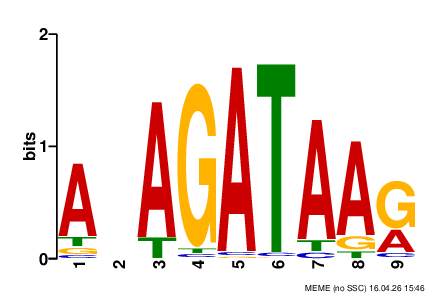

# PB-seq experiments

PB-seq measures protein abundance on naked DNA (in vitro asssay). 

# PB-seq experiments design

Naked genomic DNA (purified human gDNA) sheared to desired sizes, and incubated with purified GATA3 protein or mock (no protein), each with 4 replicates. \

# PB-seq data processing

## Convert/Rename Data
**Converting data form**
```{r engine='bash', eval=F, echo=TRUE}
# make sure there is a SampleSheet.csv in the *_AH57FJBGYX directory
# cd PBseq/260407_NB551647_0123_AH57FJBGYX
module load bcl2fastq
nohup bcl2fastq --runfolder-dir ./ --output-dir ./Data/Intensities/BaseCalls/ --no-lane-splitting
```

**Renaming file**
We want to name the experiments with the trailing name being `PE1` or `PE2` for paired end data. 

```{r engine='bash', eval=F, echo=TRUE}
#cd /home/FCAM/ssun/PBseq/260407_NB551647_0123_AH57FJBGYX/Data/Intensities/BaseCalls
for i in PB*_S*R1_001.fastq.gz
do
    nm=$(echo $i | awk -F"/" '{print $NF}' | awk -F"_S" '{print $1}')
    echo $nm
	two=$(echo $i | awk -F"/" '{print $NF}' | awk -F"R1_001.fastq.gz" '{print $1}')
	mv $i ${nm}_PE1.fastq.gz
	mv ${two}R2_001.fastq.gz ${nm}_PE2.fastq.gz
done
```

## check fastq file quality with `fastqc`

```{r engine='bash', eval=F, echo=TRUE}
module load fastqc 

for i in *fastq.gz
do
  echo $i
  fastqc $i 
done
```

## Cut off the adapter with `cutadapt`

In our daily workflow in the lab we use `cutadapt` to remove adapter sequences. The options we use below are: \

- `-j` for the number of cores to use \
- `-m` specifies the minimal length of a read to keep after adapter sequence removal \
- `-O` is the number of bases to trim off the end of the read if it overlaps with the adapter sequence \
- `-a` adapter sequence of PE1 reads \
- `-A` adapter sequence of PE2 reads \
- `-o` PE1 output file \
- `-p` PE2 output file \

If the genome contains 25% of each base, then you would expect one quarter of the
reads that have no adapter to have the trailing base
trimmed. Likewise, approximately 1/16 of the remaining
reads without the adapter will have the final two bases
trimmed. Technically these values are not exact, because the reads with
matches to longer trailing k-mers (in this case 19-mers) would be
removed first, then 18-mer matches removed, etc...  \

The `-a` and `-A` options are the adapter sequences of the PE1 and PE2 reads.  The
output file is `-o` (PE1) and `-p` PE2. The last two positional arguments are the input `fastq` files. 
We save the output to a log file.

```{r engine='bash', eval=F, echo=TRUE}
#!/bin/bash
#SBATCH --job-name=PB_cutadapt_260408.sh     
#SBATCH -N 1                  
#SBATCH -n 1                 
#SBATCH -c 8                  
#SBATCH -p general           
#SBATCH --qos=general       
#SBATCH --mem=200G               
#SBATCH --mail-type=ALL 
#SBATCH --mail-user=ssun@uchc.edu
#SBATCH -o PB_cutadapt_260408.sh_%j.out
#SBATCH -e PB_cutadapt_260408.sh_%j.err
module load cutadapt
for i in *PE1.fastq.gz
do
    name=$(echo $i | awk -F"/" '{print $NF}' | awk -F"_PE1" '{print $1}')
	echo $name
	echo unzipping $i
	gunzip $i
	echo unzipping ${name}_PE2.fastq.gz
	gunzip ${name}_PE2.fastq.gz
	cutadapt -a AGATCGGAAGAGCACACGTCTGAACTCCAGTCA -A AGATCGGAAGAGCGTCGTGTAGGGAAAGAGTGT -j 8 -m 10 -O 1 -o ${name}_PE1_no_adapt.fastq -p ${name}_PE2_no_adapt.fastq ${name}_PE1.fastq ${name}_PE2.fastq 2>&1 | tee ${name}_cutadapt.log
done

#cutadapt -a AGATCGGAAGAGCACACGTCTGAACTCCAGTCA -A AGATCGGAAGAGCGTCGTGTAGGGAAAGAGTGT -j 8 -m 10 -O 1 -o PB_GATA3_1_PE1_no_adapt.fastq -p PB_GATA3_1_PE2_no_adapt.fastq PB_GATA3_1_PE1.fastq PB_GATA3_1_PE2.fastq 2>&1 | tee PB_GATA3_1_cutadapt.log
```

## Align to the human genome
First we want to generate a folder in the convenient directory and name it as Genome. We will save all the genome files here. `cd` to this working directory, we are getting reference genome and chrom.sizes file from the USCS genome server, and build the genome index with `bowtie2-build`.

```{r engine='bash', eval=F, echo=TRUE}
#!/bin/bash
#SBATCH --job-name=PB_alignment_260410.sh     
#SBATCH -N 1                  
#SBATCH -n 1                 
#SBATCH -c 32                  
#SBATCH -p general           
#SBATCH --qos=general       
#SBATCH --mem=160G               
#SBATCH --mail-type=ALL 
#SBATCH --mail-user=ssun@uchc.edu
#SBATCH -o PB_alignment_260410.sh_%j.out
#SBATCH -e PB_alignment_260410.sh_%j.err

hostname
name=260410

# I have seqOutBias and other packages export to my Path
export PATH=$PATH:/home/FCAM/ssun/packages/

module load samtools/1.16.1
module load genometools/1.5.10
module load ucsc_genome/2012.05.22
module load rust
module load bowtie2
module load bedtools

export TMPDIR="${HOME}/temp" 
sizes=/home/FCAM/ssun/Genome/hg38.chrom.sizes

genome=/home/FCAM/ssun/Genome/hg38.fa
genome_index=/home/FCAM/ssun/Genome/hg38_bt2/hg38
ncore=32 
tallymer=/home/FCAM/ssun/seqoutbias/full_hg38_kmer3_rs42/hg38.tal_42.gtTxt.gz

gzip -d ${name}_PE1_no_adapt.fastq.gz
gzip -d ${name}_PE2_no_adapt.fastq.gz
bowtie2 -p $ncore --maxins 800 -x $genome_index -1 ${name}_PE1_no_adapt.fastq -2 ${name}_PE2_no_adapt.fastq | samtools sort -@ $ncore -n -o ${name}.bw.bam
gzip ${name}_PE1_no_adapt.fastq
gzip ${name}_PE2_no_adapt.fastq
gzip ${name}_PE2.fastq
gzip ${name}_PE1.fastq
samtools fixmate -m ${name}.bw.bam - | samtools sort -@ $ncore - | samtools markdup -s -r - ${name}.hg38.bam
seqOutBias ${genome} ${name}.hg38.bam --shift-counts --no-scale \
                                      --bw=${name}.bigWig --read-size=42 --tallymer=$tallymer 2>&1 | tee ${name}_seqOutBias.log
samtools sort -@ $ncore -n -o ${name}.sorted.bam ${name}.hg38.bam
# the above samtools -n is sorting files by queryname, which is important for the next bedtools bamtobed command with the -bedpe flag; 

bedtools bamtobed -i ${name}.sorted.bam -bedpe > ${name}_bed12.bed

awk '$1==$4 {print $0}' ${name}_bed12.bed | awk '{OFS="\t";} {print $1, $2, $6}' | awk '$1!="." && $3>$2 && (($3 - $2)<2000) {print $0}' | sort -k1,1 -k2,2n > ${name}_read_span.bed
genomeCoverageBed -bg -i ${name}_read_span.bed -g $sizes > ${name}.bedGraph
depth=`awk -F'\t' '{sum+=$5;}END{print sum;}' ${name}.hg38_not_scaled.bed`
echo "depth is " $depth
scaled=$(bc <<< "scale=3 ; 10000000 / $depth")
echo "scale is " $scaled
awk -v scaled="$scaled" '{OFS="\t";} {print $1, $2, $3, $4*scaled}' ${name}.bedGraph > ${name}_normalized.bedGraph
wigToBigWig -clip ${name}_normalized.bedGraph $sizes ${name}_normalized.bigWig
echo "complete"
```

**Run the previous chunk in parallel**

Now we are generating tallymer files and table use `seqOutBias` outside the loop, and then run the previous chunk in parallel. \
We need to know the read size of our library. Here the read size is 42.\
```{r engine='bash', eval=F, echo=TRUE}
#Compute mappability for the given read length and the k-mer that corresponds to each possible read alignment position
#time-consuming but only need to run this one time
#seqOutBias seqtable hg38.fa --read-size=42
#mkdir -p ${HOME}/temp

file=PB_alignment_260410.sh

for i in *_PE1.fastq.gz
do
    nm=$(echo $i | awk -F"/" '{print $NF}' | awk -F"_PE1.fastq.gz" '{print $1}')
    echo $nm
    sed -e "s/260410/${nm}/g" "$file" > PB_processing_${nm}.sh
    sbatch PB_processing_${nm}.sh
    sleep 1
done
```

## Alignment rate and post-alignment read depth
**Alignment rate**
```{r engine='bash', eval=F, echo=TRUE}
for i in PB_alignment*.err
do
  name=$(echo $i | awk -F".sh" '{print $1}')
  echo $name
  alignrate=$(cat $i | grep "overall alignment rate")
  echo $alignrate
done 2>&1 | tee alignment_rate.txt
```


PB_alignment_PB_GATA3_1   92.64% overall alignment rate \
PB_alignment_PB_GATA3_2   92.51% overall alignment rate \
PB_alignment_PB_GATA3_3   94.41% overall alignment rate \
PB_alignment_PB_GATA3_4   92.36% overall alignment rate \
PB_alignment_PB_Mock_1    88.52% overall alignment rate \
PB_alignment_PB_Mock_2    91.18% overall alignment rate \
PB_alignment_PB_Mock_3    93.69% overall alignment rate \
PB_alignment_PB_Mock_4    91.79% overall alignment rate \


**Aligned reads**
bowtie2 direct output: \
```{r engine='bash', eval=F, echo=T}
module load samtools/1.16.1
for i in *bw.bam
do
  echo $i
  samtools view -c -f 0x42 $i
done 2>&1 | tee -a aligned_reads_from_bam_log.txt
```

PB_GATA3_1.bw.bam   52644985 \
PB_GATA3_2.bw.bam   34620738 \
PB_GATA3_3.bw.bam   22407691 \
PB_GATA3_4.bw.bam   60935181 \
PB_Mock_1.bw.bam    24751186 \
PB_Mock_2.bw.bam    30693849 \
PB_Mock_3.bw.bam    23362189 \
PB_Mock_4.bw.bam    28091646 \


de-duplicate, sorted output: \
```{r engine='bash', eval=F, echo=T}
module load samtools/1.16.1
for i in *sorted.bam
do
  echo $i
  samtools view -c -f 0x42 $i
done 2>&1 | tee -a aligned_reads_from_sorted_bam_log.txt

```

PB_GATA3_1.sorted.bam   33778085 \
PB_GATA3_2.sorted.bam   26235708 \
PB_GATA3_3.sorted.bam   18755913 \
PB_GATA3_4.sorted.bam   28289813 \
PB_Mock_1.sorted.bam    5137693 \
PB_Mock_2.sorted.bam    7431286 \
PB_Mock_3.sorted.bam    8985394 \
PB_Mock_4.sorted.bam    8214750 \


# Peak calling

## calling GATA3 PB-seq peaks with `Macs3`
We want to call a set of universal peaks for purified GATA3 bound DNAs. The reasons are: taking intersection of peaks between replicates/conditions will result in high false negative rates. We may lose important binding regions for transcription factor analysis. Here we are doing a compromise to call every peaks on all files and later in downstream analysis we will decide the functional peaks. \

We use `Macs3 callpeaks` to identify TF binding sites. It takes the treatment files against the control genomic input. \
`-t/--treatment FILENAME` takes your treatment file. If there is more than one alignment file, we can specify them as `-t A B C`. MACS will pool up all these files together. \
`-c/--control` takes the control file. Here we pool all the IgG file. \
`-n/--name` is the output name we give. \
`-f/--format FORMAT` we specify BAMPE format for the output. \
`-g/--gsize` is the mappable genome size or effective genome size. The actual mappable genome size is ~70% to 90% of the genome size due to the repetitive features on the chromosomes. Here we use the default hs --2.7e9 (for human genome). \
`-q/--qvalue` is the FDR cutoff to call signidicant regions. \


**GATA peaks**

We tested 1) q 0.01 (default), 2) q 0.05, and 3) q 0.1 in macs3 peak calling. We determined a q-value cutoff of < 0.05 which sets a good balance between sensitivity and specificity for calling PB-seq peaks. \

```{r engine='bash', eval=F, echo=TRUE}
#! /bin/sh
#SBATCH --job-name=GATA_PB_peak_calling.sh    
#SBATCH -N 1
#SBATCH -n 1
#SBATCH -c 2
#SBATCH -p general
#SBATCH --qos=general
#SBATCH --mem=32G
#SBATCH --mail-type=ALL
#SBATCH --mail-user=ssun@uchc.edu
#SBATCH -o GATA_PB_peak_calling.sh_%j.out
#SBATCH -e GATA_PB_peak_calling.sh_%j.err

hostname
module load macs3

mkdir temp_macs
directory=/home/FCAM/ssun/PBseq/260407_NB551647_0123_AH57FJBGYX/Data/Intensities/BaseCalls/

macs3 callpeak --call-summits -t ${directory}*GATA3*sorted.bam -c ${directory}*Mock*sorted.bam -n GATA_PB -g hs -q 0.05 --keep-dup all -f BAMPE --nomodel --tempdir temp_macs

#wc -l GATA_PB_summits.bed
#108918
```


```{r engine='bash', eval=F, echo=TRUE}
#! /bin/sh
#SBATCH --job-name=remove_peak.sh     
#SBATCH -N 1
#SBATCH -n 1
#SBATCH -c 8
#SBATCH -p general
#SBATCH --qos=general
#SBATCH --mem=32G
#SBATCH --mail-type=ALL
#SBATCH --mail-user=ssun@uchc.edu
#SBATCH -o remove_peak.sh_%j.out
#SBATCH -e remove_peak.sh_%j.err
module load deeptools/3.5.0
module load bedtools
wget https://github.com/Boyle-Lab/Blacklist/raw/master/lists/hg38-blacklist.v2.bed.gz
gunzip hg38-blacklist.v2.bed.gz
blacklist=hg38-blacklist.v2.bed
sizes=/home/FCAM/ssun/Genome/hg38.chrom.sizes


for i in *_summits.bed
do
	name=$(echo $i | awk -F"/" '{print $NF}' | awk -F"_summits.bed" '{print $1}')
	echo $name
	grep -v "random" ${name}_summits.bed | grep -v "chrUn" | grep -v "chrEBV" | grep -v "chrM" | grep -v "alt" | intersectBed -v -a - -b $blacklist > ${name}_summits_final.bed
	slopBed -b 50 -i ${name}_summits_final.bed -g $sizes  | sort -k1,1 -k2,2n > ${name}_summit_100window.bed
  slopBed -b 200 -i ${name}_summits_final.bed -g $sizes  | sort -k1,1 -k2,2n > ${name}_summit_400window.bed
done

```

## (Quick check) Top enriched motif within peak set

De novo motif analysis uses tools like `MEME`, `TOMTOM`, `MAST` and `FIMO` to analyze binding site. The `MEME` analysis suite allows users to identify (de novo) enriched motifs with a set of sequences, and compare to databases of known motifs; it also allow users to search for motifs of interest within a set of sequences... The user manual and more usage can be found here：https://meme-suite.org/meme/doc/meme.html \

In this analysis, we will first convert the coordinate bed file to a sequence fasta file, then we perform de novo motif analysis with `meme`. Here we only want to do a quick quality check by manually looking at the top hit to ensure that it is a GATA motif variant for GATA peaks. \

**GATA3 PB-seq peaks**
```{r engine='bash', eval=F, echo=TRUE}
module load deeptools/3.5.0
module load meme/5.4.1
module load bedtools
genome=/home/FCAM/ssun/Genome/hg38.fa
sizes=/home/FCAM/ssun/Genome/hg38.chrom.sizes
dir=/home/FCAM/ssun/PBseq/GATA_Deseq2/peakcall0.05/

#GATA_ChIP_summit_100window.bed
name=GATA_PB

# Just did the top 2000 GATA peaks to make it faster
sort -nrk5,5 ${dir}${name}_summit_100window.bed | head -n 2000 > ${name}_top2000_summit_100window.bed
name=${name}_top2000
fastaFromBed -fi $genome -bed ${name}_summit_100window.bed -fo ${name}_summit_100window.fasta
# MEME
meme -p 16 -oc ${name}_meme_test -nmotifs 1 -objfun classic -csites 20000 -searchsize 0 -minw 5 -maxw 15 -revcomp -dna -markov_order 3 -maxsize 100000000 ${name}_summit_100window.fasta # normal GATA motif is GATAA, so minw can be set to 5
```

By searching the top 2000 most significant GATA peaks (101bp window), we find the top motif match to the GATA3. \
```{r  out.width = "50%", echo=F, fig.align = "center", fig.cap="de novo identified motif matched to the GATA3 motif"}
library(knitr)
 
```

# visulize peak regions on genome browser

**Single library (normalized)** \
UCSC Genome Browser trackhub link for non-merged, normalized bigWig files: http://guertinlab.cam.uchc.edu/GATA3_PB_hub/hub.txt \

# How many reads in the peaks (FRIP)
FRiP (Fraction of Reads in Peaks), is a common quality measurement for PB-seq experiment. It calculates the percentage of all reads that fall in peak regions mapped to the genome. It is important that we always use a universal peak set to calculate the FRiP score for each replicates, then compare between replicates. Usually, we will use the peak set that we generated previously from MACS3, since in that step we have called peaks using all replicates in bam format for the same factor. \

## 400bp window read depth normalization 
```{r engine='bash', eval=F, echo=TRUE}
cd /home/FCAM/ssun/PBseq/GATA_Deseq2/peakcall0.05
wc -l GATA_PB_summits_final.bed #104132
wc -l GATA_PB_summit_400window.bed #104132

# Counting reads in peaks (400bp window) with `DeSeq2`
cp ../PB_reads.txt . 
# cat PB_reads.txt
#		PB_GATA3_1	PB_GATA3_2	PB_GATA3_3	PB_GATA3_4	PB_Mock_1	PB_Mock_2	PB_Mock_3	PB_Mock_4
# 	67556170	52471416	37511826	56579626	102753814862572	17970788	16429500

module load R/4.1.2 # this version of `R` on Xanadu has many of our libraries pre-installed. 
R 
#libraries
library(DESeq2)
library(lattice)
library(dplyr)
library(ggplot2)
library(limma)
library(bigWig)

#functions on github
source('https://raw.githubusercontent.com/mjg54/znf143_pro_seq_analysis/master/docs/ZNF143_functions.R')

#new functions
get.counts.interval <- function(df, path.to.bigWig, file.prefix = 'H') {
    vec.names = c()
    inten.df=data.frame(matrix(ncol = 0, nrow = nrow(df)))
    
    for (mod.bigWig in Sys.glob(file.path(path.to.bigWig, paste(file.prefix, "*.bigWig", sep ='')))) {
        factor.name = strsplit(strsplit(mod.bigWig, "/")[[1]][length(strsplit(mod.bigWig, "/")[[1]])], '.bigWig')[[1]][1]
        print(factor.name)
        vec.names = c(vec.names, factor.name)
        loaded.bw = load.bigWig(mod.bigWig)
        print(mod.bigWig)
        mod.inten = bed.region.bpQuery.bigWig(loaded.bw, df, abs.value = TRUE)
        inten.df = cbind(inten.df, mod.inten)
    }
    colnames(inten.df) = vec.names
    r.names = paste(df[,1], ':', df[,2], '-', df[,3], sep='')
    row.names(inten.df) = r.names
    return(inten.df)
}

#DeSeq count read size and parse into different quantile 
a =  read.table('/home/FCAM/ssun/PBseq/GATA_Deseq2/peakcall0.05/GATA_PB_summit_400window.bed', sep = "\t", header=FALSE)

#non-normalized counts
GATA.counts.df= get.counts.interval(a, "/home/FCAM/ssun/PBseq/260407_NB551647_0123_AH57FJBGYX/Data/Intensities/BaseCalls/Seqoutbias_bw","PB")
sample.conditions <- data.frame(
  row.names = colnames(GATA.counts.df),
  sample.conditions = c("GATA3","GATA3","GATA3","GATA3",
                "Mock","Mock","Mock","Mock")
)
deseq.counts.table = DESeqDataSetFromMatrix(countData =GATA.counts.df , # DESeqDataSet needs countData to be non-negative integers; non-normalized counts are integer, normalized signals has decimals.
                colData = as.data.frame(sample.conditions),
                design = ~ sample.conditions)


GATA.SF <- read.table("PB_reads.txt", sep = '\t', header = TRUE)[,-1] # GATA size factors from read depth
GATA.size.factors = estimateSizeFactorsForMatrix(GATA.SF)
sizeFactors(deseq.counts.table) <- GATA.size.factors 
# assign to each column of the count matrix (deseq.counts.table) the size factor to bring each column to a common scale
dds <- DESeq(deseq.counts.table)
normalized.counts.GATA3 = counts(dds, normalized=TRUE)
peak.intensities = rowMeans(normalized.counts.GATA3[,1:4]) # we want to get the average read counts for GATA3 groups

peak.intensities = peak.intensities[which(peak.intensities != 0)]


# making 161 window quantile file
chr = sapply(strsplit(names(peak.intensities), ":"), "[", 1)
rnge = sapply(strsplit(names(peak.intensities), ":"), "[", 2)

quantile(peak.intensities, probs = seq(.05, 1.00, by = .05))


start2 = as.numeric(sapply(strsplit(rnge, "-"), "[", 1)) + 120
end2 = as.numeric(sapply(strsplit(rnge, "-"), "[", 2)) - 120
j =0 
q=seq(.05, 1.00, by = .05)
count=0
for (i in quantile(peak.intensities, probs = seq(.05, 1.00, by =
.05)))
{
count = count +1

write.table(file = paste0('quantile', as.character(q[count]), '_summits_161window.bed'), data.frame(chr[peak.intensities > j & peak.intensities <= i], start2[peak.intensities > j & peak.intensities <= i], end2[peak.intensities > j & peak.intensities <= i], peak.intensities[peak.intensities > j & peak.intensities <= i]), sep = '\t', quote=FALSE, col.names=FALSE, row.names=FALSE )
j = i
}

# wc -l quantile0.05_summits_161window.bed
# 5142

options(scipen = 999)
quantile(peak.intensities, probs = seq(.05, 1.00, by = .05))
#        5%        10%        15%        20%        25%        30%        35% 
#  12.42913   14.49291   16.00418   17.38888   18.78211   20.32706   21.94463 
#       40%        45%        50%        55%        60%        65%        70% 
#  23.74917   25.74699   27.99887   30.50441   33.45570   36.89508   40.97625 
#       75%        80%        85%        90%        95%       100% 
#  45.96799   52.32755   60.79801   72.84185   94.49580 1242.58645 


chr = sapply(strsplit(names(peak.intensities), ":"), "[", 1)
rnge = sapply(strsplit(names(peak.intensities), ":"), "[", 2)
start = as.numeric(sapply(strsplit(rnge, "-"), "[", 1)) + 200
end = as.numeric(sapply(strsplit(rnge, "-"), "[", 2)) - 200

# 1bp summit all GATA3 peaks
peak=data.frame(chr, start, end, peak.intensities)
head(peak)
#                      chr   start     end peak.intensities
#chr1:861707-862108   chr1  861907  861908       215.569876
#chr1:879575-879976   chr1  879775  879776        55.382808
#chr1:885648-886049   chr1  885848  885849        22.069708
#chr1:899806-900207   chr1  900006  900007        30.308283
#chr1:1190094-1190495 chr1 1190294 1190295       159.683533
#chr1:1416127-1416528 chr1 1416327 1416328         6.439215
nrow(peak)
#[1] 102830
ranked_peak <- peak[order(-peak[, 4]), ]
write.table(ranked_peak, file = 'GATA_PB_summits_final_DESeq2_ranked_intensity.bed', sep = '\t', quote=FALSE, col.names=FALSE, row.names=FALSE )

save.image('260415_GATA3_PB_deseq.Rdata') 
```

## Frip
```{r, engine='R', eval=F, echo=TRUE}
module load bedtools
module load samtools/1.12
peaks=/home/FCAM/ssun/PBseq/GATA_Deseq2/peakcall0.05/GATA_PB_summit_400window.bed

for i in /home/FCAM/ssun/PBseq/260407_NB551647_0123_AH57FJBGYX/Data/Intensities/BaseCalls/*_not_scaled.bed
do
    nm=$(echo $i | awk -F"/" '{print $NF}' | awk -F"_not_scaled.bed" '{print $1}')
    #sort -k1,1 -k2,2n $i > ${nm}_sorted.bed
    mapBed -null '0' -a $peaks -b /home/FCAM/ssun/PBseq/260407_NB551647_0123_AH57FJBGYX/Data/Intensities/BaseCalls/${nm}_sorted.bed > ${nm}_peak_counts.txt
done

for i in *_peak_counts.txt
do
    name=$(echo $i | awk -F"/" '{print $NF}' | awk -F".hg38_peak_counts.txt" '{print $1}')
    echo $name > ${name}_FRiP.txt
    awk '{print $NF}' ${name}.hg38_peak_counts.txt > ${name}_peak_counts_only.txt
    RiP=$(awk '{sum+=$1;} END{print sum;}' ${name}_peak_counts_only.txt) # count the reads in each peak region (from the universal set)
    echo $name | cat - ${name}_peak_counts_only.txt > ${name}_peak_counts.txt
    aligned_reads=$(samtools view -c -f 0x42  /home/FCAM/ssun/PBseq/260407_NB551647_0123_AH57FJBGYX/Data/Intensities/BaseCalls/${name}.sorted.bam) # count the total aligned reads
    FRiP=$(echo "scale=2 ; $RiP / $aligned_reads" | bc)
    echo $FRiP >> ${name}_FRiP.txt
    rm ${name}_peak_counts_only.txt
done

echo -e "chr\tstart\tend\tname\tqvalue" | cat - $peaks | paste -d'\t' - *peak_counts.txt > Combined_GATA_peak_counts.txt
echo -e "Name" > rowname.txt
echo -e "FrIP" >> rowname.txt
paste -d'\t' rowname.txt *FRiP.txt > Combined_GATA_FRiP.txt
rm rowname.txt

# Name	PB_GATA3_1	PB_GATA3_2	PB_GATA3_3	PB_GATA3_4	PB_Mock_1	PB_Mock_2	PB_Mock_3	PB_Mock_4
#FrIP	  .26	        .28	        .24	        .32	        .05	      .05	      .04	      .05

```

```{r, engine='R', eval=F, echo=TRUE}
library(lattice)
library(reshape2)
df <- read.table("Combined_GATA_FRiP.txt", header = TRUE, sep = "\t")
df_long <- melt(df, id.vars = "Name",
                variable.name = "Sample",
                value.name = "FRiP")
df_long$Group <- ifelse(grepl("GATA3", df_long$Sample),
                        "GATA3", "Mock")
df_long$Group <- factor(df_long$Group, levels = c("GATA3", "Mock"))

pdf('barplot_GATA3_PBpeak_FRiP.pdf',width=8,height=8)
print(barchart(FRiP ~ Sample,
         data = df_long,
         groups = Group,
         col = c("lightblue", "pink"),
         scales = list(x = list(rot = 45)),
         auto.key = list(space = "right"),
         main = "GATA3 PB peak FRiP",
         xlab = "PB peak FRiP score",
         ylab = "FRiP",
         las = 2))
dev.off()
```

```{r fig.width=8, fig.height=8, echo=F, fig.align = "center", fig.cap="Frip"}
library(knitr)
knitr::include_graphics("./barplot_GATA3_PBpeak_FRiP.pdf") 
```


# Exaustive de novo motif analysis in PB-seq peaks 

For PB-seq peaks, each peak should ideally contains at least one GATA3 binding site. By conducting a kmer analysis, we are confident that the 

Working directory: /home/FCAM/ssun/PBseq/Exhaustive_denovomotif_analysis_260410/new_Exaust


## Updated parse_mast_to_coordinates.R
Path to file: /home/FCAM/ssun/scripts/updated_parse_mast_to_coordinates.R \

When parsing the MAST output to the BED file, we calculate the motif coordinates from the TXT file using some hard-coded R scripts. The output BED file from the current `parse_mast_to_coordinates.R` script generates a BED file with motif coordinates. However, there is a discrepancy of one base when transforming the output BED to the FASTA format with `fastaFromBed`. \

What I changed is that while calculating the start of motif coordinates, I added a `-1` to the original script:\
```{r engine='R', eval=F, echo=TRUE}
start[j] = as.numeric(strsplit(strsplit(mast.data[j,1], ":")[[1]][2], "-")[[1]][1]) + mast.data[j,5] -1
```

Now, the output BED file will be one base ahead.\
The updated parse_mast_to_coordinates1.R file correctly reflect the actual coordinates of the motifs. \

# MEME

## Input sequences: GATA3 PB-seq data in vitro

These peak regions are generated from `MACS3 peak calling` using the default stringency and have removed peaks on contigs and within blacklisted regions. The peak intensity is normalized with DeSeq2. \
Peaks are centered at the summit/center of the peak with a 161bp window flanking the center. \

**parse by 10 intensity quantiles and select random 2000 peaks within each quantile** \


```{r engine='bash', eval=F, echo=TRUE}
module load bedtools
sizes=/home/FCAM/ssun/Genome/hg38.chrom.sizes
genome=/home/FCAM/ssun/Genome/hg38.fa
dir=/home/FCAM/ssun/PBseq/GATA_Deseq2/peakcall0.05/

# extend the peak region to 161bp window centered on the summit
slopBed -b 80 -i ${dir}GATA_PB_summits_final_DESeq2_ranked_intensity.bed -g $sizes  | sort -k1,1 -k2,2n > GATA_PB_summits_final_DESeq2_ranked_intensity_161bpwindow.bed #102830

sort -nrk4,4 GATA_PB_summits_final_DESeq2_ranked_intensity_161bpwindow.bed > GATA_PB_summits_final_DESeq2_ranked_intensity_161bpwindow_sorted.bed
N=$(wc -l < GATA_PB_summits_final_DESeq2_ranked_intensity_161bpwindow_sorted.bed) #102830
Q=$((N / 10)) #10283

awk -v Q=$Q -v N=$N '{
    q = int((NR-1)/Q) + 1;
    if (q > 10) q = 10;   # make sure last bin absorbs remainder
    print > ("quantile_" q ".bed")
}' GATA_PB_summits_final_DESeq2_ranked_intensity_161bpwindow_sorted.bed


# quantile_10 = lowest signal
# quantile_1 = highest signal

for i in {1..10}
do
    shuf -n 2000 quantile_${i}.bed > quantile_${i}_2000sampled.bed
done

module load meme/5.4.1
module load bedtools
genome=/home/FCAM/ssun/Genome/hg38.fa

for i in {1..10}
do
    fastaFromBed -fi $genome -bed quantile_${i}_2000sampled.bed -fo quantile_${i}_2000sampled.fasta
done

```


## MEME-round1:

161 window
```{r engine='bash', eval=F, echo=TRUE}
#!/bin/bash
#SBATCH --job-name=meme_quantile1_random2000.sh
#SBATCH -N 1
#SBATCH -n 1
#SBATCH -c 32
#SBATCH -p general
#SBATCH --qos=general
#SBATCH --mem=128G
#SBATCH --mail-type=ALL
#SBATCH --mail-user=ssun@uchc.edu
#SBATCH -o meme_quantile1_random2000.sh_%j.out
#SBATCH -e meme_quantile1_random2000.sh_%j.err

hostname
export TMPDIR="${HOME}/temp"
module load meme/5.4.1

for i in {1..10}
do
#    meme -p 32 -oc GATA3_161bp_random2000_meme_output1_q${i} -nmotifs 5 -objfun classic -csites 20000 -searchsize 0 -minw 8 -maxw 19 -allw -revcomp -dna -markov_order 3 -maxsize 100000000 quantile_${i}_2000sampled.fasta
    meme -p 32 -oc GATA3_161bp_random2000_meme_output2_q${i} -nmotifs 5 -objfun classic -csites 20000 -searchsize 0 -minw 8 -maxw 19 -allw -revcomp -dna -markov_order 2 -maxsize 100000000 quantile_${i}_2000sampled.fasta
#    meme -p 32 -oc GATA3_161bp_random2000_meme_output3_q${i} -nmotifs 5 -objfun classic -csites 20000 -searchsize 0 -minw 8 -maxw 19 -allw -revcomp -dna -markov_order 1 -maxsize 100000000 quantile_${i}_2000sampled.fasta
    
    meme -p 32 -oc GATA3_161bp_random2000_meme_output4_q${i} -nmotifs 5 -objfun classic -csites 20000 -searchsize 0 -minw 8 -maxw 19 -allw -revcomp -dna -maxsize 100000000 quantile_${i}_2000sampled.fasta
    
#    meme -p 32 -oc GATA3_161bp_random2000_meme_output5_q${i} -nmotifs 5 -objfun classic -csites 20000 -searchsize 0 -minw 8 -maxw 19 -allw -revcomp -dna -bfile ../hg38_bkgrnd.txt -maxsize 100000000 quantile_${i}_2000sampled.fasta
    
#    meme -p 32 -oc GATA3_161bp_random2000_meme_output6_q${i} -nmotifs 5 -objfun classic -csites 20000 -searchsize 0 -minw 8 -maxw 19 -allw -revcomp -dna -bfile ../hg38_bkgrnd_2mer.txt -maxsize 100000000 quantile_${i}_2000sampled.fasta
    
done

```


# GLAM2

Quote from MEME suite: GLAM2 discovers novel, gapped motifs (recurring, variable-length patterns) in your DNA or protein sequences. \

working directory: /home/FCAM/ssun/PBseq/Exhaustive_denovomotif_analysis_260410/new_Exaust/GLAM2 \

## Input sequences: GATA3 PB-seq data in vitro

These peak regions are generated from `MACS3 peak calling` using the default stringency and have removed peaks on contigs and within blacklisted regions. The peak intensity is normalized with DeSeq2. \
Peaks are centered at the summit/center of the peak with a 161bp window flanking the center. \

```{r engine='bash', eval=F, echo=TRUE}
module load bedtools
sizes=/home/FCAM/ssun/Genome/hg38.chrom.sizes
genome=/home/FCAM/ssun/Genome/hg38.fa
dir=/home/FCAM/ssun/PBseq/GATA_Deseq2/peakcall0.05/

# extend the peak region to 161bp window centered on the summit
slopBed -b 80 -i ${dir}GATA_PB_summits_final_DESeq2_ranked_intensity.bed -g $sizes  | sort -k1,1 -k2,2n > GATA_PB_summits_final_DESeq2_ranked_intensity_161bpwindow.bed #102830

# convert to FASTA
fastaFromBed -fi $genome -bed GATA_PB_summits_final_DESeq2_ranked_intensity_161bpwindow.bed -fo GATA_PB_summits_final_DESeq2_ranked_intensity_161bpwindow.fasta #205660
```

```{r engine='bash', eval=F, echo=TRUE}
head -5 GATA_PB_summits_final_DESeq2_ranked_intensity_161bpwindow.bed
#chr1	861827	861988	215.56987605857
#chr1	879695	879856	55.3828083151726
#chr1	885768	885929	22.0697079251984
#chr1	899926	900087	30.308282773772
#chr1	1190214	1190375	159.683533257889
```

The first three columns in the bed file are the peak coordinates, notice that they are all 161bp width. The forth column is the peak intensity normaloized via DeSeq2. \
The total number of GATA3 PB-seq peaks is 102830. \

<!--
**Generation of random 5000 peak set with 161bp window** \

Select 5000 peaks randomly. \
```{r engine='bash', eval=F, echo=TRUE}
shuf GATA_PB_summits_final_DESeq2_ranked_intensity_161bpwindow.bed | head -n 5000 > GATA_PB_random5000_161window.bed #5000
```

Convert this random 5000 peak BED file to a FASTA file with `fastaFromBed`. \
```{r engine='bash', eval=F, echo=TRUE}
module load bedtools
genome=/home/FCAM/ssun/Genome/hg38.fa
fastaFromBed -fi $genome -bed GATA_PB_random5000_161window.bed -fo GATA_PB_random5000_161window.fasta
```


**controls: random 5000 matched negative/background sequences** \

```{r engine='bash', eval=F, echo=TRUE}
# random peak regions: /home/FCAM/ssun/PBseq/260407_NB551647_0123_AH57FJBGYX/Data/Intensities/BaseCalls/GATA_PB_neg3_summits_final.bed
# get random 5000 peaks from it as a negative control for GLAM2
shuf /home/FCAM/ssun/PBseq/260407_NB551647_0123_AH57FJBGYX/Data/Intensities/BaseCalls/GATA_PB_neg3_summits_final.bed | head -n 5000 > GATA_PB_neg3_random5000_summits_final.bed #5000

sizes=/home/FCAM/ssun/Genome/hg38.chrom.sizes
slopBed -b 80 -i GATA_PB_neg3_random5000_summits_final.bed -g $sizes  | sort -k1,1 -k2,2n > GATA_PB_neg3_random5000_161window.bed #5000

module load bedtools
genome=/home/FCAM/ssun/Genome/hg38.fa
fastaFromBed -fi $genome -bed GATA_PB_neg3_random5000_161window.bed -fo GATA_PB_neg3_random5000_161window.fasta
```

-->

## GLAM2-all-round1
working directory: /home/FCAM/ssun/PBseq/Exhaustive_denovomotif_analysis_260410/new_Exaust/GLAM2/glam2_all_PB

```{r, engine='bash', eval=F, echo=TRUE}
#!/bin/bash
#SBATCH --job-name=Glam2_all.sh
#SBATCH -N 1
#SBATCH -n 32
#SBATCH -c 1
#SBATCH -p general
#SBATCH --qos=general
#SBATCH --mem=128G
#SBATCH --mail-type=ALL
#SBATCH --mail-user=ssun@uchc.edu
#SBATCH -o Glam2_all.sh_%j.out
#SBATCH -e Glam2_all.sh_%j.err

hostname
export TMPDIR="${HOME}/temp"
module load meme/5.5.9

# all PB-seq peaks with 161 window
glam2 -O GATA_PB_all_161win_glam2_output -2 n GATA_PB_summits_final_DESeq2_ranked_intensity_161bpwindow.fasta

#glam2 -Q -n 1000000 -z $minsites -a 8 -b 30 -w 16 -O $meme_out -2 n $.fasta
```

Conduct a TOMTOM to compare the GLAM2-round1 top motif with the 12 ChIP-seq motif: \
```{r, engine='bash', eval=F, echo=TRUE}
# concatenate 12 ChIP-seq motifs in one MEME file
out="chip_12_motifs.meme"
meme_dir="/home/FCAM/ssun/GATA3_ChIP_PRO_July2023/ChIP_final/re_run_exhaustive_denovomotif_260414/single_bash2/individual_meme/"
first_file=$(ls "$meme_dir"*meme.txt | sort | head -n 1)
awk '/^MOTIF/ {exit} {print}' "$first_file" > "$out"

for f in $(ls "$meme_dir"*meme.txt | sort)
do
    awk '
    BEGIN {keep=0}
    /^MOTIF/ {keep=1}
    keep == 1 {print}
    ' "$f" >> "$out"

    echo "" >> "$out"
done

# get the top Glam2 motif

#wget https://raw.githubusercontent.com/sysunn/siyu_daily_update/main/December_2023/MEME_individual_from_db_python3.py
python ../MEME_individual_from_db_python3_updated.py -i GATA_PB_all_161win_glam2_output/glam2.meme
mkdir Glam2_all_individual_meme
cp 1_meme.txt Glam2_all_individual_meme/Glam2_PB_GATAmotif1_meme.txt
rm *meme.txt


# TOMTOM
tomtom -oc tomtom_glam2_vs_chip12_qval -thresh 0.05 -dist pearson Glam2_all_individual_meme/Glam2_PB_GATAmotif1_meme.txt chip_12_motifs.meme

cat tomtom_glam2_vs_chip12_qval/tomtom.tsv
#Query_ID	Target_ID	      Optimal_offset	p-value	    E-value	      q-value	    Overlap   Query_consensus	      Target_consensus	  Orientation
#1	AGATBNNNNNNVNWGATAA	  -1	            0.000560288	0.00672346	  0.0134469	  19	      TAGATAAAAAAAAAAGATAA	AGATGTCAAATACAGATAA	+
#1	TTATCTBYNNVATCT	      -5	            0.00260378	0.0312454	    0.0312454	  15	      TAGATAAAAAAAAAAGATAA	AGATGAAAGAGATAA	    -
#1	21-AGATAAGG	          -14	            0.00461196	0.0553435	    0.0368957	            TAGATAAAAAAAAAAGATAA	AGATAAGG	          +

```

**A coherence for using TOMTOM:** \

```{r, engine='bash', eval=F, echo=TRUE}
# negative control: TOMTOM the neg top glam2 motif against the 12 chip motif
python ../MEME_individual_from_db_python3_updated.py -i ../GATA_PB_negcontrol_ran5000_161win_glam2_output/glam2.meme
mv 1_meme.txt neg_glam2.meme
rm *meme.txt

tomtom -oc tomtom_glam2_vs_chip12_qval_neg -thresh 0.05 -dist pearson neg_glam2.meme chip_12_motifs.meme
cat tomtom_glam2_vs_chip12_qval_neg/tomtom.tsv
# no matching output


# positive control: chip motif with itself
tomtom -oc tomtom_glam2_vs_chip12_qval_pos -thresh 0.05 -dist pearson ${meme_dir}GATAmotif6_meme.txt chip_12_motifs.meme
cat tomtom_glam2_vs_chip12_qval_pos/tomtom.tsv

#Query_ID	            Target_ID	          Optimal_offset	p-value	E-value	q-value	OverlapQuery_consensus	Target_consensus	Orientation
#AGATBNNNNNNVNWGATAA	AGATBNNNNNNVNWGATAA	0	              1.34099e-28	1.60918e-27	3.21837e-27	19	AGATGTCAAATACAGATAA	AGATGTCAAATACAGATAA	+
#AGATBNNNNNNVNWGATAA	RATCWWGATAA	        -8	            0.00374824	0.0449789	0.0333753	11	AGATGTCAAATACAGATAA	GATCTAGATAA	+
#AGATBNNNNNNVNWGATAA	TTATCTBYNNVATCT	    0	              0.00417191	0.0500629	0.0333753	15	AGATGTCAAATACAGATAA	AGATGAAAGAGATAA	-
#AGATBNNNNNNVNWGATAA	AGATGRVAGATAA	      -6	            0.00566843	0.0680212	0.0340106	13	AGATGTCAAATACAGATAA	AGATGAGAGAT
```


Among the 12 ChIP-seq motif variants, TOMTOM ranked motif AGATBNNNNNNVNWGATAA as the closest match to the top GLAM2 motif. Because the target database contained only 12 motifs, significance values were interpreted cautiously. \

Mast using the closest matched ChIP-seq motif \
MAST - Given a motif position weight matrix, MAST can search sequences for the occurrence of that motif. \
Usage: http://meme-suite.org/tools/mast \

```{r, engine='bash', eval=F, echo=TRUE}
module load meme/5.5.9
module load deeptools/3.5.0
module load bedtools
module load R/4.1.2
genome=/home/FCAM/ssun/Genome/hg38.fa
sizes=/home/FCAM/ssun/Genome/hg38.chrom.sizes

meme_dir="/home/FCAM/ssun/GATA3_ChIP_PRO_July2023/ChIP_final/re_run_exhaustive_denovomotif_260414/single_bash2/individual_meme/"
tomtom_tsv="tomtom_glam2_vs_chip12_qval/tomtom.tsv"

best_target=$(awk 'BEGIN{FS="\t"} 
    NR > 1 && $1 !~ /^#/ && NF >= 10 {
        print $2, $6
    }' "$tomtom_tsv" | sort -k2,2g | head -n 1 | awk '{print $1}')
echo "Best TOMTOM Target_ID: $best_target"


matched_file=$(awk -v target="$best_target" '
    /^MOTIF/ {
        if ($2 == target || $3 == target) {
            print FILENAME
            exit
        }
    }
' "$meme_dir"*meme.txt)


mast -mt 0.0001 -hit_list -best  $matched_file ../GATA_PB_summits_final_DESeq2_ranked_intensity_161bpwindow.fasta > mast_GATA3_PSWM_in_all_PB_peaks_glam2_round1.txt #29658

# coherence check
# mast -mt 0.0001 -hit_list -best  $matched_file ../GATA_PB_summits_final_DESeq2_ranked_intensity_161bpwindow.fasta | wc -l  # 29658 - 3 of 102830
# mast -mt 0.0005 -hit_list -best  $matched_file ../GATA_PB_summits_final_DESeq2_ranked_intensity_161bpwindow.fasta | wc -l  # 50285 - 3 of 102830

# random peak regions: /home/FCAM/ssun/PBseq/260407_NB551647_0123_AH57FJBGYX/Data/Intensities/BaseCalls/GATA_PB_neg3_summits_final.bed #85474
# slopBed -b 80 -i /home/FCAM/ssun/PBseq/260407_NB551647_0123_AH57FJBGYX/Data/Intensities/BaseCalls/GATA_PB_neg3_summits_final.bed -g $sizes  | sort -k1,1 -k2,2n > GATA_PB_neg3_summits_final_161window.bed #85474
# fastaFromBed -fi $genome -bed GATA_PB_neg3_summits_final_161window.bed -fo GATA_PB_neg3_summits_final_161window.fasta
# mast -mt 0.0001 -hit_list -best  $matched_file GATA_PB_neg3_summits_final_161window.fasta | wc -l # 1705
# mast -mt 0.0005 -hit_list -best  $matched_file GATA_PB_neg3_summits_final_161window.fasta | wc -l # 11858


Rscript /home/FCAM/ssun/scripts/updated_parse_mast_to_coordinates.R mast_GATA3_PSWM_in_all_PB_peaks_glam2_round1.txt 
wc -l mast_GATA3_PSWM_in_all_PB_peaks_glam2_round1.bed #29655

# coherence check: check the near mast_cutoff sequences -- evaluate if they are acceptable / match to the spaced motif
genome=/home/FCAM/ssun/Genome/hg38.fa
awk 'BEGIN{OFS="\t"}
{
    p = $5
    if (p >= 0.00009 && p <= 0.0001) {
        name = $1 ":" $2 "-" $3 "|p=" $5 "|strand=" $6
        print $1, $2, $3, name, $5, $6
    }
}' mast_GATA3_PSWM_in_all_PB_peaks_glam2_round1.bed > mast_hits_near_0.0001.bed #269

module load bedtools
bedtools getfasta -fi $genome -bed mast_hits_near_0.0001.bed -fo mast_hits_near_0.0001.fasta -name -s
head mast_hits_near_0.0001.fasta

#>chr1:21062541-21062560|p=9.3e-05|strand=+::chr1:21062541-21062560(+)
#AGACGTAAGCAGTAGATAT
#>chr1:43412813-43412832|p=9.89e-05|strand=+::chr1:43412813-43412832(+)
#tgattttaaaatgggattt
#>chr1:45972790-45972809|p=9.01e-05|strand=-::chr1:45972790-45972809(-)
#agacagatcttgctgataa
#>chr1:60583313-60583332|p=9.6e-05|strand=-::chr1:60583313-60583332(-)
#tgacaataataattgataa
#>chr1:74549574-74549593|p=9.3e-05|strand=-::chr1:74549574-74549593(-)
#AGACAGATACTTGAGATAA

# Not all sequences near the cutoff perfectly match the motif

# change to a more stringent mast_p cut off
mast -mt 0.00005 -hit_list -best  $matched_file ../GATA_PB_summits_final_DESeq2_ranked_intensity_161bpwindow.fasta > mast_GATA3_PSWM_in_all_PB_peaks_glam2_round1.txt #28371

# coherence check
# mast -mt 0.00005 -hit_list -best  $matched_file ../GATA_PB_summits_final_DESeq2_ranked_intensity_161bpwindow.fasta | wc -l  # 28371 - 3 of 102830


Rscript /home/FCAM/ssun/scripts/updated_parse_mast_to_coordinates.R mast_GATA3_PSWM_in_all_PB_peaks_glam2_round1.txt 
wc -l mast_GATA3_PSWM_in_all_PB_peaks_glam2_round1.bed #28368

# coherence check: check the near mast_cutoff sequences -- evaluate if they are acceptable / match to the spaced motif
genome=/home/FCAM/ssun/Genome/hg38.fa
awk 'BEGIN{OFS="\t"}
{
    p = $5
    if (p >= 0.00004 && p <= 0.00005) {
        name = $1 ":" $2 "-" $3 "|p=" $5 "|strand=" $6
        print $1, $2, $3, name, $5, $6
    }
}' mast_GATA3_PSWM_in_all_PB_peaks_glam2_round1.bed > mast_hits_near_0.00005.bed #455

module load bedtools
bedtools getfasta -fi $genome -bed mast_hits_near_0.00005.bed -fo mast_hits_near_0.00005.fasta -name -s
head mast_hits_near_0.00005.fasta

#>chr1:5071571-5071590|p=4.4e-05|strand=-::chr1:5071571-5071590(-)
#tgataaagaaatttgatta
#>chr1:31807489-31807508|p=4.6e-05|strand=+::chr1:31807489-31807508(+)
#tgataaaatattgagattg
#>chr1:35310402-35310421|p=4e-05|strand=+::chr1:35310402-35310421(+)
#TGATAGTAATTTTTGATAC
#>chr1:40140441-40140460|p=4.2e-05|strand=+::chr1:40140441-40140460(+)
#tgataatatttacagattc
#>chr1:42226835-42226854|p=4.4e-05|strand=-::chr1:42226835-42226854(-)
#AGATCTCAAACTGGGATTA

# now looks much much better
```


```{r engine='R', eval=F, echo=TRUE}
# Use `intersectBed` to find GATA3 peaks without motif 1. And convert to FASTA. 
intersectBed -v -a ../GATA_PB_summits_final_DESeq2_ranked_intensity_161bpwindow.bed -b mast_GATA3_PSWM_in_all_PB_peaks_glam2_round1.bed > PB_without_glam2_motifs_1.bed #74460
fastaFromBed -fi $genome -bed PB_without_glam2_motifs_1.bed -fo PB_without_glam2_motifs_1.fasta

```

## GLAM2-all-round2

```{r engine='R', eval=F, echo=TRUE}
#!/bin/bash
#SBATCH --job-name=Glam2_round2_all.sh
#SBATCH -N 1
#SBATCH -n 1
#SBATCH -c 32
#SBATCH -p general
#SBATCH --qos=general
#SBATCH --mem=128G
#SBATCH --mail-type=ALL
#SBATCH --mail-user=ssun@uchc.edu
#SBATCH -o Glam2_round2_all.sh_%j.out
#SBATCH -e Glam2_round2_all.sh_%j.err

hostname
export TMPDIR="${HOME}/temp"
module load meme/5.5.9

# all PB-seq peaks without glam2_found motif1
glam2 -O GATA_PB_without_glam2_motifs_1_161win_glam2_round2_output -2 n PB_without_glam2_motifs_1.fasta
```

Conduct TOMTOM \
```{r, engine='bash', eval=F, echo=TRUE}
# concatenate 12 ChIP-seq motifs in one MEME file: chip_12_motifs.meme

# get the top Glam2 motif

#wget https://raw.githubusercontent.com/sysunn/siyu_daily_update/main/December_2023/MEME_individual_from_db_python3.py
python ../MEME_individual_from_db_python3_updated.py -i GATA_PB_without_glam2_motifs_1_161win_glam2_round2_output/glam2.meme
# mkdir Glam2_all_individual_meme
cp 1_meme.txt Glam2_all_individual_meme/Glam2_PB_GATAmotif2_meme.txt
rm *meme.txt


# TOMTOM
tomtom -oc tomtom_glam2_vs_chip12_qval_round2 -thresh 0.05 -dist pearson Glam2_all_individual_meme/Glam2_PB_GATAmotif2_meme.txt chip_12_motifs.meme

cat tomtom_glam2_vs_chip12_qval_round2/tomtom.tsv
#Query_ID	Target_ID	Optimal_offset	p-value	E-value	q-value	OverlapQuery_consensus	Target_consensus	Orientation
#1	AGATDDDNAGATAAD	-2	1.1925e-06	1.431e-05	2.862e-05	15	ATAGATTAAAAGATAAAGAT	AGATGAAAAGATAAA	+
#1	21-AGATAAGG	-10	0.000402817	0.00483381	0.00385503	ATAGATTAAAAGATAAAGAT	AGATAAGG	+
#1	AGATBYTTATC	-11	0.000481879	0.00578254	0.00385503	ATAGATTAAAAGATAAAGAT	GATAAAAATCT	-


```


Among the 12 ChIP-seq motif variants, TOMTOM ranked motif AGATDDDNAGATAAD as the closest match to the top round2_GLAM2 motif. Because the target database contained only 12 motifs, significance values were interpreted cautiously. \

Mast using the closest matched ChIP-seq motif \
MAST - Given a motif position weight matrix, MAST can search sequences for the occurrence of that motif. \
Usage: http://meme-suite.org/tools/mast \

```{r, engine='bash', eval=F, echo=TRUE}
module load meme/5.5.9
module load deeptools/3.5.0
module load bedtools
module load R/4.1.2
genome=/home/FCAM/ssun/Genome/hg38.fa
sizes=/home/FCAM/ssun/Genome/hg38.chrom.sizes

meme_dir="/home/FCAM/ssun/GATA3_ChIP_PRO_July2023/ChIP_final/re_run_exhaustive_denovomotif_260414/single_bash2/individual_meme/"
tomtom_tsv="tomtom_glam2_vs_chip12_qval_round2/tomtom.tsv"

best_target=$(awk 'BEGIN{FS="\t"} 
    NR > 1 && $1 !~ /^#/ && NF >= 10 {
        print $2, $6
    }' "$tomtom_tsv" | sort -k2,2g | head -n 1 | awk '{print $1}')
echo "Best TOMTOM Target_ID: $best_target"


matched_file=$(awk -v target="$best_target" '
    /^MOTIF/ {
        if ($2 == target || $3 == target) {
            print FILENAME
            exit
        }
    }
' "$meme_dir"*meme.txt)

#echo $matched_file
#/home/FCAM/ssun/GATA3_ChIP_PRO_July2023/ChIP_final/re_run_exhaustive_denovomotif_260414/single_bash2/individual_meme/GATAmotif3_meme.txt

mast -mt 0.0001 -hit_list -best  $matched_file PB_without_glam2_motifs_1.fasta > mast_GATA3_PSWM_in_all_PB_peaks_glam2_round2.txt #18290


Rscript /home/FCAM/ssun/scripts/updated_parse_mast_to_coordinates.R mast_GATA3_PSWM_in_all_PB_peaks_glam2_round2.txt 
wc -l mast_GATA3_PSWM_in_all_PB_peaks_glam2_round2.bed #18287

# coherence check: check the near mast_cutoff sequences -- evaluate if they are acceptable / match to the spaced motif
genome=/home/FCAM/ssun/Genome/hg38.fa
awk 'BEGIN{OFS="\t"}
{
    p = $5
    if (p >= 0.00009 && p <= 0.0001) {
        name = $1 ":" $2 "-" $3 "|p=" $5 "|strand=" $6
        print $1, $2, $3, name, $5, $6
    }
}' mast_GATA3_PSWM_in_all_PB_peaks_glam2_round2.bed > mast_hits_near_0.0001_round2.bed #182

module load bedtools
bedtools getfasta -fi $genome -bed mast_hits_near_0.0001_round2.bed -fo mast_hits_near_0.0001_round2.fasta -name -s
head mast_hits_near_0.0001_round2.fasta

# MOTIF	AGATDDDNAGATAAD
#>chr1:13993520-13993535|p=9.77e-05|strand=+::chr1:13993520-13993535(+)
#AGATTGAATGGTAGT
#>chr1:17004038-17004053|p=9.77e-05|strand=+::chr1:17004038-17004053(+)
#tgatagtctgattca
#>chr1:27833840-27833855|p=9.77e-05|strand=+::chr1:27833840-27833855(+)
#AGATAACCAGGTATT
#>chr1:49964531-49964546|p=9.77e-05|strand=+::chr1:49964531-49964546(+)
#TGATGTCAGGATTGT
#>chr1:58458949-58458964|p=9.33e-05|strand=+::chr1:58458949-58458964(+)
#tgatattaaggtaga

# Not all sequences near the cutoff perfectly match the motif

# change to a more stringent mast_p cut off
mast -mt 0.00005 -hit_list -best  $matched_file PB_without_glam2_motifs_1.fasta > mast_GATA3_PSWM_in_all_PB_peaks_glam2_round2.txt #17051


Rscript /home/FCAM/ssun/scripts/updated_parse_mast_to_coordinates.R mast_GATA3_PSWM_in_all_PB_peaks_glam2_round2.txt 
wc -l mast_GATA3_PSWM_in_all_PB_peaks_glam2_round2.bed #17048 of 102830

# coherence check: check the near mast_cutoff sequences -- evaluate if they are acceptable / match to the spaced motif
genome=/home/FCAM/ssun/Genome/hg38.fa
awk 'BEGIN{OFS="\t"}
{
    p = $5
    if (p >= 0.00004 && p <= 0.00005) {
        name = $1 ":" $2 "-" $3 "|p=" $5 "|strand=" $6
        print $1, $2, $3, name, $5, $6
    }
}' mast_GATA3_PSWM_in_all_PB_peaks_glam2_round2.bed > mast_hits_near_0.00005_round2.bed #324

module load bedtools
bedtools getfasta -fi $genome -bed mast_hits_near_0.00005_round2.bed -fo mast_hits_near_0.00005_round2.fasta -name -s
head mast_hits_near_0.00005_round2.fasta

#>chr1:8219467-8219482|p=4.84e-05|strand=+::chr1:8219467-8219482(+)
#agataaatagatgta
#>chr1:20450313-20450328|p=4.27e-05|strand=+::chr1:20450313-20450328(+)
#tGATtgcaagattgt
#>chr1:21425737-21425752|p=4.84e-05|strand=-::chr1:21425737-21425752(-)
#TGATATTGGGATAAT
#>chr1:21482250-21482265|p=4.84e-05|strand=+::chr1:21482250-21482265(+)
#TGATATTGGGATAAT
#>chr1:40013793-40013808|p=4.55e-05|strand=-::chr1:40013793-40013808(-)
#agatgttaggattga

# now looks much much better
```


```{r, engine='bash', eval=F, echo=TRUE}
# Use `intersectBed` to find GATA3 peaks without motif 1 and 2. And convert to FASTA. 
intersectBed -v -a PB_without_glam2_motifs_1.bed -b mast_GATA3_PSWM_in_all_PB_peaks_glam2_round2.bed > PB_without_glam2_motifs_12.bed #57409

fastaFromBed -fi $genome -bed PB_without_glam2_motifs_12.bed -fo PB_without_glam2_motifs_12.fasta

```


## GLAM2-all-round3

```{r, engine='bash', eval=F, echo=TRUE}
#!/bin/bash
#SBATCH --job-name=Glam2_round3_all.sh
#SBATCH -N 1
#SBATCH -n 1
#SBATCH -c 32
#SBATCH -p general
#SBATCH --qos=general
#SBATCH --mem=128G
#SBATCH --mail-type=ALL
#SBATCH --mail-user=ssun@uchc.edu
#SBATCH -o Glam2_round3_all.sh_%j.out
#SBATCH -e Glam2_round3_all.sh_%j.err

hostname
export TMPDIR="${HOME}/temp"
module load py-deeptools
module load meme/5.5.9

# all PB-seq peaks without glam2_found motif12
glam2 -O GATA_PB_without_glam2_motifs_12_161win_glam2_round3_output -2 n PB_without_glam2_motifs_12.fasta
```

Conduct TOMTOM  \
```{r, engine='bash', eval=F, echo=TRUE}
module load meme/5.5.9
module load deeptools/3.5.0
module load bedtools
module load R/4.1.2
# concatenate 12 ChIP-seq motifs in one MEME file: chip_12_motifs.meme

# get the top Glam2 motif

#wget https://raw.githubusercontent.com/sysunn/siyu_daily_update/main/December_2023/MEME_individual_from_db_python3.py
python ../MEME_individual_from_db_python3_updated.py -i GATA_PB_without_glam2_motifs_12_161win_glam2_round3_output/glam2.meme
# mkdir Glam2_all_individual_meme
cp 1_meme.txt Glam2_all_individual_meme/Glam2_PB_GATAmotif3_meme.txt
rm *meme.txt


# TOMTOM
tomtom -oc tomtom_glam2_vs_chip12_qval_round3 -thresh 0.05 -dist pearson Glam2_all_individual_meme/Glam2_PB_GATAmotif3_meme.txt chip_12_motifs.meme

cat tomtom_glam2_vs_chip12_qval_round3/tomtom.tsv
#Query_ID	Target_ID	Optimal_offset	p-value	E-value	q-value	OverlapQuery_consensus	Target_consensus	Orientation
#1	TTATCTBYNNVATCT	0	6.11462e-06	7.33755e-05	0.000146751	15	AGATAAAAAAGATAAGATAT	AGATGAAAGAGATAA	-
#1	WGATAAVATCW	-9	0.000415094	0.00498113	0.00498113	11	AGATAAAAAAGATAAGATAT	AGATAACATCT	+
#1	21-AGATAAGG	-9	0.00261613	0.0313936	0.0209291	AGATAAAAAAGATAAGATAT	AGATAAGG	+


```


Among the 12 ChIP-seq motif variants, TOMTOM ranked motif TTATCTBYNNVATCT as the closest match to the top round2_GLAM2 motif. Because the target database contained only 12 motifs, significance values were interpreted cautiously. \

Mast using the closest matched ChIP-seq motif \
MAST - Given a motif position weight matrix, MAST can search sequences for the occurrence of that motif. \
Usage: http://meme-suite.org/tools/mast \

```{r, engine='bash', eval=F, echo=TRUE}
genome=/home/FCAM/ssun/Genome/hg38.fa
sizes=/home/FCAM/ssun/Genome/hg38.chrom.sizes

meme_dir="/home/FCAM/ssun/GATA3_ChIP_PRO_July2023/ChIP_final/re_run_exhaustive_denovomotif_260414/single_bash2/individual_meme/"
tomtom_tsv="tomtom_glam2_vs_chip12_qval_round3/tomtom.tsv"

best_target=$(awk 'BEGIN{FS="\t"} 
    NR > 1 && $1 !~ /^#/ && NF >= 10 {
        print $2, $6
    }' "$tomtom_tsv" | sort -k2,2g | head -n 1 | awk '{print $1}')
echo "Best TOMTOM Target_ID: $best_target"


matched_file=$(awk -v target="$best_target" '
    /^MOTIF/ {
        if ($2 == target || $3 == target) {
            print FILENAME
            exit
        }
    }
' "$meme_dir"*meme.txt)

# Best TOMTOM Target_ID: TTATCTBYNNVATCT

#echo $matched_file
#/home/FCAM/ssun/GATA3_ChIP_PRO_July2023/ChIP_final/re_run_exhaustive_denovomotif_260414/single_bash2/individual_meme/GATAmotif4_meme.txt

mast -mt 0.0001 -hit_list -best  $matched_file PB_without_glam2_motifs_12.fasta > mast_GATA3_PSWM_in_all_PB_peaks_glam2_round3.txt #10576


Rscript /home/FCAM/ssun/scripts/updated_parse_mast_to_coordinates.R mast_GATA3_PSWM_in_all_PB_peaks_glam2_round3.txt 
wc -l mast_GATA3_PSWM_in_all_PB_peaks_glam2_round3.bed #10573

# coherence check: check the near mast_cutoff sequences -- evaluate if they are acceptable / match to the spaced motif
genome=/home/FCAM/ssun/Genome/hg38.fa
awk 'BEGIN{OFS="\t"}
{
    p = $5
    if (p >= 0.00009 && p <= 0.0001) {
        name = $1 ":" $2 "-" $3 "|p=" $5 "|strand=" $6
        print $1, $2, $3, name, $5, $6
    }
}' mast_GATA3_PSWM_in_all_PB_peaks_glam2_round3.bed > mast_hits_near_0.0001_round3.bed #211

module load bedtools
bedtools getfasta -fi $genome -bed mast_hits_near_0.0001_round3.bed -fo mast_hits_near_0.0001_round3.fasta -name -s
head mast_hits_near_0.0001_round3.fasta

#>chr1:7426470-7426485|p=9.61e-05|strand=-::chr1:7426470-7426485(-)
#GTATCAATCGAATCG
#>chr1:11173817-11173832|p=9.35e-05|strand=+::chr1:11173817-11173832(+)
#TAATCCTGGTGATCA
#>chr1:20847935-20847950|p=9.88e-05|strand=-::chr1:20847935-20847950(-)
#TTAACAGTGTAATCA
#>chr1:38171313-38171328|p=9.35e-05|strand=-::chr1:38171313-38171328(-)
#CTATCTCCTTAACCT
#>chr1:74730381-74730396|p=9.61e-05|strand=+::chr1:74730381-74730396(+)
#CTATCCACGGGATCA


# Not all sequences near the cutoff perfectly match the motif

# change to a more stringent mast_p cut off
mast -mt 0.00005 -hit_list -best  $matched_file PB_without_glam2_motifs_12.fasta > mast_GATA3_PSWM_in_all_PB_peaks_glam2_round3.txt #9739


Rscript /home/FCAM/ssun/scripts/updated_parse_mast_to_coordinates.R mast_GATA3_PSWM_in_all_PB_peaks_glam2_round3.txt 
wc -l mast_GATA3_PSWM_in_all_PB_peaks_glam2_round3.bed #9736 of 102830

# coherence check: check the near mast_cutoff sequences -- evaluate if they are acceptable / match to the spaced motif
genome=/home/FCAM/ssun/Genome/hg38.fa
awk 'BEGIN{OFS="\t"}
{
    p = $5
    if (p >= 0.00004 && p <= 0.00005) {
        name = $1 ":" $2 "-" $3 "|p=" $5 "|strand=" $6
        print $1, $2, $3, name, $5, $6
    }
}' mast_GATA3_PSWM_in_all_PB_peaks_glam2_round3.bed > mast_hits_near_0.00005_round3.bed #247

module load bedtools
bedtools getfasta -fi $genome -bed mast_hits_near_0.00005_round3.bed -fo mast_hits_near_0.00005_round3.fasta -name -s
head mast_hits_near_0.00005_round3.fasta

#>chr1:32600051-32600066|p=4.87e-05|strand=+::chr1:32600051-32600066(+)
#AAATCACTTTTATCA
#>chr1:59945946-59945961|p=4.87e-05|strand=+::chr1:59945946-59945961(+)
#aaatcatccttatct
#>chr1:60177768-60177783|p=4.65e-05|strand=-::chr1:60177768-60177783(-)
#atatcatacatatca
#>chr1:62649046-62649061|p=4.23e-05|strand=+::chr1:62649046-62649061(+)
#AAATCTACACCATCA
#>chr1:66055065-66055080|p=4.02e-05|strand=-::chr1:66055065-66055080(-)
#AAATCAGTAAAATCA

# now looks much much better
```


```{r, engine='bash', eval=F, echo=TRUE}
# Use `intersectBed` to find GATA3 peaks without motif 1 and 2. And convert to FASTA. 
intersectBed -v -a PB_without_glam2_motifs_12.bed -b mast_GATA3_PSWM_in_all_PB_peaks_glam2_round3.bed > PB_without_glam2_motifs_123.bed #47670

fastaFromBed -fi $genome -bed PB_without_glam2_motifs_123.bed -fo PB_without_glam2_motifs_123.fasta

```


## GLAM2-all-round4

```{r, engine='bash', eval=F, echo=TRUE}
#!/bin/bash
#SBATCH --job-name=Glam2_round4_all.sh
#SBATCH -N 1
#SBATCH -n 1
#SBATCH -c 32
#SBATCH -p general
#SBATCH --qos=general
#SBATCH --mem=128G
#SBATCH --mail-type=ALL
#SBATCH --mail-user=ssun@uchc.edu
#SBATCH -o Glam2_round4_all.sh_%j.out
#SBATCH -e Glam2_round4_all.sh_%j.err

hostname
export TMPDIR="${HOME}/temp"
module load py-deeptools
module load meme/5.5.9

# all PB-seq peaks without glam2_found motif123
glam2 -O GATA_PB_without_glam2_motifs_12_161win_glam2_round4_output -2 n PB_without_glam2_motifs_123.fasta
```


<!--
## GLAM2-round1:


```{r engine='R', eval=F, echo=TRUE}
#!/bin/bash
#SBATCH --job-name=Glam2_round1.sh
#SBATCH -N 1
#SBATCH -n 1
#SBATCH -c 32
#SBATCH -p general
#SBATCH --qos=general
#SBATCH --mem=128G
#SBATCH --mail-type=ALL
#SBATCH --mail-user=ssun@uchc.edu
#SBATCH -o Glam2_round1.sh_%j.out
#SBATCH -e Glam2_round1.sh_%j.err

hostname
export TMPDIR="${HOME}/temp"
module load meme/5.4.1


# a positive control: see how GLAM2 works on ChIP-seq peaks-- top 2000 peaks
# see how GLAM2 works on PB-seq peaks

#  ChIP-seq peaks
#for i in {1..12}
#do
#  glam2 -o GATA_ChIP_ind_motif${i}_161win_glam2_output -2 n y_regions_with_chip_161win_motif_${i}.fasta # -2: examine both strands - forward and reverse complement

#done


# random 5000 PB-seq peaks
glam2 -O GATA_PB_ran5000_161win_glam2_output_round1 -2 n GATA_PB_random5000_161window.fasta


# matched negative/background sequences
glam2 -O GATA_PB_negcontrol_ran5000_161win_glam2_output -2 n GATA_PB_neg3_random5000_161window.fasta
```

random 5000 peak gives different spaced motif because it was a different set of random peaks. \


## GLAM2-round1-top5000: 

**Generation of the top 5000 peak set with 161bp window** \

Sort peaks by intensity, and select top 5000 peaks. \
```{r engine='bash', eval=F, echo=TRUE}
sort -nrk4,4 GATA_PB_summits_final_DESeq2_ranked_intensity_161bpwindow.bed | head -n 5000 > GATA_PB_top5000_161window.bed #5000
```

Convert this top 5000 peak BED file to a FASTA file with `fastaFromBed`. \
```{r engine='bash', eval=F, echo=TRUE}
module load bedtools
genome=/home/FCAM/ssun/Genome/hg38.fa
fastaFromBed -fi $genome -bed GATA_PB_top5000_161window.bed -fo GATA_PB_top5000_161window.fasta
```


```{r engine='R', eval=F, echo=TRUE}
# working directory: /home/FCAM/ssun/PBseq/Exhaustive_denovomotif_analysis_260410/new_Exaust/GLAM2

#!/bin/bash
#SBATCH --job-name=Glam2_round1_top5000.sh
#SBATCH -N 1
#SBATCH -n 1
#SBATCH -c 32
#SBATCH -p general
#SBATCH --qos=general
#SBATCH --mem=128G
#SBATCH --mail-type=ALL
#SBATCH --mail-user=ssun@uchc.edu
#SBATCH -o Glam2_round1_top5000.sh_%j.out
#SBATCH -e Glam2_round1_top5000.sh_%j.err

hostname
export TMPDIR="${HOME}/temp"
module load meme/5.4.1

# top 5000 PB-seq peaks
glam2 -O GATA_PB_top5000_161win_glam2_output_round1 -2 n GATA_PB_top5000_161window.fasta
```


top5000 peaks gives a GATA3 spaced motif (tandem 13bp; thrid motif), maybe start from here


```{r engine='R', eval=F, echo=TRUE}
#wget https://raw.githubusercontent.com/sysunn/siyu_daily_update/main/December_2023/MEME_individual_from_db_python3.py
python MEME_individual_from_db_python3_updated.py -i GATA_PB_top5000_161win_glam2_output_round1/glam2.meme
mkdir Glam2_individual_meme
cp 3_meme.txt Glam2_individual_meme/Glam2_PB_GATAmotif1_meme.txt
rm *meme.txt
```

Motif enriched in top 5,000 peak match to GATA3 \


MAST - Given a motif position weight matrix, MAST can search sequences for the occurrence of that motif. \
Usage: http://meme-suite.org/tools/mast \
```{r, engine='R', eval=F, echo=TRUE}
module load meme/5.5.9
module load deeptools/3.5.0
module load bedtools
module load R/4.1.2
genome=/home/FCAM/ssun/Genome/hg38.fa
sizes=/home/FCAM/ssun/Genome/hg38.chrom.sizes


mast -mt 0.0001 -hit_list -best  Glam2_individual_meme/Glam2_PB_GATAmotif1_meme.txt GATA_PB_summits_final_DESeq2_ranked_intensity_161bpwindow.fasta > mast_GATA3_PSWM_in_PB_peaks_glam2_round1.txt #42572

# coherence check
# mast -mt 0.0001 -hit_list -best  Glam2_individual_meme/Glam2_PB_GATAmotif1_meme.txt GATA_PB_summits_final_DESeq2_ranked_intensity_161bpwindow.fasta | wc -l  # 42572 - 3 of 102830
# mast -mt 0.0005 -hit_list -best  Glam2_individual_meme/Glam2_PB_GATAmotif1_meme.txt GATA_PB_summits_final_DESeq2_ranked_intensity_161bpwindow.fasta | wc -l  # 68737 - 3 of 102830

# random peak regions: /home/FCAM/ssun/PBseq/260407_NB551647_0123_AH57FJBGYX/Data/Intensities/BaseCalls/GATA_PB_neg3_summits_final.bed #85474
# slopBed -b 80 -i /home/FCAM/ssun/PBseq/260407_NB551647_0123_AH57FJBGYX/Data/Intensities/BaseCalls/GATA_PB_neg3_summits_final.bed -g $sizes  | sort -k1,1 -k2,2n > GATA_PB_neg3_summits_final_161window.bed #85474
# fastaFromBed -fi $genome -bed GATA_PB_neg3_summits_final_161window.bed -fo GATA_PB_neg3_summits_final_161window.fasta
# mast -mt 0.0001 -hit_list -best  Glam2_individual_meme/Glam2_PB_GATAmotif1_meme.txt GATA_PB_neg3_summits_final_161window.fasta | wc -l # 6289
# mast -mt 0.0005 -hit_list -best  Glam2_individual_meme/Glam2_PB_GATAmotif1_meme.txt GATA_PB_neg3_summits_final_161window.fasta | wc -l # 23173
# 


Rscript /home/FCAM/ssun/scripts/updated_parse_mast_to_coordinates.R mast_GATA3_PSWM_in_PB_peaks_glam2_round1.txt #This updated_parse_mast_to_coordinates.R is included in the GitHub folder
wc -l mast_GATA3_PSWM_in_PB_peaks_glam2_round1.bed #42569

# Use `intersectBed` to find GATA3 peaks without motif 1. And convert to FASTA. 
intersectBed -v -a GATA_PB_summits_final_DESeq2_ranked_intensity_161bpwindow.bed -b mast_GATA3_PSWM_in_PB_peaks_glam2_round1.bed > PB_without_glam2_motifs_1.bed #60257
fastaFromBed -fi $genome -bed PB_without_glam2_motifs_1.bed -fo PB_without_glam2_motifs_1.fasta

```


## GLAM2-round2-top5000:  \
MEME-classic
```{r, engine='R', eval=F, echo=TRUE}
sort -nrk4,4 PB_without_glam2_motifs_1.bed | head -n 5000 > PB_without_glam2_motifs_1_top5000.bed # select top 5000
fastaFromBed -fi $genome -bed PB_without_glam2_motifs_1_top5000.bed -fo PB_without_glam2_motifs_1_top5000.fasta
```

```{r engine='R', eval=F, echo=TRUE}
#!/bin/bash
#SBATCH --job-name=Glam2_round2_top5000.sh
#SBATCH -N 1
#SBATCH -n 1
#SBATCH -c 32
#SBATCH -p general
#SBATCH --qos=general
#SBATCH --mem=128G
#SBATCH --mail-type=ALL
#SBATCH --mail-user=ssun@uchc.edu
#SBATCH -o Glam2_round2_top5000.sh_%j.out
#SBATCH -e Glam2_round2_top5000.sh_%j.err

hostname
export TMPDIR="${HOME}/temp"
module load meme/5.4.1

# top 5000 PB-seq peaks without glam2_found motif1
glam2 -O GATA_PB_without_glam2_motifs_1_top5000_161win_glam2__round2_output -2 n PB_without_glam2_motifs_1_top5000.fasta
```

```{r engine='R', eval=F, echo=TRUE}
module load meme/5.4.1
# generate seqlogo
 ceqlogo -i1 "glam2.meme" \
        -o "Glam2_PB_GATAmotif1_meme.eps" \
      

    # Reverse-complement of first motif
    ceqlogo \
        -i1 "glam2.meme" \
        -o "Glam2_PB_GATAmotif1_meme_rc.eps" \
        -r
```


PB-seq high intensity:
MEME --> single site
GLAM2 --> spaced motif

PB-seq low intensity:
MEME --> spaced motif

ChIP-seq high intensity:
MEME --> spaced motif


Although MEME detects only a single GATA-site motif from the top PB-seq peaks, GLAM2 recovers a spaced motif from the same high-intensity PB-seq subset. This suggests that spaced GATA-site configurations are present in high-intensity PB-seq peaks but are not the most dominant ungapped motif signal. In contrast, MEME can recover spaced motifs from high-intensity ChIP-seq peaks, implying that the spaced architecture is more consistently enriched or better aligned relative to the ChIP-seq peak centers in vivo.


<!--
## 3-ordered Markov Background Model
GATA3 TF binding sites are short, commonly seen as 4-mer GATA/GATC. \
To account for this fact, we want to generate the markov background model from the reference genome, which estimates the probability of a candidate motif appearing in the dataset by chance. \

I use `fasta-get-markov` with `-m 3` option to generate a 3-ordered Markov Background Model for hg38 ref genome. The output file defines all k-mer frequencies from 1-mer to 4-mer. \
```{r, engine='bash', eval=F, echo=TRUE}
module load meme/5.4.1
module load bedtools
module load R/4.1.2

genome=/home/FCAM/ssun/Genome/hg38.fa
sizes=/home/FCAM/ssun/Genome/hg38.chrom.sizes

fasta-get-markov -m 3 $genome > hg38_bkgrnd.txt
```

MEME also provide a internal parameter `-markov_order 3` that will creates a 3-order Markov model using an add-one prior from the input primary sequences. \


## Updated parse_mast_to_coordinates.R
Path to file: /home/FCAM/ssun/scripts/updated_parse_mast_to_coordinates.R \

When parsing the MAST output to the BED file, we calculate the motif coordinates from the TXT file using some hard-coded R scripts. The output BED file from the current `parse_mast_to_coordinates.R` script generates a BED file with motif coordinates. However, there is a discrepancy of one base when transforming the output BED to the FASTA format with `fastaFromBed`. \

What I changed is that while calculating the start of motif coordinates, I added a `-1` to the original script:\
```{r engine='R', eval=F, echo=TRUE}
start[j] = as.numeric(strsplit(strsplit(mast.data[j,1], ":")[[1]][2], "-")[[1]][1]) + mast.data[j,5] -1
```

Now, the output BED file will be one base ahead.\
The updated parse_mast_to_coordinates1.R file correctly reflect the actual coordinates of the motifs. \

## Input sequences: GATA3 PB-seq data in vitro

These peak regions are generated from `MACS3 peak calling` using the default stringency and have removed peaks on contigs and within blacklisted regions. The peak intensity is normalized with DeSeq2. \
Peaks are centered at the summit/center of the peak with a 161bp window flanking the center. \

```{r engine='bash', eval=F, echo=TRUE}
#cd /home/FCAM/ssun/PBseq/Exhaustive_denovomotif_analysis_260410

module load bedtools
sizes=/home/FCAM/ssun/Genome/hg38.chrom.sizes
genome=/home/FCAM/ssun/Genome/hg38.fa
dir=/home/FCAM/ssun/PBseq/GATA_Deseq2/peakcall0.05/

# extend the peak region to 161bp window centered on the summit
slopBed -b 80 -i ${dir}GATA_PB_summits_final_DESeq2_ranked_intensity.bed -g $sizes  | sort -k1,1 -k2,2n > GATA_PB_summits_final_DESeq2_ranked_intensity_161bpwindow.bed #102830

# convert to FASTA
fastaFromBed -fi $genome -bed GATA_PB_summits_final_DESeq2_ranked_intensity_161bpwindow.bed -fo GATA_PB_summits_final_DESeq2_ranked_intensity_161bpwindow.fasta #205660
```

```{r engine='bash', eval=F, echo=TRUE}
head -5 GATA_PB_summits_final_DESeq2_ranked_intensity_161bpwindow.bed
#chr1	861827	861988	215.56987605857
#chr1	879695	879856	55.3828083151726
#chr1	885768	885929	22.0697079251984
#chr1	899926	900087	30.308282773772
#chr1	1190214	1190375	159.683533257889
```

The first three columns in the bed file are the peak coordinates, notice that they are all 161bp width. The forth column is the peak intensity normaloized via DeSeq2. \
The total number of GATA3 peaks is 102830. \


## MEME-round1:

**Generation of the top 5000 peak set with 161bp window** \

Sort peaks by intensity, and select top 5000 peaks. \
```{r engine='bash', eval=F, echo=TRUE}
sort -nrk4,4 GATA_PB_summits_final_DESeq2_ranked_intensity_161bpwindow.bed | head -n 5000 > GATA_PB_top5000_161window.bed #5000
```

Convert this top 5000 peak BED file to a FASTA file with `fastaFromBed`. \
```{r engine='bash', eval=F, echo=TRUE}
module load bedtools
genome=/home/FCAM/ssun/Genome/hg38.fa
fastaFromBed -fi $genome -bed GATA_PB_top5000_161window.bed -fo GATA_PB_top5000_161window.fasta
```

**Generation of random 5000 peak set with 161bp window** \

Select 5000 peaks randomly. \
```{r engine='bash', eval=F, echo=TRUE}
shuf GATA_PB_summits_final_DESeq2_ranked_intensity_161bpwindow.bed | head -n 5000 > GATA_PB_random5000_161window.bed #5000
```

Convert this top 5000 peak BED file to a FASTA file with `fastaFromBed`. \
```{r engine='bash', eval=F, echo=TRUE}
module load bedtools
genome=/home/FCAM/ssun/Genome/hg38.fa
fastaFromBed -fi $genome -bed GATA_PB_random5000_161window.bed -fo GATA_PB_random5000_161window.fasta
```

```{r engine='bash', eval=F, echo=TRUE}
#!/bin/bash
#SBATCH --job-name=meme2.sh    
#SBATCH -N 1
#SBATCH -n 1
#SBATCH -c 32
#SBATCH -p himem
#SBATCH --qos=himem
#SBATCH --mem=128G
#SBATCH --mail-type=ALL
#SBATCH --mail-user=ssun@uchc.edu
#SBATCH -o meme2.sh_%j.out
#SBATCH -e meme2.sh_%j.err

hostname
export TMPDIR="${HOME}/temp"
module load meme/5.4.1

meme -p 32 GATA_PB_random5000_161window.fasta -oc GATA_PB_random5000_161window_meme_output -nmotifs 3 -csites 20000 -objfun classic -searchsize 0 -minw 5 -maxw 15 -revcomp -dna -markov_order 3 -maxsize 10000000

meme -p 32 GATA_PB_random5000_161window.fasta -oc GATA_PB_random5000_161window_meme_output2 -nmotifs 3 -csites 20000 -objfun classic -searchsize 0 -minw 8 -maxw 19 -revcomp -dna -markov_order 3 -maxsize 10000000

meme -p 32 GATA_PB_random5000_161window.fasta -oc GATA_PB_random5000_161window_meme_output3 -nmotifs 3 -csites 20000 -objfun classic -searchsize 0 -minw 8 -maxw 19 -revcomp -dna -maxsize 10000000

meme -p 32 GATA_PB_random5000_161window.fasta -oc GATA_PB_random5000_161window_meme_output4 -nmotifs 3 -csites 20000 -objfun classic -searchsize 0 -minw 8 -maxw 19 -revcomp -dna -bfile hg38_bkgrnd.txt -maxsize 10000000

```

-->
