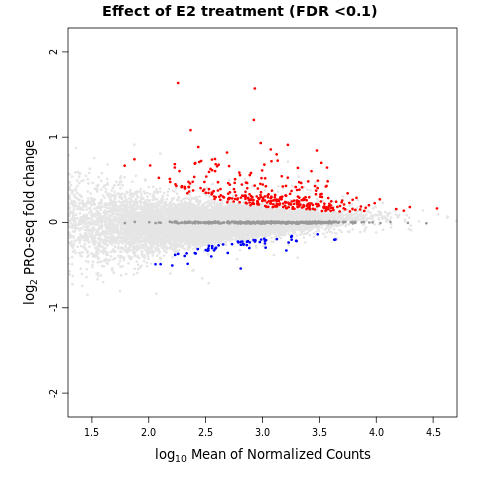

# PRO-seq analysis

## Pre-processing PRO-seq Data

### Renaming fastq files
The raw fastq files are initially named as R1_001 and R2_001, we want to change them to PE1 and PE2 (meaning pair-end 1 and pair-end 2).\
```{r engine='bash', eval=F, echo=TRUE}
#!/bin/bash

#SBATCH --job-name=cname.sh     # name for job
#SBATCH -N 1                    # number of nodes
#SBATCH -n 1                    # number of jobs / tasks
#SBATCH -c 16                    # number of cores
#SBATCH -p general           # SLURM partition
#SBATCH --qos=general        # SLURM Quality of service
#SBATCH --mem=32G                # RAM (memory) requested
#SBATCH --mail-type=ALL
#SBATCH --mail-user=ssun@uchc.edu
#SBATCH -o cname.sh_%j.out
#SBATCH -e cname.sh_%j.err

gunzip *.gz

for i in *_S*R1_001.fastq
do
    nm=$(echo $i | awk -F"/" '{print $NF}' | awk -F"_S" '{print $1}')
    echo $nm
        two=$(echo $i | awk -F"/" '{print $NF}' | awk -F"R1_001.fastq" '{print $1}')
        mv $i ${nm}_dep1_PE1.fastq 
        mv ${two}R2_001.fastq ${nm}_dep1_PE2.fastq
done
```

<!--
combining dep1 and dep2 pro-seq data? (haven't got the dep2 data yet)
```{r engine='bash', eval=F, echo=TRUE}
cd /directory/of/GATA3_PRO

for i in *_dep1_*.fastq.gz
do
	echo $i
	pre=$(echo $i | awk -F"/" '{print $NF}' | awk -F"_dep1_" '{print $1}')
	suf=$(echo $i | awk -F"/" '{print $NF}' | awk -F"_dep1_" '{print $2}')
	x=$(echo $suf |  awk -F".fastq" '{print $1}')
	echo $pre
	echo $suf
	echo $x
	cat $i ${pre}_dep2_${suf} > ${pre}_${x}_final.fastq.gz
done 
```
-->

## Install softwares and scripts
```{r engine='bash', eval=F, echo=TRUE}
# mkdir scripts
# pwd
# home/FCAM/ssun/scripts
module load bowtie2/2.5.0
module load genometools/1.5.10
module load bedtools/2.29.0
module load ucsc_genome/2012.05.22
module load rust 

release=109

wget https://raw.githubusercontent.com/guertinlab/fqComplexity/main/fqComplexity
wget https://raw.githubusercontent.com/guertinlab/fqComplexity/main/complexity_pro.R
wget https://raw.githubusercontent.com/guertinlab/Nascent_RNA_Methods/main/insert_size.R
wget https://raw.githubusercontent.com/guertinlab/Nascent_RNA_Methods/main/pause_index.R
wget https://raw.githubusercontent.com/guertinlab/Nascent_RNA_Methods/main/exon_intron_ratio.R
wget https://raw.githubusercontent.com/guertinlab/Nascent_RNA_Methods/main/plot_all_metrics.R
wget https://raw.githubusercontent.com/guertinlab/Nascent_RNA_Methods/main/differential_expression.R

wget https://raw.githubusercontent.com/guertinlab/Nascent_RNA_Methods/main/PRO_normalization
wget https://raw.githubusercontent.com/guertinlab/Nascent_RNA_Methods/main/normalization_factor.R
wget https://raw.githubusercontent.com/guertinlab/Nascent_RNA_Methods/main/normalize_bedGraph.py


chmod +x insert_size.R
chmod +x fqComplexity
chmod +x complexity_pro.R
chmod +x pause_index.R
chmod +x exon_intron_ratio.R
chmod +x plot_all_metrics.R
chmod +x differential_expression.R

chmod +x normalize_bedGraph.py
chmod +x normalization_factor.R
chmod +x PRO_normalization

# cd /home/FCAM/ssun/packages
wget https://github.com/guertinlab/fqdedup/archive/refs/tags/v1.0.0.tar.gz
gunzip v1.0.0.tar.gz
tar -xvf v1.0.0.tar
cd fqdedup-1.0.0/ 
cargo build --release
```


## Confirming read size and UMI length
```{r engine='bash', eval=F, echo=TRUE}
# retrieve the readsize of raw library
for i in *.fastq
do

	#echo $i
	awk 'NR%4==2 {print length}' $i | sort -n | uniq -c | sort -rh | head -1 
	# The NR%4==2 count the second line out of every block of 4.
done 2>&1 | tee -a raw_reads_from_fastq_log.txt
#First column (with number) read number and second column (with number) read length.


#MCF7_dTAGGATAClone522_30min_control_E2_rep1_dep1_PE1.fastq
#20343886 47
#MCF7_dTAGGATAClone522_30min_control_E2_rep1_dep1_PE2.fastq
#20343886 39
#...
#read size ==39
#Read1 contains the barcoding information (UMI) followed by the polyT tail of the messenger RNA, and Read2 contains the actual sequence. 47-39=8
#UMI == 8
```


## Genome and annotation processing
install from source, if you have issues: guertin@uchc.edu \
 \
Genome \
```{r engine='bash', eval=F, echo=TRUE}
# cd /home/FCAM/ssun/Genome_pro
#! /bin/sh

#SBATCH --job-name=getrefgenome.sh     # name for job
#SBATCH -N 1                  
#SBATCH -n 1                 
#SBATCH -c 32                  
#SBATCH -p general           
#SBATCH --qos=general       
#SBATCH --mem=32G               
#SBATCH --mail-type=ALL 
#SBATCH --mail-user=ssun@uchc.edu
#SBATCH -o getrefgenome.sh_%j.out
#SBATCH -e getrefgenome.sh_%j.err

export PATH=$PATH:/home/FCAM/ssun/packages/

module load bowtie2/2.5.0
module load genometools/1.5.10
module load bedtools/2.29.0
module load ucsc_genome/2012.05.22


wget https://hgdownload.cse.ucsc.edu/goldenpath/hg38/bigZips/hg38.fa.gz
gunzip hg38.fa.gz
mkdir hg38_bt2
cd hg38_bt2
bowtie2-build ../hg38.fa hg38

cd ..
mkdir human_rDNA_bt2
wget https://github.com/databio/ref_decoy/raw/master/human_rDNA.fa.gz
gunzip human_rDNA.fa.gz
cd human_rDNA_bt2
bowtie2-build ../human_rDNA.fa human_rDNA


cd ..
mkdir seqOutbias_hg38
cd seqOutbias_hg38
seqOutBias seqtable ../hg38.fa --read-size=39 #Compute mappability for the given read length and the k-mer that corresponds to each possible read alignment position
#This is the most time-consuming step of the seqOutBias command but can be completed once before processing the sequencing data

cd ..
wget https://hgdownload.cse.ucsc.edu/goldenpath/hg38/bigZips/hg38.chrom.sizes

```

Annotation \
```{r engine='bash', eval=F, echo=TRUE}
# cd /home/FCAM/ssun/Annotation
#! /bin/sh

#SBATCH --job-name=getesblannotation.sh     # name for job
#SBATCH -N 1                  
#SBATCH -n 1
#SBATCH -c 32                  
#SBATCH -p general           
#SBATCH --qos=general
#SBATCH --mem=32G           	
#SBATCH --mail-type=ALL	
#SBATCH --mail-user=ssun@uchc.edu
#SBATCH -o getesblannotation.sh_%j.out
#SBATCH -e getesblannotation.sh_%j.err

module load bedtools

release=109

wget http://ftp.ensembl.org/pub/release-${release}/gtf/homo_sapiens/Homo_sapiens.GRCh38.${release}.chr.gtf.gz
gunzip Homo_sapiens.GRCh38.${release}.chr.gtf.gz

#extract all exon 1 annotations
grep 'exon_number "1"' Homo_sapiens.GRCh38.${release}.chr.gtf | \
    sed 's/^/chr/' | \
    awk '{OFS="\t";} {print $1,$4,$5,$14,$20,$7}' | \
    sed 's/";//g' | \
    sed 's/"//g' | sed 's/chrMT/chrM/g' | \
    sort -k1,1 -k2,2n > Homo_sapiens.GRCh38.${release}.tss.bed

#extract all exons
grep 'exon_number' Homo_sapiens.GRCh38.${release}.chr.gtf | \
    sed 's/^/chr/' | \
    awk '{OFS="\t";} {print $1,$4,$5,$14,$20,$7}' | \
    sed 's/";//g' | \
    sed 's/"//g' | sed 's/chrMT/chrM/g' | \
    sort -k1,1 -k2,2n > Homo_sapiens.GRCh38.${release}.all.exons.bed

#extract all complete gene annotations, sorted for use with join
awk '$3 == "gene"' Homo_sapiens.GRCh38.${release}.chr.gtf | \
    sed 's/^/chr/' | \
    awk '{OFS="\t";} {print $1,$4,$5,$10,$14,$7}' | \
    sed 's/";//g' | \
    sed 's/"//g' | sed 's/chrMT/chrM/g' | \
    sort -k5,5 > Homo_sapiens.GRCh38.${release}.bed
    
#extract all complete gene annotations, sorted for use with bedtools map
awk '$3 == "gene"' Homo_sapiens.GRCh38.${release}.chr.gtf | \
    sed 's/^/chr/' | \
    awk '{OFS="\t";} {print $1,$4,$5,$10,$14,$7}' | \
    sed 's/";//g' | \
    sed 's/"//g' | sed 's/chrMT/chrM/g' | \
    sort -k1,1 -k2,2n > Homo_sapiens.GRCh38.${release}_sorted.bed
 
#merge exon intervals that overlap each other
mergeBed -s -c 6 -o distinct -i Homo_sapiens.GRCh38.${release}.all.exons.bed | \
    awk '{OFS="\t";} {print $1,$2,$3,$4,$2,$4}' | 
    sort -k1,1 -k2,2n > Homo_sapiens.GRCh38.${release}.all.exons.merged.bed

#remove all first exons (so pause region is excluded from exon / intron density ratio)
subtractBed -s -a Homo_sapiens.GRCh38.${release}.all.exons.merged.bed -b Homo_sapiens.GRCh38.${release}.tss.bed | \
    sort -k1,1 -k2,2n > Homo_sapiens.GRCh38.${release}.no.first.exons.bed

#extract gene names of exons
intersectBed -s -wb -a Homo_sapiens.GRCh38.${release}.no.first.exons.bed -b Homo_sapiens.GRCh38.${release}.bed | \
    awk '{OFS="\t";} {print $1,$2,$3,$11,$4,$4}' | \
    sort -k1,1 -k2,2n >  Homo_sapiens.GRCh38.${release}.no.first.exons.named.bed

#extract the pause region from the first exons, position 20 - 120 downstream of the TSS
awk  '{OFS="\t";} $6 == "+" {print $1,$2+20,$2 + 120,$4,$5,$6} \
    $6 == "-" {print $1,$3 - 120,$3 - 20,$4,$5,$6}' Homo_sapiens.GRCh38.${release}.tss.bed  | \
    sort -k1,1 -k2,2n > Homo_sapiens.GRCh38.${release}.pause.bed 

#define and name all introns 
subtractBed -s -a Homo_sapiens.GRCh38.${release}.bed -b Homo_sapiens.GRCh38.${release}.all.exons.merged.bed | \
    sort -k1,1 -k2,2n > Homo_sapiens.GRCh38.${release}.introns.bed 
```

# PRO alignment and parallelization:
## Processing reads
```{r engine='bash', eval=F, echo=TRUE}
#! /bin/sh

#SBATCH --job-name=pro_processing_230802.sh     # name for job
#SBATCH -N 1                  
#SBATCH -n 1                 
#SBATCH -c 10                  
#SBATCH -p general           
#SBATCH --qos=general       
#SBATCH --mem=32G               
#SBATCH --mail-type=ALL 
#SBATCH --mail-user=ssun@uchc.edu
#SBATCH -o pro_processing_230802.sh_%j.out
#SBATCH -e pro_processing_230802.sh_%j.err

hostname
name=230802

set -e
# add path to the R files
export PATH=$PATH:/home/FCAM/ssun/packages/://home/FCAM/ssun/scripts

#initialize variables
directory=/home/FCAM/ssun/GATA3_ChIP_PRO_July2023/ProDep1_Sathyan_MCF7_GATAPROSeq_09June23

module load cutadapt/3.5
module load seqtk/1.3
#seqOutBias=/home/FCAM/mguertin/software/seqOutBias
#fqdedup=/home/FCAM/mguertin/ZNF143_PRO/fqdedup-1.0.0/target/release/fqdedup
#flash=/home/FCAM/mguertin/software/flash
module load fastq-pair/1.0
module load samtools/1.16.1
module load genometools/1.5.10
module load ucsc_genome/2012.05.22
module load rust
module load bowtie2
module load bedtools

sizes=/home/FCAM/ssun/Genome_pro/hg38.chrom.sizes
annotation_prefix=/home/FCAM/ssun/Annotation/Homo_sapiens.GRCh38.109 
UMI_length=8
read_size=39
cores=10
genome=/home/FCAM/ssun/Genome_pro/hg38.fa
genome_index=/home/FCAM/ssun/Genome_pro/hg38_bt2/hg38
prealign_rdna_index=/home/FCAM/ssun/Genome_pro/human_rDNA_bt2/human_rDNA
tallymer=/home/FCAM/ssun/Genome_pro/seqOutbias_hg38/hg38.tal_${read_size}.gtTxt.gz
table=/home/FCAM/ssun/Genome_pro/seqOutbias_hg38/hg38_${read_size}.4.2.2.tbl

#gunzip ${name}_PE1_final.fastq.gz
#gunzip ${name}_PE2_final.fastq.gz

echo 'removing dual adapter ligations and calculating the fraction of adapter/adapters in' $name
# remove adapter sequences and discard reads that have insert sizes of one base. If the adapters ligate directly to one another, the UMI is treated as an insert to cutadapt and the effective insert length is equal to the UMI length. The option -m $((UMI_length+2)) provides a one base buffer and discards reads with a length of less than the UMI length + 2.
cutadapt --cores=$cores -m $((UMI_length+2)) -O 1 -a TGGAATTCTCGGGTGCCAAGG ${name}_dep1_PE1.fastq \
        -o ${name}_PE1_noadap.fastq --too-short-output ${name}_PE1_short.fastq > ${name}_PE1_cutadapt.txt
cutadapt --cores=$cores -m $((UMI_length+10)) -O 1 -a GATCGTCGGACTGTAGAACTCTGAAC ${name}_dep1_PE2.fastq \
        -o ${name}_PE2_noadap.fastq --too-short-output ${name}_PE2_short.fastq > ${name}_PE2_cutadapt.txt

PE1_total=$(wc -l ${name}_dep1_PE1.fastq | awk '{print $1/4}') # calculate the raw sequencing depth
PE1_w_Adapter=$(wc -l ${name}_PE1_short.fastq | awk '{print $1/4}') # calculate the raw sequencing depth on files containing reads with 0 or 1 base insertions
AAligation=$(echo "scale=2 ; $PE1_w_Adapter / $PE1_total" | bc) # adapter/adapter ligation product value
echo -e  "value\texperiment\tthreshold\tmetric" > ${name}_QC_metrics.txt
echo -e "$AAligation\t$name\t0.80\tAdapter/Adapter" >> ${name}_QC_metrics.txt


echo 'removing short RNA insertions in' $name
seqtk seq -L $((UMI_length+10)) ${name}_PE1_noadap.fastq > ${name}_PE1_noadap_trimmed.fastq # removes reads that are shorter than 10 bases


echo 'removing PCR duplicates from' $name
fqdedup -i ${name}_PE1_noadap_trimmed.fastq -o ${name}_PE1_dedup.fastq #remove PCR duplicates
PE1_noAdapter=$(wc -l ${name}_PE1_dedup.fastq | awk '{print $1/4}') #this variable is a near-optimal table size value for fastq_pair
fastq_pair -t $PE1_noAdapter ${name}_PE1_dedup.fastq ${name}_PE2_noadap.fastq #pair FASTQ files


echo 'calculating and plotting RNA insert sizes from' $name
# measure RNA degradation by searching for overlap between paired end reads with flash and plotting the resultant histogram output with insert_size.R
flash -q --compress-prog=gzip --suffix=gz ${name}_PE1_dedup.fastq.paired.fq \
        ${name}_PE2_noadap.fastq.paired.fq -o ${name}
insert_size.R ${name}.hist ${UMI_length}


echo 'trimming off the UMI from' $name
# removes the UMI and reverse complements from paired end reads
seqtk trimfq -b ${UMI_length} ${name}_PE1_dedup.fastq | seqtk seq -r - > ${name}_PE1_processed.fastq
seqtk trimfq -e ${UMI_length} ${name}_PE2_noadap.fastq | seqtk seq -r - > ${name}_PE2_processed.fastq


echo 'aligning' $name 'to rDNA and removing aligned reads'
    bowtie2 -p $((cores-2)) -x $prealign_rdna_index -U ${name}_PE1_processed.fastq 2>${name}_bowtie2_rDNA.log | \
        samtools sort -n - | samtools fastq -f 0x4 - > ${name}_PE1.rDNA.fastq
# removes PE2-aligned reads with a rDNA-aligned mate
reads=$(wc -l ${name}_PE1.rDNA.fastq | awk '{print $1/4}')
fastq_pair -t $reads ${name}_PE1.rDNA.fastq ${name}_PE2_processed.fastq


echo 'aligning' $name 'to the genome'
bowtie2 -p $((cores-2)) --maxins 1000 -x $genome_index --rf -1 ${name}_PE1.rDNA.fastq.paired.fq \
        -2 ${name}_PE2_processed.fastq.paired.fq 2>${name}_bowtie2.log | samtools view -b - | \
        samtools sort - -o ${name}.bam # align to the genome;  --rf flag is to account for the fact that we reverse complemented both reads; samtools convert the file to BAM and sort the reads. 
        

#calculate the total number of rDNA-aligned reads
PE1_prior_rDNA=$(wc -l ${name}_PE1_processed.fastq | awk '{print $1/4}')
PE1_post_rDNA=$(wc -l ${name}_PE1.rDNA.fastq | awk '{print $1/4}')
total_rDNA=$(echo "$(($PE1_prior_rDNA-$PE1_post_rDNA))") 
#calculate the total that concordantly align to hg38 and/or rDNA
concordant_pe1=$(samtools view -c -f 0x42 ${name}.bam)
total=$(echo "$(($concordant_pe1+$total_rDNA))")
#rDNA alignment rate
rDNA_alignment=$(echo "scale=2 ; $total_rDNA / $total" | bc)
echo -e "$rDNA_alignment\t$name\t0.10\trDNA Alignment Rate" >> ${name}_QC_metrics.txt

#Mappability rate (expect an alignment rate above 80% for high quality libraries)
map_pe1=$(samtools view -c -f 0x42 ${name}.bam)
pre_alignment=$(wc -l ${name}_PE1.rDNA.fastq.paired.fq | awk '{print $1/4}')
alignment_rate=$(echo "scale=2 ; $map_pe1 / $pre_alignment" | bc)
echo -e "$alignment_rate\t$name\t0.80\tAlignment Rate" >> ${name}_QC_metrics.txt

echo 'plotting and calculating complexity for' $name
fqComplexity -i ${name}_PE1_noadap_trimmed.fastq

echo 'calculating and plotting theoretical sequencing depth' 
echo 'to achieve a defined number of concordantly aligned reads for' $name
PE1_total=$(wc -l ${name}_dep1_PE1.fastq | awk '{print $1/4}')
PE1_noadap_trimmed=$(wc -l ${name}_PE1_noadap_trimmed.fastq | awk '{print $1/4}')
factorX=$(echo "scale=2 ; $PE1_noadap_trimmed / $PE1_total" | bc)

echo fraction of reads that are not adapter/adapter ligation products or below 10 base inserts
echo $factorX 
PE1_dedup=$(wc -l ${name}_PE1_dedup.fastq | awk '{print $1/4}')
factorY=$(echo "scale=2 ; $concordant_pe1 / $PE1_dedup" | bc)
    
fqComplexity -i ${name}_PE1_noadap_trimmed.fastq -x $factorX -y $factorY
echo 'Separating paired end reads and creating genomic BED and bigWig intensity files for' $name

seqOutBias scale $table ${name}.bam --no-scale --stranded --bed-stranded-positive \
        --bw=$name.bigWig --bed=$name.bed --out-split-pairends --only-paired \
        --tail-edge --read-size=$read_size --tallymer=$tallymer

grep -v "random" ${name}_not_scaled_PE1.bed | grep -v "chrUn" | grep -v "chrEBV" | sort -k1,1 -k2,2n > ${name}_tmp.txt 
mv ${name}_tmp.txt ${name}_not_scaled_PE1.bed 

mapBed -null "0" -s -a $annotation_prefix.pause.bed -b ${name}_not_scaled_PE1.bed | \
awk '$7>0' | sort -k5,5 -k7,7nr | sort -k5,5 -u > ${name}_pause.bed

join -1 5 -2 5 ${name}_pause.bed $annotation_prefix.bed | \
        awk '{OFS="\t";} $2==$8 && $6==$12 {print $2, $3, $4, $1, $6, $7, $9, $10}' | \
        awk '{OFS="\t";} $5 == "+" {print $1,$2+480,$8,$4,$6,$5} $5 == "-" {print $1,$7,$2 - 380,$4,$6,$5}' | \
        awk  '{OFS="\t";} $3>$2 {print $1,$2,$3,$4,$5,$6}' | sort -k1,1 -k2,2n  > ${name}_pause_counts_body_coordinates.bed
mapBed -null "0" -s -a ${name}_pause_counts_body_coordinates.bed \
        -b ${name}_not_scaled_PE1.bed | awk '$7>0' | \
        awk '{OFS="\t";} {print $1,$2,$3,$4,$5,$6,$7,$5/100,$7/($3 - $2)}' | \
        awk '{OFS="\t";} {print $1,$2,$3,$4,$5,$6,$7,$8,$9,$8/$9}' > ${name}_pause_body.bed

pause_index.R ${name}_pause_body.bed
echo 'Calculating exon density / intron density as a metric for nascent RNA purity for' $name
mapBed -null "0" -s -a $annotation_prefix.introns.bed \
        -b ${name}_not_scaled_PE1.bed | awk '$7>0' | \
        awk '{OFS="\t";} {print $1,$2,$3,$5,$5,$6,$7,($3 - $2)}' > ${name}_intron_counts.bed
mapBed -null "0" -s -a $annotation_prefix.no.first.exons.named.bed \
        -b ${name}_not_scaled_PE1.bed | awk '$7>0' | \
        awk '{OFS="\t";} {print $1,$2,$3,$4,$4,$6,$7,($3 - $2)}' > ${name}_exon_counts.bed

exon_intron_ratio.R ${name}_exon_counts.bed ${name}_intron_counts.bed
rm ${name}_PE1_short.fastq
rm ${name}_PE2_short.fastq
rm ${name}_PE1_noadap.fastq
rm ${name}_PE2_noadap.fastq
rm ${name}_PE1_noadap_trimmed.fastq
rm ${name}_PE1_dedup.fastq
rm ${name}_PE1_processed.fastq
rm ${name}_PE2_processed.fastq
rm ${name}_PE1_dedup.fastq.paired.fq   
rm ${name}_PE2_noadap.fastq.paired.fq
rm ${name}_PE1_dedup.fastq.single.fq
rm ${name}_PE2_noadap.fastq.single.fq
rm ${name}_PE1.rDNA.fastq.paired.fq
rm ${name}_PE1.rDNA.fastq.single.fq
rm ${name}_PE2_processed.fastq.paired.fq
rm ${name}_PE2_processed.fastq.single.fq
rm ${name}.extendedFrags.fastq.gz
rm ${name}.notCombined_1.fastq.gz
rm ${name}.notCombined_2.fastq.gz

```

Run the previous chunk in parallel \

```{r engine='bash', eval=F, echo=TRUE}


file=pro_processing_230802.sh

for i in *_dep1_PE1.fastq 
do
    nm=$(echo $i | awk -F"/" '{print $NF}' | awk -F"_dep1_PE1.fastq" '{print $1}')
    echo $nm
    sed -e "s/230802/${nm}/g" "$file" > pro_processing_${nm}.sh
    sbatch pro_processing_${nm}.sh
    sleep 1
done

```

```{r engine='bash', eval=F, echo=TRUE}
# count the total aligned reads
module load samtools/1.16.1
for i in *.bam
do
  echo $i
  samtools view -c -f 0x42 $i
done 2>&1 | tee -a aligned_reads_from_bam_log.txt

cat aligned_reads_from_bam_log.txt
#MCF7_dTAGGATAClone522_30min_control_E2_rep1.bam
#7165927
#MCF7_dTAGGATAClone522_30min_control_E2_rep2.bam
#6368273
#MCF7_dTAGGATAClone522_30min_control_E2_rep3.bam
#7927577
#MCF7_dTAGGATAClone522_30min_control_NoE2_rep1.bam
#5383060
#MCF7_dTAGGATAClone522_30min_control_NoE2_rep2.bam
#9783729
#MCF7_dTAGGATAClone522_30min_control_NoE2_rep3.bam
#7954675
#MCF7_dTAGGATAClone522_30min_dTAGV1_E2_rep1.bam
#7797223
#MCF7_dTAGGATAClone522_30min_dTAGV1_E2_rep2.bam
#6695927
#MCF7_dTAGGATAClone522_30min_dTAGV1_E2_rep3.bam
#8281655
#MCF7_dTAGGATAClone522_30min_dTAGV1_NoE2_rep1.bam
#11240496
#MCF7_dTAGGATAClone522_30min_dTAGV1_NoE2_rep2.bam
#7969310
#MCF7_dTAGGATAClone522_30min_dTAGV1_NoE2_rep3.bam
#7076786

```

## Plot all QC metrics 

```{r engine='bash', eval=F, echo=TRUE}
module load R/4.1.2

cat *_QC_metrics.txt | awk '!x[$0]++' > project_QC_metrics.txt 
plot_all_metrics.R project_QC_metrics.txt GATA3_degron_PRO # pdf output

```


# primaryTranscriptAnnotation (PTA) 
The purpose of this analysis is to define primary transcripts 

## Data pre-process
```{r engine='bash', eval=F, echo=TRUE}
#! /bin/sh

#SBATCH --job-name=mergebw.sh     # name for job
#SBATCH -N 1                  
#SBATCH -n 1                 
#SBATCH -c 10                  
#SBATCH -p general           
#SBATCH --qos=general       
#SBATCH --mem=32G               
#SBATCH --mail-type=ALL 
#SBATCH --mail-user=ssun@uchc.edu
#SBATCH -o mergebw.sh_%j.out
#SBATCH -e mergebw.sh_%j.err
export PATH=$PATH:/home/FCAM/ssun/packages/://home/FCAM/ssun/scripts
module load ucsc_genome/2012.05.22
module load R/4.1.2
PRO_normalization -c /home/FCAM/ssun/Genome_pro/hg38.chrom.sizes
# PRO_normalization assumes the naming convention CELL_COND_TIME_ETC_rep<#>_<plus><minus>.bigWig for unpaired reads or 
#CELL_COND_TIME_ETC_rep<#>_<plus><minus>_PE<1><2>.bigWig for paired reads, 
#and assumes that you are running the script in the directory with your bigWigs 
```

### Input for PTA
get the merged bigWigs (minus and plus) for primaryTranscriptAnnotation （PE1 data） \

```{r engine='bash', eval=F, echo=TRUE}
#! /bin/sh

#SBATCH --job-name=mergebw2.sh     # name for job
#SBATCH -N 1                  
#SBATCH -n 1                 
#SBATCH -c 10                  
#SBATCH -p general           
#SBATCH --qos=general       
#SBATCH --mem=32G               
#SBATCH --mail-type=ALL 
#SBATCH --mail-user=ssun@uchc.edu
#SBATCH -o mergebw2.sh_%j.out
#SBATCH -e mergebw2.sh_%j.err

export PATH=$PATH:/home/FCAM/ssun/packages/://home/FCAM/ssun/scripts
module load ucsc_genome/2012.05.22

reps=12
pair="_PE1"
name="MCF7_dTAGGATAClone522_30min"
chrSizes=/home/FCAM/ssun/Genome_pro/hg38.chrom.sizes 

plusfiles=$(ls ${name}_*rep*_plus${pair}_scaled.bigWig)
bigWigMerge $plusfiles tmpPlus${pair}.bg
minusfiles=$(ls ${name}_*rep*_minus${pair}_scaled.bigWig)
bigWigMerge -threshold=-10000000000 $minusfiles tmpMinus${pair}.bg
scaleall=$(bc <<< "scale=4 ; 1.0 / $reps")
normalize_bedGraph.py -i tmpPlus${pair}.bg -s $scaleall -o ${name}_plus${pair}_scaled.bg
normalize_bedGraph.py -i tmpMinus${pair}.bg -s $scaleall -o ${name}_minus${pair}_scaled.bg
sort -k1,1 -k2,2n ${name}_plus${pair}_scaled.bg > ${name}_plus${pair}_scaled_sorted.bg
sort -k1,1 -k2,2n ${name}_minus${pair}_scaled.bg > ${name}_minus${pair}_scaled_sorted.bg
bedGraphToBigWig ${name}_plus${pair}_scaled_sorted.bg $chrSizes ${name}_plus${pair}_scaled.bigWig 
bedGraphToBigWig ${name}_minus${pair}_scaled_sorted.bg $chrSizes ${name}_minus${pair}_scaled.bigWig

rm ${name}_plus${pair}_scaled.bg
rm ${name}_minus${pair}_scaled.bg
rm ${name}_plus${pair}_scaled_sorted.bg
rm ${name}_minus${pair}_scaled_sorted.bg
rm tmpPlus${pair}.bg
rm tmpMinus${pair}.bg
```

### Input for TSS
get the merged plus and minus for TSS inference (PE2 data) \

```{r engine='bash', eval=F, echo=TRUE}
#! /bin/sh

#SBATCH --job-name=mergebw3.sh     # name for job
#SBATCH -N 1                  
#SBATCH -n 1                 
#SBATCH -c 10                  
#SBATCH -p general           
#SBATCH --qos=general       
#SBATCH --mem=32G               
#SBATCH --mail-type=ALL 
#SBATCH --mail-user=ssun@uchc.edu
#SBATCH -o mergebw3.sh_%j.out
#SBATCH -e mergebw3.sh_%j.err

export PATH=$PATH:/home/FCAM/ssun/packages/://home/FCAM/ssun/scripts
module load ucsc_genome/2012.05.22

reps=12
pair="_PE2"
name="MCF7_dTAGGATAClone522_30min"
chrSizes=/home/FCAM/ssun/Genome_pro/hg38.chrom.sizes

plusfiles=$(ls ${name}_*rep*_plus${pair}_scaled.bigWig)
bigWigMerge $plusfiles tmpPlus${pair}.bg
minusfiles=$(ls ${name}_*rep*_minus${pair}_scaled.bigWig)
bigWigMerge -threshold=-10000000000 $minusfiles tmpMinus${pair}.bg
scaleall=$(bc <<< "scale=4 ; 1.0 / $reps")
normalize_bedGraph.py -i tmpPlus${pair}.bg -s $scaleall -o ${name}_plus${pair}_scaled.bg
normalize_bedGraph.py -i tmpMinus${pair}.bg -s $scaleall -o ${name}_minus${pair}_scaled.bg
sort -k1,1 -k2,2n ${name}_plus${pair}_scaled.bg > ${name}_plus${pair}_scaled_sorted.bg
sort -k1,1 -k2,2n ${name}_minus${pair}_scaled.bg > ${name}_minus${pair}_scaled_sorted.bg
bedGraphToBigWig ${name}_plus${pair}_scaled_sorted.bg $chrSizes ${name}_plus${pair}_scaled.bigWig 
bedGraphToBigWig ${name}_minus${pair}_scaled_sorted.bg $chrSizes ${name}_minus${pair}_scaled.bigWig

rm ${name}_plus${pair}_scaled.bg
rm ${name}_minus${pair}_scaled.bg
rm ${name}_plus${pair}_scaled_sorted.bg
rm ${name}_minus${pair}_scaled_sorted.bg
rm tmpPlus${pair}.bg
rm tmpMinus${pair}.bg
```

## Transcription start site (TSS) Inference analysis

TSS Annotations \
```{r engine='R', eval=F, echo=TRUE}
# download the gencode.v42.basic.annotation.gtf.gz file from: https://www.gencodegenes.org/human/release_42.html
# content: Basic gene annotation; region: Chr; Download: GTF

#mkdir Annotation_v42
#cd Annotation_v42
wget https://ftp.ebi.ac.uk/pub/databases/gencode/Gencode_human/release_42/gencode.v42.basic.annotation.gtf.gz
gunzip gencode.v42.basic.annotation.gtf.gz

grep 'transcript_type "protein_coding"' gencode.v42.basic.annotation.gtf | \
    grep -v 'tag "readthrough_transcript"' | \
    grep -v 'tag "RNA_Seq_supported_only"' | \
    grep -v 'tag "RNA_Seq_supported_partial"' | \
    awk '{if($3=="exon"){print $0}} ' | \
    grep -w "exon_number 1" | \
    cut -f1,4,5,7,9 | tr ";" "\t" | \
    awk '{for(i=5;i<=NF;i++){if($i~/^gene_name/){a=$(i+1)}} print $1,$2,$3,a,"na",$4}' | \
    tr " " "\t" | tr -d '"' | \
    grep -v "\tENSG" > gencode.hg38.v42.basic.firstExon.latest.filtered.bed

```

TSS \
```{r engine='R', eval=F, echo=TRUE}
# at the TSS working directory (where you saved the merged bigWig files)
module load R/4.1.2
R

# source TSSinference functions
source("/home/FCAM/ssun/scripts/TSSinference.R")
library(bigWig)
# prepare annotation file
gene.exon1 = parse.bed.exon1("/home/FCAM/ssun/Annotation_v42/gencode.hg38.v42.basic.firstExon.latest.filtered.bed")

# assign bigWig variables
# These two are the ones with control + experimental merged
bw.plus='MCF7_dTAGGATAClone522_30min_plus_PE2_scaled.bigWig'
bw.minus='MCF7_dTAGGATAClone522_30min_minus_PE2_scaled.bigWig'


#potential.tss = TSSinference(gene.exon1, bw.plus, bw.minus, densityFilter=TRUE)
potential.tss2 = TSSinference(gene.exon1, bw.minus, bw.plus, densityFilter=TRUE) # looking for upstream antisense TSSs
```

```{r engine='R', eval=F, echo=TRUE}
head(potential.tss2)
#   chrom     start       end  gene  misc strand height up down
#1  chr19  58353491  58353492  A1BG  A1BG      -     NA NA   NA
#2  chr10  50885674  50885675  A1CF  A1CF      -     NA NA   NA
#3  chr12   9115918   9115919   A2M   A2M      -     NA NA   NA
#4  chr12   8822621   8822622 A2ML1 A2ML1      +     NA NA   NA
#7   chr3 138132389 138132390 A4GNT A4GNT      -     NA NA   NA
#10  chr3 151814073 151814074 AADAC AADAC      +     NA NA   NA
```

## Primary Transcription Annotations 

Annotations \
```{r engine='R', eval=F, echo=TRUE}
#mkdir Annotation_v42
#cd Annotation_v42
#wget https://ftp.ebi.ac.uk/pub/databases/gencode/Gencode_human/release_42/gencode.v42.basic.annotation.gtf.gz
#gunzip gencode.v42.basic.annotation.gtf.gz

# get the coordinates of first exon for every protein-coding gene
grep 'transcript_type "protein_coding"' gencode.v42.basic.annotation.gtf | \
   awk '{if($3=="exon"){print $0}}' | \
   grep -w "exon_number 1" | \
   cut -f1,4,5,7,9 | tr ";" "\t" | \
   awk '{for(i=5;i<=NF;i++){if($i~/^gene_name/){a=$(i+1)}} print $1,$2,$3,a,"na",$4}' | \
   tr " " "\t" | tr -d '"' > gencode.v42.firstExon.bed
  
# get all transcripts
grep 'transcript_type "protein_coding"' gencode.v42.basic.annotation.gtf | \
    awk '{if($3=="transcript"){print $0}} ' | \
    cut -f1,4,5,7,9 | tr ";" "\t" | \
    awk '{for(i=5;i<=NF;i++){if($i~/^gene_name/){a=$(i+1)}} print $1,$2,$3,a,"na",$4}' | \
    tr " " "\t" | tr -d '"' > gencode.v42.transcript.bed
```

PTA \
1.Loading key packages and preprocessed Pro-seq data
```{r engine='R', eval=F, echo=TRUE}
#if (!require("BiocManager", quietly = TRUE))
#    install.packages("BiocManager")

#BiocManager::install("NMF")
library(NMF)
library(dplyr)
library(bigWig)
#BiocManager::install("pracma")
library(pracma) 
library(RColorBrewer) 
# https://github.com/WarrenDavidAnderson/genomicsRpackage/tree/master/primaryTranscriptAnnotation
#library(devtools)
#install_github("WarrenDavidAnderson/genomicsRpackage/primaryTranscriptAnnotation")
#library(primaryTranscriptAnnotation)

### facing troubles while installing the primaryTranscriptAnnotation packages, doing the following instead:
# download genomicsRpackage-master.zip from https://github.com/WarrenDavidAnderson/genomicsRpackage
# unzip genomicsRpackage-master.zip
source("/home/FCAM/ssun/primaryTranscriptsAnnotation/genomicsRpackage-master/primaryTranscriptAnnotation/R/gene_ann.R")
source("/home/FCAM/ssun/primaryTranscriptsAnnotation/genomicsRpackage-master/primaryTranscriptAnnotation/R/map_tu.R")


# import data for all 1's exons, annotate, and remove duplicate transcripts
fname = "/home/FCAM/ssun/Annotation_v42/gencode.v42.firstExon.bed"
dat0 = read.table(fname,header=F,stringsAsFactors=F) 
names(dat0) = c('chr', 'start', 'end', 'gene', 'xy', 'strand') 
dat0 = unique(dat0)
gencode.firstExon = dat0

# import data for all transcripts, annotate, and remove duplicate transcripts
fname = "/home/FCAM/ssun/Annotation_v42/gencode.v42.transcript.bed"
dat0 = read.table(fname,header=F,stringsAsFactors=F) 
names(dat0) = c('chr', 'start', 'end', 'gene', 'xy', 'strand') 
dat0 = unique(dat0)
gencode.transcript = dat0

# chrom size
chrom.sizes = read.table("/home/FCAM/ssun/Genome_pro/hg38.chrom.sizes",stringsAsFactors=F,header=F) 
names(chrom.sizes) = c("chr","size")

# merged plus
plus.file = "MCF7_dTAGGATAClone522_30min_plus_PE1_scaled.bigWig" 
# merged minus
minus.file = "MCF7_dTAGGATAClone522_30min_minus_PE1_scaled.bigWig" 

bw.plus = load.bigWig(plus.file)
bw.minus = load.bigWig(minus.file)
```

2. \
obtain gene annotations use get.largest.interval(); \
count reads for each transcripts use read.count.transcript().\
```{r engine='R', eval=F, echo=TRUE}
# Get the largest interval for each gene, given multiple TSS and TTS annotations
largest.interval.bed = get.largest.interval(bed=gencode.transcript)
# Evaluate reads and compute densities for each transcript of each gene.
transcript.reads = read.count.transcript(bed=gencode.transcript, bw.plus=bw.plus, bw.minus=bw.minus)

# str(transcript.reads)
#List of 2
# $ counts : Named num [1:19650] 0 0 0 249 144 ...
#  ..- attr(*, "names")= chr [1:19650] "OR4F5" "OR4F29" "OR4F16" "SAMD11" ...
# $ density: Named num [1:19650] 0 0 0 0.01207 0.00954 ...
#  ..- attr(*, "names")= chr [1:19650] "OR4F5" "OR4F29" "OR4F16" "SAMD11" ...
```

3. Evaluate count and density distribution \
```{r engine='R', eval=F, echo=TRUE}
png(file="count_density_distribution.png")
par(mfrow=c(1,2)) 
hist(log(transcript.reads$density), breaks=200,
col="black",xlab="log read density",main="") 

hist(log(transcript.reads$counts), breaks=200,
     col="black",xlab="log read count",main="")
dev.off()
```

```{r  out.width = "100%", echo=F, fig.align = "center", fig.cap="Evaluate count and density distribution"}
library(knitr)
 
```

4. 
based on above distribution, we want to filter out genes with low/no expression \
choose threshold \
```{r engine='R', eval=F, echo=TRUE}
den.cut = -8
cnt.cut = 0
ind.cut.den = which(log(transcript.reads$density) < den.cut) 

ind.cut.cnt = which(log(transcript.reads$counts) < cnt.cut) 
ind.cut = union(ind.cut.den, ind.cut.cnt)

png(file="cut_count_density_distribution.png")
par(mfrow=c(1,2))
hist(log(transcript.reads$density), breaks=200,
col="black",xlab="log read density",main="") 
abline(v=den.cut, col="red") 
hist(log(transcript.reads$counts), breaks=200,
col="black",xlab="log read count",main="") 
abline(v=cnt.cut, col="red")
dev.off()
```

```{r  out.width = "100%", echo=F, fig.align = "center", fig.cap="Evaluate count and density distribution 2"}
#library(knitr)
 
```


5. remove genes with low/no expression
```{r engine='R', eval=F, echo=TRUE}
unexp = names(transcript.reads$counts)[ind.cut]
largest.interval.expr.bed = largest.interval.bed[!(largest.interval.bed$gene %in% unexp),]

#head(largest.interval.bed)
#        chr    start      end    gene xy strand
#57158 chr19 58345183 58353492    A1BG na      -
#31276 chr10 50799409 50885675    A1CF na      -
#37570 chr12  9067708  9115919     A2M na      -
#37561 chr12  8822621  8876787   A2ML1 na      +
#1408   chr1 33306766 33321098 A3GALT2 na      -
#60649 chr22 42692121 42720870  A4GALT na      -
```

6. TSS identification and remove overlaps \

In previous TSS analysis session, we have identified transcription start site (TSS).\
```{r engine='R', eval=F, echo=TRUE}
# from TSSInference
tss.interval.bed = merge(potential.tss2, largest.interval.expr.bed, by.x="gene", by.y="gene")


tss.interval.bed$end.x[tss.interval.bed$strand.x == "+"] <- tss.interval.bed$end.y[tss.interval.bed$strand.x == "+"]
tss.interval.bed$start.x[tss.interval.bed$strand.x == "-"] <- tss.interval.bed$start.y[tss.interval.bed$strand.x == "-"]

tss.interval.bed= tss.interval.bed[,c(2:5, 7, 6)]
colnames(tss.interval.bed) = c('chr', 'start', 'end', 'gene', 'xy', 'strand')
tss.interval.bed$xy <- 0

# head(tss.interval.bed)
#    chr     start       end    gene xy strand
#1 chr19  58345183  58353492    A1BG  0      -
#2  chr1  33306766  33321142 A3GALT2  0      -
#3 chr22  42692121  42718965  A4GALT  0      -
#4 chr12  53307459  53321610    AAAS  0      -
#5 chr12 125065402 125143316    AACS  0      +
#6  chr4 170060222 170090202   AADAT  0      -
```

Now we want to address overlaps (if multiple genes' occupying same coordinates) and filter them out from TSSs. 
```{r engine='R', eval=F, echo=TRUE}
#remove gene overlaps with the highest density
overlap.data = gene.overlaps(bed = tss.interval.bed) 

filtered.id.overlaps = remove.overlaps(bed=tss.interval.bed,
                                       overlaps=overlap.data$cases, 
                                       transcripts=gencode.transcript, 
                                       bw.plus=bw.plus, 
                                       bw.minus=bw.minus, 
                                       by="den")
```

7. TTS identification \ 
TTS: transcription termination site.
find TTS search regions use get.end.intervals(); \
identifying TTS use get.TTS(), which will generate a bed output with both TSSs and TTSs. \
```{r engine='R', eval=F, echo=TRUE}
# get TTS intervals
add.to.end = 100000
fraction.end = 0.2
dist.from.start = 50
bed.for.tts.eval = get.end.intervals(bed=filtered.id.overlaps,
                                     add.to.end=add.to.end,
                                     fraction.end=fraction.end,
                                     dist.from.start=dist.from.start)
# identify gene ends
add.to.end = max(bed.for.tts.eval$xy) 
knot.div = 40
pk.thresh = 0.05
bp.bin = 50
knot.thresh = 5

cnt.thresh = 5
tau.dist = 50000
frac.max = 1
frac.min = 0.3

#save.image('230817_GATA3_pro_TSS.Rdata')

inferred.coords = get.TTS(bed=bed.for.tts.eval, tss=  filtered.id.overlaps,
                          bw.plus=bw.plus, bw.minus=bw.minus,
                          bp.bin=bp.bin, add.to.end=add.to.end,
                          pk.thresh=pk.thresh, knot.thresh=knot.thresh,
                          cnt.thresh=cnt.thresh, tau.dist=tau.dist,
                          frac.max=frac.max, frac.min=frac.min,
                          knot.div=knot.div)	# this takes long time to run					  
final.coords = inferred.coords$bed		

write.table(final.coords, file = "MCF7_GATA3_gene_annotations.bed",
sep = "\t", row.names=FALSE, col.names=FALSE, quote=FALSE)
#save.image('230817_GATA3_pro_TSS2.Rdata')
```


# Differential expression analysis with DESeq2

The differential expression analysis quantifies transcriptomic changes upon treating MCF7 cells with 4 combinations of treatment use 30min estrogen (E2) or 30min dTAG (degrading GATA3): \ 
-four groups of treatment, each with 3 reps: \
-control+ E2 \
-control+ control \
-dTAG+control \
-dTAG+E2 \

## load key packages and functions 
```{r engine='R', eval=F, echo=TRUE}
module load R/4.1.2
R

library(bigWig)
library(lattice)
library(latticeExtra)
library(DESeq2)
library(MatchIt) # Selects matched samples of the original treated and control groups with similar covariate distributions – can be used to match exactly on covariates, to match on propensity scores, or perform a variety of other matching procedures. 
library(data.table)

source('https://raw.githubusercontent.com/guertinlab/seqOutBias/master/docs/R/seqOutBias_functions.R')
source('https://raw.githubusercontent.com/mjg54/znf143_pro_seq_analysis/master/docs/ZNF143_functions.R')

get.raw.counts.interval <- function(df, path.to.bigWig, file.prefix = 'M') {
    vec.names = c()
    inten.df=data.frame(matrix(ncol = 0, nrow = nrow(df)))
    
    for (mod.bigWig in Sys.glob(file.path(path.to.bigWig, paste(file.prefix, "*plus_PE1.bigWig", sep ='')))) {
        factor.name = strsplit(strsplit(mod.bigWig, "/")[[1]][length(strsplit(mod.bigWig, "/")[[1]])], '_plus')[[1]][1]
        print(factor.name)
        vec.names = c(vec.names, factor.name)
        loaded.bw.plus = load.bigWig(mod.bigWig)
        print(mod.bigWig)
        print(paste(path.to.bigWig,'/',factor.name, '_minus.bigWig', sep=''))
        loaded.bw.minus = load.bigWig(paste(path.to.bigWig,'/',factor.name, '_minus_PE1.bigWig', sep=''))
        mod.inten = bed6.region.bpQuery.bigWig(loaded.bw.plus, loaded.bw.minus, df)
        inten.df = cbind(inten.df, mod.inten)
    }
    colnames(inten.df) = vec.names
    r.names = paste(df[,1], ':', df[,2], '-', df[,3],'_', df[,4], sep='')
    row.names(inten.df) = r.names
    return(inten.df)
}

plotPCAlattice <- function(df, file = 'PCA_lattice.pdf') {  
  perVar = round(100 * attr(df, "percentVar"))
  df = data.frame(cbind(df, sapply(strsplit(as.character(df$name), '_rep'), '[', 1)))
  colnames(df) = c(colnames(df)[1:(ncol(df)-1)], 'unique_condition')
  print(df)
  #get colors and take away the hex transparency
  color.x = substring(rainbow(length(unique(df$unique_condition))), 1,7) 
  
  df$color = NA
  df$alpha.x = NA
  df$alpha.y = NA
  df$colpal = NA
  
  for (i in 1:length(unique(df$unique_condition))) {
    
    df[df$unique_condition == unique(df$unique_condition)[[i]],]$color = color.x[i]   
    #gives replicates for unique condition
    reps_col<- df[df$unique_condition == unique(df$unique_condition)[[i]],]
    #gives number of replicates in unique condition
    replicates.x = nrow(reps_col)
    alx <- rev(seq(0.2, 1, length.out = replicates.x))
    
    #count transparency(alx), convert alx to hex(aly), combain color and transparency(cp)
    for(rep in 1:replicates.x) {
    
      na <- reps_col[rep, ]$name
      df[df$name == na, ]$alpha.x = alx[rep]
      aly = as.hexmode(round(alx * 255))
      df[df$name == na, ]$alpha.y = aly[rep]
      cp = paste0(color.x[i], aly)
      df[df$name == na, ]$colpal = cp[rep]
      #print(df)
    }
  }
  colpal = df$colpal
  df$name = gsub('_', ' ', df$name)
  pdf(file, width=6, height=6, useDingbats=FALSE)
  print(xyplot(PC2 ~ PC1, groups = name, data=df,
               xlab = paste('PC1: ', perVar[1], '% variance', sep = ''),
               ylab = paste('PC2: ', perVar[2], '% variance', sep = ''),
               par.settings = list(superpose.symbol = list(pch = c(20), col=colpal)),
               pch = 20, cex = 1.7,
               auto.key = TRUE,
               col = colpal))
  dev.off()
}

#run.deseq.list <- function(mat, untreated = 4, treated=4) {
# sample.conditions = factor(c(rep("untreated",untreated), rep("treated", treated)), levels=c("untreated","treated"))        
  
  
#  deseq.counts.table = DESeqDataSetFromMatrix(mat, DataFrame(sample.conditions), ~ sample.conditions);
#  colData(deseq.counts.table)$condition<-factor(colData(deseq.counts.table)$sample.conditions, levels=c('untreated','treated'));
#  dds = DESeq(deseq.counts.table);
#  res = results(dds);
  #res = res[order(res$padj),];
#  return(res)
#}

#run.deseq.list.dds <- function(mat) {
#  sample.conditions = factor(c("untreated","untreated","untreated","untreated","treated","treated","treated","treated"), levels=c("untreated","treated"))        
#  deseq.counts.table = DESeqDataSetFromMatrix(mat, DataFrame(sample.conditions), ~ sample.conditions);
#  colData(deseq.counts.table)$condition<-factor(colData(deseq.counts.table)$sample.conditions, levels=c('untreated','treated'));
#  dds = DESeq(deseq.counts.table);
  #res = results(dds);
  #res = res[order(res$padj),];
#  return(dds)
#}

tighten_summit_window <- function(res.deseq) {
  chr = sapply(strsplit(rownames(res.deseq), ':'), '[', 1)
  start = as.numeric(sapply(strsplit(sapply(strsplit(rownames(res.deseq), ':'), '[', 2), "-"), "[", 1))
  x=sapply(strsplit(sapply(strsplit(rownames(res.deseq), ':'), '[', 2), "-"), "[", 2)
  end = as.numeric(sapply(strsplit(x, "_"), "[", 1))
  gene = sapply(strsplit(rownames(res.deseq), "_"), "[", 2)
  df = cbind.data.frame(chr, start, end, gene)
  return(df)
}

ma.plot.lattice <- function(ma.df, filename = 'file.name', 
         title.main = "Differential PRO-seq Expression",
         col = c("grey90",  "grey60", "#ce228e" , "#2290cf"))
  {
   pdf(paste("MA_plot_", filename, ".pdf", sep=''), width=4, height=4)
   print(xyplot(ma.df$log2FoldChange ~ log(ma.df$baseMean, base=10),
               groups=ma.df$treatment,
               col= col,
               main=title.main, scales="free", aspect=1, pch=20, cex=0.5,
               ylim=c(-2,2),
               xlim=c(1.5,4.5),
               ylab=expression("log"[2]~"PRO-seq fold change"), 
               xlab=expression("log"[10]~"Mean of Normalized Counts"),
               par.settings=list(par.xlab.text=list(cex=1.1,font=2), 
                                 par.ylab.text=list(cex=1.1,font=2))));
  dev.off()
  }

ma.plot.png.lattice <- function(ma.df, filename = 'file.name', 
         title.main = "Differential PRO-seq Expression",
         col = c("grey90",  "grey60", "#ce228e" , "#2290cf"))
  {
  png(paste("MA_plot_", filename, "_response.png", sep=''))
  # pdf(paste("MA_plot_", filename, ".pdf", sep=''), width=4, height=4)
  print(xyplot(ma.df$log2FoldChange ~ log(ma.df$baseMean, base=10),
               groups=ma.df$treatment,
               col= col,
               main=title.main, scales="free", aspect=1, pch=20, cex=0.5,
               ylim=c(-2,2),
               xlim=c(1.5,4.5),
               ylab=expression("log"[2]~"PRO-seq fold change"), 
               xlab=expression("log"[10]~"Mean of Normalized Counts"),
               par.settings=list(par.xlab.text=list(cex=1.1,font=2), 
                                 par.ylab.text=list(cex=1.1,font=2))));
  dev.off()
}

bw.plot.png.lattice <- function(df.bw, filename = 'file.name', 
         title.main = "Differential PRO-seq Expression",
         fill.col = c("red",  "blue"))
  {
png(paste("BW_plot_", filename, "_response.png", sep=''))
print(bwplot(log2FoldChange~treatment,
             data=df.bw,
             par.settings = list(box.rectangle = list(
                                                        # use these box fill colors
                                                        fill = fill.col,
                                                        # make box outlines black
                                                        col = "black"),
                                                        # make whiskers black
                                                        box.umbrella = list(col = "black"),
                                                        # make outlier symbols red stars
                                                        plot.symbol = list(col = "red",pch = 8),
                                                        # make title text 18pt
                                                        par.main.text = list(fontsize = 14)),
             pch = "|",
             ylab="log2FoldChange",
             #auto.key=list(space="right", columns=4),
             scales = list(x = list(rot = 45)),)
      )
dev.off()
 }
```

## load the unnormalized bigWig PRO data 

estimate read size use the `DESeq2` function `estimateSizeFactorsForMatrix`: Each column is divided by the mean of the row. The median of the ratios will be the size factor of the column. \

```{r engine='R', eval=F, echo=TRUE}
inferred.coords=read.table('MCF7_GATA3_gene_annotations.bed', header =FALSE)

counts.df = abs(get.raw.counts.interval(inferred.coords, "/home/FCAM/ssun/GATA3_ChIP_PRO_July2023/ProDep1_Sathyan_MCF7_GATAPROSeq_09June23/bw/", file.prefix = "MCF"))

# estimate read size
estimateSizeFactorsForMatrix(counts.df)
#MCF7_dTAGGATAClone522_30min_control_E2_rep1 
#                                    0.9217157 
#  MCF7_dTAGGATAClone522_30min_control_E2_rep2 
#                                    0.8219647 
#  MCF7_dTAGGATAClone522_30min_control_E2_rep3 
#                                   1.0366662 
#MCF7_dTAGGATAClone522_30min_control_NoE2_rep1 
#                                    0.6803199 
#MCF7_dTAGGATAClone522_30min_control_NoE2_rep2 
#                                    1.3319295 
#MCF7_dTAGGATAClone522_30min_control_NoE2_rep3 
#                                    1.0590939 
#   MCF7_dTAGGATAClone522_30min_dTAGV1_E2_rep1 
#                                    1.0224496 
#   MCF7_dTAGGATAClone522_30min_dTAGV1_E2_rep2 
#                                    0.8222466 
#   MCF7_dTAGGATAClone522_30min_dTAGV1_E2_rep3 
#                                    1.0810677 
# MCF7_dTAGGATAClone522_30min_dTAGV1_NoE2_rep1 
#                                    1.5296429 
# MCF7_dTAGGATAClone522_30min_dTAGV1_NoE2_rep2 
#                                    1.0432574 
# MCF7_dTAGGATAClone522_30min_dTAGV1_NoE2_rep3 
#                                    0.9394534 
```

## Principal Component Analysis for Visualization (PCA)
In this PRO exp, we have 4 levels, here we define the sample conditions based on our experiment treatment set the levels, and plot PCA plot to see similarity within conditions and differences across conditions. \

### call DESeq
```{r engine='R', eval=F, echo=TRUE}
sample.conditions = factor(c("control_E2","control_E2","control_E2","control_NoE2","control_NoE2","control_NoE2","dTAGV1_E2","dTAGV1_E2", "dTAGV1_E2", "dTAGV1_NoE2", "dTAGV1_NoE2","dTAGV1_NoE2"), 
                           levels=c("control_E2","control_NoE2","dTAGV1_E2", "dTAGV1_NoE2"))
deseq.counts.table = DESeqDataSetFromMatrix(counts.df, DataFrame(sample.conditions), ~ sample.conditions)
colData(deseq.counts.table)$condition<-factor(colData(deseq.counts.table)$sample.conditions, levels=c("control_E2","control_NoE2","dTAGV1_E2", "dTAGV1_NoE2"))
dds = DESeq(deseq.counts.table)
#resultsNames(dds)
#[1] "Intercept"                                   
#[2] "sample.conditions_control_NoE2_vs_control_E2"
#[3] "sample.conditions_dTAGV1_E2_vs_control_E2"   
#[4] "sample.conditions_dTAGV1_NoE2_vs_control_E2" 
res = results(dds)
#res = res[order(res$padj),]
rld <- rlog(dds)
```

### PCA plot for 12 reps
```{r engine='R', eval=F, echo=TRUE}
#PCA for experiments
plotPCA(rld)

pca.plot = plotPCA(rld, intgroup="sample.conditions", returnData=TRUE)
pca.plot$sample.conditions = rownames(pca.plot)
plotPCAlattice(pca.plot, file = 'PCA_GATA3_PRO.pdf')
```

```{r  out.width = "100%", echo=F, fig.align = "center", fig.cap="PCA"}
#library(knitr)
knitr::include_graphics("./png_image/PCA_GATA3_PRO.png") 
```

### PCA plot for separated groups
In the above PCA, we can see a clear separation between libraries with or without dTAG treatment. We can further seprate the libraries to two groups and check if there is also clear separation bewteen E2 treated groups. \

1) "control_E2" and "control_NoE2" \
```{r engine='R', eval=F, echo=TRUE}
#PCA for experiments
rld.control.sub <- rld[, rld$condition %in% c("control_E2", "control_NoE2") ]

pca.plot1 = plotPCA(rld.control.sub, intgroup="sample.conditions", returnData=TRUE)
pca.plot1$sample.conditions = rownames(pca.plot1)
plotPCAlattice(pca.plot1, file = 'PCA_GATA3_PRO_control_sub.pdf')
```

```{r  out.width = "100%", echo=F, fig.align = "center", fig.cap="PCA E2 sub"}
#library(knitr)
 
```

2) "dTAGV1_E2" and "dTAGV1_NoE2" \
```{r engine='R', eval=F, echo=TRUE}
#PCA for experiments
rld.dTAG.sub <- rld[, rld$condition %in% c("dTAGV1_E2", "dTAGV1_NoE2") ]

pca.plot2 = plotPCA(rld.dTAG.sub, intgroup="sample.conditions", returnData=TRUE)
pca.plot2$sample.conditions = rownames(pca.plot2)
plotPCAlattice(pca.plot2, file = 'PCA_GATA3_PRO_dTAG_sub.pdf')
```

```{r  out.width = "100%", echo=F, fig.align = "center", fig.cap="PCA dTAG sub"}
#library(knitr)
knitr::include_graphics("./png_image/PCA_GATA3_PRO_dTAG_sub.png") 
```

## DESeq2 design 1

if we consider only one varaible at a time, in other words, if we only care about how one factor affect our gene expression, we could do the following:\

if we want to compare things more complicated, for instances, I want to know if my genes up-regulated in E2 treatment change when degrading GATA3 compared to not degrading GATA3, I need to add the interaction term in the deseq2 design matrix (see the DESeq2 design2 part). \

```{r engine='R', eval=F, echo=TRUE}
rep = factor(sapply(strsplit(colnames(counts.df), 'rep'), '[', 2))
# [1] "1" "2" "3" "1" "2" "3" "1" "2" "3" "1" "2" "3"
sample.conditions = factor(c("control_E2","control_E2","control_E2","control_NoE2","control_NoE2","control_NoE2","dTAGV1_E2","dTAGV1_E2", "dTAGV1_E2", "dTAGV1_NoE2", "dTAGV1_NoE2","dTAGV1_NoE2"), 
                           levels=c("control_E2","control_NoE2","dTAGV1_E2", "dTAGV1_NoE2"))


deseq.df = DESeqDataSetFromMatrix(counts.df, cbind.data.frame(sample.conditions, rep), ~ rep + sample.conditions)
deseq.df = DESeq(deseq.df)
#save.image('230817_GATA3_pro_DEA.Rdata')
```

we want to compare: \
1) "control_E2"  vs. "control_NoE2": ER activity under control \
2) "dTAGV1_E2"  vs.  "dTAGV1_NoE2" : ER activity when GATA3 is depleted \   
3) "dTAGV1_E2" vs. "control_E2" : compare between with or without GATA3 (when ER is activated) \  
4) "dTAGV1_NoE2" vs. "control_NoE2": compare between with or without GATA3 (when ER is not activated) \ 

### 1) control_E2_vs_control_NoE2 \

Here we use `contrast` to extract comparisons between "control_E2" and "control_NoE2"; \
we want to try a few p-value cutoff and see how many coordinates fall into the range.
```{r engine='R', eval=F, echo=TRUE}
#levels(sample.conditions)
#[1] "control_E2"   "control_NoE2" "dTAGV1_E2"    "dTAGV1_NoE2" 

res.deseq = results(deseq.df, contrast = c("sample.conditions", "control_E2", "control_NoE2")) #compare any two groups: contrast = c("Condition", "Treatment", "Control")
sum(res.deseq$padj < 0.1 & !is.na(res.deseq$padj))
#[1] 131
sum(res.deseq$padj < 0.5 & !is.na(res.deseq$padj))
#[1] 274

# activated
activated = res.deseq[res.deseq$padj < 0.1 & !is.na(res.deseq$padj) & res.deseq$log2FoldChange > 0,]
activated.strand = merge(cbind(tighten_summit_window(activated), "Activated"), inferred.coords, by.x = "gene", by.y = "V4")[,c(2, 3, 4, 1, 5, 10)]  # "chr" "start" "end" "gene" "Activated" "strand"
write.table(activated.strand, file = 'control_E2_vs_control_NoE2_activated_genes.bed', quote = FALSE, row.names = FALSE, col.names = FALSE, sep = '\t')
  
# unchanged Matched to Activated
unchanged = res.deseq[!is.na(res.deseq$padj) & res.deseq$padj > 0.1 & abs(res.deseq$log2FoldChange) < 0.01,]
 #unchanged = unchanged[sample(x, size, replace = FALSE, prob = NULL),]
unchanged$treatment = 0
activated$treatment = 1
df.deseq.effects.lattice = rbind(unchanged, activated)
out = matchit(treatment ~ baseMean, data = df.deseq.effects.lattice, method = "optimal", ratio = 1)
unchanged = df.deseq.effects.lattice[rownames(df.deseq.effects.lattice) %in% out$match.matrix,]
unchanged.strand = merge(cbind(tighten_summit_window(unchanged), "Matched to Activated"), inferred.coords, by.x = "gene", by.y = "V4")[,c(2, 3, 4, 1, 5, 10)]	
write.table(unchanged.strand, file = 'control_E2_vs_control_NoE2_activated_matched_genes.bed', quote = FALSE, row.names = FALSE, col.names = FALSE, sep = '\t')
unchanged$treatment = "Matched to Activated"
activated$treatment = "Activated"
df.x = rbind(activated, unchanged)


# repressed
repressed = res.deseq[res.deseq$padj < 0.1 & !is.na(res.deseq$padj) & res.deseq$log2FoldChange < 0,]
repressed.strand = merge(cbind(tighten_summit_window(repressed), "Repressed"), inferred.coords, by.x = "gene", by.y = "V4")[,c(2, 3, 4, 1, 5, 10)]	
write.table(repressed.strand, file = 'control_E2_vs_control_NoE2_repressed_genes.bed', quote = FALSE, row.names = FALSE, col.names = FALSE, sep = '\t')
 

# unchanged Matched to repressed 
unchanged = res.deseq[!is.na(res.deseq$padj) & res.deseq$padj > 0.1 & abs(res.deseq$log2FoldChange) < 0.01,]
 # unchanged = res.deseq[rownames(res.deseq) %notin% rownames(repressed) & !is.na(res.deseq$padj) & res.deseq$log2FoldChange > 0,]
unchanged$treatment = 0
repressed$treatment = 1
df.deseq.effects.lattice = rbind(unchanged, repressed)
out = matchit(treatment ~ baseMean, data = df.deseq.effects.lattice, method = "optimal", ratio = 1)
unchanged = df.deseq.effects.lattice[rownames(df.deseq.effects.lattice) %in% out$match.matrix,]
unchanged.strand = merge(cbind(tighten_summit_window(unchanged), "Matched to Repressed"), inferred.coords, by.x = "gene", by.y = "V4")[,c(2, 3, 4, 1, 5, 10)]	
write.table(unchanged.strand, file = 'control_E2_vs_control_NoE2_repressed_matched_genes.bed', quote = FALSE, row.names = FALSE, col.names = FALSE, sep = '\t')
unchanged$treatment = "Matched to Repressed"
repressed$treatment = "Repressed"
df.x = rbind(df.x, unchanged)
df.x = rbind(df.x, repressed)
```

MA plot \
Using a padj cutoff of 0.1, we got 4 repressed genes and 127 activated genes under E2 treatment (control_E2_vs_control_NoE2). This is expected because we know that ER is an activator and induce ER activity will result in ER-regulated gene activation. \
```{r engine='R', eval=F, echo=TRUE}
ma.df=df.x
ma.df[ma.df$treatment == "Matched to Activated",]$treatment = "Unchanged"
ma.df[ma.df$treatment == "Matched to Repressed",]$treatment = "Unchanged"
# all.other genes
all.other=res.deseq[!(rownames(res.deseq) %in% rownames(ma.df)),]
all.other$treatment="all.other"
ma.df= rbind(ma.df, all.other)
ma.df$treatment <- factor(ma.df$treatment, levels=c("all.other", "Unchanged", "Activated", "Repressed"))

# repressed: 4; activated: 127


ma.plot.lattice(ma.df, filename='control_E2_vs_control_NoE2', title.main="Differential Expression (FDR <0.1)", col=c("grey90","grey60", "red", "blue"))
ma.plot.png.lattice(ma.df, filename='control_E2_vs_control_NoE2', title.main="Differential Expression (FDR <0.1)", col=c("grey90","grey60", "red", "blue"))

#save.image('230818_GATA3_pro_DEA_control_E2_vs_control_NoE2.Rdata')
```

```{r  out.width = "100%", echo=F, fig.align = "center", fig.cap="MA plot"}
#library(knitr)
 
```

### 2) dTAGV1_E2_vs_dTAGV1_NoE2 \   
```{r engine='R', eval=F, echo=TRUE}
#levels(sample.conditions)
#[1] "control_E2"   "control_NoE2" "dTAGV1_E2"    "dTAGV1_NoE2" 

res.deseq = results(deseq.df, contrast = c("sample.conditions", "dTAGV1_E2" , "dTAGV1_NoE2")) # use `contrast` to compare any two groups: contrast = c("Condition", "Treatment", "Control")
sum(res.deseq$padj < 0.1 & !is.na(res.deseq$padj))
#[1] 191
sum(res.deseq$padj < 0.5 & !is.na(res.deseq$padj))
#[1] 433


# activated
activated = res.deseq[res.deseq$padj < 0.1 & !is.na(res.deseq$padj) & res.deseq$log2FoldChange > 0,]
activated.strand = merge(cbind(tighten_summit_window(activated), "Activated"), inferred.coords, by.x = "gene", by.y = "V4")[,c(2, 3, 4, 1, 5, 10)]  # "chr" "start" "end" "gene" "Activated" "strand"
write.table(activated.strand, file = 'dTAGV1_E2_vs_dTAGV1_NoE2_activated_genes.bed', quote = FALSE, row.names = FALSE, col.names = FALSE, sep = '\t')
  
# unchanged Matched to Activated
unchanged = res.deseq[!is.na(res.deseq$padj) & res.deseq$padj > 0.1 & abs(res.deseq$log2FoldChange) < 0.01,]
 #unchanged = unchanged[sample(x, size, replace = FALSE, prob = NULL),]
unchanged$treatment = 0
activated$treatment = 1
df.deseq.effects.lattice = rbind(unchanged, activated)
out = matchit(treatment ~ baseMean, data = df.deseq.effects.lattice, method = "optimal", ratio = 1)
unchanged = df.deseq.effects.lattice[rownames(df.deseq.effects.lattice) %in% out$match.matrix,]
unchanged.strand = merge(cbind(tighten_summit_window(unchanged), "Matched to Activated"), inferred.coords, by.x = "gene", by.y = "V4")[,c(2, 3, 4, 1, 5, 10)]	
write.table(unchanged.strand, file = 'dTAGV1_E2_vs_dTAGV1_NoE2_activated_matched_genes.bed', quote = FALSE, row.names = FALSE, col.names = FALSE, sep = '\t')
unchanged$treatment = "Matched to Activated"
activated$treatment = "Activated"
df.x = rbind(activated, unchanged)


# repressed
repressed = res.deseq[res.deseq$padj < 0.1 & !is.na(res.deseq$padj) & res.deseq$log2FoldChange < 0,]
repressed.strand = merge(cbind(tighten_summit_window(repressed), "Repressed"), inferred.coords, by.x = "gene", by.y = "V4")[,c(2, 3, 4, 1, 5, 10)]	
write.table(repressed.strand, file = 'dTAGV1_E2_vs_dTAGV1_NoE2_repressed_genes.bed', quote = FALSE, row.names = FALSE, col.names = FALSE, sep = '\t')
 

# unchanged Matched to repressed 
unchanged = res.deseq[!is.na(res.deseq$padj) & res.deseq$padj > 0.1 & abs(res.deseq$log2FoldChange) < 0.01,]
 # unchanged = res.deseq[rownames(res.deseq) %notin% rownames(repressed) & !is.na(res.deseq$padj) & res.deseq$log2FoldChange > 0,]
unchanged$treatment = 0
repressed$treatment = 1
df.deseq.effects.lattice = rbind(unchanged, repressed)
out = matchit(treatment ~ baseMean, data = df.deseq.effects.lattice, method = "optimal", ratio = 1)
unchanged = df.deseq.effects.lattice[rownames(df.deseq.effects.lattice) %in% out$match.matrix,]
unchanged.strand = merge(cbind(tighten_summit_window(unchanged), "Matched to Repressed"), inferred.coords, by.x = "gene", by.y = "V4")[,c(2, 3, 4, 1, 5, 10)]	
write.table(unchanged.strand, file = 'dTAGV1_E2_vs_dTAGV1_NoE2_repressed_matched_genes.bed', quote = FALSE, row.names = FALSE, col.names = FALSE, sep = '\t')
unchanged$treatment = "Matched to Repressed"
repressed$treatment = "Repressed"
df.x = rbind(df.x, unchanged)
df.x = rbind(df.x, repressed)
```

MA plot \
```{r engine='R', eval=F, echo=TRUE}
ma.df=df.x
ma.df[ma.df$treatment == "Matched to Activated",]$treatment = "Unchanged"
ma.df[ma.df$treatment == "Matched to Repressed",]$treatment = "Unchanged"
# all.other genes
all.other=res.deseq[!(rownames(res.deseq) %in% rownames(ma.df)),]
all.other$treatment="all.other"
ma.df= rbind(ma.df, all.other)
ma.df$treatment <- factor(ma.df$treatment, levels=c("all.other", "Unchanged", "Activated", "Repressed"))

# repressed: 12; activated: 179

ma.plot.lattice(ma.df, filename='dTAGV1_E2_vs_dTAGV1_NoE2', title.main="Differential Expression (FDR <0.1)", col=c("grey90","grey60", "red", "blue"))
ma.plot.png.lattice(ma.df, filename='dTAGV1_E2_vs_dTAGV1_NoE2', title.main="Differential Expression (FDR <0.1)", col=c("grey90","grey60", "red", "blue"))

#save.image('230818_GATA3_pro_DEA_dTAGV1_E2_vs_dTAGV1_NoE2.Rdata')
```

```{r  out.width = "100%", echo=F, fig.align = "center", fig.cap="MA plot"}
#library(knitr)
knitr::include_graphics("./png_image/MA_plot_dTAGV1_E2_vs_dTAGV1_NoE2_response.png") 
```

### 3) dTAGV1_E2_vs_control_E2 \ 
```{r engine='R', eval=F, echo=TRUE}
#levels(sample.conditions)
#[1] "control_E2"   "control_NoE2" "dTAGV1_E2"    "dTAGV1_NoE2" 

res.deseq = results(deseq.df, contrast = c("sample.conditions", "dTAGV1_E2" , "control_E2")) # use `contrast` to compare any two groups: contrast = c("Condition", "Treatment", "Control")
sum(res.deseq$padj < 0.1 & !is.na(res.deseq$padj))
#[1] 1012


# activated
activated = res.deseq[res.deseq$padj < 0.1 & !is.na(res.deseq$padj) & res.deseq$log2FoldChange > 0,]
activated.strand = merge(cbind(tighten_summit_window(activated), "Activated"), inferred.coords, by.x = "gene", by.y = "V4")[,c(2, 3, 4, 1, 5, 10)]  # "chr" "start" "end" "gene" "Activated" "strand"
write.table(activated.strand, file = 'dTAGV1_E2_vs_control_E2_activated_genes.bed', quote = FALSE, row.names = FALSE, col.names = FALSE, sep = '\t')
  
# unchanged Matched to Activated
unchanged = res.deseq[!is.na(res.deseq$padj) & res.deseq$padj > 0.1 & abs(res.deseq$log2FoldChange) < 0.01,]
 #unchanged = unchanged[sample(x, size, replace = FALSE, prob = NULL),]
unchanged$treatment = 0
activated$treatment = 1
df.deseq.effects.lattice = rbind(unchanged, activated)
out = matchit(treatment ~ baseMean, data = df.deseq.effects.lattice, method = "optimal", ratio = 1)
unchanged = df.deseq.effects.lattice[rownames(df.deseq.effects.lattice) %in% out$match.matrix,]
unchanged.strand = merge(cbind(tighten_summit_window(unchanged), "Matched to Activated"), inferred.coords, by.x = "gene", by.y = "V4")[,c(2, 3, 4, 1, 5, 10)]	
write.table(unchanged.strand, file = 'dTAGV1_E2_vs_control_E2_activated_matched_genes.bed', quote = FALSE, row.names = FALSE, col.names = FALSE, sep = '\t')
unchanged$treatment = "Matched to Activated"
activated$treatment = "Activated"
df.x = rbind(activated, unchanged)


# repressed
repressed = res.deseq[res.deseq$padj < 0.1 & !is.na(res.deseq$padj) & res.deseq$log2FoldChange < 0,]
repressed.strand = merge(cbind(tighten_summit_window(repressed), "Repressed"), inferred.coords, by.x = "gene", by.y = "V4")[,c(2, 3, 4, 1, 5, 10)]	
write.table(repressed.strand, file = 'dTAGV1_E2_vs_control_E2_repressed_genes.bed', quote = FALSE, row.names = FALSE, col.names = FALSE, sep = '\t')
 

# unchanged Matched to repressed 
unchanged = res.deseq[!is.na(res.deseq$padj) & res.deseq$padj > 0.1 & abs(res.deseq$log2FoldChange) < 0.01,]
 # unchanged = res.deseq[rownames(res.deseq) %notin% rownames(repressed) & !is.na(res.deseq$padj) & res.deseq$log2FoldChange > 0,]
unchanged$treatment = 0
repressed$treatment = 1
df.deseq.effects.lattice = rbind(unchanged, repressed)
out = matchit(treatment ~ baseMean, data = df.deseq.effects.lattice, method = "optimal", ratio = 1)
unchanged = df.deseq.effects.lattice[rownames(df.deseq.effects.lattice) %in% out$match.matrix,]
unchanged.strand = merge(cbind(tighten_summit_window(unchanged), "Matched to Repressed"), inferred.coords, by.x = "gene", by.y = "V4")[,c(2, 3, 4, 1, 5, 10)]	
write.table(unchanged.strand, file = 'dTAGV1_E2_vs_control_E2_repressed_matched_genes.bed', quote = FALSE, row.names = FALSE, col.names = FALSE, sep = '\t')
unchanged$treatment = "Matched to Repressed"
repressed$treatment = "Repressed"
df.x = rbind(df.x, unchanged)
df.x = rbind(df.x, repressed)
```

MA plot \
```{r engine='R', eval=F, echo=TRUE}
ma.df=df.x
ma.df[ma.df$treatment == "Matched to Activated",]$treatment = "Unchanged"
ma.df[ma.df$treatment == "Matched to Repressed",]$treatment = "Unchanged"
# all.other genes
all.other=res.deseq[!(rownames(res.deseq) %in% rownames(ma.df)),]
all.other$treatment="all.other"
ma.df= rbind(ma.df, all.other)
ma.df$treatment <- factor(ma.df$treatment, levels=c("all.other", "Unchanged", "Activated", "Repressed"))

# repressed: 492; activated: 520

ma.plot.lattice(ma.df, filename='dTAGV1_E2_vs_control_E2', title.main="Differential Expression (FDR <0.1)", col=c("grey90","grey60", "red", "blue"))
ma.plot.png.lattice(ma.df, filename='dTAGV1_E2_vs_control_E2', title.main="Differential Expression (FDR <0.1)", col=c("grey90","grey60", "red", "blue"))

#save.image('230810_GATA3_pro_DEA_dTAGV1_E2_vs_control_E2.Rdata')
```

```{r  out.width = "100%", echo=F, fig.align = "center", fig.cap="MA plot"}
#library(knitr)
knitr::include_graphics("./png_image/MA_plot_dTAGV1_E2_vs_control_E2_response.png") 
```


### 4) dTAGV1_NoE2_vs_control_NoE2 \ 
```{r engine='R', eval=F, echo=TRUE}
#levels(sample.conditions)
#[1] "control_E2"   "control_NoE2" "dTAGV1_E2"    "dTAGV1_NoE2" 

res.deseq = results(deseq.df, contrast = c("sample.conditions", "dTAGV1_NoE2" , "control_NoE2")) # use `contrast` to compare any two groups: contrast = c("Condition", "Treatment", "Control")
sum(res.deseq$padj < 0.1 & !is.na(res.deseq$padj))
#[1] 1376
sum(res.deseq$padj < 0.05 & !is.na(res.deseq$padj))
#[1] 1165
sum(res.deseq$padj < 0.01 & !is.na(res.deseq$padj))
#[1] 863

# activated
activated = res.deseq[res.deseq$padj < 0.01 & !is.na(res.deseq$padj) & res.deseq$log2FoldChange > 0,]
activated.strand = merge(cbind(tighten_summit_window(activated), "Activated"), inferred.coords, by.x = "gene", by.y = "V4")[,c(2, 3, 4, 1, 5, 10)]  # "chr" "start" "end" "gene" "Activated" "strand"
write.table(activated.strand, file = 'dTAGV1_NoE2_vs_control_NoE2_activated_genes.bed', quote = FALSE, row.names = FALSE, col.names = FALSE, sep = '\t')
  
# unchanged Matched to Activated
unchanged = res.deseq[!is.na(res.deseq$padj) & res.deseq$padj > 0.1 & abs(res.deseq$log2FoldChange) < 0.01,]
 #unchanged = unchanged[sample(x, size, replace = FALSE, prob = NULL),]
unchanged$treatment = 0
activated$treatment = 1
df.deseq.effects.lattice = rbind(unchanged, activated)
out = matchit(treatment ~ baseMean, data = df.deseq.effects.lattice, method = "optimal", ratio = 1)
        #Warning message:
        #Fewer control units than treated units; not all treated units will get a match.
        #unchanged has 528 genes, changing padj cutoff to more stringent value of 0.01 would make activated genes ~461, then the warning message would not show because now you have enough unchanged to match with your activated genes.
unchanged = df.deseq.effects.lattice[rownames(df.deseq.effects.lattice) %in% out$match.matrix,]
unchanged.strand = merge(cbind(tighten_summit_window(unchanged), "Matched to Activated"), inferred.coords, by.x = "gene", by.y = "V4")[,c(2, 3, 4, 1, 5, 10)]	
write.table(unchanged.strand, file = 'dTAGV1_NoE2_vs_control_NoE2_activated_matched_genes.bed', quote = FALSE, row.names = FALSE, col.names = FALSE, sep = '\t')
unchanged$treatment = "Matched to Activated"
activated$treatment = "Activated"
df.x = rbind(activated, unchanged)


# repressed
repressed = res.deseq[res.deseq$padj < 0.01 & !is.na(res.deseq$padj) & res.deseq$log2FoldChange < 0,]
repressed.strand = merge(cbind(tighten_summit_window(repressed), "Repressed"), inferred.coords, by.x = "gene", by.y = "V4")[,c(2, 3, 4, 1, 5, 10)]	
write.table(repressed.strand, file = 'dTAGV1_NoE2_vs_control_NoE2_repressed_genes.bed', quote = FALSE, row.names = FALSE, col.names = FALSE, sep = '\t')
 

# unchanged Matched to repressed 
unchanged = res.deseq[!is.na(res.deseq$padj) & res.deseq$padj > 0.1 & abs(res.deseq$log2FoldChange) < 0.01,]
 # unchanged = res.deseq[rownames(res.deseq) %notin% rownames(repressed) & !is.na(res.deseq$padj) & res.deseq$log2FoldChange > 0,]
unchanged$treatment = 0
repressed$treatment = 1
df.deseq.effects.lattice = rbind(unchanged, repressed)
out = matchit(treatment ~ baseMean, data = df.deseq.effects.lattice, method = "optimal", ratio = 1)
        #Warning message:
        #Fewer control units than treated units; not all treated units will get a match.
        #changing repressed gene padj cutoff fix the warning
        
unchanged = df.deseq.effects.lattice[rownames(df.deseq.effects.lattice) %in% out$match.matrix,]
unchanged.strand = merge(cbind(tighten_summit_window(unchanged), "Matched to Repressed"), inferred.coords, by.x = "gene", by.y = "V4")[,c(2, 3, 4, 1, 5, 10)]	
write.table(unchanged.strand, file = 'dTAGV1_NoE2_vs_control_NoE2_repressed_matched_genes.bed', quote = FALSE, row.names = FALSE, col.names = FALSE, sep = '\t')
unchanged$treatment = "Matched to Repressed"
repressed$treatment = "Repressed"
df.x = rbind(df.x, unchanged)
df.x = rbind(df.x, repressed)
```

MA plot \
GATA3 is an activator, when we treat the cells with the GATA3 degrader dTAG, we would expect to see genes that is regulated by GATA3 been repressed. \
```{r engine='R', eval=F, echo=TRUE}
# padj: 0.05 activated:637 repressed:528
# padj: 0.01 activated:461 repressed:402
# Unchanged is the combine matched genes.
ma.df=df.x
ma.df[ma.df$treatment == "Matched to Activated",]$treatment = "Unchanged"
ma.df[ma.df$treatment == "Matched to Repressed",]$treatment = "Unchanged"
# all.other genes
all.other=res.deseq[!(rownames(res.deseq) %in% rownames(ma.df)),]
all.other$treatment="all.other"
ma.df= rbind(ma.df, all.other)
ma.df$treatment <- factor(ma.df$treatment, levels=c("all.other", "Unchanged", "Activated", "Repressed"))


ma.plot.lattice(ma.df, filename='dTAGV1_NoE2_vs_control_NoE2', title.main="Differential Expression (FDR <0.01)", col=c("grey90","grey60", "red", "blue"))
ma.plot.png.lattice(ma.df, filename='dTAGV1_NoE2_vs_control_NoE2', title.main="Differential Expression (FDR <0.01)", col=c("grey90","grey60", "red", "blue"))

#save.image('230818_GATA3_pro_DEA_dTAGV1_NoE2_vs_control_NoE2.Rdata')
```

```{r  out.width = "100%", echo=F, fig.align = "center", fig.cap="MA plot"}
#library(knitr)
knitr::include_graphics("./png_image/MA_plot_dTAGV1_NoE2_vs_control_NoE2_response.png") 
```


## DESeq2 design2
not using rep in DeSeq2 design df.
```{r engine='R', eval=F, echo=TRUE}
inferred.coords=read.table('MCF7_GATA3_gene_annotations.bed', header =FALSE)
counts.df = abs(get.raw.counts.interval(inferred.coords, "/home/FCAM/ssun/GATA3_ChIP_PRO_July2023/ProDep1_Sathyan_MCF7_GATAPROSeq_09June23/bw/", file.prefix = "MCF"))

sample.conditions = factor(c("control_E2","control_E2","control_E2","control_NoE2","control_NoE2","control_NoE2","dTAGV1_E2","dTAGV1_E2", "dTAGV1_E2", "dTAGV1_NoE2", "dTAGV1_NoE2","dTAGV1_NoE2"), 
                           levels=c("control_E2","control_NoE2","dTAGV1_E2", "dTAGV1_NoE2"))


deseq.df.norep = DESeqDataSetFromMatrix(counts.df, 
                                  data.frame(sample.conditions), 
                                  ~ sample.conditions)
deseq.df.norep = DESeq(deseq.df.norep)
#save.image('230828_GATA3_pro_DEA_norep.Rdata')
```

### control_E2_vs_control_NoE2
Here we use `contrast` to extract comparisons between "control_E2" and "control_NoE2"; \
we want to try a few p-value cutoff and see how many coordinates fall into the range.
```{r engine='R', eval=F, echo=TRUE}
res.deseq.norep = results(deseq.df.norep, contrast = c("sample.conditions", "control_E2", "control_NoE2")) #compare any two groups: contrast = c("Condition", "Treatment", "Control")
sum(res.deseq.norep$padj < 0.1 & !is.na(res.deseq.norep$padj))
#198 (with rep we have ~131)
sum(res.deseq.norep$padj < 0.5 & !is.na(res.deseq.norep$padj))
#476 （with rep we have 274)

# activated
activated = res.deseq.norep[res.deseq.norep$padj < 0.1 & !is.na(res.deseq.norep$padj) & res.deseq.norep$log2FoldChange > 0,]
activated.strand = merge(cbind(tighten_summit_window(activated), "Activated"), inferred.coords, by.x = "gene", by.y = "V4")[,c(2, 3, 4, 1, 5, 10)]  # "chr" "start" "end" "gene" "Activated" "strand"
write.table(activated.strand, file = 'norep_control_E2_vs_control_NoE2_activated_genes.bed', quote = FALSE, row.names = FALSE, col.names = FALSE, sep = '\t')
  
# unchanged Matched to Activated
unchanged = res.deseq.norep[!is.na(res.deseq.norep$padj) & res.deseq.norep$padj > 0.1 & abs(res.deseq.norep$log2FoldChange) < 0.01,]
 #unchanged = unchanged[sample(x, size, replace = FALSE, prob = NULL),]
unchanged$treatment = 0
activated$treatment = 1
df.deseq.effects.lattice = rbind(unchanged, activated)
out = matchit(treatment ~ baseMean, data = df.deseq.effects.lattice, method = "optimal", ratio = 1)
unchanged = df.deseq.effects.lattice[rownames(df.deseq.effects.lattice) %in% out$match.matrix,]
unchanged.strand = merge(cbind(tighten_summit_window(unchanged), "Matched to Activated"), inferred.coords, by.x = "gene", by.y = "V4")[,c(2, 3, 4, 1, 5, 10)]	
write.table(unchanged.strand, file = 'norep_control_E2_vs_control_NoE2_activated_matched_genes.bed', quote = FALSE, row.names = FALSE, col.names = FALSE, sep = '\t')
unchanged$treatment = "Matched to Activated"
activated$treatment = "Activated"
df.x = rbind(activated, unchanged)


# repressed
repressed = res.deseq.norep[res.deseq.norep$padj < 0.1 & !is.na(res.deseq.norep$padj) & res.deseq.norep$log2FoldChange < 0,]
repressed.strand = merge(cbind(tighten_summit_window(repressed), "Repressed"), inferred.coords, by.x = "gene", by.y = "V4")[,c(2, 3, 4, 1, 5, 10)]	
write.table(repressed.strand, file = 'norep_control_E2_vs_control_NoE2_repressed_genes.bed', quote = FALSE, row.names = FALSE, col.names = FALSE, sep = '\t')
 

# unchanged Matched to repressed 
unchanged = res.deseq.norep[!is.na(res.deseq.norep$padj) & res.deseq.norep$padj > 0.1 & abs(res.deseq.norep$log2FoldChange) < 0.01,]
 # unchanged = res.deseq.norep[rownames(res.deseq.norep) %notin% rownames(repressed) & !is.na(res.deseq.norep$padj) & res.deseq.norep$log2FoldChange > 0,]
unchanged$treatment = 0
repressed$treatment = 1
df.deseq.effects.lattice = rbind(unchanged, repressed)
out = matchit(treatment ~ baseMean, data = df.deseq.effects.lattice, method = "optimal", ratio = 1)
unchanged = df.deseq.effects.lattice[rownames(df.deseq.effects.lattice) %in% out$match.matrix,]
unchanged.strand = merge(cbind(tighten_summit_window(unchanged), "Matched to Repressed"), inferred.coords, by.x = "gene", by.y = "V4")[,c(2, 3, 4, 1, 5, 10)]	
write.table(unchanged.strand, file = 'norep_control_E2_vs_control_NoE2_repressed_matched_genes.bed', quote = FALSE, row.names = FALSE, col.names = FALSE, sep = '\t')
unchanged$treatment = "Matched to Repressed"
repressed$treatment = "Repressed"
df.x = rbind(df.x, unchanged)
df.x = rbind(df.x, repressed)

# repressed: 11; activated: 187
# save.image('230828_norep_GATA3_pro_DEA_control_E2_vs_control_NoE2.Rdata')
```

Determine if we need to include "rep"in our design 
```{r engine='R', eval=F, echo=TRUE}
E2_activated_norep=read.table('norep_control_E2_vs_control_NoE2_activated_genes.bed', header =FALSE)
E2_activated=read.table('../DEA_new/control_E2_vs_control_NoE2_activated_genes.bed', header =FALSE)
noreponly_activated=E2_activated_norep[!(E2_activated_norep$V4 %in% E2_activated$V4),]
write.table(noreponly_activated, file = 'only_norep_control_E2_vs_control_NoE2_activated_genes.bed', quote = FALSE, row.names = FALSE, col.names = FALSE, sep = '\t')

#[1] "ACKR2"     "ACTN4"     "ADAMTSL5"  "ADD1"      "AKAP1"     "AMOTL2"   
# [7] "ARHGEF10L" "B4GALT1"   "BCAS1"     "BCL10"     "BICDL2"    "C1QTNF6"  
#[13] "CALCR"     "CARD10"    "CARD19"    "CAV2"      "CCDC170"   "CELSR1"   
#[19] "CRY2"      "DYNLT3"    "E2F6"      "ECE1"      "ENTPD3"    "EPAS1"    
#[25] "EPS15L1"   "FBXO39"    "GJA1"      "GLDC"      "GRPR"      "HOOK3"    
#[31] "HSCB"      "HSH2D"     "JAK1"      "KDM4B"     "LSMEM2"    "MCM3AP"   
#[37] "MID1"      "MX2"       "MYOF"      "NLRC5"     "NRIP1"     "OAS2"     
#[43] "OSTF1"     "PARL"      "PIM1"      "PLCD3"     "PSAP"      "RIMS4"    
#[49] "RIOK3"     "SH3BP5"    "SLC25A25"  "SNRPA"     "SP100"     "SPATS2L"  
#[55] "ST3GAL4"   "TGFA"      "TINCR"     "TNFSF15"   "TSPAN15"   "USP31"    
#[61] "VEZF1" 


#cdf plot
E2_activated_matchunchange=read.table('norep_control_E2_vs_control_NoE2_activated_matched_genes.bed', sep="\t", header =FALSE)
gene.file=rbind(E2_activated_matchunchange,noreponly_activated)
#here the chip.peak file I am using the summit (100bp window) file from published ER Chip data
chip.peak=read.table("/home/FCAM/ssun/GATA3_ChIP_PRO_July2023/ChIP1_Sathyan_MCF7_GATA3/6_FRiP/ER/ER_published_summits_final.bed", header=FALSE)


df.activated= cdf.deseq.df(genes = gene.file, chip.peaks=chip.peak, cat = "Activated")
#df.all=rbind(df.repressed, df.activated)
#df.all$status <- factor(df.all$status, levels=c("Repressed","Matched to Repressed", "Activated", "Matched to Activated"))


#plot the combined cdf
plot_cdf_all(df.activated, 
             tf = "GATA3_control_E2_vs_control_NoE2",
             main="cdf for ER peaks",
             col.lines = c("#00ffff", "grey60", "#ff0000", "grey90"), 
             line.type = c(1), 
             cex = 0.5)
```

conclusion: rep is not necessary. \

scatter plot to see if including interactions in DESeq2 calling can still get similar results for DESeq2 not using interaction (in both DESeq2 formula, `rep` are not included); if the log2FC fall onto/close to the diagonal, the two set of data are similar. \

```{r engine='R', eval=F, echo=TRUE}
load('230828_GATA3_pro_DEA_norep.Rdata')
res.deseq.norep = results(deseq.df.norep, contrast = c("sample.conditions", "control_E2", "control_NoE2"))
de.gene= as.data.frame(res.deseq.norep[res.deseq.norep$padj < 0.1 & !is.na(res.deseq.norep$padj),])
de.gene$gene=rownames(de.gene)

####################
supp.condition1 =factor(rep(rep(c("E2","noE2"),each=3),2), levels=c("noE2","E2"))
supp.condition2=factor(rep(c("ctrl", "dTAG"), each = 6), levels=c("ctrl","dTAG"))


deseq.df = DESeqDataSetFromMatrix(counts.df, 
                                  cbind.data.frame(supp.condition1, supp.condition2), 
                                  ~ supp.condition1 + supp.condition2 + supp.condition1:supp.condition2)
dds = DESeq(deseq.df)
resultsNames(dds)
res3 = results(dds, contrast=c("supp.condition1","E2","noE2"))
sum(res3$padj < 0.1 & !is.na(res3$padj))
de.gene2= as.data.frame(res3[res3$padj < 0.1 & !is.na(res3$padj),])
de.gene2$gene=rownames(de.gene2)
#####################
plot.df=merge(de.gene, de.gene2, by="gene")
plot.df1=plot.df[,c(1,3,9)]
head(plot.df1)

#####################
library(lattice)
png("ER_control_comparison between rep and interaction.png")
print(xyplot(log2FoldChange.x ~ log2FoldChange.y, plot.df1))
dev.off()
###################################################################################################################################################
res.deseq.norep = results(deseq.df.norep, contrast = c("sample.conditions", "dTAGV1_NoE2" , "control_NoE2"))
de.gene= as.data.frame(res.deseq.norep[res.deseq.norep$padj < 0.1 & !is.na(res.deseq.norep$padj),])
de.gene$gene=rownames(de.gene)

res1 = results(dds, contrast=c("supp.condition2","dTAG","ctrl"))
de.gene2= as.data.frame(res1[res1$padj < 0.1 & !is.na(res1$padj),])
de.gene2$gene=rownames(de.gene2)

plot.df=merge(de.gene, de.gene2, by="gene")
plot.df1=plot.df[,c(1,3,9)]
head(plot.df1)

png("dTag_control_comparison between rep and interaction.png")
print(xyplot(log2FoldChange.x ~ log2FoldChange.y, plot.df1))
dev.off()
```


###  dTAGV1_NoE2_vs_control_NoE2
```{r engine='R', eval=F, echo=TRUE}
res.deseq.norep = results(deseq.df.norep, contrast = c("sample.conditions", "dTAGV1_NoE2" , "control_NoE2")) #compare any two groups: contrast = c("Condition", "Treatment", "Control")
sum(res.deseq.norep$padj < 0.1 & !is.na(res.deseq.norep$padj))
#1814
```

## DESeq2 design3
As previous section described, if we want to compare things more complicated, for instances, I want to know if my genes up-regulated in E2 treatment change when degrading GATA3 compared to not degrading GATA3, I need to add the interaction term in the deseq2 design formula. \

we want to compare: \
1) if genes (up-regulated in E2 treatment) will change when degrading GATA3 compared to not degrading GATA3 \
2) if genes (up-regulated when degrading GATA3) will change when activated ER \
3) if genes (down-regulated when degrading GATA3) will change when activated ER \
```{r engine='R', eval=F, echo=TRUE}
inferred.coords=read.table('MCF7_GATA3_gene_annotations.bed', header =FALSE)
counts.df = abs(get.raw.counts.interval(inferred.coords, "/home/FCAM/ssun/GATA3_ChIP_PRO_July2023/ProDep1_Sathyan_MCF7_GATAPROSeq_09June23/bw/", file.prefix = "MCF"))

supp.condition1 =factor(rep(rep(c("E2","noE2"),each=3),2), levels=c("noE2","E2"))
supp.condition2=factor(rep(c("ctrl", "dTAG"), each = 6), levels=c("ctrl","dTAG"))


deseq.df = DESeqDataSetFromMatrix(counts.df, 
                                  cbind.data.frame(supp.condition1, supp.condition2), 
                                  ~ supp.condition1 + supp.condition2 + supp.condition1:supp.condition2)
dds = DESeq(deseq.df)
resultsNames(dds)
#[1] "Intercept"                            
#[2] "supp.condition1_E2_vs_noE2"            
#[3] "supp.condition2_dTAG_vs_ctrl"     
#[4] "supp.condition1E2.supp.condition2dTAG"

# 1) the effect of dTAG treatment in no-E2 condition (no-E2 is reference level)--main effect
res1 = results(dds, contrast=c("supp.condition2","dTAG","ctrl"))
sum(res1$padj < 0.1 & !is.na(res1$padj))
# 1814

# 2) the effect of dTAG treatment in ER activated condition (main effect + interaction term)
res2 = results(dds, list(c("supp.condition2_dTAG_vs_ctrl", "supp.condition1E2.supp.condition2dTAG")))
sum(res2$padj < 0.1 & !is.na(res2$padj))
#1269

# 3) What is the difference between E2 treated and noE2 without dTAG treatment (didn't degrade GATA3)?
res3 = results(dds, contrast=c("supp.condition1","E2","noE2"))
sum(res3$padj < 0.1 & !is.na(res3$padj))
#198

# 4) With dTAG treatment, what is the difference between E2 treated and noE2?
res4 = results(dds, list(c("supp.condition1_E2_vs_noE2","supp.condition1E2.supp.condition2dTAG")))
sum(res4$padj < 0.1 & !is.na(res4$padj))
#261

# 5) The different response in different ER activity (Is the effect of dTAG treatment different across ER activity on/off? This is the interaction term.) ---no   whether GATA3 depend on ER
res5 = results(dds, name="supp.condition1E2.supp.condition2dTAG")
sum(res5$padj < 0.1 & !is.na(res5$padj))
#22

#save.image('230901_GATA3_pro_DEA_interaction.Rdata')
```

### bw plot for different condition (priority)
1) bw plot for +/- E2, activated vs. repressed
```{r engine='R', eval=F, echo=TRUE}
# load('230901_GATA3_pro_DEA_interaction.Rdata')
# res3 = results(dds, contrast=c("supp.condition1","E2","noE2"))
sum(res3$padj < 0.1 & !is.na(res3$padj))
#198

############################### activated
activated = res3[res3$padj < 0.1 & !is.na(res3$padj) & res3$log2FoldChange > 0,]
#activated.strand = merge(cbind(tighten_summit_window(activated), "Activated"), inferred.coords, by.x = "gene", by.y = "V4")[,c(2, 3, 4, 1, 5, 10)]  # "chr" "start" "end" "gene" "Activated" "strand"
#write.table(activated.strand, file = 'control_E2_vs_control_NoE2_activated_genes.bed', quote = FALSE, row.names = FALSE, col.names = FALSE, sep = '\t')

# unchanged Matched to Activated
#unchanged = res3[!is.na(res3$padj) & res3$padj > 0.1 & abs(res3$log2FoldChange) < 0.01,]
 #unchanged = unchanged[sample(x, size, replace = FALSE, prob = NULL),]
#unchanged$treatment = 0
#activated$treatment = 1
#df.deseq.effects.lattice = rbind(unchanged, activated)
#out = matchit(treatment ~ baseMean, data = df.deseq.effects.lattice, method = "optimal", ratio = 1)
#unchanged = df.deseq.effects.lattice[rownames(df.deseq.effects.lattice) %in% out$match.matrix,]
#unchanged.strand = merge(cbind(tighten_summit_window(unchanged), "Matched to Activated"), inferred.coords, by.x = "gene", by.y = "V4")[,c(2, 3, 4, 1, 5, 10)]	
#write.table(unchanged.strand, file = 'control_E2_vs_control_NoE2_activated_matched_genes.bed', quote = FALSE, row.names = FALSE, col.names = FALSE, sep = '\t')

activated$treatment = "Activated"


############################### repressed
repressed = res3[res3$padj < 0.1 & !is.na(res3$padj) & res3$log2FoldChange < 0,]
#repressed.strand = merge(cbind(tighten_summit_window(repressed), "Repressed"), inferred.coords, by.x = "gene", by.y = "V4")[,c(2, 3, 4, 1, 5, 10)]	
#write.table(repressed.strand, file = 'control_E2_vs_control_NoE2_repressed_genes.bed', quote = FALSE, row.names = FALSE, col.names = FALSE, sep = '\t')

# unchanged Matched to repressed 
#unchanged = res3[!is.na(res3$padj) & res3$padj > 0.1 & abs(res3$log2FoldChange) < 0.01,]
#unchanged$treatment = 0
#repressed$treatment = 1
#df.deseq.effects.lattice = rbind(unchanged, repressed)
#out = matchit(treatment ~ baseMean, data = df.deseq.effects.lattice, method = "optimal", ratio = 1)
#unchanged = df.deseq.effects.lattice[rownames(df.deseq.effects.lattice) %in% out$match.matrix,]
#unchanged.strand = merge(cbind(tighten_summit_window(unchanged), "Matched to Repressed"), inferred.coords, by.x = "gene", by.y = "V4")[,c(2, 3, 4, 1, 5, 10)]	
#write.table(unchanged.strand, file = 'control_E2_vs_control_NoE2_repressed_matched_genes.bed', quote = FALSE, row.names = FALSE, col.names = FALSE, sep = '\t')

repressed$treatment = "Repressed"

```

```{r engine='R', eval=F, echo=TRUE}
# bw plot
df.bw1=as.data.frame(rbind(activated, repressed))
df.bw1$treatment=as.factor(df.bw1$treatment)


bw.plot.png.lattice(df.bw1, filename = 'control_E2_vs_control_NoE2', 
         title.main = "differentially expressed gene +/- E2 (FDR=0.1)",
         fill.col = c("red",  "blue"))
```

2) bw plot for +/- E2 genes + dTAG treatment, activated vs. repressed
```{r engine='R', eval=F, echo=TRUE}
#res4 = results(dds, list(c("supp.condition1_E2_vs_noE2","supp.condition1E2.supp.condition2dTAG")))
sum(res4$padj < 0.1 & !is.na(res4$padj))
#261

############################### activated
activated = res4[res4$padj < 0.1 & !is.na(res4$padj) & res4$log2FoldChange > 0,]
#activated.strand = merge(cbind(tighten_summit_window(activated), "Activated"), inferred.coords, by.x = "gene", by.y = "V4")[,c(2, 3, 4, 1, 5, 10)]  # "chr" "start" "end" "gene" "Activated" "strand"
#write.table(activated.strand, file = 'withorwithoutE2_dTAG_activated_genes.bed', quote = FALSE, row.names = FALSE, col.names = FALSE, sep = '\t')
# unchanged Matched to Activated
#unchanged = res4[!is.na(res4$padj) & res4$padj > 0.1 & abs(res4$log2FoldChange) < 0.01,]
 #unchanged = unchanged[sample(x, size, replace = FALSE, prob = NULL),]
#unchanged$treatment = 0
#activated$treatment = 1
#df.deseq.effects.lattice = rbind(unchanged, activated)
#out = matchit(treatment ~ baseMean, data = df.deseq.effects.lattice, method = "optimal", ratio = 1)
#unchanged = df.deseq.effects.lattice[rownames(df.deseq.effects.lattice) %in% out$match.matrix,]
#unchanged.strand = merge(cbind(tighten_summit_window(unchanged), "Matched to Activated"), inferred.coords, by.x = "gene", by.y = "V4")[,c(2, 3, 4, 1, 5, 10)]	
#write.table(unchanged.strand, file = 'withorwithoutE2_dTAG_activated_matched_genes.bed', quote = FALSE, row.names = FALSE, col.names = FALSE, sep = '\t')
activated$treatment = "Activated"

############################### repressed
repressed = res4[res4$padj < 0.1 & !is.na(res4$padj) & res4$log2FoldChange < 0,]
#repressed.strand = merge(cbind(tighten_summit_window(repressed), "Repressed"), inferred.coords, by.x = "gene", by.y = "V4")[,c(2, 3, 4, 1, 5, 10)]	
#write.table(repressed.strand, file = 'withorwithoutE2_dTAG_repressed_genes.bed', quote = FALSE, row.names = FALSE, col.names = FALSE, sep = '\t')

# unchanged Matched to repressed 
#unchanged = res4[!is.na(res4$padj) & res4$padj > 0.1 & abs(res4$log2FoldChange) < 0.01,]
#unchanged$treatment = 0
#repressed$treatment = 1
#df.deseq.effects.lattice = rbind(unchanged, repressed)
#out = matchit(treatment ~ baseMean, data = df.deseq.effects.lattice, method = "optimal", ratio = 1)
#unchanged = df.deseq.effects.lattice[rownames(df.deseq.effects.lattice) %in% out$match.matrix,]
#unchanged.strand = merge(cbind(tighten_summit_window(unchanged), "Matched to Repressed"), inferred.coords, by.x = "gene", by.y = "V4")[,c(2, 3, 4, 1, 5, 10)]	
#write.table(unchanged.strand, file = 'withorwithoutE2_dTAG_repressed_matched_genes.bed', quote = FALSE, row.names = FALSE, col.names = FALSE, sep = '\t')
repressed$treatment = "Repressed"
```

```{r engine='R', eval=F, echo=TRUE}
# bw plot
df.bw2=as.data.frame(rbind(activated, repressed))
df.bw2$treatment=as.factor(df.bw2$treatment)

bw.plot.png.lattice(df.bw2, filename = 'withorwithoutE2_dTAG', 
         title.main = "differentially expressed gene +/- E2 with dTAG (FDR=0.1)",
         fill.col = c("red",  "blue"))
```

```{r engine='R', eval=F, echo=F}
+
  
  # add individual points to existing plot
  as.layer(xyplot(log2FoldChange ~ treatment,
                  data=as.data.frame(df.bw),
                 # function that adds labels
                  #panel = function(x, y, ...) {
                  #panel.xyplot(x, y, ...)
                  #panel.text(x, y,...)
                  #},
                 # tweak individual point display
                  par.settings = list(plot.symbol = list(
                                                          # make individual points black
                                                          col = "black",
                                                          # make individual points open circles
                                                          pch = 1))))
```


3) bw plot for genes that less activated, less repressed
```{r engine='R', eval=F, echo=TRUE}
nrow(df.bw1) # +/-E2
#198
nrow(df.bw2) # +/-E2 +dTAG
#261

df.bw1$chr = sapply(strsplit(rownames(df.bw1), ':'), '[', 1)
df.bw1$start = sapply(strsplit(rownames(df.bw1), '-'), '[', 1)
df.bw1$start = sapply(strsplit(df.bw1$start, ':'), '[', 2)
df.bw1$end = sapply(strsplit(rownames(df.bw1), '-'), '[', 2)
df.bw1$gene=sapply(strsplit(df.bw1$end, '_'), '[', 2)
df.bw1$end = sapply(strsplit(df.bw1$end, '_'), '[', 1)

df.bw2$chr = sapply(strsplit(rownames(df.bw2), ':'), '[', 1)
df.bw2$start = sapply(strsplit(rownames(df.bw2), '-'), '[', 1)
df.bw2$start = sapply(strsplit(df.bw2$start, ':'), '[', 2)
df.bw2$end = sapply(strsplit(rownames(df.bw2), '-'), '[', 2)
df.bw2$gene=sapply(strsplit(df.bw2$end, '_'), '[', 2)
df.bw2$end = sapply(strsplit(df.bw2$end, '_'), '[', 1)

same.gene.bw1= df.bw1[rownames(df.bw1) %in% rownames(df.bw2),]#106
same.gene.bw1= same.gene.bw1[,c(2,7,11)] # log2FoldChange, treatment, gene
same.gene.bw2 = df.bw2[rownames(df.bw2) %in% rownames(df.bw1),] #106
same.gene.bw2= same.gene.bw2[,c(2,7,11)] # log2FoldChange, treatment, gene

colnames(same.gene.bw1)=c("E2_ctrl_log2FoldChange","E2_ctrl_treatment", "gene")
colnames(same.gene.bw2)=c("E2_dTAG_log2FoldChange","E2_dTAG_treatment", "gene")
df.bw3=merge(same.gene.bw1,same.gene.bw2,by='gene',all=TRUE)
```

4) bw plot for genes (that are newly activated, or newly repressed)
```{r engine='R', eval=F, echo=TRUE}

```

### MA plot
MA plot for condition1, condition2, condition 4 and condition 5
```{r engine='R', eval=F, echo=TRUE}

```

### heatmap for 4 factor DE genes
try to draw heatmap for differentially expressed genes on condition 3. 
```{r engine='R', eval=F, echo=TRUE}

```

### are the ones less E2-activated in dTAG treatment than in Ctrl treatment closer to GATA3 binding sites?
cdf plot for condition 5
```{r engine='R', eval=F, echo=TRUE}

```


# integrate with ChIP...
The above activated, repressed, and matched files in bed format are going to be integrated with our ChIP exp to determine functional ChIP peaks. \