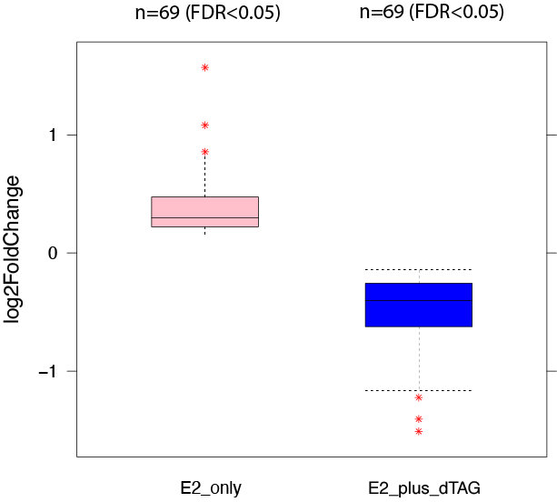
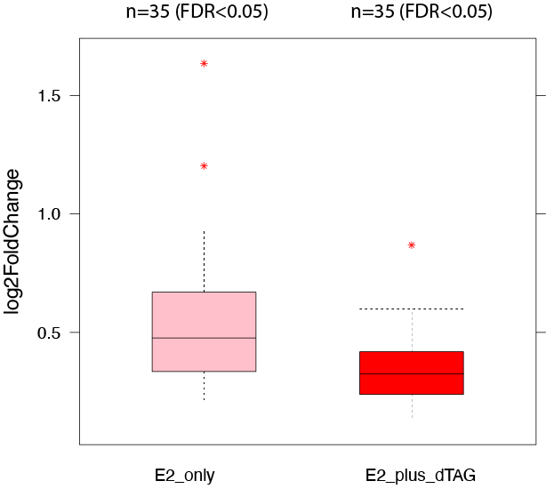

# PRO-seq Data Processing

## Pre-processing PRO-seq Data

### Renaming fastq files
The raw fastq files are initially named as R1_001 and R2_001, we want to change them to PE1 and PE2 (meaning pair-end 1 and pair-end 2).\

1) dep1 \

```{r engine='bash', eval=F, echo=TRUE}
#cp /labs/Guertin/sathyan/MCF7_dTAGGATA3_PRO_060923/230609_NB551647_0102_AHVVGCBGXN/Data/Intensities/BaseCalls/Sathyan_MCF7_GATAPROSeq_09June23/*.gz .

for i in *_S*R1_001.fastq.gz
do
    nm=$(echo $i | awk -F"/" '{print $NF}' | awk -F"_S" '{print $1}')
    echo $nm
        two=$(echo $i | awk -F"/" '{print $NF}' | awk -F"R1_001.fastq.gz" '{print $1}')
        mv $i ${nm}_dep1_PE1.fastq.gz 
        mv ${two}R2_001.fastq.gz ${nm}_dep1_PE2.fastq.gz
done
```

2) dep2 \
```{r engine='bash', eval=F, echo=TRUE}
#cd /home/FCAM/ssun/GATA3_ChIP_PRO_July2023/230915_NB551647_0108_AHTGWHBGXT/Data/Intensities/BaseCalls/230915_GATA3_PRO

for i in *R1_001.fastq.gz
do
    name=$(echo $i | awk -F"/" '{print $NF}' | awk -F"_S" '{print $1}')
    cat ${name}*R1_001.fastq.gz > MCF7_dTAGGATAClone522_30min_${name}_dep2_PE1.fastq.gz
    cat ${name}*R2_001.fastq.gz > MCF7_dTAGGATAClone522_30min_${name}_dep2_PE2.fastq.gz    
done
```


combining dep1 and dep2 PRO-seq data \
```{r engine='bash', eval=F, echo=TRUE}
#cd /directory/of/GATA3_PRO
#cp /home/FCAM/ssun/GATA3_ChIP_PRO_July2023/230915_NB551647_0108_AHTGWHBGXT/Data/Intensities/BaseCalls/230915_GATA3_PRO/*dep2*.gz .

for i in *_dTAG_*.gz
do
 nm=$(echo $i | awk -F"MCF7_dTAGGATAClone522_30min_dTAG_" '{print $2}')
 mv $i MCF7_dTAGGATAClone522_30min_dTAGV1_${nm}
done

for i in *_noE2_*.gz
do
 nm=$(echo $i | awk -F"_noE2_" '{print $2}')
 nmm=$(echo $i | awk -F"_noE2_" '{print $1}')
 mv $i ${nmm}_NoE2_${nm}
done


for i in *_dep1_*.fastq.gz
do
	echo $i
	pre=$(echo $i | awk -F"/" '{print $NF}' | awk -F"_dep1_" '{print $1}')
	suf=$(echo $i | awk -F"/" '{print $NF}' | awk -F"_dep1_" '{print $2}')
	x=$(echo $suf |  awk -F".fastq" '{print $1}')
	echo $pre
	echo $suf
	echo $x
	cat $i ${pre}_dep2_${suf} > ${pre}_${x}_final.fastq.gz
done 
```

```{r engine='bash', eval=F, echo=F}
md5sum *final.fastq.gz

dfe6c6094ed8541afe1ed0e47eaffb39  MCF7_dTAGGATAClone522_30min_control_E2_rep1_PE1_final.fastq.gz
bc54f23cb075e9df0c9f1df176d949db  MCF7_dTAGGATAClone522_30min_control_E2_rep1_PE2_final.fastq.gz
1ab84c09e7ba8e0221f77be8d64499ff  MCF7_dTAGGATAClone522_30min_control_E2_rep2_PE1_final.fastq.gz
d2084e5140c58439d59818d853171001  MCF7_dTAGGATAClone522_30min_control_E2_rep2_PE2_final.fastq.gz
fb2f948a9b7698f122df7a990c6908bd  MCF7_dTAGGATAClone522_30min_control_E2_rep3_PE1_final.fastq.gz
8465df9dc904f6b6db4d7b912a92cb6c  MCF7_dTAGGATAClone522_30min_control_E2_rep3_PE2_final.fastq.gz
9371d0fc6f0306df946db6250512cc6b  MCF7_dTAGGATAClone522_30min_control_NoE2_rep1_PE1_final.fastq.gz
cb33664c6d717937b04be8ab65620ffd  MCF7_dTAGGATAClone522_30min_control_NoE2_rep1_PE2_final.fastq.gz
9ba399f1d8d151400f94f031bee845ef  MCF7_dTAGGATAClone522_30min_control_NoE2_rep2_PE1_final.fastq.gz
4219c13ccfc27192339a6225dc0540c6  MCF7_dTAGGATAClone522_30min_control_NoE2_rep2_PE2_final.fastq.gz
3934e6610fbb924d4d3071630cb477f3  MCF7_dTAGGATAClone522_30min_control_NoE2_rep3_PE1_final.fastq.gz
f51fadb87683d75cb76db0dfba61991a  MCF7_dTAGGATAClone522_30min_control_NoE2_rep3_PE2_final.fastq.gz
e561d6d9a5d6afd3feb49c92079899de  MCF7_dTAGGATAClone522_30min_dTAGV1_E2_rep1_PE1_final.fastq.gz
81bd3d16663b6caf576ee45ff381dae5  MCF7_dTAGGATAClone522_30min_dTAGV1_E2_rep1_PE2_final.fastq.gz
98c0583af89871fc8f53b0e472996719  MCF7_dTAGGATAClone522_30min_dTAGV1_E2_rep2_PE1_final.fastq.gz
58d947dcefc157ac7556a9692869b5bd  MCF7_dTAGGATAClone522_30min_dTAGV1_E2_rep2_PE2_final.fastq.gz
436aba45c025d52efb369a6b00906497  MCF7_dTAGGATAClone522_30min_dTAGV1_E2_rep3_PE1_final.fastq.gz
56d81392872f2bb0f87da514b3ceaf8e  MCF7_dTAGGATAClone522_30min_dTAGV1_E2_rep3_PE2_final.fastq.gz
9c71109a93a58ca40925394992c60b0a  MCF7_dTAGGATAClone522_30min_dTAGV1_NoE2_rep1_PE1_final.fastq.gz
f4ffebc432c9534a13239ea9e74ad705  MCF7_dTAGGATAClone522_30min_dTAGV1_NoE2_rep1_PE2_final.fastq.gz
51875e618dd20b19f380597279de05ad  MCF7_dTAGGATAClone522_30min_dTAGV1_NoE2_rep2_PE1_final.fastq.gz
b04a79eb1437734418208a58fc1a65fa  MCF7_dTAGGATAClone522_30min_dTAGV1_NoE2_rep2_PE2_final.fastq.gz
08562b62fcb60fb0b749799956bfb787  MCF7_dTAGGATAClone522_30min_dTAGV1_NoE2_rep3_PE1_final.fastq.gz
6e6de59c8bc7ced3b07ad8bd38085c53  MCF7_dTAGGATAClone522_30min_dTAGV1_NoE2_rep3_PE2_final.fastq.gz
```

Pre-align raw reads \
```{r engine='bash', eval=F, echo=TRUE}
for i in *final*.fastq
do
 echo $i
 echo $(cat $i |wc -l)/4|bc
done

#MCF7_dTAGGATAClone522_30min_control_E2_rep1_PE1_final.fastq
#46197075
#MCF7_dTAGGATAClone522_30min_control_E2_rep1_PE2_final.fastq
#46197075
#MCF7_dTAGGATAClone522_30min_control_E2_rep2_PE1_final.fastq
#55526070
#MCF7_dTAGGATAClone522_30min_control_E2_rep2_PE2_final.fastq
#55526070
#MCF7_dTAGGATAClone522_30min_control_E2_rep3_PE1_final.fastq
#36656775
#MCF7_dTAGGATAClone522_30min_control_E2_rep3_PE2_final.fastq
#36656775
#MCF7_dTAGGATAClone522_30min_control_NoE2_rep1_PE1_final.fastq
#118386335
#MCF7_dTAGGATAClone522_30min_control_NoE2_rep1_PE2_final.fastq
#118386335
#MCF7_dTAGGATAClone522_30min_control_NoE2_rep2_PE1_final.fastq
#53342524
#MCF7_dTAGGATAClone522_30min_control_NoE2_rep2_PE2_final.fastq
#53342524
#MCF7_dTAGGATAClone522_30min_control_NoE2_rep3_PE1_final.fastq
#39471875
#MCF7_dTAGGATAClone522_30min_control_NoE2_rep3_PE2_final.fastq
#39471875
#MCF7_dTAGGATAClone522_30min_dTAGV1_E2_rep1_PE1_final.fastq
#44290358
#MCF7_dTAGGATAClone522_30min_dTAGV1_E2_rep1_PE2_final.fastq
#44290358
#MCF7_dTAGGATAClone522_30min_dTAGV1_E2_rep2_PE1_final.fastq
#67780216
#MCF7_dTAGGATAClone522_30min_dTAGV1_E2_rep2_PE2_final.fastq
#67780216
#MCF7_dTAGGATAClone522_30min_dTAGV1_E2_rep3_PE1_final.fastq
#44984789
#MCF7_dTAGGATAClone522_30min_dTAGV1_E2_rep3_PE2_final.fastq
#44984789
#MCF7_dTAGGATAClone522_30min_dTAGV1_NoE2_rep1_PE1_final.fastq
#36132418
#MCF7_dTAGGATAClone522_30min_dTAGV1_NoE2_rep1_PE2_final.fastq
#36132418
#MCF7_dTAGGATAClone522_30min_dTAGV1_NoE2_rep2_PE1_final.fastq
#51329663
#MCF7_dTAGGATAClone522_30min_dTAGV1_NoE2_rep2_PE2_final.fastq
#51329663
#MCF7_dTAGGATAClone522_30min_dTAGV1_NoE2_rep3_PE1_final.fastq
#51457906
#MCF7_dTAGGATAClone522_30min_dTAGV1_NoE2_rep3_PE2_final.fastq
#51457906
```

### Pre-Install softwares and scripts
```{r engine='bash', eval=F, echo=TRUE}
# mkdir scripts
# pwd
# home/FCAM/ssun/scripts
module load bowtie2/2.5.0
module load genometools/1.5.10
module load bedtools/2.29.0
module load ucsc_genome/2012.05.22
module load rust 

release=109

wget https://raw.githubusercontent.com/guertinlab/fqComplexity/main/fqComplexity
wget https://raw.githubusercontent.com/guertinlab/fqComplexity/main/complexity_pro.R
wget https://raw.githubusercontent.com/guertinlab/Nascent_RNA_Methods/main/insert_size.R
wget https://raw.githubusercontent.com/guertinlab/Nascent_RNA_Methods/main/pause_index.R
wget https://raw.githubusercontent.com/guertinlab/Nascent_RNA_Methods/main/exon_intron_ratio.R
wget https://raw.githubusercontent.com/guertinlab/Nascent_RNA_Methods/main/plot_all_metrics.R
wget https://raw.githubusercontent.com/guertinlab/Nascent_RNA_Methods/main/differential_expression.R

wget https://raw.githubusercontent.com/guertinlab/Nascent_RNA_Methods/main/PRO_normalization
wget https://raw.githubusercontent.com/guertinlab/Nascent_RNA_Methods/main/normalization_factor.R
wget https://raw.githubusercontent.com/guertinlab/Nascent_RNA_Methods/main/normalize_bedGraph.py


chmod +x insert_size.R
chmod +x fqComplexity
chmod +x complexity_pro.R
chmod +x pause_index.R
chmod +x exon_intron_ratio.R
chmod +x plot_all_metrics.R
chmod +x differential_expression.R

chmod +x normalize_bedGraph.py
chmod +x normalization_factor.R
chmod +x PRO_normalization

# cd /home/FCAM/ssun/packages
wget https://github.com/guertinlab/fqdedup/archive/refs/tags/v1.0.0.tar.gz
gunzip v1.0.0.tar.gz
tar -xvf v1.0.0.tar
cd fqdedup-1.0.0/ 
cargo build --release
```


### Confirming Read size and UMI length

Knowing the read size and UMI length is important for downstream analysis (such as adapter removing...). If you know your experimental protocol well, you could also double check using approaches listed here. \

**Read size:** \
```{r engine='bash', eval=F, echo=TRUE}
# retrieve the read size from raw library
for i in *final.fastq
do

	#echo $i
	awk 'NR%4==2 {print length}' $i | sort -n | uniq -c | sort -rh | head -1 
	# The NR%4==2 count the second line out of every block of 4.
done 2>&1 | tee -a raw_reads_from_fastq_log.txt
#First column (with number) read number and second column (with number) read length.


#46197075 47
#46197075 39
#55526070 47
#55526070 39
#...

#Read1 contains the barcoding information (UMI) followed by the polyT tail of the messenger RNA, and Read2 contains the actual sequence. 

```

read size = 39 \
\

**UMI length:** \

We could also interpret the UMI size from the `cutadapt` report. There is a "Overview of removed sequences" table showing in the `cutadapt` output: the first and second column (length and count) will tell us X(length) bases were removed in Y (count) reads. `cutadapt` search for adapter sequences, and once found match, will remove/trim the matched sequences. Since UMI length is fixed (let's call it N), but its sequence is variable, it is expected that in the case of adapter-adapter ligation, you would trim off most of your sequences except for the UMI. \
```{r engine='bash', eval=F, echo=TRUE}
# subset 2 million reads from one of the FASTQs
zcat MCF7_dTAGGATAClone522_30min_dTAGV1_NoE2_rep3_PE1_final.fastq.gz | head -n 20000000 > UMI_test.fastq
module load cutadapt

# <cutadapt>
# -m : minimum length
# -O : [capital letter o] minimum overlap length between adapter and read
# -a : adapter sequence ligated to 3' end, or of the first read in paired data
# -o : [lowercase o] name of output file, which is a FASTQ with trimmed reads
cutadapt --cores=12 -m 1 -O 1 -a TGGAATTCTCGGGTGCCAAGG UMI_test.fastq -o UMI_test_noadapt.fastq > UMI_test_cutadapt.txt

tail -47 UMI_test_cutadapt.txt
# 1	592436	1250000.0	0	592436
# 2	144162	312500.0	0	144162
# ...
# 38	20859	0.0	2	18392 2283 184
# 39	1919588	0.0	2	1819435 90946 9207
# 40	68522	0.0	2	57236 10607 679
# 41	44009	0.0	2	40378 2842 789
# 42	36100	0.0	2	33541 2135 424
# 43	32719	0.0	2	30383 1873 463
# 44	29800	0.0	2	27750 1646 404
# 45	27873	0.0	2	26077 1517 279
# 46	34163	0.0	2	32187 1675 301
# 47	38688	0.0	2	36157 2124 407
```

In our example above, we have a sequence of 47bp long, at length 39 (1st column), we see highest count value of 1919588 (2nd column), which means: `cutadapt` found matches of adapter sequences and trims 39 bases off in 1919588 reads. These sequences are most likely to be adapter-adapter ligation with UMI next to the adapter. \

UMI length = 47-39 = 8.


### Get Reference Genome and Genome Annotation
Install from source, if you have issues: guertin@uchc.edu \
 \
**Genome** \
```{r engine='bash', eval=F, echo=TRUE}
# cd /home/FCAM/ssun/Genome_pro
export PATH=$PATH:/home/FCAM/ssun/packages/

module load bowtie2/2.5.0
module load genometools/1.5.10
module load bedtools/2.29.0
module load ucsc_genome/2012.05.22


wget https://hgdownload.cse.ucsc.edu/goldenpath/hg38/bigZips/hg38.fa.gz
gunzip hg38.fa.gz
mkdir hg38_bt2
cd hg38_bt2
bowtie2-build ../hg38.fa hg38

cd ..
mkdir human_rDNA_bt2
wget https://github.com/databio/ref_decoy/raw/master/human_rDNA.fa.gz
gunzip human_rDNA.fa.gz
cd human_rDNA_bt2
bowtie2-build ../human_rDNA.fa human_rDNA


cd ..
mkdir seqOutbias_hg38
cd seqOutbias_hg38
seqOutBias seqtable ../hg38.fa --read-size=39 #Compute mappability for the given read length and the k-mer that corresponds to each possible read alignment position
#This is the most time-consuming step of the seqOutBias command but can be completed once before processing the sequencing data

cd ..
wget https://hgdownload.cse.ucsc.edu/goldenpath/hg38/bigZips/hg38.chrom.sizes

```

**Reference Gene Annotation** \

The Ensembl website (http://www.ensembl.org/index.html) contains the information for the latest release, at the time of writing the release for hg38 is 110.\
```{r engine='bash', eval=F, echo=TRUE}
# cd /home/FCAM/ssun/Annotation
module load bedtools

release=110
mkdir Annotation_${release}
cd Annotation_${release}

wget http://ftp.ensembl.org/pub/release-${release}/gtf/homo_sapiens/Homo_sapiens.GRCh38.${release}.chr.gtf.gz
gunzip Homo_sapiens.GRCh38.${release}.chr.gtf.gz

#extract all exon 1 annotations
grep 'exon_number "1"' Homo_sapiens.GRCh38.${release}.chr.gtf | \
    sed 's/^/chr/' | \
    awk '{OFS="\t";} {print $1,$4,$5,$14,$20,$7}' | \
    sed 's/";//g' | \
    sed 's/"//g' | sed 's/chrMT/chrM/g' | \
    sort -k1,1 -k2,2n > Homo_sapiens.GRCh38.${release}.tss.bed

#extract all exons
grep 'exon_number' Homo_sapiens.GRCh38.${release}.chr.gtf | \
    sed 's/^/chr/' | \
    awk '{OFS="\t";} {print $1,$4,$5,$14,$20,$7}' | \
    sed 's/";//g' | \
    sed 's/"//g' | sed 's/chrMT/chrM/g' | \
    sort -k1,1 -k2,2n > Homo_sapiens.GRCh38.${release}.all.exons.bed

#extract all complete gene annotations, sorted for use with join
awk '$3 == "gene"' Homo_sapiens.GRCh38.${release}.chr.gtf | \
    sed 's/^/chr/' | \
    awk '{OFS="\t";} {print $1,$4,$5,$10,$14,$7}' | \
    sed 's/";//g' | \
    sed 's/"//g' | sed 's/chrMT/chrM/g' | \
    sort -k5,5 > Homo_sapiens.GRCh38.${release}.bed
    
#extract all complete gene annotations, sorted for use with bedtools map
awk '$3 == "gene"' Homo_sapiens.GRCh38.${release}.chr.gtf | \
    sed 's/^/chr/' | \
    awk '{OFS="\t";} {print $1,$4,$5,$10,$14,$7}' | \
    sed 's/";//g' | \
    sed 's/"//g' | sed 's/chrMT/chrM/g' | \
    sort -k1,1 -k2,2n > Homo_sapiens.GRCh38.${release}_sorted.bed
 
#merge exon intervals that overlap each other
mergeBed -s -c 6 -o distinct -i Homo_sapiens.GRCh38.${release}.all.exons.bed | \
    awk '{OFS="\t";} {print $1,$2,$3,$4,$2,$4}' | 
    sort -k1,1 -k2,2n > Homo_sapiens.GRCh38.${release}.all.exons.merged.bed

#remove all first exons (so pause region is excluded from exon / intron density ratio)
subtractBed -s -a Homo_sapiens.GRCh38.${release}.all.exons.merged.bed -b Homo_sapiens.GRCh38.${release}.tss.bed | \
    sort -k1,1 -k2,2n > Homo_sapiens.GRCh38.${release}.no.first.exons.bed

#extract gene names of exons
intersectBed -s -wb -a Homo_sapiens.GRCh38.${release}.no.first.exons.bed -b Homo_sapiens.GRCh38.${release}.bed | \
    awk '{OFS="\t";} {print $1,$2,$3,$11,$4,$4}' | \
    sort -k1,1 -k2,2n >  Homo_sapiens.GRCh38.${release}.no.first.exons.named.bed

#extract the pause region from the first exons, position 20 - 120 downstream of the TSS
awk  '{OFS="\t";} $6 == "+" {print $1,$2+20,$2 + 120,$4,$5,$6} \
    $6 == "-" {print $1,$3 - 120,$3 - 20,$4,$5,$6}' Homo_sapiens.GRCh38.${release}.tss.bed  | \
    sort -k1,1 -k2,2n > Homo_sapiens.GRCh38.${release}.pause.bed 

#define and name all introns 
subtractBed -s -a Homo_sapiens.GRCh38.${release}.bed -b Homo_sapiens.GRCh38.${release}.all.exons.merged.bed | \
    sort -k1,1 -k2,2n > Homo_sapiens.GRCh38.${release}.introns.bed 
```

## PRO-seq pre-alignment and alignment

### Work Flow
**Pre-alignment:** \
1) **Remove Adapters**: use `cutadapt` to trim out the provided adapter sequences, and also removes any adapter-adapter ligation sequences. \ 
In any normal case, after removing the adapter, the remaining sequences would be considered as an effective insert sequences by `cutadapt`, and the minimum effective size should be larger than the UMI length; in the case of adapter-adapter ligation, after removing the adapter sequences, there will be left with some sequences with 0 to UMIsize length, and we want to filter those sequences out because there are large chances these are product of adapter-adapter ligation sequences. Here in the code, we specify a `-m` parameter to discard processed reads that are shorter than (UMI_length+2) in PE1 and (UMI_length+10) in PE2. \
The output .txt file is the `cutadapt` report, more details could be found here: (https://cutadapt.readthedocs.io/en/stable/guide.html#reporting)\

2) **Remove short RNA insertions** \
Short insertions are removed by  indirect indicators for RNA integrity.
3) **Remove PCR duplicates** \
4) **Trim UMI and reverse complement** \


\
**Alignment:** \
1) **rDNA**:  \
There are >80% rDNA in mature RNA, and 10% to 20% rDNA in nascent RNA. The rDNA alignment rate lower than 20% is acceptable. \
2) **Genome:** \
Here we map to hg38 genome. \

**Quality control**: \
1) **Adapter Ratio**: \
2) **RNA integrity**: \
3) **library complexity**: \
4) **Nascent RNA purity**: \
5) **Run-on efficiency**: \


### parallel running 

Create the "pro_processing_230919.sh":
```{r engine='bash', eval=F, echo=TRUE}
#! /bin/sh

#SBATCH --job-name=pro_processing_230919.sh     
#SBATCH -N 1                  
#SBATCH -n 1                 
#SBATCH -c 16                  
#SBATCH -p himem           
#SBATCH --qos=himem      
#SBATCH --mem=68G               
#SBATCH --mail-type=ALL 
#SBATCH --mail-user=ssun@uchc.edu
#SBATCH -o pro_processing_230919.sh_%j.out
#SBATCH -e pro_processing_230919.sh_%j.err

hostname
name=230919

set -e
# add path to the R files
export PATH=$PATH:/home/FCAM/ssun/packages/://home/FCAM/ssun/scripts

#initialize variables
directory=/home/FCAM/ssun/GATA3_ChIP_PRO_July2023/Pro_final

module load cutadapt/3.5
module load seqtk/1.3
#seqOutBias=/home/FCAM/mguertin/software/seqOutBias
#fqdedup=/home/FCAM/mguertin/ZNF143_PRO/fqdedup-1.0.0/target/release/fqdedup
#flash=/home/FCAM/mguertin/software/flash
module load fastq-pair/1.0
module load samtools/1.16.1
module load genometools/1.5.10
module load ucsc_genome/2012.05.22
module load rust
module load bowtie2
module load bedtools

sizes=/home/FCAM/ssun/Genome_pro/hg38.chrom.sizes
annotation_prefix=/home/FCAM/ssun/Annotation/Annotation_110/Homo_sapiens.GRCh38.110 
UMI_length=8
read_size=39
cores=16
genome=/home/FCAM/ssun/Genome_pro/hg38.fa
genome_index=/home/FCAM/ssun/Genome_pro/hg38_bt2/hg38
prealign_rdna_index=/home/FCAM/ssun/Genome_pro/human_rDNA_bt2/human_rDNA
tallymer=/home/FCAM/ssun/Genome_pro/seqOutbias_hg38/hg38.tal_${read_size}.gtTxt.gz
table=/home/FCAM/ssun/Genome_pro/seqOutbias_hg38/hg38_${read_size}.4.2.2.tbl

#gunzip ${name}_PE1_final.fastq.gz
#gunzip ${name}_PE2_final.fastq.gz

echo 'removing dual adapter ligations and calculating the fraction of adapter/adapters in' $name
cutadapt --cores=$cores -m $((UMI_length+2)) -O 1 -a TGGAATTCTCGGGTGCCAAGG ${name}_PE1_final.fastq \
        -o ${name}_PE1_noadap.fastq --too-short-output ${name}_PE1_short.fastq > ${name}_PE1_cutadapt.txt # --too-short-output is a filter option, and output the filterred reads to an output file
cutadapt --cores=$cores -m $((UMI_length+10)) -O 1 -a GATCGTCGGACTGTAGAACTCTGAAC ${name}_PE2_final.fastq \
        -o ${name}_PE2_noadap.fastq --too-short-output ${name}_PE2_short.fastq > ${name}_PE2_cutadapt.txt

PE1_total=$(wc -l ${name}_PE1_final.fastq | awk '{print $1/4}') # calculate the raw sequencing depth
PE1_w_Adapter=$(wc -l ${name}_PE1_short.fastq | awk '{print $1/4}') # calculate the raw sequencing depth on files containing reads with 0 or 1 base insertions
AAligation=$(echo "scale=2 ; $PE1_w_Adapter / $PE1_total" | bc) # adapter/adapter ligation product value
echo -e  "value\texperiment\tthreshold\tmetric" > ${name}_QC_metrics.txt
echo -e "$AAligation\t$name\t0.80\tAdapter/Adapter" >> ${name}_QC_metrics.txt


echo 'removing short RNA insertions in' $name
seqtk seq -L $((UMI_length+10)) ${name}_PE1_noadap.fastq > ${name}_PE1_noadap_trimmed.fastq # removes reads that are shorter than 10 bases


echo 'removing PCR duplicates from' $name
fqdedup -i ${name}_PE1_noadap_trimmed.fastq -o ${name}_PE1_dedup.fastq #remove PCR duplicates
PE1_noAdapter=$(wc -l ${name}_PE1_dedup.fastq | awk '{print $1/4}') #this variable is a near-optimal table size value for fastq_pair
fastq_pair -t $PE1_noAdapter ${name}_PE1_dedup.fastq ${name}_PE2_noadap.fastq #pair FASTQ files


echo 'calculating and plotting RNA insert sizes from' $name
# measure RNA degradation by searching for overlap between paired end reads with flash and plotting the resultant histogram output with insert_size.R
flash -q --compress-prog=gzip --suffix=gz ${name}_PE1_dedup.fastq.paired.fq \
        ${name}_PE2_noadap.fastq.paired.fq -o ${name}
insert_size.R ${name}.hist ${UMI_length}


echo 'trimming off the UMI from' $name
# removes the UMI and reverse complements from paired end reads
seqtk trimfq -b ${UMI_length} ${name}_PE1_dedup.fastq | seqtk seq -r - > ${name}_PE1_processed.fastq
seqtk trimfq -e ${UMI_length} ${name}_PE2_noadap.fastq | seqtk seq -r - > ${name}_PE2_processed.fastq


echo 'aligning' $name 'to rDNA and removing aligned reads'
    bowtie2 -p $((cores-2)) -x $prealign_rdna_index -U ${name}_PE1_processed.fastq 2>${name}_bowtie2_rDNA.log | \
        samtools sort -n - | samtools fastq -f 0x4 - > ${name}_PE1.rDNA.fastq
# removes PE2-aligned reads with a rDNA-aligned mate
reads=$(wc -l ${name}_PE1.rDNA.fastq | awk '{print $1/4}')
fastq_pair -t $reads ${name}_PE1.rDNA.fastqc ${name}_PE2_processed.fastq


echo 'aligning' $name 'to the genome'
bowtie2 -p $((cores-2)) --maxins 1000 -x $genome_index --rf -1 ${name}_PE1.rDNA.fastq.paired.fq \
        -2 ${name}_PE2_processed.fastq.paired.fq 2>${name}_bowtie2.log | samtools view -b - | \
        samtools sort - -o ${name}.bam # align to the genome;  --rf flag is to account for the fact that we reverse complemented both reads; samtools convert the file to BAM and sort the reads. 
        

#calculate the total number of rDNA-aligned reads
PE1_prior_rDNA=$(wc -l ${name}_PE1_processed.fastq | awk '{print $1/4}')
PE1_post_rDNA=$(wc -l ${name}_PE1.rDNA.fastq | awk '{print $1/4}')
total_rDNA=$(echo "$(($PE1_prior_rDNA-$PE1_post_rDNA))") 
#calculate the total that concordantly align to hg38 and/or rDNA
concordant_pe1=$(samtools view -c -f 0x42 ${name}.bam)                     
total=$(echo "$(($concordant_pe1+$total_rDNA))")
#rDNA alignment rate (20% lower rDNA alignment is good)
rDNA_alignment=$(echo "scale=2 ; $total_rDNA / $total" | bc)
echo -e "$rDNA_alignment\t$name\t0.20\trDNA Alignment Rate" >> ${name}_QC_metrics.txt

#Mappability rate (expect an alignment rate above 80% for high quality libraries)
map_pe1=$(samtools view -c -f 0x42 ${name}.bam)
pre_alignment=$(wc -l ${name}_PE1.rDNA.fastq.paired.fq | awk '{print $1/4}')
alignment_rate=$(echo "scale=2 ; $map_pe1 / $pre_alignment" | bc)
echo -e "$alignment_rate\t$name\t0.80\tAlignment Rate" >> ${name}_QC_metrics.txt

echo 'plotting and calculating complexity for' $name
fqComplexity -i ${name}_PE1_noadap_trimmed.fastq

echo 'calculating and plotting theoretical sequencing depth' 
echo 'to achieve a defined number of concordantly aligned reads for' $name
PE1_total=$(wc -l ${name}_PE1_final.fastq | awk '{print $1/4}')
PE1_noadap_trimmed=$(wc -l ${name}_PE1_noadap_trimmed.fastq | awk '{print $1/4}')
factorX=$(echo "scale=2 ; $PE1_noadap_trimmed / $PE1_total" | bc)

echo fraction of reads that are not adapter/adapter ligation products or below 10 base inserts
echo $factorX 
PE1_dedup=$(wc -l ${name}_PE1_dedup.fastq | awk '{print $1/4}')
factorY=$(echo "scale=2 ; $concordant_pe1 / $PE1_dedup" | bc)
    
fqComplexity -i ${name}_PE1_noadap_trimmed.fastq -x $factorX -y $factorY
echo 'Separating paired end reads and creating genomic BED and bigWig intensity files for' $name
        
seqOutBias scale $table ${name}.bam --no-scale --stranded --bed-stranded-positive \
        --bw=$name.bigWig --bed=$name.bed --out-split-pairends --only-paired \
        --tail-edge --read-size=$read_size --tallymer=$tallymer 2>&1 | tee ${name}_seqOutBias.log

grep -v "random" ${name}_not_scaled_PE1.bed | grep -v "chrUn" | grep -v "chrEBV" | sort -k1,1 -k2,2n > ${name}_tmp.txt 
mv ${name}_tmp.txt ${name}_not_scaled_PE1.bed 

mapBed -null "0" -s -a $annotation_prefix.pause.bed -b ${name}_not_scaled_PE1.bed | \
awk '$7>0' | sort -k5,5 -k7,7nr | sort -k5,5 -u > ${name}_pause.bed

join -1 5 -2 5 ${name}_pause.bed $annotation_prefix.bed | \
        awk '{OFS="\t";} $2==$8 && $6==$12 {print $2, $3, $4, $1, $6, $7, $9, $10}' | \
        awk '{OFS="\t";} $5 == "+" {print $1,$2+480,$8,$4,$6,$5} $5 == "-" {print $1,$7,$2 - 380,$4,$6,$5}' | \
        awk  '{OFS="\t";} $3>$2 {print $1,$2,$3,$4,$5,$6}' | sort -k1,1 -k2,2n  > ${name}_pause_counts_body_coordinates.bed
mapBed -null "0" -s -a ${name}_pause_counts_body_coordinates.bed \
        -b ${name}_not_scaled_PE1.bed | awk '$7>0' | \
        awk '{OFS="\t";} {print $1,$2,$3,$4,$5,$6,$7,$5/100,$7/($3 - $2)}' | \
        awk '{OFS="\t";} {print $1,$2,$3,$4,$5,$6,$7,$8,$9,$8/$9}' > ${name}_pause_body.bed

pause_index.R ${name}_pause_body.bed
echo 'Calculating exon density / intron density as a metric for nascent RNA purity for' $name
mapBed -null "0" -s -a $annotation_prefix.introns.bed \
        -b ${name}_not_scaled_PE1.bed | awk '$7>0' | \
        awk '{OFS="\t";} {print $1,$2,$3,$5,$5,$6,$7,($3 - $2)}' > ${name}_intron_counts.bed
mapBed -null "0" -s -a $annotation_prefix.no.first.exons.named.bed \
        -b ${name}_not_scaled_PE1.bed | awk '$7>0' | \
        awk '{OFS="\t";} {print $1,$2,$3,$4,$4,$6,$7,($3 - $2)}' > ${name}_exon_counts.bed

exon_intron_ratio.R ${name}_exon_counts.bed ${name}_intron_counts.bed
rm ${name}_PE1_short.fastq
rm ${name}_PE2_short.fastq
rm ${name}_PE1_noadap.fastq
rm ${name}_PE2_noadap.fastq
rm ${name}_PE1_noadap_trimmed.fastq
rm ${name}_PE1_dedup.fastq
rm ${name}_PE1_processed.fastq
rm ${name}_PE2_processed.fastq
rm ${name}_PE1_dedup.fastq.paired.fq   
rm ${name}_PE2_noadap.fastq.paired.fq
rm ${name}_PE1_dedup.fastq.single.fq
rm ${name}_PE2_noadap.fastq.single.fq
rm ${name}_PE1.rDNA.fastq.paired.fq
rm ${name}_PE1.rDNA.fastq.single.fq
rm ${name}_PE2_processed.fastq.paired.fq
rm ${name}_PE2_processed.fastq.single.fq
rm ${name}.extendedFrags.fastq.gz
rm ${name}.notCombined_1.fastq.gz
rm ${name}.notCombined_2.fastq.gz

```

Run the previous chunk in parallel \

```{r engine='bash', eval=F, echo=TRUE}
file=pro_processing_230919.sh

for i in *_PE1_final.fastq 
do
    nm=$(echo $i | awk -F"/" '{print $NF}' | awk -F"_PE1_final.fastq" '{print $1}')
    echo $nm
    sed -e "s/230919/${nm}/g" "$file" > pro_processing_${nm}.sh
    sbatch pro_processing_${nm}.sh
    sleep 1
done
```

### Plot QC metrics 
```{r engine='bash', eval=F, echo=TRUE}
module load R/4.1.2

cat *_QC_metrics.txt | awk '!x[$0]++' > project_QC_metrics.txt              
plot_all_metrics.R project_QC_metrics.txt GATA3_degron_final_PRO # pdf output
```

### Additional quanlity control
**aligned reads**
```{r engine='bash', eval=F, echo=TRUE}
# count the total aligned reads
module load samtools/1.16.1
for i in *.bam
do
  echo $i                                                                                                  
  samtools view -c -f 0x42 $i
done 2>&1 | tee -a aligned_reads_from_bam_log.txt
         
# cat aligned_reads_from_bam_log.txt

module load R/4.1.2
R 
library("lattice") 
df_sum=read.table('aligned_reads_from_bam_log.txt', sep = "", header=FALSE)

df_plot=data.frame(file=df_sum[seq(1, nrow(df_sum), by=2),],
                   reads=as.numeric(df_sum[seq(2, nrow(df_sum), by=2),]))

pdf('barplot_GATA3_PRO_final_reads.pdf',width=8,height=8)
print(barchart(reads~ file,         
         data = df_plot,
         auto.key=list(space="right"),
         scales = list(x = list(rot = 45)),
         ylab = "libraries",
         xlab = "post-alignment reads",
         col="light blue",
         panel=function(...) {
           panel.barchart(...)
           panel.abline(h=15000000, lty = "dotted", col = "red", identifier = "abline")
       })
)
dev.off()
```

**bowtie2 alignment rate**
```{r engine='bash', eval=F, echo=F}
for i in *bowtie2.log
do
echo $i
cat $i | tail -1
done 2>&1 | tee -a bowtie2_alignment_rate.txt

86.88% overall alignment rate
86.93% overall alignment rate
87.91% overall alignment rate
81.57% overall alignment rate
87.68% overall alignment rate
86.66% overall alignment rate
88.29% overall alignment rate
84.52% overall alignment rate
88.31% overall alignment rate
88.78% overall alignment rate
88.01% overall alignment rate
88.18% overall alignment rate

```


# primaryTranscriptAnnotation (PTA) 
The purpose of this analysis is to define primary transcripts 

## Data pre-process
```{r engine='bash', eval=F, echo=TRUE}
#! /bin/sh

#SBATCH --job-name=mergebw.sh     # name for job
#SBATCH -N 1                  
#SBATCH -n 1                 
#SBATCH -c 10                  
#SBATCH -p amd           
#SBATCH --qos=general       
#SBATCH --mem=32G               
#SBATCH --mail-type=ALL 
#SBATCH --mail-user=ssun@uchc.edu
#SBATCH -o mergebw.sh_%j.out
#SBATCH -e mergebw.sh_%j.err
export PATH=$PATH:/home/FCAM/ssun/packages/://home/FCAM/ssun/scripts
module load ucsc_genome/2012.05.22
module load R/4.1.2
PRO_normalization -c /home/FCAM/ssun/Genome_pro/hg38.chrom.sizes
# PRO_normalization assumes the naming convention CELL_COND_TIME_ETC_rep<#>_<plus><minus>.bigWig for unpaired reads or 
#CELL_COND_TIME_ETC_rep<#>_<plus><minus>_PE<1><2>.bigWig for paired reads, 
#and assumes that you are running the script in the directory with your bigWigs 
```

### Input for PTA
get the merged bigWigs (minus and plus) for primaryTranscriptAnnotation （PE1 data） \

```{r engine='bash', eval=F, echo=TRUE}
#! /bin/sh

#SBATCH --job-name=mergebw2.sh     # name for job
#SBATCH -N 1                  
#SBATCH -n 1                 
#SBATCH -c 10                  
#SBATCH -p amd           
#SBATCH --qos=general       
#SBATCH --mem=32G               
#SBATCH --mail-type=ALL 
#SBATCH --mail-user=ssun@uchc.edu
#SBATCH -o mergebw2.sh_%j.out
#SBATCH -e mergebw2.sh_%j.err

export PATH=$PATH:/home/FCAM/ssun/packages/://home/FCAM/ssun/scripts
module load ucsc_genome/2012.05.22

reps=12
pair="_PE1"
name="MCF7_dTAGGATAClone522_30min"
chrSizes=/home/FCAM/ssun/Genome_pro/hg38.chrom.sizes 

plusfiles=$(ls ${name}_*rep*_plus${pair}_scaled.bigWig)
bigWigMerge $plusfiles tmpPlus${pair}.bg
minusfiles=$(ls ${name}_*rep*_minus${pair}_scaled.bigWig)
bigWigMerge -threshold=-10000000000 $minusfiles tmpMinus${pair}.bg
scaleall=$(bc <<< "scale=4 ; 1.0 / $reps")
normalize_bedGraph.py -i tmpPlus${pair}.bg -s $scaleall -o ${name}_plus${pair}_scaled.bg
normalize_bedGraph.py -i tmpMinus${pair}.bg -s $scaleall -o ${name}_minus${pair}_scaled.bg
sort -k1,1 -k2,2n ${name}_plus${pair}_scaled.bg > ${name}_plus${pair}_scaled_sorted.bg
sort -k1,1 -k2,2n ${name}_minus${pair}_scaled.bg > ${name}_minus${pair}_scaled_sorted.bg
bedGraphToBigWig ${name}_plus${pair}_scaled_sorted.bg $chrSizes ${name}_plus${pair}_scaled.bigWig 
bedGraphToBigWig ${name}_minus${pair}_scaled_sorted.bg $chrSizes ${name}_minus${pair}_scaled.bigWig

rm ${name}_plus${pair}_scaled.bg
rm ${name}_minus${pair}_scaled.bg
rm ${name}_plus${pair}_scaled_sorted.bg
rm ${name}_minus${pair}_scaled_sorted.bg
rm tmpPlus${pair}.bg
rm tmpMinus${pair}.bg
```

### Input for TSS
get the merged plus and minus for TSS inference (PE2 data) \

```{r engine='bash', eval=F, echo=TRUE}
#! /bin/sh

#SBATCH --job-name=mergebw3.sh     # name for job
#SBATCH -N 1                  
#SBATCH -n 1                 
#SBATCH -c 10                  
#SBATCH -p amd           
#SBATCH --qos=general       
#SBATCH --mem=32G               
#SBATCH --mail-type=ALL 
#SBATCH --mail-user=ssun@uchc.edu
#SBATCH -o mergebw3.sh_%j.out
#SBATCH -e mergebw3.sh_%j.err

export PATH=$PATH:/home/FCAM/ssun/packages/://home/FCAM/ssun/scripts
module load ucsc_genome/2012.05.22

reps=12
pair="_PE2"
name="MCF7_dTAGGATAClone522_30min"
chrSizes=/home/FCAM/ssun/Genome_pro/hg38.chrom.sizes

plusfiles=$(ls ${name}_*rep*_plus${pair}_scaled.bigWig)
bigWigMerge $plusfiles tmpPlus${pair}.bg
minusfiles=$(ls ${name}_*rep*_minus${pair}_scaled.bigWig)
bigWigMerge -threshold=-10000000000 $minusfiles tmpMinus${pair}.bg
scaleall=$(bc <<< "scale=4 ; 1.0 / $reps")
normalize_bedGraph.py -i tmpPlus${pair}.bg -s $scaleall -o ${name}_plus${pair}_scaled.bg
normalize_bedGraph.py -i tmpMinus${pair}.bg -s $scaleall -o ${name}_minus${pair}_scaled.bg
sort -k1,1 -k2,2n ${name}_plus${pair}_scaled.bg > ${name}_plus${pair}_scaled_sorted.bg
sort -k1,1 -k2,2n ${name}_minus${pair}_scaled.bg > ${name}_minus${pair}_scaled_sorted.bg
bedGraphToBigWig ${name}_plus${pair}_scaled_sorted.bg $chrSizes ${name}_plus${pair}_scaled.bigWig 
bedGraphToBigWig ${name}_minus${pair}_scaled_sorted.bg $chrSizes ${name}_minus${pair}_scaled.bigWig

rm ${name}_plus${pair}_scaled.bg
rm ${name}_minus${pair}_scaled.bg
rm ${name}_plus${pair}_scaled_sorted.bg
rm ${name}_minus${pair}_scaled_sorted.bg
rm tmpPlus${pair}.bg
rm tmpMinus${pair}.bg
```

## Transcription start site (TSS) Inference analysis

**TSS Annotations**
```{r engine='R', eval=F, echo=TRUE}
# download the gencode.v42.basic.annotation.gtf.gz file from: https://www.gencodegenes.org/human/release_42.html
# content: Basic gene annotation; region: Chr; Download: GTF

#mkdir Annotation_v42
#cd Annotation_v42
wget https://ftp.ebi.ac.uk/pub/databases/gencode/Gencode_human/release_42/gencode.v42.basic.annotation.gtf.gz
gunzip gencode.v42.basic.annotation.gtf.gz

grep 'transcript_type "protein_coding"' gencode.v42.basic.annotation.gtf | \
    grep -v 'tag "readthrough_transcript"' | \
    grep -v 'tag "RNA_Seq_supported_only"' | \
    grep -v 'tag "RNA_Seq_supported_partial"' | \
    awk '{if($3=="exon"){print $0}} ' | \
    grep -w "exon_number 1" | \
    cut -f1,4,5,7,9 | tr ";" "\t" | \
    awk '{for(i=5;i<=NF;i++){if($i~/^gene_name/){a=$(i+1)}} print $1,$2,$3,a,"na",$4}' | \
    tr " " "\t" | tr -d '"' | \
    grep -v "\tENSG" > gencode.hg38.v42.basic.firstExon.latest.filtered.bed

```

**TSS** \
Here we define the TSS, by first making a unique bed file with function `parse.bed.exon1`, which modified the GTF file exon1 info for each gene. In the output gene.exon1 data frame, we will have unique genes with its correct chrom, and strand info. It also contains most upstream and most downstream TSS in the second and third columns in a strand-specific manner. \

Then we take the merged (control + experimental) bigWig files generated at previous steps into the `TSSinference` function. `TSSinference` will first increase 100window (by default) up and down for most upstream and most downstream TSSs. Then it will find the position in this increased window that has the top reads, and output a 1bp position as the potential TSSs. Notice that we are using PE2 data, so we are looking for upstream antisense TSSs, and we need to flip the minus and plus input files. \

```{r engine='R', eval=F, echo=TRUE}
# at the TSS working directory (where you saved the merged bigWig files)
module load R/4.1.2
R

# source TSSinference functions
source("/home/FCAM/ssun/scripts/TSSinference.R")
library(bigWig)
# prepare annotation file

#TSS_annot_input=read.table("/home/FCAM/ssun/Annotation_v42/gencode.hg38.v42.basic.firstExon.latest.filtered.bed",col.names=c('chrom', 'start', 'end', 'gene', 'v5', 'strand'))
gene.exon1 = parse.bed.exon1("/home/FCAM/ssun/Annotation_v42/gencode.hg38.v42.basic.firstExon.latest.filtered.bed")

# assign bigWig variables
# These two are the ones with control + experimental merged
bw.plus='MCF7_dTAGGATAClone522_30min_plus_PE2_scaled.bigWig'
bw.minus='MCF7_dTAGGATAClone522_30min_minus_PE2_scaled.bigWig'

potential.tss2 = TSSinference(gene.exon1, bw.minus, bw.plus, densityFilter=TRUE) # looking for upstream antisense TSSs
# TSSinference <- function(bed, bw.plus, bw.minus, tssWin = 100, top.num.peaks = 20, low.limit.tss.factor = 3, denWin = 100, densityFilter = FALSE)

head(potential.tss2)
#chrom     start       end  gene  misc strand height up down
#1  chr19  58353491  58353492  A1BG  A1BG      -     NA NA   NA
#2  chr10  50885674  50885675  A1CF  A1CF      -     NA NA   NA
#3  chr12   9115918   9115919   A2M   A2M      -     NA NA   NA
#4  chr12   8822621   8822622 A2ML1 A2ML1      +     NA NA   NA
#7   chr3 138132389 138132390 A4GNT A4GNT      -     NA NA   NA
#10  chr3 151814073 151814074 AADAC AADAC      +     NA NA   NA

save.image('231003_GATA3_pro_TSS.Rdata')
```


## Primary Transcription Annotations 
We are employing WarrenDavidAnderson's `Primary Transcription Annotation` package. \

**PTA Annotations** \
```{r engine='R', eval=F, echo=TRUE}
#mkdir Annotation_v42
#cd Annotation_v42
#wget https://ftp.ebi.ac.uk/pub/databases/gencode/Gencode_human/release_42/gencode.v42.basic.annotation.gtf.gz
#gunzip gencode.v42.basic.annotation.gtf.gz

# get the coordinates of first exon for every protein-coding gene
grep 'transcript_type "protein_coding"' gencode.v42.basic.annotation.gtf | \
   awk '{if($3=="exon"){print $0}}' | \
   grep -w "exon_number 1" | \
   cut -f1,4,5,7,9 | tr ";" "\t" | \
   awk '{for(i=5;i<=NF;i++){if($i~/^gene_name/){a=$(i+1)}} print $1,$2,$3,a,"na",$4}' | \
   tr " " "\t" | tr -d '"' > gencode.v42.firstExon.bed
  
# get all transcripts
grep 'transcript_type "protein_coding"' gencode.v42.basic.annotation.gtf | \
    awk '{if($3=="transcript"){print $0}} ' | \
    cut -f1,4,5,7,9 | tr ";" "\t" | \
    awk '{for(i=5;i<=NF;i++){if($i~/^gene_name/){a=$(i+1)}} print $1,$2,$3,a,"na",$4}' | \
    tr " " "\t" | tr -d '"' > gencode.v42.transcript.bed
```

**PTA** \
1.Loading key packages and pre-processed PRO-seq data
```{r engine='R', eval=F, echo=TRUE}
#if (!require("BiocManager", quietly = TRUE))
#    install.packages("BiocManager")

#BiocManager::install("NMF")
library(NMF)
library(dplyr)
library(bigWig)
#BiocManager::install("pracma")
library(pracma) 
library(RColorBrewer) 
# https://github.com/WarrenDavidAnderson/genomicsRpackage/tree/master/primaryTranscriptAnnotation
#library(devtools)
#install_github("WarrenDavidAnderson/genomicsRpackage/primaryTranscriptAnnotation")
#library(primaryTranscriptAnnotation)

### facing troubles while installing the primaryTranscriptAnnotation packages, doing the following instead:
# download genomicsRpackage-master.zip from https://github.com/WarrenDavidAnderson/genomicsRpackage
# unzip genomicsRpackage-master.zip
source("/home/FCAM/ssun/primaryTranscriptsAnnotation/genomicsRpackage-master/primaryTranscriptAnnotation/R/gene_ann.R")
source("/home/FCAM/ssun/primaryTranscriptsAnnotation/genomicsRpackage-master/primaryTranscriptAnnotation/R/map_tu.R")


# import data for all 1's exons, annotate, and remove duplicate transcripts
fname = "/home/FCAM/ssun/Annotation_v42/gencode.v42.firstExon.bed"
dat0 = read.table(fname,header=F,stringsAsFactors=F) 
names(dat0) = c('chr', 'start', 'end', 'gene', 'xy', 'strand') 
dat0 = unique(dat0)
gencode.firstExon = dat0

# import data for all transcripts, annotate, and remove duplicate transcripts
fname = "/home/FCAM/ssun/Annotation_v42/gencode.v42.transcript.bed"
dat0 = read.table(fname,header=F,stringsAsFactors=F) 
names(dat0) = c('chr', 'start', 'end', 'gene', 'xy', 'strand') 
dat0 = unique(dat0)
gencode.transcript = dat0

# chrom size
chrom.sizes = read.table("/home/FCAM/ssun/Genome_pro/hg38.chrom.sizes",stringsAsFactors=F,header=F) 
names(chrom.sizes) = c("chr","size")

# merged PE1 plus
plus.file = "MCF7_dTAGGATAClone522_30min_plus_PE1_scaled.bigWig" 
# merged PE1 minus
minus.file = "MCF7_dTAGGATAClone522_30min_minus_PE1_scaled.bigWig" 

bw.plus = load.bigWig(plus.file)
bw.minus = load.bigWig(minus.file)
```

2. \
obtain gene annotations use get.largest.interval(); \
count reads for each transcripts use read.count.transcript().\
```{r engine='R', eval=F, echo=TRUE}
# Get the largest interval for each gene, given multiple TSS and TTS annotations
largest.interval.bed = get.largest.interval(bed=gencode.transcript)
# Evaluate reads and compute densities for each transcript of each gene.
transcript.reads = read.count.transcript(bed=gencode.transcript, bw.plus=bw.plus, bw.minus=bw.minus)

# str(transcript.reads)
#List of 2
# $ counts : Named num [1:19650] 0 0 0 244 140 ...
#  ..- attr(*, "names")= chr [1:19650] "OR4F5" "OR4F29" "OR4F16" "SAMD11" ...
# $ density: Named num [1:19650] 0 0 0 0.01183 0.00932 ...
#  ..- attr(*, "names")= chr [1:19650] "OR4F5" "OR4F29" "OR4F16" "SAMD11" ...
```

3. Evaluate count and density distribution \
```{r engine='R', eval=F, echo=TRUE}
pdf(file="count_density_distribution.pdf", width=8,height=5)
par(mfrow=c(1,2)) 
hist(log(transcript.reads$density), breaks=200, col="black",xlab="log read density",main="") 
hist(log(transcript.reads$counts), breaks=200, col="black",xlab="log read count",main="")
dev.off()
```

```{r  out.width = "100%", echo=F, fig.align = "center", fig.cap="Evaluate count and density distribution"}
library(knitr)
knitr::include_graphics("./png_image/count_density_distribution.png") 
```

4. 
based on above distribution, we want to filter out genes with low/no expression \
choose threshold \
```{r engine='R', eval=F, echo=TRUE}
den.cut = -8
cnt.cut = 0
ind.cut.den = which(log(transcript.reads$density) < den.cut) 

ind.cut.cnt = which(log(transcript.reads$counts) < cnt.cut) 
ind.cut = union(ind.cut.den, ind.cut.cnt)

pdf(file="cut_count_density_distribution.pdf",width=8,height=5)
par(mfrow=c(1,2))
hist(log(transcript.reads$density), breaks=200, col="black",xlab="log read density",main="") 
abline(v=den.cut, col="red") 
hist(log(transcript.reads$counts), breaks=200, col="black",xlab="log read count",main="") 
abline(v=cnt.cut, col="red")
dev.off()
```

```{r  out.width = "100%", echo=F, fig.align = "center", fig.cap="choosing a cut-off based on count and density distribution"}
#library(knitr)
knitr::include_graphics("./png_image/cut_count_density_distribution.png") 
```


5. remove genes with low/no expression
```{r engine='R', eval=F, echo=TRUE}
unexp = names(transcript.reads$counts)[ind.cut]
# length(unexp)
# 5841
largest.interval.expr.bed = largest.interval.bed[!(largest.interval.bed$gene %in% unexp),]

#head(largest.interval.bed)
# chr    start      end    gene xy strand
#57158 chr19 58345183 58353492    A1BG na      -
#31276 chr10 50799409 50885675    A1CF na      -
#37570 chr12  9067708  9115919     A2M na      -
#37561 chr12  8822621  8876787   A2ML1 na      +
#1408   chr1 33306766 33321098 A3GALT2 na      -
#60649 chr22 42692121 42720870  A4GALT na      -
```

6. TSS identification and remove overlaps \

In previous TSS analysis session, we find potential transcription start site (TSS).\
```{r engine='R', eval=F, echo=TRUE}
# from TSSInference
tss.interval.bed = merge(potential.tss2, largest.interval.expr.bed, by.x="gene", by.y="gene")


tss.interval.bed$end.x[tss.interval.bed$strand.x == "+"] <- tss.interval.bed$end.y[tss.interval.bed$strand.x == "+"]
tss.interval.bed$start.x[tss.interval.bed$strand.x == "-"] <- tss.interval.bed$start.y[tss.interval.bed$strand.x == "-"]

tss.interval.bed= tss.interval.bed[,c(2:5, 7, 6)]
colnames(tss.interval.bed) = c('chr', 'start', 'end', 'gene', 'xy', 'strand')
tss.interval.bed$xy <- 0

# head(tss.interval.bed)
#chr     start       end    gene xy strand
#1 chr19  58345183  58353492    A1BG  0      -
#2  chr1  33306766  33321127 A3GALT2  0      -
#3 chr22  42692121  42720870  A4GALT  0      -
#4 chr12  53307459  53321610    AAAS  0      -
#5 chr12 125065402 125143316    AACS  0      +
#6  chr4 170060222 170090202   AADAT  0      -

```

Now we want to address overlaps (if multiple genes' occupying same coordinates) and filter them out from TSSs. 
```{r engine='R', eval=F, echo=TRUE}
#remove gene overlaps with the highest density
overlap.data = gene.overlaps(bed = tss.interval.bed) 

filtered.id.overlaps = remove.overlaps(bed=tss.interval.bed,
                                       overlaps=overlap.data$cases, 
                                       transcripts=gencode.transcript, 
                                       bw.plus=bw.plus, 
                                       bw.minus=bw.minus, 
                                       by="den")
```

7. TTS identification \ 
TTS: transcription termination site.
find TTS search regions use get.end.intervals(); \
identifying TTS use get.TTS(), which will generate a bed output with both TSSs and TTSs. \
```{r engine='R', eval=F, echo=TRUE}
# get TTS intervals
add.to.end = 100000
fraction.end = 0.2
dist.from.start = 50
bed.for.tts.eval = get.end.intervals(bed=filtered.id.overlaps,
                                     add.to.end=add.to.end,
                                     fraction.end=fraction.end,
                                     dist.from.start=dist.from.start)
# identify gene ends
add.to.end = max(bed.for.tts.eval$xy) 
knot.div = 40
pk.thresh = 0.05
bp.bin = 50
knot.thresh = 5

cnt.thresh = 5
tau.dist = 50000
frac.max = 1
frac.min = 0.3

#save.image('231003_GATA3_pro_PTA.Rdata')

inferred.coords = get.TTS(bed=bed.for.tts.eval, tss=  filtered.id.overlaps,
                          bw.plus=bw.plus, bw.minus=bw.minus,
                          bp.bin=bp.bin, add.to.end=add.to.end,
                          pk.thresh=pk.thresh, knot.thresh=knot.thresh,
                          cnt.thresh=cnt.thresh, tau.dist=tau.dist,
                          frac.max=frac.max, frac.min=frac.min,
                          knot.div=knot.div)	# this takes long time to run					  
final.coords = inferred.coords$bed		

write.table(final.coords, file = "MCF7_GATA3_gene_annotations.bed",
sep = "\t", row.names=FALSE, col.names=FALSE, quote=FALSE)
#save.image('231003_GATA3_pro_PTA_final.Rdata')

# we have one chrM coordinates exceeds chrM end: chrM	14746	16809	MT-CYB	0	+
# removed this single line when uploading TSS.bed to genome browser.
```

A trackhub link to visualize (merged)plus/minus PE1/PE2 PRO-data and the inferred TSSs (need to upload "MCF7_GATA3_gene_annotations.bed" separately): http://guertinlab.cam.uchc.edu/GATA3_pro_test/hub.txt \

# Differential expression analysis with DESeq2

The differential expression analysis quantifies transcriptomic changes upon treating MCF7 cells with 4 combinations of treatment use 30min estrogen (E2) or 30min dTAG (degrading GATA3): \ 
-four groups of treatment, each with 3 reps: \
-control+ E2 \
-control+ control \
-dTAG+control \
-dTAG+E2 \

## load key packages and functions 
```{r engine='R', eval=F, echo=TRUE}
module load R/4.1.2
R

library(bigWig)
library(lattice)
library(latticeExtra)
library(DESeq2)
library(MatchIt) # Selects matched samples of the original treated and control groups with similar covariate distributions – can be used to match exactly on covariates, to match on propensity scores, or perform a variety of other matching procedures. 
library(data.table)

source('https://raw.githubusercontent.com/guertinlab/seqOutBias/master/docs/R/seqOutBias_functions.R')
source('https://raw.githubusercontent.com/mjg54/znf143_pro_seq_analysis/master/docs/ZNF143_functions.R')

get.raw.counts.interval <- function(df, path.to.bigWig, file.prefix = 'M') {
    vec.names = c()
    inten.df=data.frame(matrix(ncol = 0, nrow = nrow(df)))
    
    for (mod.bigWig in Sys.glob(file.path(path.to.bigWig, paste(file.prefix, "*plus_PE1.bigWig", sep ='')))) {
        factor.name = strsplit(strsplit(mod.bigWig, "/")[[1]][length(strsplit(mod.bigWig, "/")[[1]])], '_plus')[[1]][1]
        print(factor.name)
        vec.names = c(vec.names, factor.name)
        loaded.bw.plus = load.bigWig(mod.bigWig)
        print(mod.bigWig)
        print(paste(path.to.bigWig,'/',factor.name, '_minus.bigWig', sep=''))
        loaded.bw.minus = load.bigWig(paste(path.to.bigWig,'/',factor.name, '_minus_PE1.bigWig', sep=''))
        mod.inten = bed6.region.bpQuery.bigWig(loaded.bw.plus, loaded.bw.minus, df)
        inten.df = cbind(inten.df, mod.inten)
    }
    colnames(inten.df) = vec.names
    r.names = paste(df[,1], ':', df[,2], '-', df[,3],'_', df[,4], sep='')
    row.names(inten.df) = r.names
    return(inten.df)
}

plotPCAlattice <- function(df, file = 'PCA_lattice.pdf') {  
  perVar = round(100 * attr(df, "percentVar"))
  df = data.frame(cbind(df, sapply(strsplit(as.character(df$name), '_rep'), '[', 1)))
  colnames(df) = c(colnames(df)[1:(ncol(df)-1)], 'unique_condition')
  print(df)
  #get colors and take away the hex transparency
  color.x = substring(rainbow(length(unique(df$unique_condition))), 1,7) 
  
  df$color = NA
  df$alpha.x = NA
  df$alpha.y = NA
  df$colpal = NA
  
  for (i in 1:length(unique(df$unique_condition))) {
    
    df[df$unique_condition == unique(df$unique_condition)[[i]],]$color = color.x[i]   
    #gives replicates for unique condition
    reps_col<- df[df$unique_condition == unique(df$unique_condition)[[i]],]
    #gives number of replicates in unique condition
    replicates.x = nrow(reps_col)
    alx <- rev(seq(0.2, 1, length.out = replicates.x))
    
    #count transparency(alx), convert alx to hex(aly), combain color and transparency(cp)
    for(rep in 1:replicates.x) {
    
      na <- reps_col[rep, ]$name
      df[df$name == na, ]$alpha.x = alx[rep]
      aly = as.hexmode(round(alx * 255))
      df[df$name == na, ]$alpha.y = aly[rep]
      cp = paste0(color.x[i], aly)
      df[df$name == na, ]$colpal = cp[rep]
      #print(df)
    }
  }
  colpal = df$colpal
  df$name = gsub('_', ' ', df$name)
  pdf(file, width=6, height=6, useDingbats=FALSE)
  print(xyplot(PC2 ~ PC1, groups = name, data=df,
               xlab = paste('PC1: ', perVar[1], '% variance', sep = ''),
               ylab = paste('PC2: ', perVar[2], '% variance', sep = ''),
               par.settings = list(superpose.symbol = list(pch = c(20), col=colpal)),
               pch = 20, cex = 1.7,
               auto.key = TRUE,
               col = colpal))
  dev.off()
}

plotPCAlattice_png <- function(df, file = 'PCA_lattice.pdf') {  
  perVar = round(100 * attr(df, "percentVar"))
  df = data.frame(cbind(df, sapply(strsplit(as.character(df$name), '_rep'), '[', 1)))
  colnames(df) = c(colnames(df)[1:(ncol(df)-1)], 'unique_condition')
  print(df)
  #get colors and take away the hex transparency
  color.x = substring(rainbow(length(unique(df$unique_condition))), 1,7) 
  
  df$color = NA
  df$alpha.x = NA
  df$alpha.y = NA
  df$colpal = NA
  
  for (i in 1:length(unique(df$unique_condition))) {
    
    df[df$unique_condition == unique(df$unique_condition)[[i]],]$color = color.x[i]   
    #gives replicates for unique condition
    reps_col<- df[df$unique_condition == unique(df$unique_condition)[[i]],]
    #gives number of replicates in unique condition
    replicates.x = nrow(reps_col)
    alx <- rev(seq(0.2, 1, length.out = replicates.x))
    
    #count transparency(alx), convert alx to hex(aly), combain color and transparency(cp)
    for(rep in 1:replicates.x) {
    
      na <- reps_col[rep, ]$name
      df[df$name == na, ]$alpha.x = alx[rep]
      aly = as.hexmode(round(alx * 255))
      df[df$name == na, ]$alpha.y = aly[rep]
      cp = paste0(color.x[i], aly)
      df[df$name == na, ]$colpal = cp[rep]
      #print(df)
    }
  }
  colpal = df$colpal
  df$name = gsub('_', ' ', df$name)
  png(file)
  print(xyplot(PC2 ~ PC1, groups = name, data=df,
               xlab = paste('PC1: ', perVar[1], '% variance', sep = ''),
               ylab = paste('PC2: ', perVar[2], '% variance', sep = ''),
               par.settings = list(superpose.symbol = list(pch = c(20), col=colpal)),
               pch = 20, cex = 1.7,
               auto.key = TRUE,
               col = colpal))
  dev.off()
}

#run.deseq.list <- function(mat, untreated = 4, treated=4) {
# sample.conditions = factor(c(rep("untreated",untreated), rep("treated", treated)), levels=c("untreated","treated"))        
#  
#  
#  deseq.counts.table = DESeqDataSetFromMatrix(mat, DataFrame(sample.conditions), ~ sample.conditions);
#  colData(deseq.counts.table)$condition<-factor(colData(deseq.counts.table)$sample.conditions, levels=c('untreated','treated'));
#  dds = DESeq(deseq.counts.table);
#  res = results(dds);
  #res = res[order(res$padj),];
#  return(res)
#}
#
#run.deseq.list.dds <- function(mat) {
#  sample.conditions = factor(c("untreated","untreated","untreated","untreated","treated","treated","treated","treated"), levels=c("untreated","treated"))        
#  deseq.counts.table = DESeqDataSetFromMatrix(mat, DataFrame(sample.conditions), ~ sample.conditions);
#  colData(deseq.counts.table)$condition<-factor(colData(deseq.counts.table)$sample.conditions, levels=c('untreated','treated'));
#  dds = DESeq(deseq.counts.table);
  #res = results(dds);
  #res = res[order(res$padj),];
#  return(dds)
#}

tighten_summit_window <- function(res.deseq) {
  chr = sapply(strsplit(rownames(res.deseq), ':'), '[', 1)
  start = as.numeric(sapply(strsplit(sapply(strsplit(rownames(res.deseq), ':'), '[', 2), "-"), "[", 1))
  x=sapply(strsplit(sapply(strsplit(rownames(res.deseq), ':'), '[', 2), "-"), "[", 2)
  end = as.numeric(sapply(strsplit(x, "_"), "[", 1))
  gene = sapply(strsplit(rownames(res.deseq), "_"), "[", 2)
  df = cbind.data.frame(chr, start, end, gene)
  return(df)
}

ma.plot.lattice <- function(ma.df, filename = 'file.name', 
         title.main = "Differential PRO-seq Expression",
         col = c("grey90",  "grey60", "#ce228e" , "#2290cf"))
  {
   pdf(paste("MA_plot_", filename, ".pdf", sep=''), width=4, height=4)
   print(xyplot(ma.df$log2FoldChange ~ log(ma.df$baseMean, base=10),
               groups=ma.df$treatment,
               col= col,
               main=title.main, scales="free", aspect=1, pch=20, cex=0.5,
               ylim=c(-2,2),
               xlim=c(1.5,4.5),
               ylab=expression("log"[2]~"PRO-seq fold change"), 
               xlab=expression("log"[10]~"Mean of Normalized Counts"),
               par.settings=list(par.xlab.text=list(cex=1.1,font=2), 
                                 par.ylab.text=list(cex=1.1,font=2))));
  dev.off()
  }

ma.plot.png.lattice <- function(ma.df, filename = 'file.name', 
         title.main = "Differential PRO-seq Expression",
         col = c("grey90",  "grey60", "#ce228e" , "#2290cf"))
  {
  png(paste("MA_plot_", filename, "_response.png", sep=''))
  # pdf(paste("MA_plot_", filename, ".pdf", sep=''), width=4, height=4)
  print(xyplot(ma.df$log2FoldChange ~ log(ma.df$baseMean, base=10),
               groups=ma.df$treatment,
               col= col,
               main=title.main, scales="free", aspect=1, pch=20, cex=0.5,
               ylim=c(-2,2),
               xlim=c(1.5,4.5),
               ylab=expression("log"[2]~"PRO-seq fold change"), 
               xlab=expression("log"[10]~"Mean of Normalized Counts"),
               par.settings=list(par.xlab.text=list(cex=1.1,font=2), 
                                 par.ylab.text=list(cex=1.1,font=2))));
  dev.off()
}

bw.plot.lattice <- function(df.bw, filename = 'file.name', 
         title.main = "Differential PRO-seq Expression",
         fill.col = c("red",  "blue")){
pdf(paste("BW_plot_", filename, "_response.pdf", sep=''),  width=5, height=5)
print(bwplot(log2FoldChange~treatment,
             data=df.bw,
             par.settings = list(box.rectangle = list(
                                                        # use these box fill colors
                                                        fill = fill.col,
                                                        # make box outlines black
                                                        col = "black"),
                                                        # make whiskers black
                                                        box.umbrella = list(col = "black"),
                                                        # make outlier symbols red stars
                                                        plot.symbol = list(col = "red",pch = 8,cex=0.5),
                                                        # make title text 18pt
                                                        par.main.text = list(fontsize = 14)),
             pch = "|",
             ylab="log2FoldChange",
             #auto.key=list(space="right", columns=4),
             scales = list(x = list(rot = 45)),)
      )
dev.off()
}

bw.plot.png.lattice <- function(df.bw, filename = 'file.name', 
         title.main = "Differential PRO-seq Expression",
         fill.col = c("red",  "blue")){
png(paste("BW_plot_", filename, "_response.png", sep=''))
print(bwplot(log2FoldChange~treatment,
             data=df.bw,
             par.settings = list(box.rectangle = list(
                                                        # use these box fill colors
                                                        fill = fill.col,
                                                        # make box outlines black
                                                        col = "black"),
                                                        # make whiskers black
                                                        box.umbrella = list(col = "black"),
                                                        # make outlier symbols red stars
                                                        plot.symbol = list(col = "red",pch = 8),
                                                        # make title text 18pt
                                                        par.main.text = list(fontsize = 14)),
             pch = "|",
             ylab="log2FoldChange",
             #auto.key=list(space="right", columns=4),
             scales = list(x = list(rot = 45)),)
      )
dev.off()
}
```

## load the unnormalized bigWig PRO data 

We are loading the un-normalized bigWig (and notice only the PE1 files) to `get.raw.counts.interval`, this will output the raw counts for each input file. \
Then we will estimate read size use the `DESeq2` function `estimateSizeFactorsForMatrix`: Each column is divided by the mean of the row. The median of the ratios will be the size factor of the column. \

```{r engine='R', eval=F, echo=TRUE}
inferred.coords=read.table('../PTA/MCF7_GATA3_gene_annotations.bed', header =FALSE)

counts.df = abs(get.raw.counts.interval(inferred.coords, "/home/FCAM/ssun/GATA3_ChIP_PRO_July2023/Pro_final/final_processed/seqoutbias_bw", file.prefix = "MCF"))

# estimate read size
estimateSizeFactorsForMatrix(counts.df)
```

```{r engine='R', eval=F, echo=F}
MCF7_dTAGGATAClone522_30min_control_E2_rep1 0.9505786 
MCF7_dTAGGATAClone522_30min_control_E2_rep2 0.9749445 
MCF7_dTAGGATAClone522_30min_control_E2_rep3 0.9423860 
MCF7_dTAGGATAClone522_30min_control_NoE2_rep1 0.9870192 
MCF7_dTAGGATAClone522_30min_control_NoE2_rep2 1.4476334 **
MCF7_dTAGGATAClone522_30min_control_NoE2_rep3 0.9765735 
MCF7_dTAGGATAClone522_30min_dTAGV1_E2_rep1 0.9640323 
MCF7_dTAGGATAClone522_30min_dTAGV1_E2_rep2 0.9340603 **
MCF7_dTAGGATAClone522_30min_dTAGV1_E2_rep3 0.9533636 
MCF7_dTAGGATAClone522_30min_dTAGV1_NoE2_rep1 1.0184865 
MCF7_dTAGGATAClone522_30min_dTAGV1_NoE2_rep2 0.9556203 
MCF7_dTAGGATAClone522_30min_dTAGV1_NoE2_rep3 0.9959829 
```

## Principal Component Analysis (PCA)
In this PRO-seq exp, we have 4 levels. Here we define the sample conditions based on our experimental treatment and set the levels, then plot a PCA plot to see similarity within conditions and differences across conditions. \

**Making inputs with DESeq2**

```{r engine='R', eval=F, echo=TRUE}
sample.conditions = factor(c("control_E2","control_E2","control_E2","control_NoE2","control_NoE2","control_NoE2","dTAGV1_E2","dTAGV1_E2", "dTAGV1_E2", "dTAGV1_NoE2", "dTAGV1_NoE2","dTAGV1_NoE2"), 
                           levels=c("control_E2","control_NoE2","dTAGV1_E2", "dTAGV1_NoE2"))

deseq.counts.table = DESeqDataSetFromMatrix(counts.df, DataFrame(sample.conditions), ~ sample.conditions)
colData(deseq.counts.table)$condition<-factor(colData(deseq.counts.table)$sample.conditions, levels=c("control_E2","control_NoE2","dTAGV1_E2", "dTAGV1_NoE2"))
dds = DESeq(deseq.counts.table)
#resultsNames(dds)
#[1] "Intercept"                                   
#[2] "sample.conditions_control_NoE2_vs_control_E2"
#[3] "sample.conditions_dTAGV1_E2_vs_control_E2"   
#[4] "sample.conditions_dTAGV1_NoE2_vs_control_E2" 
res = results(dds)
#res = res[order(res$padj),]
rld <- rlog(dds)
```

### plot PCA

**all 12 samples** \
```{r engine='R', eval=F, echo=TRUE}
#PCA for experiments
plotPCA(rld)

pca.plot = plotPCA(rld, intgroup="sample.conditions", returnData=TRUE)
pca.plot$sample.conditions = rownames(pca.plot)
plotPCAlattice(pca.plot, file = 'PCA_GATA3_PRO.pdf')
#plotPCAlattice_png(pca.plot, file = 'PCA_GATA3_PRO.png')
```

we can see a clear separation between libraries with or without dTAG treatment: \
```{r  out.width = "100%", echo=F, fig.align = "center", fig.cap="PCA"}
#library(knitr)
 
```

**separated groups** \

1) "control_E2" and "control_NoE2" \
```{r engine='R', eval=F, echo=TRUE}
#PCA for experiments
rld.control.sub <- rld[, rld$condition %in% c("control_E2", "control_NoE2") ]

pca.plot1 = plotPCA(rld.control.sub, intgroup="sample.conditions", returnData=TRUE)
pca.plot1$sample.conditions = rownames(pca.plot1)
plotPCAlattice(pca.plot1, file = 'PCA_GATA3_PRO_control_sub.pdf')
#plotPCAlattice_png(pca.plot1, file = 'PCA_GATA3_PRO_control_sub.png')
```

```{r  out.width = "100%", echo=F, fig.align = "center", fig.cap="PCA E2 sub"}
#library(knitr)
knitr::include_graphics("./png_image/PCA_GATA3_PRO_control_sub.png") 
```

2) "dTAGV1_E2" and "dTAGV1_NoE2" \
```{r engine='R', eval=F, echo=TRUE}
#PCA for experiments
rld.dTAG.sub <- rld[, rld$condition %in% c("dTAGV1_E2", "dTAGV1_NoE2") ]

pca.plot2 = plotPCA(rld.dTAG.sub, intgroup="sample.conditions", returnData=TRUE)
pca.plot2$sample.conditions = rownames(pca.plot2)
plotPCAlattice(pca.plot2, file = 'PCA_GATA3_PRO_dTAG_sub.pdf')
#plotPCAlattice_png(pca.plot2, file = 'PCA_GATA3_PRO_dTAG_sub.png')
```

```{r  out.width = "100%", echo=F, fig.align = "center", fig.cap="PCA dTAG sub"}
#library(knitr)
 
```

## Differential Expression Analysis with `DESeq2` 

<!--
**Call DESeq2 (without interactions)** \
Now lets track down the gene expression changes by extracting the 2-factor effects first: \
```{r engine='R', eval=F, echo=TRUE}
inferred.coords=read.table('../PTA/MCF7_GATA3_gene_annotations.bed', header =FALSE)
counts.df = abs(get.raw.counts.interval(inferred.coords, "/home/FCAM/ssun/GATA3_ChIP_PRO_July2023/Pro_final/final_processed/seqoutbias_bw", file.prefix = "MCF"))

#str(counts.df)
#'data.frame':	13090 obs. of  12 variables:
# $ MCF7_dTAGGATAClone522_30min_control_E2_rep1  : num  1000 183 374 51 445 ...
# $ MCF7_dTAGGATAClone522_30min_control_E2_rep2  : num  993 206 397 30 492 ...
# $ MCF7_dTAGGATAClone522_30min_control_E2_rep3  : num  898 190 299 28 452 ...
# $ MCF7_dTAGGATAClone522_30min_control_NoE2_rep1: num  932 209 342 40 551 ...
# $ MCF7_dTAGGATAClone522_30min_control_NoE2_rep2: num  1451 261 511 70 756 ...
# $ MCF7_dTAGGATAClone522_30min_control_NoE2_rep3: num  843 196 356 45 479 ...
# $ MCF7_dTAGGATAClone522_30min_dTAGV1_E2_rep1   : num  960 171 366 45 245 ...
# $ MCF7_dTAGGATAClone522_30min_dTAGV1_E2_rep2   : num  920 181 340 53 234 ...
# $ MCF7_dTAGGATAClone522_30min_dTAGV1_E2_rep3   : num  823 164 364 62 322 ...
# $ MCF7_dTAGGATAClone522_30min_dTAGV1_NoE2_rep1 : num  1130 186 396 59 251 ...
# $ MCF7_dTAGGATAClone522_30min_dTAGV1_NoE2_rep2 : num  953 173 350 52 246 ...
# $ MCF7_dTAGGATAClone522_30min_dTAGV1_NoE2_rep3 : num  1057 168 355 41 221 ...
```

```{r engine='R', eval=F, echo=TRUE}
sample.conditions = factor(c("control_E2","control_E2","control_E2","control_NoE2","control_NoE2","control_NoE2","dTAGV1_E2","dTAGV1_E2", "dTAGV1_E2", "dTAGV1_NoE2", "dTAGV1_NoE2","dTAGV1_NoE2"), 
                           levels=c("control_E2","control_NoE2","dTAGV1_E2", "dTAGV1_NoE2"))
deseq.df = DESeqDataSetFromMatrix(counts.df, 
                                  data.frame(sample.conditions), 
                                  ~ sample.conditions)
dds = DESeq(deseq.df)


#resultsNames(dds)
#[1] "Intercept"                                   
#[2] "sample.conditions_control_NoE2_vs_control_E2"
#[3] "sample.conditions_dTAGV1_E2_vs_control_E2"   
#[4] "sample.conditions_dTAGV1_NoE2_vs_control_E2" 

#save.image('231003_GATA3_pro_DEA_interaction.Rdata')
```

Two results we want to extract from the dds results: 1) control_E2 vs. control_NoE2   2)  dTAGV1_E2 vs. control_E2 \
Make bw plot, and also notice the p-value. \
```{r engine='R', eval=F, echo=TRUE}
res1 = results(dds, contrast=c("sample.conditions","control_E2","control_NoE2"))
#compare res1 with res2 (called by DESeq2 with interaction: res2 = results(dds, contrast=c("supp.condition1","E2","noE2")))
supp.condition1 =factor(rep(rep(c("E2","noE2"),each=3),2), levels=c("noE2","E2"))
supp.condition2=factor(rep(c("ctrl", "dTAG"), each = 6), levels=c("ctrl","dTAG"))


deseq.df = DESeqDataSetFromMatrix(counts.df, 
                                  cbind.data.frame(supp.condition1, supp.condition2), 
                                  ~ supp.condition1 + supp.condition2 + supp.condition1:supp.condition2)
dds = DESeq(deseq.df)
resultsNames(dds)
res2 = results(dds, contrast=c("supp.condition1","E2","noE2"))

temp=as.data.frame(cbind(res1, res2)[,c(2,8)])
colnames(temp)=c("twofactor","interaction")

library(lattice)
png("comparing DESeq2 results between 2-factor and interaction.png")
print(
  xyplot(twofactor ~ interaction,data=temp,
       main="comparing DESeq2 results between 2-factor and interaction")
)
dev.off()
```

```{r engine='R', eval=F, echo=TRUE}
res2 = results(dds, contrast=c("sample.conditions","dTAGV1_E2","control_E2"))
#compare res2 with res1 (called by DESeq2 with interaction with my reference level set to E2:

#supp.condition1 =factor(rep(rep(c("E2","noE2"),each=3),2), levels=c("noE2","E2"))
supp.condition1 =factor(rep(rep(c("E2","noE2"),each=3),2), levels=c("E2","noE2")) # Levels: E2 noE2, E2 is the reference level
supp.condition2=factor(rep(c("ctrl", "dTAG"), each = 6), levels=c("ctrl","dTAG"))
deseq.df = DESeqDataSetFromMatrix(counts.df, 
                                  cbind.data.frame(supp.condition1, supp.condition2), 
                                  ~ supp.condition1 + supp.condition2 + supp.condition1:supp.condition2)
dds = DESeq(deseq.df)
resultsNames(dds)
#[1] "Intercept"                              
#[2] "supp.condition1_noE2_vs_E2"             
#[3] "supp.condition2_dTAG_vs_ctrl"           
#[4] "supp.condition1noE2.supp.condition2dTAG"

res1 = results(dds, contrast=c("supp.condition2","dTAG","ctrl")) #comparing between dTAG vs ctrl under E2 treated reference

temp=as.data.frame(cbind(res1, res2)[,c(2,8)])
colnames(temp)=c("interaction","twofactor")

library(lattice)
png("comparing DESeq2 results between 2-factor and interaction2.png")
print(
  xyplot(twofactor ~ interaction,data=temp,
       main="comparing DESeq2 results between 2-factor and interaction")
)
dev.off()

########## coherence check
supp.condition1 =factor(rep(rep(c("E2","noE2"),each=3),2), levels=c("noE2","E2"))
#supp.condition1 =factor(rep(rep(c("E2","noE2"),each=3),2), levels=c("E2","noE2")) # Levels: E2 noE2, E2 is the reference level
supp.condition2=factor(rep(c("ctrl", "dTAG"), each = 6), levels=c("ctrl","dTAG"))
deseq.df = DESeqDataSetFromMatrix(counts.df, 
                                  cbind.data.frame(supp.condition1, supp.condition2), 
                                  ~ supp.condition1 + supp.condition2 + supp.condition1:supp.condition2)
dds = DESeq(deseq.df)
res1 = results(dds, contrast=c("supp.condition2","dTAG","ctrl")) #comparing between dTAG vs ctrl under E2 treated reference
temp=as.data.frame(cbind(res1, res2)[,c(2,8)])
colnames(temp)=c("interaction","twofactor")
library(lattice)
png("comparing DESeq2 results between 2-factor and interaction3.png")
print(
  xyplot(twofactor ~ interaction,data=temp,
       main="comparing DESeq2 results between 2-factor and interaction")
)
dev.off()
```

conclusion: DESeq2 interaction can be used to extract comparison between dTAGV1_E2 vs. control_E2, as long as we set the reference level to E2. \


2) subset the comparisons
```{r engine='R', eval=F, echo=TRUE}
counts.df1=counts.df[,1:6] #+/- E2 under ctrl
#counts.df2=counts.df[, c(1:3, 7:9)] #+/- dTAG under E2
#counts.df3=counts.df[,c(4:6, 10:12)] # +/- dTAG under control

sample.conditions1 = factor(c("control_E2","control_E2","control_E2","control_NoE2","control_NoE2","control_NoE2"), 
                           levels=c("control_NoE2","control_E2"))
deseq.df1 = DESeqDataSetFromMatrix(counts.df1, 
                                  data.frame(sample.conditions1), 
                                  ~ sample.conditions1)

dds1 = DESeq(deseq.df1)
res1 = results(dds1)

#compare res1 with res (= results(dds, contrast=c("sample.conditions","control_E2","control_NoE2")))
#draw a scatter plot
temp=as.data.frame(cbind(res, res1)[,c(2,8)])
colnames(temp)=c("extract","subset")

library(lattice)
png("comparing DESeq2 results between subsetting data and extract results.png")
print(
  xyplot(extract ~ subset,data=temp,
       main="comparing DESeq2 results between subsetting data and extract results")
)
dev.off()

```

conclusion: subsetting data first, then call DESeq2 has similar results as: first call the entire data then followed by extracting results via `contrast`. \
-->


**Call DESeq2 (with interaction)** \

(The concern that I am having when calling interaction is that I actually don't know if there are actual interactions between ER and GATA3, if there is not, then did we decreased our effective size by calling the interactions?) \

```{r engine='R', eval=F, echo=TRUE}
inferred.coords=read.table('../PTA/MCF7_GATA3_gene_annotations.bed', header =FALSE)
counts.df = abs(get.raw.counts.interval(inferred.coords, "/home/FCAM/ssun/GATA3_ChIP_PRO_July2023/Pro_final/final_processed/seqoutbias_bw", file.prefix = "MCF"))

supp.condition1 =factor(rep(rep(c("E2","noE2"),each=3),2), levels=c("noE2","E2")) #noE2 is reference
supp.condition2=factor(rep(c("ctrl", "dTAG"), each = 6), levels=c("ctrl","dTAG")) #ctrl is reference


deseq.df = DESeqDataSetFromMatrix(counts.df, 
                                  cbind.data.frame(supp.condition1, supp.condition2), 
                                  ~ supp.condition1 + supp.condition2 + supp.condition1:supp.condition2)
dds = DESeq(deseq.df)
resultsNames(dds)
#[1] "Intercept"                            
#[2] "supp.condition1_E2_vs_noE2"            
#[3] "supp.condition2_dTAG_vs_ctrl"     
#[4] "supp.condition1E2.supp.condition2dTAG"
```

## GATA3 degradtaion induces changes of gene expression level 

Extract **GATA3 degradation effects** under no-E2 reference level: \
(dTAGV1_NoE2_vs_control_NoE2) \
```{r engine='R', eval=F, echo=TRUE}
# the effect of dTAG treatment in no-E2 condition (no-E2 is reference level)--main effect
res1 = results(dds, contrast=c("supp.condition2","dTAG","ctrl"))
sum(res1$padj < 0.1 & !is.na(res1$padj))
# 2837
sum(res1$padj < 0.05 & !is.na(res1$padj))
# 2309
sum(res1$padj < 0.01 & !is.na(res1$padj))
# 1619
```

```{r engine='R', eval=F, echo=TRUE}
# activated
activated = res1[res1$padj < 0.01 & !is.na(res1$padj) & res1$log2FoldChange > 0,]
activated.strand = merge(cbind(tighten_summit_window(activated), "Activated"), inferred.coords, by.x = "gene", by.y = "V4")[,c(2, 3, 4, 1, 5, 10)]  # "chr" "start" "end" "gene" "Activated" "strand"
write.table(activated.strand, file = 'dTAGV1_NoE2_vs_control_NoE2_activated_genes.bed', quote = FALSE, row.names = FALSE, col.names = FALSE, sep = '\t')
  
# unchanged Matched to Activated
unchanged = res1[!is.na(res1$padj) & res1$padj > 0.1 & abs(res1$log2FoldChange) < 0.015,]

unchanged$treatment = 0
activated$treatment = 1
df.deseq.effects.lattice = rbind(unchanged, activated)
out = matchit(treatment ~ baseMean, data = df.deseq.effects.lattice, method = "optimal", ratio = 1)
        #Warning message:
        #Fewer control units than treated units; not all treated units will get a match.
        #unchanged has 655 genes, activated has 893 genes. Change log2FoldChange cutoff for unchanged gene (from 0.01) to 0.015, which increase the number of unchanged genes to 960. Now we have enough unchanged to match with the activated genes.

unchanged = df.deseq.effects.lattice[rownames(df.deseq.effects.lattice) %in% out$match.matrix,]
unchanged.strand = merge(cbind(tighten_summit_window(unchanged), "Matched to Activated"), inferred.coords, by.x = "gene", by.y = "V4")[,c(2, 3, 4, 1, 5, 10)]	
write.table(unchanged.strand, file = 'dTAGV1_NoE2_vs_control_NoE2_activated_matched_genes.bed', quote = FALSE, row.names = FALSE, col.names = FALSE, sep = '\t')
unchanged$treatment = "Matched to Up"
activated$treatment = "Up"
df.x = rbind(activated, unchanged)


# repressed
repressed = res1[res1$padj < 0.01 & !is.na(res1$padj) & res1$log2FoldChange < 0,] #726
repressed.strand = merge(cbind(tighten_summit_window(repressed), "Repressed"), inferred.coords, by.x = "gene", by.y = "V4")[,c(2, 3, 4, 1, 5, 10)]	
write.table(repressed.strand, file = 'dTAGV1_NoE2_vs_control_NoE2_repressed_genes.bed', quote = FALSE, row.names = FALSE, col.names = FALSE, sep = '\t')
 

# unchanged Matched to repressed 
unchanged = res1[!is.na(res1$padj) & res1$padj > 0.1 & abs(res1$log2FoldChange) < 0.015,]
unchanged$treatment = 0
repressed$treatment = 1
df.deseq.effects.lattice = rbind(unchanged, repressed)
out = matchit(treatment ~ baseMean, data = df.deseq.effects.lattice, method = "optimal", ratio = 1)
        
        
unchanged = df.deseq.effects.lattice[rownames(df.deseq.effects.lattice) %in% out$match.matrix,]
unchanged.strand = merge(cbind(tighten_summit_window(unchanged), "Matched to Repressed"), inferred.coords, by.x = "gene", by.y = "V4")[,c(2, 3, 4, 1, 5, 10)]	
write.table(unchanged.strand, file = 'dTAGV1_NoE2_vs_control_NoE2_repressed_matched_genes.bed', quote = FALSE, row.names = FALSE, col.names = FALSE, sep = '\t')
unchanged$treatment = "Matched to Down"
repressed$treatment = "Down"
df.x = rbind(df.x, unchanged)
df.x = rbind(df.x, repressed)
```

**MA plot** \
```{r engine='R', eval=F, echo=TRUE}
# padj: 0.01 activated:893 repressed:726
# Unchanged is the combine matched genes.
ma.df=df.x
ma.df[ma.df$treatment == "Matched to Up",]$treatment = "Unchanged"
ma.df[ma.df$treatment == "Matched to Down",]$treatment = "Unchanged"
# all.other genes
all.other=res1[!(rownames(res1) %in% rownames(ma.df)),]
all.other$treatment="all.other"
ma.df= rbind(ma.df, all.other)
ma.df$treatment <- factor(ma.df$treatment, levels=c("all.other", "Unchanged", "Up", "Down"))


ma.plot.lattice(ma.df, filename='dTAGV1_NoE2_vs_control_NoE2', title.main="GATA3 degradation effects (FDR <0.01)", col=c("grey90","grey60", "red", "blue"))
ma.plot.png.lattice(ma.df, filename='dTAGV1_NoE2_vs_control_NoE2', title.main="GATA3 degradation effects (FDR <0.01)", col=c("grey90","grey60", "red", "blue"))

```

```{r engine='R', eval=F, echo=TRUE}
save.image('231018_GATA3_pro_DEA_interaction1.Rdata')
```

```{r  out.width = "100%", echo=F, fig.align = "center", fig.cap="GATA3 degradation effects (FDR <0.01)"}
#library(knitr)
 
```


## E2 treatment induces changes of gene expression level

Extract **E2 effects** under no-dTAG reference level: \
```{r engine='R', eval=F, echo=TRUE}
# What is the difference between E2 treated and noE2 without dTAG treatment (didn't degrade GATA3)?
res2 = results(dds, contrast=c("supp.condition1","E2","noE2"))
sum(res2$padj < 0.1 & !is.na(res2$padj))
#393
sum(res2$padj < 0.05 & !is.na(res2$padj))
#302
```

```{r engine='R', eval=F, echo=TRUE}
# activated
activated = res2[res2$padj < 0.1 & !is.na(res2$padj) & res2$log2FoldChange > 0,]
activated.strand = merge(cbind(tighten_summit_window(activated), "Activated"), inferred.coords, by.x = "gene", by.y = "V4")[,c(2, 3, 4, 1, 5, 10)]  # "chr" "start" "end" "gene" "Activated" "strand"
write.table(activated.strand, file = 'control_E2_vs_control_NoE2_activated_genes.bed', quote = FALSE, row.names = FALSE, col.names = FALSE, sep = '\t')
  
# unchanged Matched to Activated
unchanged = res2[!is.na(res2$padj) & res2$padj > 0.1 & abs(res2$log2FoldChange) < 0.01,]
 #unchanged = unchanged[sample(x, size, replace = FALSE, prob = NULL),]
unchanged$treatment = 0
activated$treatment = 1
df.deseq.effects.lattice = rbind(unchanged, activated)
out = matchit(treatment ~ baseMean, data = df.deseq.effects.lattice, method = "optimal", ratio = 1)

unchanged = df.deseq.effects.lattice[rownames(df.deseq.effects.lattice) %in% out$match.matrix,]
unchanged.strand = merge(cbind(tighten_summit_window(unchanged), "Matched to Activated"), inferred.coords, by.x = "gene", by.y = "V4")[,c(2, 3, 4, 1, 5, 10)]	
write.table(unchanged.strand, file = 'control_E2_vs_control_NoE2_activated_matched_genes.bed', quote = FALSE, row.names = FALSE, col.names = FALSE, sep = '\t')
unchanged$treatment = "Matched to Up"
activated$treatment = "Up"
df.x = rbind(activated, unchanged)


# repressed
repressed = res2[res2$padj < 0.1 & !is.na(res2$padj) & res2$log2FoldChange < 0,]
repressed.strand = merge(cbind(tighten_summit_window(repressed), "Repressed"), inferred.coords, by.x = "gene", by.y = "V4")[,c(2, 3, 4, 1, 5, 10)]	
write.table(repressed.strand, file = 'control_E2_vs_control_NoE2_repressed_genes.bed', quote = FALSE, row.names = FALSE, col.names = FALSE, sep = '\t')
 

# unchanged Matched to repressed 
unchanged = res2[!is.na(res2$padj) & res2$padj > 0.1 & abs(res2$log2FoldChange) < 0.01,]
 # unchanged = res.deseq[rownames(res.deseq) %notin% rownames(repressed) & !is.na(res.deseq$padj) & res.deseq$log2FoldChange > 0,]
unchanged$treatment = 0
repressed$treatment = 1
df.deseq.effects.lattice = rbind(unchanged, repressed)
out = matchit(treatment ~ baseMean, data = df.deseq.effects.lattice, method = "optimal", ratio = 1)
unchanged = df.deseq.effects.lattice[rownames(df.deseq.effects.lattice) %in% out$match.matrix,]
unchanged.strand = merge(cbind(tighten_summit_window(unchanged), "Matched to Repressed"), inferred.coords, by.x = "gene", by.y = "V4")[,c(2, 3, 4, 1, 5, 10)]	
write.table(unchanged.strand, file = 'control_E2_vs_control_NoE2_repressed_matched_genes.bed', quote = FALSE, row.names = FALSE, col.names = FALSE, sep = '\t')
unchanged$treatment = "Matched to Down"
repressed$treatment = "Down"
df.x = rbind(df.x, unchanged)
df.x = rbind(df.x, repressed)
```


**MA plot ((FDR <0.1)** \
```{r engine='R', eval=F, echo=TRUE}
ma.df=df.x
ma.df[ma.df$treatment == "Matched to Up",]$treatment = "Unchanged"
ma.df[ma.df$treatment == "Matched to Down",]$treatment = "Unchanged"
# all.other genes
all.other=res2[!(rownames(res2) %in% rownames(ma.df)),]
all.other$treatment="all.other"
ma.df= rbind(ma.df, all.other)
ma.df$treatment <- factor(ma.df$treatment, levels=c("all.other", "Unchanged", "Up", "Down"))

# repressed: 57; activated: 336


ma.plot.lattice(ma.df, filename='control_E2_vs_control_NoE2', title.main="Effect of E2 treatment (FDR <0.1)", col=c("grey90","grey60", "red", "blue"))
ma.plot.png.lattice(ma.df, filename='control_E2_vs_control_NoE2', title.main="Effect of E2 treatment (FDR <0.1)", col=c("grey90","grey60", "red", "blue"))
```

```{r engine='R', eval=F, echo=TRUE}
save.image('231018_GATA3_pro_DEA_interaction1.1.Rdata')
```


```{r  out.width = "100%", echo=F, fig.align = "center", fig.cap="Effect of E2 treatment (FDR <0.1)"}
#library(knitr)
knitr::include_graphics("./png_image/MA_plot_control_E2_vs_control_NoE2_response.png") 
```


**MA plot ((FDR <0.05)** \
```{r engine='R', eval=F, echo=TRUE}
# activated (use FDR 0.05)
activated = res2[res2$padj < 0.05 & !is.na(res2$padj) & res2$log2FoldChange > 0,]
unchanged = res1[!is.na(res1$padj) & res1$padj > 0.05 & abs(res1$log2FoldChange) < 0.01,]
unchanged$treatment = 0
activated$treatment = 1
df.deseq.effects.lattice = rbind(unchanged, activated)
out = matchit(treatment ~ baseMean, data = df.deseq.effects.lattice, method = "optimal", ratio = 1)
unchanged = df.deseq.effects.lattice[rownames(df.deseq.effects.lattice) %in% out$match.matrix,]
unchanged$treatment = "Matched to Up"
activated$treatment = "Up"
df.x = rbind(activated, unchanged)


# repressed  (use FDR 0.05)
repressed = res2[res2$padj < 0.05 & !is.na(res2$padj) & res2$log2FoldChange < 0,]
unchanged = res2[!is.na(res2$padj) & res2$padj > 0.05 & abs(res2$log2FoldChange) < 0.01,]
unchanged$treatment = 0
repressed$treatment = 1
df.deseq.effects.lattice = rbind(unchanged, repressed)
out = matchit(treatment ~ baseMean, data = df.deseq.effects.lattice, method = "optimal", ratio = 1)
unchanged = df.deseq.effects.lattice[rownames(df.deseq.effects.lattice) %in% out$match.matrix,]
unchanged$treatment = "Matched to Down"
repressed$treatment = "Down"
df.x = rbind(df.x, unchanged)
df.x = rbind(df.x, repressed)

#draw MA plot:
ma.df=df.x
ma.df[ma.df$treatment == "Matched to Up",]$treatment = "Unchanged"
ma.df[ma.df$treatment == "Matched to Down",]$treatment = "Unchanged"
# all.other genes
all.other=res2[!(rownames(res2) %in% rownames(ma.df)),]
all.other$treatment="all.other"
ma.df= rbind(ma.df, all.other)
ma.df$treatment <- factor(ma.df$treatment, levels=c("all.other", "Unchanged", "Up", "Down"))

# repressed: 25; activated: 277


ma.plot.lattice(ma.df, filename='control_E2_vs_control_NoE2', title.main="Effect of E2 treatment (FDR <0.05)", col=c("grey90","grey60", "red", "blue"))
ma.plot.png.lattice(ma.df, filename='control_E2_vs_control_NoE2', title.main="Effect of E2 treatment (FDR <0.05)", col=c("grey90","grey60", "red", "blue"))
```

```{r engine='R', eval=F, echo=TRUE}
save.image('231018_GATA3_pro_DEA_interaction1.2.Rdata')
```


## bw plot for gene expression change under different condition
**+/- E2 effects** \

```{r engine='R', eval=F, echo=TRUE}
#inferred.coords=read.table('../PTA/MCF7_GATA3_gene_annotations.bed', header =FALSE)
#counts.df = abs(get.raw.counts.interval(inferred.coords, "/home/FCAM/ssun/GATA3_ChIP_PRO_July2023/Pro_final/final_processed/seqoutbias_bw", file.prefix = "MCF"))

supp.condition1 =factor(rep(rep(c("E2","noE2"),each=3),2), levels=c("noE2","E2")) #noE2 is reference
supp.condition2=factor(rep(c("ctrl", "dTAG"), each = 6), levels=c("ctrl","dTAG")) #ctrl is reference
deseq.df = DESeqDataSetFromMatrix(counts.df, 
                                  cbind.data.frame(supp.condition1, supp.condition2), 
                                  ~ supp.condition1 + supp.condition2 + supp.condition1:supp.condition2)
dds = DESeq(deseq.df)

res_E2 = results(dds, contrast=c("supp.condition1","E2","noE2"))
sum(res_E2$padj < 0.1 & !is.na(res_E2$padj))
#393
sum(res_E2$padj < 0.05 & !is.na(res_E2$padj))
#302

############################### activated
activated = res_E2[res_E2$padj < 0.05 & !is.na(res_E2$padj) & res_E2$log2FoldChange > 0,] #277
activated$treatment = "Activated"

############################### repressed
repressed = res_E2[res_E2$padj < 0.05 & !is.na(res_E2$padj) & res_E2$log2FoldChange < 0,] #25
repressed$treatment = "Repressed"
```

```{r engine='R', eval=F, echo=TRUE}
# bw plot
bw.df.E2=as.data.frame(rbind(activated, repressed))
bw.df.E2$treatment=as.factor(bw.df.E2$treatment)


bw.plot.lattice(bw.df.E2, filename = '0.05_control_E2_vs_control_NoE2', 
         title.main = "differentially expressed gene under E2 treatment (FDR=0.05)",
         fill.col = c("pink",  "light grey"))
```


**+/- dTAG effects on ER-activated genes** \
Taking the E2 activated genes (which confirmed by CDF that these are directly regulated by ER), extract these genes' log2FoldChange value from DESeq2 results of "dTAGV1_E2" vs. "control_E2". \
Need to first re-call DEseq2 to shift the reference level for ER. Make the reference level from noE2 to E2. \

```{r engine='R', eval=F, echo=TRUE}
#inferred.coords=read.table('../PTA/MCF7_GATA3_gene_annotations.bed', header =FALSE)
#counts.df = abs(get.raw.counts.interval(inferred.coords, "/home/FCAM/ssun/GATA3_ChIP_PRO_July2023/Pro_final/final_processed/seqoutbias_bw", file.prefix = "MCF"))

supp.condition1 =factor(rep(rep(c("E2","noE2"),each=3),2), levels=c("E2","noE2")) # **E2 is the reference level
supp.condition2=factor(rep(c("ctrl", "dTAG"), each = 6), levels=c("ctrl","dTAG"))  


deseq.df = DESeqDataSetFromMatrix(counts.df, 
                                  cbind.data.frame(supp.condition1, supp.condition2), 
                                  ~ supp.condition1 + supp.condition2 + supp.condition1:supp.condition2)
dds = DESeq(deseq.df)
resultsNames(dds)
#[1] "Intercept"                              
#[2] "supp.condition1_noE2_vs_E2"             
#[3] "supp.condition2_dTAG_vs_ctrl"           
#[4] "supp.condition1noE2.supp.condition2dTAG"

res_dTAG_E2 = results(dds, contrast=c("supp.condition2","dTAG","ctrl")) #comparing between dTAG vs ctrl under E2 treated reference
sum(res_dTAG_E2$padj < 0.1 & !is.na(res_dTAG_E2$padj))
#1965
```

```{r engine='R', eval=F, echo=TRUE}
ER_activated =as.data.frame(activated)[,c(2,7)] #277
res_dTAG_E2=as.data.frame(results(dds, contrast=c("supp.condition2","dTAG","ctrl"))) #13090

ER_activated_dTAG = res_dTAG_E2[rownames(res_dTAG_E2) %in% rownames(ER_activated),] #277
sum(ER_activated_dTAG$padj < 0.1 & !is.na(ER_activated_dTAG$padj)) # 185
sum(ER_activated_dTAG$padj < 0.05 & !is.na(ER_activated_dTAG$padj)) # 174

############################### consider FDR (<0.05)
activated = ER_activated_dTAG[ER_activated_dTAG$padj < 0.05 & !is.na(ER_activated_dTAG$padj) & ER_activated_dTAG$log2FoldChange > 0,] #107
repressed= ER_activated_dTAG[ER_activated_dTAG$padj < 0.05 & !is.na(ER_activated_dTAG$padj) & ER_activated_dTAG$log2FoldChange < 0,] # 67

activated$treatment = "Activated*"
repressed$treatment = "Repressed*"

sig_ER_dTAG_df=as.data.frame(rbind(activated, repressed)) #174
```

1) ER-activated genes change expression status from active to repress upon GATA3 degradation

```{r engine='R', eval=F, echo=TRUE}
temp1=sig_ER_dTAG_df[sig_ER_dTAG_df$treatment=="Repressed*", ][,c(2,7)] #67
temp1$treatment="E2_plus_dTAG"
temp2=ER_activated[rownames(ER_activated) %in% rownames(temp1),] #67
temp2$treatment="E2_only"

# bw plot
shift_exp=as.data.frame(rbind(temp1,temp2))
shift_exp$treatment=as.factor(shift_exp$treatment)


bw.plot.lattice(shift_exp, filename = 'ER-activated_genes_upon_dTAG_change_status', 
         title.main = "ER-activated genes shift expression status upon GATA3 degradation",
         fill.col = c("pink",  "blue"))
```

```{r  out.width = "100%", echo=F, fig.align = "center", fig.cap="ER-regulated/activated genes convert expression status upon dTAG treatment (FDR <0.05)"}
#library(knitr)
 
```

2) ER-activated genes increase activation upon GATA3 degradation

```{r engine='R', eval=F, echo=TRUE}
temp3=sig_ER_dTAG_df[sig_ER_dTAG_df$treatment=="Activated*", ][,c(2,7)] #107
temp3$treatment="E2_plus_dTAG"
temp4=ER_activated[rownames(ER_activated) %in% rownames(temp3),] #107
temp4$treatment="E2_only"

change_exp=merge(temp3, temp4, by='row.names', all=TRUE) #107
change_exp$treatment = ifelse(change_exp$log2FoldChange.x > change_exp$log2FoldChange.y, "increase_activation" , "decrease_activation")
```

```{r engine='R', eval=F, echo=TRUE}
inc_exp=change_exp[change_exp$treatment=="increase_activation",] #70

x=inc_exp[,2:3]
colnames(x)=c("log2FoldChange","treatment")
y=inc_exp[,4:5]
colnames(y)=c("log2FoldChange","treatment")
inc_exp2=as.data.frame(rbind(x,y))
inc_exp2$treatment=as.factor(inc_exp2$treatment)
# bw plot
bw.plot.lattice(inc_exp2, filename = 'ER-activated_genes_upon_dTAG_increase_activation', 
         title.main = "ER-activated genes increase activation upon GATA3 degradation",
         fill.col = c("pink",  "red"))
```

```{r  out.width = "100%", echo=F, fig.align = "center", fig.cap="ER-regulated/activated genes increase activation upon dTAG treatment (FDR <0.05)"}
#library(knitr)
 
```

3) ER-activated genes decrease activation upon GATA3 degradation
```{r engine='R', eval=F, echo=TRUE}
dec_exp=change_exp[change_exp$treatment=="decrease_activation",] #37

x=dec_exp[,2:3]
colnames(x)=c("log2FoldChange","treatment")
y=dec_exp[,4:5]
colnames(y)=c("log2FoldChange","treatment")
dec_exp2=as.data.frame(rbind(x,y))
dec_exp2$treatment=as.factor(dec_exp2$treatment)
# bw plot
bw.plot.lattice(dec_exp2, filename = 'ER-activated_genes_upon_dTAG_decrease_activation', 
         title.main = "ER-activated genes decrease activation upon GATA3 degradation",
         fill.col = c("pink",  "red"))
```

```{r  out.width = "100%", echo=F, fig.align = "center", fig.cap="ER-regulated/activated genes increase activation upon dTAG treatment (FDR <0.05)"}
#library(knitr)
 
```

```{r engine='R', eval=F, echo=F}
save.image('231017_bw.Rdata')
```

## CDF
**Determine if GATA3 directly regulate these ER-regulated/activated genes**
(match to reverse...)
```{r engine='R', eval=F, echo=TRUE}
load('231017_bw.Rdata')
rev_exp=temp1
rev_exp$treatment="reverse_expression"
rbind(rev_exp, change_exp)

```

```{r engine='R', eval=F, echo=TRUE}
#inferred.coords=read.table('../PTA/MCF7_GATA3_gene_annotations.bed', header =FALSE)
#counts.df = abs(get.raw.counts.interval(inferred.coords, "/home/FCAM/ssun/GATA3_ChIP_PRO_July2023/Pro_final/final_processed/seqoutbias_bw", file.prefix = "MCF"))

supp.condition1 =factor(rep(rep(c("E2","noE2"),each=3),2), levels=c("E2","noE2")) # **E2 is the reference level
supp.condition2=factor(rep(c("ctrl", "dTAG"), each = 6), levels=c("ctrl","dTAG"))  


deseq.df = DESeqDataSetFromMatrix(counts.df, 
                                  cbind.data.frame(supp.condition1, supp.condition2), 
                                  ~ supp.condition1 + supp.condition2 + supp.condition1:supp.condition2)
dds = DESeq(deseq.df)
resultsNames(dds)
#[1] "Intercept"                              
#[2] "supp.condition1_noE2_vs_E2"             
#[3] "supp.condition2_dTAG_vs_ctrl"           
#[4] "supp.condition1noE2.supp.condition2dTAG"

res_dTAG_E2 = results(dds, contrast=c("supp.condition2","dTAG","ctrl")) #comparing between dTAG vs ctrl under E2 treated reference
sum(res_dTAG_E2$padj < 0.1 & !is.na(res_dTAG_E2$padj))
#1965
```

```{r engine='R', eval=F, echo=TRUE}
ER_activated =as.data.frame(activated)[,c(2,7)] #277
res_dTAG_E2=as.data.frame(results(dds, contrast=c("supp.condition2","dTAG","ctrl"))) #13090

ER_activated_dTAG = res_dTAG_E2[rownames(res_dTAG_E2) %in% rownames(ER_activated),] #277
sum(ER_activated_dTAG$padj < 0.1 & !is.na(ER_activated_dTAG$padj)) # 185
sum(ER_activated_dTAG$padj < 0.05 & !is.na(ER_activated_dTAG$padj)) # 174

############################### consider FDR (<0.05)
activated = ER_activated_dTAG[ER_activated_dTAG$padj < 0.05 & !is.na(ER_activated_dTAG$padj) & ER_activated_dTAG$log2FoldChange > 0,] #107

unchanged


repressed= ER_activated_dTAG[ER_activated_dTAG$padj < 0.05 & !is.na(ER_activated_dTAG$padj) & ER_activated_dTAG$log2FoldChange < 0,] # 67

activated$treatment = "Activated*"
repressed$treatment = "Repressed*"

sig_ER_dTAG_df=as.data.frame(rbind(activated, repressed)) #174
```


```{r engine='R', eval=F, echo=TRUE}
# activated
activated = res1[res1$padj < 0.01 & !is.na(res1$padj) & res1$log2FoldChange > 0,]
activated.strand = merge(cbind(tighten_summit_window(activated), "Activated"), inferred.coords, by.x = "gene", by.y = "V4")[,c(2, 3, 4, 1, 5, 10)]  # "chr" "start" "end" "gene" "Activated" "strand"
write.table(activated.strand, file = 'dTAGV1_NoE2_vs_control_NoE2_activated_genes.bed', quote = FALSE, row.names = FALSE, col.names = FALSE, sep = '\t')
  
# unchanged Matched to Activated
unchanged = res1[!is.na(res1$padj) & res1$padj > 0.1 & abs(res1$log2FoldChange) < 0.015,]

unchanged$treatment = 0
activated$treatment = 1
df.deseq.effects.lattice = rbind(unchanged, activated)
out = matchit(treatment ~ baseMean, data = df.deseq.effects.lattice, method = "optimal", ratio = 1)
        #Warning message:
        #Fewer control units than treated units; not all treated units will get a match.
        #unchanged has 655 genes, activated has 893 genes. Change log2FoldChange cutoff for unchanged gene (from 0.01) to 0.015, which increase the number of unchanged genes to 960. Now we have enough unchanged to match with the activated genes.

unchanged = df.deseq.effects.lattice[rownames(df.deseq.effects.lattice) %in% out$match.matrix,]
unchanged.strand = merge(cbind(tighten_summit_window(unchanged), "Matched to Activated"), inferred.coords, by.x = "gene", by.y = "V4")[,c(2, 3, 4, 1, 5, 10)]	
write.table(unchanged.strand, file = 'dTAGV1_NoE2_vs_control_NoE2_activated_matched_genes.bed', quote = FALSE, row.names = FALSE, col.names = FALSE, sep = '\t')
unchanged$treatment = "Matched to Up"
activated$treatment = "Up"
df.x = rbind(activated, unchanged)


# repressed
repressed = res1[res1$padj < 0.01 & !is.na(res1$padj) & res1$log2FoldChange < 0,] #726
repressed.strand = merge(cbind(tighten_summit_window(repressed), "Repressed"), inferred.coords, by.x = "gene", by.y = "V4")[,c(2, 3, 4, 1, 5, 10)]	
write.table(repressed.strand, file = 'dTAGV1_NoE2_vs_control_NoE2_repressed_genes.bed', quote = FALSE, row.names = FALSE, col.names = FALSE, sep = '\t')
 

# unchanged Matched to repressed 
unchanged = res1[!is.na(res1$padj) & res1$padj > 0.1 & abs(res1$log2FoldChange) < 0.015,]
unchanged$treatment = 0
repressed$treatment = 1
df.deseq.effects.lattice = rbind(unchanged, repressed)
out = matchit(treatment ~ baseMean, data = df.deseq.effects.lattice, method = "optimal", ratio = 1)
        
        
unchanged = df.deseq.effects.lattice[rownames(df.deseq.effects.lattice) %in% out$match.matrix,]
unchanged.strand = merge(cbind(tighten_summit_window(unchanged), "Matched to Repressed"), inferred.coords, by.x = "gene", by.y = "V4")[,c(2, 3, 4, 1, 5, 10)]	
write.table(unchanged.strand, file = 'dTAGV1_NoE2_vs_control_NoE2_repressed_matched_genes.bed', quote = FALSE, row.names = FALSE, col.names = FALSE, sep = '\t')
unchanged$treatment = "Matched to Down"
repressed$treatment = "Down"
df.x = rbind(df.x, unchanged)
df.x = rbind(df.x, repressed)
```
## Call the interaction term directly from DESeq2 results (play around)
By changing the reference level in setting up conditions, or utilize the interaction term implied inside, one can easily call different DESeq2 results to address different questions  \

```{r engine='R', eval=F, echo=TRUE}
#inferred.coords=read.table('../PTA/MCF7_GATA3_gene_annotations.bed', header =FALSE)
#counts.df = abs(get.raw.counts.interval(inferred.coords, "/home/FCAM/ssun/GATA3_ChIP_PRO_July2023/Pro_final/final_processed/seqoutbias_bw", file.prefix = "MCF"))

supp.condition1 =factor(rep(rep(c("E2","noE2"),each=3),2), levels=c("noE2","E2")) #noE2 is reference
supp.condition1.1 =factor(rep(rep(c("E2","noE2"),each=3),2), levels=c("E2","noE2")) #E2 is reference
supp.condition2=factor(rep(c("ctrl", "dTAG"), each = 6), levels=c("ctrl","dTAG")) #ctrl is reference
supp.condition2.1=factor(rep(c("ctrl", "dTAG"), each = 6), levels=c("dTAG","ctrl")) #dTAG is reference

#noE2, nodTAG as reference
deseq.df = DESeqDataSetFromMatrix(counts.df, 
                                  cbind.data.frame(supp.condition1, supp.condition2), 
                                  ~ supp.condition1 + supp.condition2 + supp.condition1:supp.condition2)
dds = DESeq(deseq.df)

#E2 as reference 
deseq.df1 = DESeqDataSetFromMatrix(counts.df, 
                                  cbind.data.frame(supp.condition1.1, supp.condition2), 
                                  ~ supp.condition1.1 + supp.condition2 + supp.condition1.1:supp.condition2)
dds1 = DESeq(deseq.df1)

#+dTAG as reference 
deseq.df2 = DESeqDataSetFromMatrix(counts.df, 
                                  cbind.data.frame(supp.condition1, supp.condition2.1), 
                                  ~ supp.condition1 + supp.condition2.1 + supp.condition1:supp.condition2.1)
dds2 = DESeq(deseq.df2)
```

**the effect of dTAG treatment in ER activated condition**

```{r engine='R', eval=F, echo=TRUE}
# the effect of dTAG treatment in ER activated condition
res1=results(dds, list(c("supp.condition2_dTAG_vs_ctrl", "supp.condition1E2.supp.condition2dTAG")))
#vs.
res1.1=results(dds1, contrast=c("supp.condition2","dTAG","ctrl")) 
sum(res1$padj < 0.1 & !is.na(res1$padj)) #1965
sum(res1.1$padj < 0.1 & !is.na(res1.1$padj)) #1965

#this two call should be the same 

temp=as.data.frame(cbind(res1, res1.1)[,c(2,8)])
colnames(temp)=c("interaction","E2_ref")
library(lattice)
png("comparing DESeq2 with interaction with different reference 1.png")
print(
  xyplot(E2_ref ~ interaction,data=temp,
       main="comparing DESeq2 with interaction with different reference")
)
dev.off()

```

**the effect of E2 treatment in GATA3-degraded (+dTAG) condition**

```{r engine='R', eval=F, echo=TRUE}
# the effect of E2 treatment in GATA3-degraded (+dTAG) condition. 
res2 = results(dds, list(c("supp.condition1_E2_vs_noE2","supp.condition1E2.supp.condition2dTAG")))
sum(res2$padj < 0.1 & !is.na(res2$padj)) #552


res2.1=results(dds2, contrast=c("supp.condition1","E2","noE2")) 
sum(res2.1$padj < 0.1 & !is.na(res2.1$padj)) #552

#this two call should be the same 

temp1=as.data.frame(cbind(res2, res2.1)[,c(2,8)])
colnames(temp1)=c("interaction","dTAG_ref")
library(lattice)
png("comparing DESeq2 with interaction with different reference 2.png")
print(
  xyplot(dTAG_ref ~ interaction,data=temp1,
       main="comparing DESeq2 with interaction with different reference")
)
dev.off()
```

**Is degrading GATA3 has different effect in E2 activated status and E2 inactivated status?**
```{r engine='R', eval=F, echo=TRUE}
# Is degrading GATA3 has different effect in E2 activated status and E2 inactivated status? This is the interaction term. ---whether GATA3 depend on ER -- not much

res3 = results(dds, name="supp.condition1E2.supp.condition2dTAG")
sum(res3$padj < 0.1 & !is.na(res3$padj))
#99
sum(res3$padj < 0.05 & !is.na(res3$padj))
#55
sum(res3$padj < 0.01 & !is.na(res3$padj))
#18
```

```{r engine='R', eval=F, echo=F}
save.image('231018_GATA3_pro_DEA_interaction2.Rdata')
```


## Questions: how GATA3 contributes to ER regulated genes?

Some possibilities: \
If GATA3 directly regulate ER-activated genes:

GATA3 it self or its co-activator is activating some genes, so lose GATA3 will cause gene decrease activation/lose activation(become repress); GATA3 is able to recruit some co-activator


GATA3 indirectly regulate ER-activated genes:

<!--
**+/-E2 and +/-dTAG (4-factor) effects on ER-activated genes** \
Taking the E2 activated genes (which confirmed by CDF that these are directly regulated by ER), extract these genes' log2FoldChange value from DESeq2 results of "+/- E2 genes + dTAG treatment". \

```{r engine='R', eval=F, echo=TRUE}
ER_activated =as.data.frame(activated)[,c(2,7)] #277
res_E2_dTAG = as.data.frame(results(dds, list(c("supp.condition1_E2_vs_noE2","supp.condition1E2.supp.condition2dTAG")))) #13090

ER_activated_dTAG = res_E2_dTAG[rownames(res_E2_dTAG) %in% rownames(ER_activated),] #277
sum(ER_activated_dTAG$padj < 0.1 & !is.na(ER_activated_dTAG$padj)) # 165
sum(ER_activated_dTAG$padj < 0.05 & !is.na(ER_activated_dTAG$padj)) # 140

############################### consider FDR (<0.05)
activated = ER_activated_dTAG[ER_activated_dTAG$padj < 0.05 & !is.na(ER_activated_dTAG$padj) & ER_activated_dTAG$log2FoldChange > 0,] #139
repressed= ER_activated_dTAG[ER_activated_dTAG$padj < 0.05 & !is.na(ER_activated_dTAG$padj) & ER_activated_dTAG$log2FoldChange < 0,] # 1 # PTGER1
activated$treatment = "Activated*"
repressed$treatment = "Repressed*"

sig_ER_dTAG_df=as.data.frame(rbind(activated, repressed)) #140

############################### do not consider FDR

activated = ER_activated_dTAG[!is.na(ER_activated_dTAG$padj) & ER_activated_dTAG$log2FoldChange > 0,] # 256
repressed= ER_activated_dTAG[!is.na(ER_activated_dTAG$padj) & ER_activated_dTAG$log2FoldChange < 0,] # 21
activated$treatment = "Activated"
repressed$treatment = "Repressed"
ER_dTAG_df=as.data.frame(rbind(activated, repressed)) #277

```

1) ER-activated genes change expression status from active to repress upon GATA3 degradation

```{r engine='R', eval=F, echo=TRUE}
temp1=ER_dTAG_df[ER_dTAG_df$treatment=="Repressed", ][,c(2,7)] #21
temp1$treatment="E2_plus_dTAG"
temp2=ER_activated[rownames(ER_activated) %in% rownames(temp1),] #21
temp2$treatment="E2_only"

# bw plot
shift_exp=as.data.frame(rbind(temp1,temp2))
shift_exp$treatment=as.factor(shift_exp$treatment)


bw.plot.lattice(shift_exp, filename = 'ER-activated_genes_upon_dTAG_change_status', 
         title.main = "ER-activated genes shift expression status upon GATA3 degradation",
         fill.col = c("pink",  "blue"))
```


2) ER-activated genes increase activation upon GATA3 degradation

```{r engine='R', eval=F, echo=TRUE}
temp3=ER_dTAG_df[ER_dTAG_df$treatment=="Activated", ][,c(2,7)] #256
temp3$treatment="E2_plus_dTAG"
temp4=ER_activated[rownames(ER_activated) %in% rownames(temp3),] #256
temp4$treatment="E2_only"

change_exp=merge(temp3, temp4, by='row.names', all=TRUE) #256
change_exp$treatment = ifelse(change_exp$log2FoldChange.x > change_exp$log2FoldChange.y, "increase_activation" , "decrease_activation")
```

```{r engine='R', eval=F, echo=TRUE}
inc_exp=change_exp[change_exp$treatment=="increase_activation",] #72

x=inc_exp[,2:3]
colnames(x)=c("log2FoldChange","treatment")
y=inc_exp[,4:5]
colnames(y)=c("log2FoldChange","treatment")
inc_exp2=as.data.frame(rbind(x,y))
inc_exp2$treatment=as.factor(inc_exp2$treatment)
# bw plot
bw.plot.lattice(inc_exp2, filename = 'ER-activated_genes_upon_dTAG_inhcrease_activation', 
         title.main = "ER-activated genes increase activation upon GATA3 degradation",
         fill.col = c("pink",  "red"))
```

3) ER-activated genes decrease activation upon GATA3 degradation
```{r engine='R', eval=F, echo=TRUE}
dec_exp=change_exp[change_exp$treatment=="decrease_activation",] #184

x=dec_exp[,2:3]
colnames(x)=c("log2FoldChange","treatment")
y=dec_exp[,4:5]
colnames(y)=c("log2FoldChange","treatment")
dec_exp2=as.data.frame(rbind(x,y))
dec_exp2$treatment=as.factor(dec_exp2$treatment)
# bw plot
bw.plot.lattice(dec_exp2, filename = 'ER-activated_genes_upon_dTAG_decrease_activation', 
         title.main = "ER-activated genes decrease activation upon GATA3 degradation",
         fill.col = c("pink",  "red"))
```

```{r engine='R', eval=F, echo=F}
save.image('231004_bw.Rdata')
```
-->


<!--
### bw plot for different condition (priority)
1) bw plot for +/- E2, activated vs. repressed
```{r engine='R', eval=F, echo=TRUE}
# load('230901_GATA3_pro_DEA_interaction.Rdata')
# res3 = results(dds, contrast=c("supp.condition1","E2","noE2"))
sum(res3$padj < 0.1 & !is.na(res3$padj))
#198

############################### activated
activated = res3[res3$padj < 0.1 & !is.na(res3$padj) & res3$log2FoldChange > 0,]
#activated.strand = merge(cbind(tighten_summit_window(activated), "Activated"), inferred.coords, by.x = "gene", by.y = "V4")[,c(2, 3, 4, 1, 5, 10)]  # "chr" "start" "end" "gene" "Activated" "strand"
#write.table(activated.strand, file = 'control_E2_vs_control_NoE2_activated_genes.bed', quote = FALSE, row.names = FALSE, col.names = FALSE, sep = '\t')

# unchanged Matched to Activated
#unchanged = res3[!is.na(res3$padj) & res3$padj > 0.1 & abs(res3$log2FoldChange) < 0.01,]
 #unchanged = unchanged[sample(x, size, replace = FALSE, prob = NULL),]
#unchanged$treatment = 0
#activated$treatment = 1
#df.deseq.effects.lattice = rbind(unchanged, activated)
#out = matchit(treatment ~ baseMean, data = df.deseq.effects.lattice, method = "optimal", ratio = 1)
#unchanged = df.deseq.effects.lattice[rownames(df.deseq.effects.lattice) %in% out$match.matrix,]
#unchanged.strand = merge(cbind(tighten_summit_window(unchanged), "Matched to Activated"), inferred.coords, by.x = "gene", by.y = "V4")[,c(2, 3, 4, 1, 5, 10)]	
#write.table(unchanged.strand, file = 'control_E2_vs_control_NoE2_activated_matched_genes.bed', quote = FALSE, row.names = FALSE, col.names = FALSE, sep = '\t')

activated$treatment = "Activated"


############################### repressed
repressed = res3[res3$padj < 0.1 & !is.na(res3$padj) & res3$log2FoldChange < 0,]
#repressed.strand = merge(cbind(tighten_summit_window(repressed), "Repressed"), inferred.coords, by.x = "gene", by.y = "V4")[,c(2, 3, 4, 1, 5, 10)]	
#write.table(repressed.strand, file = 'control_E2_vs_control_NoE2_repressed_genes.bed', quote = FALSE, row.names = FALSE, col.names = FALSE, sep = '\t')

# unchanged Matched to repressed 
#unchanged = res3[!is.na(res3$padj) & res3$padj > 0.1 & abs(res3$log2FoldChange) < 0.01,]
#unchanged$treatment = 0
#repressed$treatment = 1
#df.deseq.effects.lattice = rbind(unchanged, repressed)
#out = matchit(treatment ~ baseMean, data = df.deseq.effects.lattice, method = "optimal", ratio = 1)
#unchanged = df.deseq.effects.lattice[rownames(df.deseq.effects.lattice) %in% out$match.matrix,]
#unchanged.strand = merge(cbind(tighten_summit_window(unchanged), "Matched to Repressed"), inferred.coords, by.x = "gene", by.y = "V4")[,c(2, 3, 4, 1, 5, 10)]	
#write.table(unchanged.strand, file = 'control_E2_vs_control_NoE2_repressed_matched_genes.bed', quote = FALSE, row.names = FALSE, col.names = FALSE, sep = '\t')

repressed$treatment = "Repressed"

```

```{r engine='R', eval=F, echo=TRUE}
# bw plot
df.bw1=as.data.frame(rbind(activated, repressed))
df.bw1$treatment=as.factor(df.bw1$treatment)


bw.plot.png.lattice(df.bw1, filename = 'control_E2_vs_control_NoE2', 
         title.main = "differentially expressed gene +/- E2 (FDR=0.1)",
         fill.col = c("red",  "blue"))
```

2) bw plot for +/- E2 genes + dTAG treatment, activated vs. repressed
```{r engine='R', eval=F, echo=TRUE}
#res4 = results(dds, list(c("supp.condition1_E2_vs_noE2","supp.condition1E2.supp.condition2dTAG")))
sum(res4$padj < 0.1 & !is.na(res4$padj))
#261

############################### activated
activated = res4[res4$padj < 0.1 & !is.na(res4$padj) & res4$log2FoldChange > 0,]
#activated.strand = merge(cbind(tighten_summit_window(activated), "Activated"), inferred.coords, by.x = "gene", by.y = "V4")[,c(2, 3, 4, 1, 5, 10)]  # "chr" "start" "end" "gene" "Activated" "strand"
#write.table(activated.strand, file = 'withorwithoutE2_dTAG_activated_genes.bed', quote = FALSE, row.names = FALSE, col.names = FALSE, sep = '\t')
# unchanged Matched to Activated
#unchanged = res4[!is.na(res4$padj) & res4$padj > 0.1 & abs(res4$log2FoldChange) < 0.01,]
 #unchanged = unchanged[sample(x, size, replace = FALSE, prob = NULL),]
#unchanged$treatment = 0
#activated$treatment = 1
#df.deseq.effects.lattice = rbind(unchanged, activated)
#out = matchit(treatment ~ baseMean, data = df.deseq.effects.lattice, method = "optimal", ratio = 1)
#unchanged = df.deseq.effects.lattice[rownames(df.deseq.effects.lattice) %in% out$match.matrix,]
#unchanged.strand = merge(cbind(tighten_summit_window(unchanged), "Matched to Activated"), inferred.coords, by.x = "gene", by.y = "V4")[,c(2, 3, 4, 1, 5, 10)]	
#write.table(unchanged.strand, file = 'withorwithoutE2_dTAG_activated_matched_genes.bed', quote = FALSE, row.names = FALSE, col.names = FALSE, sep = '\t')
activated$treatment = "Activated"

############################### repressed
repressed = res4[res4$padj < 0.1 & !is.na(res4$padj) & res4$log2FoldChange < 0,]
#repressed.strand = merge(cbind(tighten_summit_window(repressed), "Repressed"), inferred.coords, by.x = "gene", by.y = "V4")[,c(2, 3, 4, 1, 5, 10)]	
#write.table(repressed.strand, file = 'withorwithoutE2_dTAG_repressed_genes.bed', quote = FALSE, row.names = FALSE, col.names = FALSE, sep = '\t')

# unchanged Matched to repressed 
#unchanged = res4[!is.na(res4$padj) & res4$padj > 0.1 & abs(res4$log2FoldChange) < 0.01,]
#unchanged$treatment = 0
#repressed$treatment = 1
#df.deseq.effects.lattice = rbind(unchanged, repressed)
#out = matchit(treatment ~ baseMean, data = df.deseq.effects.lattice, method = "optimal", ratio = 1)
#unchanged = df.deseq.effects.lattice[rownames(df.deseq.effects.lattice) %in% out$match.matrix,]
#unchanged.strand = merge(cbind(tighten_summit_window(unchanged), "Matched to Repressed"), inferred.coords, by.x = "gene", by.y = "V4")[,c(2, 3, 4, 1, 5, 10)]	
#write.table(unchanged.strand, file = 'withorwithoutE2_dTAG_repressed_matched_genes.bed', quote = FALSE, row.names = FALSE, col.names = FALSE, sep = '\t')
repressed$treatment = "Repressed"
```

```{r engine='R', eval=F, echo=TRUE}
# bw plot
df.bw2=as.data.frame(rbind(activated, repressed))
df.bw2$treatment=as.factor(df.bw2$treatment)

bw.plot.png.lattice(df.bw2, filename = 'withorwithoutE2_dTAG', 
         title.main = "differentially expressed gene +/- E2 with dTAG (FDR=0.1)",
         fill.col = c("red",  "blue"))
```

```{r engine='R', eval=F, echo=F}
+
  
  # add individual points to existing plot
  as.layer(xyplot(log2FoldChange ~ treatment,
                  data=as.data.frame(df.bw),
                 # function that adds labels
                  #panel = function(x, y, ...) {
                  #panel.xyplot(x, y, ...)
                  #panel.text(x, y,...)
                  #},
                 # tweak individual point display
                  par.settings = list(plot.symbol = list(
                                                          # make individual points black
                                                          col = "black",
                                                          # make individual points open circles
                                                          pch = 1))))
```

3) bw plot for genes that reappear to be significantly changed after adding dTAG
```{r engine='R', eval=F, echo=TRUE}
nrow(df.bw1) # +/-E2
#198
nrow(df.bw2) # +/-E2 +dTAG
#261

df.bw1$chr = sapply(strsplit(rownames(df.bw1), ':'), '[', 1)
df.bw1$start = sapply(strsplit(rownames(df.bw1), '-'), '[', 1)
df.bw1$start = sapply(strsplit(df.bw1$start, ':'), '[', 2)
df.bw1$end = sapply(strsplit(rownames(df.bw1), '-'), '[', 2)
df.bw1$gene=sapply(strsplit(df.bw1$end, '_'), '[', 2)
df.bw1$end = sapply(strsplit(df.bw1$end, '_'), '[', 1)

df.bw2$chr = sapply(strsplit(rownames(df.bw2), ':'), '[', 1)
df.bw2$start = sapply(strsplit(rownames(df.bw2), '-'), '[', 1)
df.bw2$start = sapply(strsplit(df.bw2$start, ':'), '[', 2)
df.bw2$end = sapply(strsplit(rownames(df.bw2), '-'), '[', 2)
df.bw2$gene=sapply(strsplit(df.bw2$end, '_'), '[', 2)
df.bw2$end = sapply(strsplit(df.bw2$end, '_'), '[', 1)

same.gene.bw1= df.bw1[rownames(df.bw1) %in% rownames(df.bw2),]#106
same.gene.bw1= same.gene.bw1[,c(2,7,11)] # log2FoldChange, treatment, gene
same.gene.bw2 = df.bw2[rownames(df.bw2) %in% rownames(df.bw1),] #106
same.gene.bw2= same.gene.bw2[,c(2,7,11)] # log2FoldChange, treatment, gene

colnames(same.gene.bw1)=c("E2_ctrl_log2FoldChange","E2_ctrl_treatment", "gene")
colnames(same.gene.bw2)=c("E2_dTAG_log2FoldChange","E2_dTAG_treatment", "gene")
df.bw3=merge(same.gene.bw1,same.gene.bw2,by='gene',all=TRUE)
#ifelse(<condition>, <yes>, ifelse(<condition>, <yes>, <no>))
df.bw3$treatment = ifelse(df.bw3$E2_ctrl_treatment != df.bw3$E2_dTAG_treatment,"previously_activated" , ifelse(df.bw3$E2_ctrl_log2FoldChange > df.bw3$E2_dTAG_log2FoldChange, "decrease_activation", "increase_activation"))

temp=df.bw3[,c(1,4,6)]
colnames(temp)[2]="log2FoldChange"
temp2=df.bw3[,c(1,2,6)]
colnames(temp2)[2]="log2FoldChange"
temp2[temp2$treatment=="increase_activation",]$treatment="noDTAG_less_activated"
temp2[temp2$treatment=="decrease_activation",]$treatment="noDTAG_more_activated"
temp2[temp2$treatment=="previously_activated",]$treatment= "noDTAG_activated"

df=rbind(temp,temp2)
df$treatment=as.factor(df$treatment)
df$treatment <- factor(df$treatment, levels = c("noDTAG_more_activated", "decrease_activation", "noDTAG_less_activated", "increase_activation", "noDTAG_activated","previously_activated"))


bw.plot.png.lattice(df, filename = 'same gene', 
         title.main = "differentially expressed gene in +/-E2 and reappear in +/- E2 with dTAG (FDR=0.1)",
         fill.col = c("pink","red", "pink","red","pink", "blue"))


```

4) bw plot for new genes that changes expression after dTAG treatment (that are newly activated, or newly repressed)
```{r engine='R', eval=F, echo=TRUE}
new.gene.bw2= df.bw2[!(rownames(df.bw2) %in% rownames(df.bw1)),] #155
new.gene.bw2$treatment=as.factor(new.gene.bw2$treatment)

bw.plot.png.lattice(new.gene.bw2, filename = 'new_gene', 
         title.main = "differentially expressed gene newly found in +/-E2 with dTAG (FDR=0.1)",
         fill.col = c("red", "blue"))

#save.image('230914_GATA3_pro_DEA_interaction.Rdata')
```

5) if we only want to study the set of genes that are found to be differentially expressed (FDR=0.1) in +/- E2 condition, and willing to accept the fact that some gene will have an FDR rate higher than 0.1, and might not be considered to be "significant" in other conditions (i.e., +/-E2 with dTAG), we can took all 198 genes from condition1, and make some bw plots:

```{r engine='R', eval=F, echo=TRUE}
# not consider the pvalue in condition (+/-E2 +dTAG), but extract log2foldchange for all 198 genes under condition (+/- E2)

#load('230914_GATA3_pro_DEA_interaction.Rdata')
#head(df.bw1)

# +/- E2 genes + dTAG
res4.df=as.data.frame(res4)
same.gene.bw5= res4.df[rownames(res4.df) %in% rownames(df.bw1),] #198

activated = same.gene.bw5[!is.na(same.gene.bw5$padj) & same.gene.bw5$log2FoldChange > 0,]
activated$treatment = "Activated"
re
repressed$treatment = "Repressed"


df.bw5=as.data.frame(rbind(activated, repressed))
df.bw5$treatment=as.factor(df.bw5$treatment)

bw.plot.png.lattice(df.bw5, filename = 'changes_of_significant_genes_(+-E2)_after_adding_dTAG', 
         title.main = " +/- E2 with dTAG (n=198)",
         fill.col = c("red",  "blue"))
```

6) For these 198 genes (that are significant in +/-E2), how many genes changes expression? (increase activation, decrease activation, activate change to repress, or repress change to activate)

```{r engine='R', eval=F, echo=TRUE}
#df.bw1
#df.bw5
df.bw5$chr = sapply(strsplit(rownames(df.bw5), ':'), '[', 1)
df.bw5$start = sapply(strsplit(rownames(df.bw5), '-'), '[', 1)
df.bw5$start = sapply(strsplit(df.bw5$start, ':'), '[', 2)
df.bw5$end = sapply(strsplit(rownames(df.bw5), '-'), '[', 2)
df.bw5$gene=sapply(strsplit(df.bw5$end, '_'), '[', 2)
df.bw5$end = sapply(strsplit(df.bw5$end, '_'), '[', 1)

df.bw6=cbind(df.bw1[,c(11,2,7)], df.bw5[,c(2,7)])
colnames(df.bw6)=c("gene", "E2_ctrl_log2FoldChange","E2_ctrl_treatment","E2_dTAG_log2FoldChange","E2_dTAG_treatment" )
df.bw6$treatment = ifelse(df.bw6$E2_ctrl_treatment != df.bw6$E2_dTAG_treatment,"shift_expression", ifelse(df.bw6$E2_ctrl_log2FoldChange > df.bw6$E2_dTAG_log2FoldChange, "decrease_activation", "increase_activation"))


```

7) what is the change for genes that are activated in E2 treatment
```{r engine='R', eval=F, echo=TRUE}
#E2_activate=df.bw1[df.bw1$treatment=="Activated",] #187
E2_activate=df.bw6[df.bw6$E2_ctrl_treatment=="Activated",] #187

temp=E2_activate[,c(1,4,6)]
colnames(temp)[2]="log2FoldChange"
temp[temp$treatment=="shift_expression",]$treatment= "previously_activated"
temp2=E2_activate[,c(1,2,6)]
colnames(temp2)[2]="log2FoldChange"
temp2[temp2$treatment=="increase_activation",]$treatment="noDTAG_less_activated"
temp2[temp2$treatment=="decrease_activation",]$treatment="noDTAG_more_activated"
temp2[temp2$treatment=="shift_expression",]$treatment= "noDTAG_activated"

df2=rbind(temp,temp2)
df2$treatment=as.factor(df2$treatment)
df2$treatment <- factor(df2$treatment, levels = c("noDTAG_more_activated", "decrease_activation", "noDTAG_less_activated", "increase_activation", "noDTAG_activated","previously_activated"))


bw.plot.png.lattice(df2, filename = 'E2_activated_gene', 
         title.main = "changes for genes that are activated in +/-E2 upon dTAG treatment (n=187)",
         fill.col = c("pink","red", "pink","red","pink", "blue"))

```

8) what is the change for genes that are repressed in E2 treatment

```{r engine='R', eval=F, echo=TRUE}
E2_repress=df.bw6[df.bw6$E2_ctrl_treatment=="Repressed",] #11
#unique(E2_repress$treatment)
#[1] "increase_activation"
E2_repress$treatment="less_repress"

temp=E2_repress[,c(1,4,6)]
colnames(temp)[2]="log2FoldChange"
temp2=E2_repress[,c(1,2,6)]
colnames(temp2)[2]="log2FoldChange"
temp2[temp2$treatment=="less_repress",]$treatment="noDTAG_repress"

df3=rbind(temp,temp2)
df3$treatment=as.factor(df3$treatment)
df3$treatment <- factor(df3$treatment, levels = c("noDTAG_repress", "less_repress"))


bw.plot.png.lattice(df3, filename = 'E2_repressed_gene', 
         title.main = "changes for genes that are repressed in +/-E2 upon dTAG treatment (n=11)",
         fill.col = c("light blue","blue"))

#save.image('230918_GATA3_pro_DEA_interaction.Rdata')
```


### heatmap for 4 factor DE genes
try to draw heatmap for differentially expressed genes on condition 3. 
```{r engine='R', eval=F, echo=TRUE}

```


### are the ones less E2-activated in dTAG treatment than in Ctrl treatment closer to GATA3 binding sites?
cdf plot for condition 5
```{r engine='R', eval=F, echo=TRUE}

```
-->


<!--
## DESeq2 design 1

if we consider only one varaible at a time, in other words, if we only care about how one factor affect our gene expression, we could do the following:\

if we want to compare things more complicated, for instances, I want to know if my genes up-regulated in E2 treatment change when degrading GATA3 compared to not degrading GATA3, I need to add the interaction term in the deseq2 design matrix (see the DESeq2 design2 part). \

```{r engine='R', eval=F, echo=TRUE}
rep = factor(sapply(strsplit(colnames(counts.df), 'rep'), '[', 2))
# [1] "1" "2" "3" "1" "2" "3" "1" "2" "3" "1" "2" "3"
sample.conditions = factor(c("control_E2","control_E2","control_E2","control_NoE2","control_NoE2","control_NoE2","dTAGV1_E2","dTAGV1_E2", "dTAGV1_E2", "dTAGV1_NoE2", "dTAGV1_NoE2","dTAGV1_NoE2"), 
                           levels=c("control_E2","control_NoE2","dTAGV1_E2", "dTAGV1_NoE2"))


deseq.df = DESeqDataSetFromMatrix(counts.df, cbind.data.frame(sample.conditions, rep), ~ rep + sample.conditions)
deseq.df = DESeq(deseq.df)
#save.image('230817_GATA3_pro_DEA.Rdata')
```

we want to compare: \
1) "control_E2"  vs. "control_NoE2": ER activity under control \
2) "dTAGV1_E2"  vs.  "dTAGV1_NoE2" : ER activity when GATA3 is depleted \   
3) "dTAGV1_E2" vs. "control_E2" : compare between with or without GATA3 (when ER is activated) \  
4) "dTAGV1_NoE2" vs. "control_NoE2": compare between with or without GATA3 (when ER is not activated) \ 

### 1) control_E2_vs_control_NoE2 \

Here we use `contrast` to extract comparisons between "control_E2" and "control_NoE2"; \
we want to try a few p-value cutoff and see how many coordinates fall into the range.
```{r engine='R', eval=F, echo=TRUE}
#levels(sample.conditions)
#[1] "control_E2"   "control_NoE2" "dTAGV1_E2"    "dTAGV1_NoE2" 

res.deseq = results(deseq.df, contrast = c("sample.conditions", "control_E2", "control_NoE2")) #compare any two groups: contrast = c("Condition", "Treatment", "Control")
sum(res.deseq$padj < 0.1 & !is.na(res.deseq$padj))
#[1] 131
sum(res.deseq$padj < 0.5 & !is.na(res.deseq$padj))
#[1] 274

# activated
activated = res.deseq[res.deseq$padj < 0.1 & !is.na(res.deseq$padj) & res.deseq$log2FoldChange > 0,]
activated.strand = merge(cbind(tighten_summit_window(activated), "Activated"), inferred.coords, by.x = "gene", by.y = "V4")[,c(2, 3, 4, 1, 5, 10)]  # "chr" "start" "end" "gene" "Activated" "strand"
write.table(activated.strand, file = 'control_E2_vs_control_NoE2_activated_genes.bed', quote = FALSE, row.names = FALSE, col.names = FALSE, sep = '\t')
  
# unchanged Matched to Activated
unchanged = res.deseq[!is.na(res.deseq$padj) & res.deseq$padj > 0.1 & abs(res.deseq$log2FoldChange) < 0.01,]
 #unchanged = unchanged[sample(x, size, replace = FALSE, prob = NULL),]
unchanged$treatment = 0
activated$treatment = 1
df.deseq.effects.lattice = rbind(unchanged, activated)
out = matchit(treatment ~ baseMean, data = df.deseq.effects.lattice, method = "optimal", ratio = 1)
unchanged = df.deseq.effects.lattice[rownames(df.deseq.effects.lattice) %in% out$match.matrix,]
unchanged.strand = merge(cbind(tighten_summit_window(unchanged), "Matched to Activated"), inferred.coords, by.x = "gene", by.y = "V4")[,c(2, 3, 4, 1, 5, 10)]	
write.table(unchanged.strand, file = 'control_E2_vs_control_NoE2_activated_matched_genes.bed', quote = FALSE, row.names = FALSE, col.names = FALSE, sep = '\t')
unchanged$treatment = "Matched to Activated"
activated$treatment = "Activated"
df.x = rbind(activated, unchanged)


# repressed
repressed = res.deseq[res.deseq$padj < 0.1 & !is.na(res.deseq$padj) & res.deseq$log2FoldChange < 0,]
repressed.strand = merge(cbind(tighten_summit_window(repressed), "Repressed"), inferred.coords, by.x = "gene", by.y = "V4")[,c(2, 3, 4, 1, 5, 10)]	
write.table(repressed.strand, file = 'control_E2_vs_control_NoE2_repressed_genes.bed', quote = FALSE, row.names = FALSE, col.names = FALSE, sep = '\t')
 

# unchanged Matched to repressed 
unchanged = res.deseq[!is.na(res.deseq$padj) & res.deseq$padj > 0.1 & abs(res.deseq$log2FoldChange) < 0.01,]
 # unchanged = res.deseq[rownames(res.deseq) %notin% rownames(repressed) & !is.na(res.deseq$padj) & res.deseq$log2FoldChange > 0,]
unchanged$treatment = 0
repressed$treatment = 1
df.deseq.effects.lattice = rbind(unchanged, repressed)
out = matchit(treatment ~ baseMean, data = df.deseq.effects.lattice, method = "optimal", ratio = 1)
unchanged = df.deseq.effects.lattice[rownames(df.deseq.effects.lattice) %in% out$match.matrix,]
unchanged.strand = merge(cbind(tighten_summit_window(unchanged), "Matched to Repressed"), inferred.coords, by.x = "gene", by.y = "V4")[,c(2, 3, 4, 1, 5, 10)]	
write.table(unchanged.strand, file = 'control_E2_vs_control_NoE2_repressed_matched_genes.bed', quote = FALSE, row.names = FALSE, col.names = FALSE, sep = '\t')
unchanged$treatment = "Matched to Repressed"
repressed$treatment = "Repressed"
df.x = rbind(df.x, unchanged)
df.x = rbind(df.x, repressed)
```

MA plot \
Using a padj cutoff of 0.1, we got 4 repressed genes and 127 activated genes under E2 treatment (control_E2_vs_control_NoE2). This is expected because we know that ER is an activator and induce ER activity will result in ER-regulated gene activation. \
```{r engine='R', eval=F, echo=TRUE}
ma.df=df.x
ma.df[ma.df$treatment == "Matched to Activated",]$treatment = "Unchanged"
ma.df[ma.df$treatment == "Matched to Repressed",]$treatment = "Unchanged"
# all.other genes
all.other=res.deseq[!(rownames(res.deseq) %in% rownames(ma.df)),]
all.other$treatment="all.other"
ma.df= rbind(ma.df, all.other)
ma.df$treatment <- factor(ma.df$treatment, levels=c("all.other", "Unchanged", "Activated", "Repressed"))

# repressed: 4; activated: 127


ma.plot.lattice(ma.df, filename='control_E2_vs_control_NoE2', title.main="Differential Expression (FDR <0.1)", col=c("grey90","grey60", "red", "blue"))
ma.plot.png.lattice(ma.df, filename='control_E2_vs_control_NoE2', title.main="Differential Expression (FDR <0.1)", col=c("grey90","grey60", "red", "blue"))

#save.image('230818_GATA3_pro_DEA_control_E2_vs_control_NoE2.Rdata')
```


### 2) dTAGV1_E2_vs_dTAGV1_NoE2 \   
```{r engine='R', eval=F, echo=TRUE}
#levels(sample.conditions)
#[1] "control_E2"   "control_NoE2" "dTAGV1_E2"    "dTAGV1_NoE2" 

res.deseq = results(deseq.df, contrast = c("sample.conditions", "dTAGV1_E2" , "dTAGV1_NoE2")) # use `contrast` to compare any two groups: contrast = c("Condition", "Treatment", "Control")
sum(res.deseq$padj < 0.1 & !is.na(res.deseq$padj))
#[1] 191
sum(res.deseq$padj < 0.5 & !is.na(res.deseq$padj))
#[1] 433


# activated
activated = res.deseq[res.deseq$padj < 0.1 & !is.na(res.deseq$padj) & res.deseq$log2FoldChange > 0,]
activated.strand = merge(cbind(tighten_summit_window(activated), "Activated"), inferred.coords, by.x = "gene", by.y = "V4")[,c(2, 3, 4, 1, 5, 10)]  # "chr" "start" "end" "gene" "Activated" "strand"
write.table(activated.strand, file = 'dTAGV1_E2_vs_dTAGV1_NoE2_activated_genes.bed', quote = FALSE, row.names = FALSE, col.names = FALSE, sep = '\t')
  
# unchanged Matched to Activated
unchanged = res.deseq[!is.na(res.deseq$padj) & res.deseq$padj > 0.1 & abs(res.deseq$log2FoldChange) < 0.01,]
 #unchanged = unchanged[sample(x, size, replace = FALSE, prob = NULL),]
unchanged$treatment = 0
activated$treatment = 1
df.deseq.effects.lattice = rbind(unchanged, activated)
out = matchit(treatment ~ baseMean, data = df.deseq.effects.lattice, method = "optimal", ratio = 1)
unchanged = df.deseq.effects.lattice[rownames(df.deseq.effects.lattice) %in% out$match.matrix,]
unchanged.strand = merge(cbind(tighten_summit_window(unchanged), "Matched to Activated"), inferred.coords, by.x = "gene", by.y = "V4")[,c(2, 3, 4, 1, 5, 10)]	
write.table(unchanged.strand, file = 'dTAGV1_E2_vs_dTAGV1_NoE2_activated_matched_genes.bed', quote = FALSE, row.names = FALSE, col.names = FALSE, sep = '\t')
unchanged$treatment = "Matched to Activated"
activated$treatment = "Activated"
df.x = rbind(activated, unchanged)


# repressed
repressed = res.deseq[res.deseq$padj < 0.1 & !is.na(res.deseq$padj) & res.deseq$log2FoldChange < 0,]
repressed.strand = merge(cbind(tighten_summit_window(repressed), "Repressed"), inferred.coords, by.x = "gene", by.y = "V4")[,c(2, 3, 4, 1, 5, 10)]	
write.table(repressed.strand, file = 'dTAGV1_E2_vs_dTAGV1_NoE2_repressed_genes.bed', quote = FALSE, row.names = FALSE, col.names = FALSE, sep = '\t')
 

# unchanged Matched to repressed 
unchanged = res.deseq[!is.na(res.deseq$padj) & res.deseq$padj > 0.1 & abs(res.deseq$log2FoldChange) < 0.01,]
 # unchanged = res.deseq[rownames(res.deseq) %notin% rownames(repressed) & !is.na(res.deseq$padj) & res.deseq$log2FoldChange > 0,]
unchanged$treatment = 0
repressed$treatment = 1
df.deseq.effects.lattice = rbind(unchanged, repressed)
out = matchit(treatment ~ baseMean, data = df.deseq.effects.lattice, method = "optimal", ratio = 1)
unchanged = df.deseq.effects.lattice[rownames(df.deseq.effects.lattice) %in% out$match.matrix,]
unchanged.strand = merge(cbind(tighten_summit_window(unchanged), "Matched to Repressed"), inferred.coords, by.x = "gene", by.y = "V4")[,c(2, 3, 4, 1, 5, 10)]	
write.table(unchanged.strand, file = 'dTAGV1_E2_vs_dTAGV1_NoE2_repressed_matched_genes.bed', quote = FALSE, row.names = FALSE, col.names = FALSE, sep = '\t')
unchanged$treatment = "Matched to Repressed"
repressed$treatment = "Repressed"
df.x = rbind(df.x, unchanged)
df.x = rbind(df.x, repressed)
```

MA plot \
```{r engine='R', eval=F, echo=TRUE}
ma.df=df.x
ma.df[ma.df$treatment == "Matched to Activated",]$treatment = "Unchanged"
ma.df[ma.df$treatment == "Matched to Repressed",]$treatment = "Unchanged"
# all.other genes
all.other=res.deseq[!(rownames(res.deseq) %in% rownames(ma.df)),]
all.other$treatment="all.other"
ma.df= rbind(ma.df, all.other)
ma.df$treatment <- factor(ma.df$treatment, levels=c("all.other", "Unchanged", "Activated", "Repressed"))

# repressed: 12; activated: 179

ma.plot.lattice(ma.df, filename='dTAGV1_E2_vs_dTAGV1_NoE2', title.main="Differential Expression (FDR <0.1)", col=c("grey90","grey60", "red", "blue"))
ma.plot.png.lattice(ma.df, filename='dTAGV1_E2_vs_dTAGV1_NoE2', title.main="Differential Expression (FDR <0.1)", col=c("grey90","grey60", "red", "blue"))

#save.image('230818_GATA3_pro_DEA_dTAGV1_E2_vs_dTAGV1_NoE2.Rdata')
```


### 3) dTAGV1_E2_vs_control_E2 \ 
```{r engine='R', eval=F, echo=TRUE}
#levels(sample.conditions)
#[1] "control_E2"   "control_NoE2" "dTAGV1_E2"    "dTAGV1_NoE2" 

res.deseq = results(deseq.df, contrast = c("sample.conditions", "dTAGV1_E2" , "control_E2")) # use `contrast` to compare any two groups: contrast = c("Condition", "Treatment", "Control")
sum(res.deseq$padj < 0.1 & !is.na(res.deseq$padj))
#[1] 1012


# activated
activated = res.deseq[res.deseq$padj < 0.1 & !is.na(res.deseq$padj) & res.deseq$log2FoldChange > 0,]
activated.strand = merge(cbind(tighten_summit_window(activated), "Activated"), inferred.coords, by.x = "gene", by.y = "V4")[,c(2, 3, 4, 1, 5, 10)]  # "chr" "start" "end" "gene" "Activated" "strand"
write.table(activated.strand, file = 'dTAGV1_E2_vs_control_E2_activated_genes.bed', quote = FALSE, row.names = FALSE, col.names = FALSE, sep = '\t')
  
# unchanged Matched to Activated
unchanged = res.deseq[!is.na(res.deseq$padj) & res.deseq$padj > 0.1 & abs(res.deseq$log2FoldChange) < 0.01,]
 #unchanged = unchanged[sample(x, size, replace = FALSE, prob = NULL),]
unchanged$treatment = 0
activated$treatment = 1
df.deseq.effects.lattice = rbind(unchanged, activated)
out = matchit(treatment ~ baseMean, data = df.deseq.effects.lattice, method = "optimal", ratio = 1)
unchanged = df.deseq.effects.lattice[rownames(df.deseq.effects.lattice) %in% out$match.matrix,]
unchanged.strand = merge(cbind(tighten_summit_window(unchanged), "Matched to Activated"), inferred.coords, by.x = "gene", by.y = "V4")[,c(2, 3, 4, 1, 5, 10)]	
write.table(unchanged.strand, file = 'dTAGV1_E2_vs_control_E2_activated_matched_genes.bed', quote = FALSE, row.names = FALSE, col.names = FALSE, sep = '\t')
unchanged$treatment = "Matched to Activated"
activated$treatment = "Activated"
df.x = rbind(activated, unchanged)


# repressed
repressed = res.deseq[res.deseq$padj < 0.1 & !is.na(res.deseq$padj) & res.deseq$log2FoldChange < 0,]
repressed.strand = merge(cbind(tighten_summit_window(repressed), "Repressed"), inferred.coords, by.x = "gene", by.y = "V4")[,c(2, 3, 4, 1, 5, 10)]	
write.table(repressed.strand, file = 'dTAGV1_E2_vs_control_E2_repressed_genes.bed', quote = FALSE, row.names = FALSE, col.names = FALSE, sep = '\t')
 

# unchanged Matched to repressed 
unchanged = res.deseq[!is.na(res.deseq$padj) & res.deseq$padj > 0.1 & abs(res.deseq$log2FoldChange) < 0.01,]
 # unchanged = res.deseq[rownames(res.deseq) %notin% rownames(repressed) & !is.na(res.deseq$padj) & res.deseq$log2FoldChange > 0,]
unchanged$treatment = 0
repressed$treatment = 1
df.deseq.effects.lattice = rbind(unchanged, repressed)
out = matchit(treatment ~ baseMean, data = df.deseq.effects.lattice, method = "optimal", ratio = 1)
unchanged = df.deseq.effects.lattice[rownames(df.deseq.effects.lattice) %in% out$match.matrix,]
unchanged.strand = merge(cbind(tighten_summit_window(unchanged), "Matched to Repressed"), inferred.coords, by.x = "gene", by.y = "V4")[,c(2, 3, 4, 1, 5, 10)]	
write.table(unchanged.strand, file = 'dTAGV1_E2_vs_control_E2_repressed_matched_genes.bed', quote = FALSE, row.names = FALSE, col.names = FALSE, sep = '\t')
unchanged$treatment = "Matched to Repressed"
repressed$treatment = "Repressed"
df.x = rbind(df.x, unchanged)
df.x = rbind(df.x, repressed)
```

MA plot \
```{r engine='R', eval=F, echo=TRUE}
ma.df=df.x
ma.df[ma.df$treatment == "Matched to Activated",]$treatment = "Unchanged"
ma.df[ma.df$treatment == "Matched to Repressed",]$treatment = "Unchanged"
# all.other genes
all.other=res.deseq[!(rownames(res.deseq) %in% rownames(ma.df)),]
all.other$treatment="all.other"
ma.df= rbind(ma.df, all.other)
ma.df$treatment <- factor(ma.df$treatment, levels=c("all.other", "Unchanged", "Activated", "Repressed"))

# repressed: 492; activated: 520

ma.plot.lattice(ma.df, filename='dTAGV1_E2_vs_control_E2', title.main="Differential Expression (FDR <0.1)", col=c("grey90","grey60", "red", "blue"))
ma.plot.png.lattice(ma.df, filename='dTAGV1_E2_vs_control_E2', title.main="Differential Expression (FDR <0.1)", col=c("grey90","grey60", "red", "blue"))

#save.image('230810_GATA3_pro_DEA_dTAGV1_E2_vs_control_E2.Rdata')
```


### 4) dTAGV1_NoE2_vs_control_NoE2 \ 
```{r engine='R', eval=F, echo=TRUE}
#levels(sample.conditions)
#[1] "control_E2"   "control_NoE2" "dTAGV1_E2"    "dTAGV1_NoE2" 

res.deseq = results(deseq.df, contrast = c("sample.conditions", "dTAGV1_NoE2" , "control_NoE2")) # use `contrast` to compare any two groups: contrast = c("Condition", "Treatment", "Control")
sum(res.deseq$padj < 0.1 & !is.na(res.deseq$padj))
#[1] 1376
sum(res.deseq$padj < 0.05 & !is.na(res.deseq$padj))
#[1] 1165
sum(res.deseq$padj < 0.01 & !is.na(res.deseq$padj))
#[1] 863

# activated
activated = res.deseq[res.deseq$padj < 0.01 & !is.na(res.deseq$padj) & res.deseq$log2FoldChange > 0,]
activated.strand = merge(cbind(tighten_summit_window(activated), "Activated"), inferred.coords, by.x = "gene", by.y = "V4")[,c(2, 3, 4, 1, 5, 10)]  # "chr" "start" "end" "gene" "Activated" "strand"
write.table(activated.strand, file = 'dTAGV1_NoE2_vs_control_NoE2_activated_genes.bed', quote = FALSE, row.names = FALSE, col.names = FALSE, sep = '\t')
  
# unchanged Matched to Activated
unchanged = res.deseq[!is.na(res.deseq$padj) & res.deseq$padj > 0.1 & abs(res.deseq$log2FoldChange) < 0.01,]
 #unchanged = unchanged[sample(x, size, replace = FALSE, prob = NULL),]
unchanged$treatment = 0
activated$treatment = 1
df.deseq.effects.lattice = rbind(unchanged, activated)
out = matchit(treatment ~ baseMean, data = df.deseq.effects.lattice, method = "optimal", ratio = 1)
        #Warning message:
        #Fewer control units than treated units; not all treated units will get a match.
        #unchanged has 528 genes, changing padj cutoff to more stringent value of 0.01 would make activated genes ~461, then the warning message would not show because now you have enough unchanged to match with your activated genes.
unchanged = df.deseq.effects.lattice[rownames(df.deseq.effects.lattice) %in% out$match.matrix,]
unchanged.strand = merge(cbind(tighten_summit_window(unchanged), "Matched to Activated"), inferred.coords, by.x = "gene", by.y = "V4")[,c(2, 3, 4, 1, 5, 10)]	
write.table(unchanged.strand, file = 'dTAGV1_NoE2_vs_control_NoE2_activated_matched_genes.bed', quote = FALSE, row.names = FALSE, col.names = FALSE, sep = '\t')
unchanged$treatment = "Matched to Activated"
activated$treatment = "Activated"
df.x = rbind(activated, unchanged)


# repressed
repressed = res.deseq[res.deseq$padj < 0.01 & !is.na(res.deseq$padj) & res.deseq$log2FoldChange < 0,]
repressed.strand = merge(cbind(tighten_summit_window(repressed), "Repressed"), inferred.coords, by.x = "gene", by.y = "V4")[,c(2, 3, 4, 1, 5, 10)]	
write.table(repressed.strand, file = 'dTAGV1_NoE2_vs_control_NoE2_repressed_genes.bed', quote = FALSE, row.names = FALSE, col.names = FALSE, sep = '\t')
 

# unchanged Matched to repressed 
unchanged = res.deseq[!is.na(res.deseq$padj) & res.deseq$padj > 0.1 & abs(res.deseq$log2FoldChange) < 0.01,]
 # unchanged = res.deseq[rownames(res.deseq) %notin% rownames(repressed) & !is.na(res.deseq$padj) & res.deseq$log2FoldChange > 0,]
unchanged$treatment = 0
repressed$treatment = 1
df.deseq.effects.lattice = rbind(unchanged, repressed)
out = matchit(treatment ~ baseMean, data = df.deseq.effects.lattice, method = "optimal", ratio = 1)
        #Warning message:
        #Fewer control units than treated units; not all treated units will get a match.
        #changing repressed gene padj cutoff fix the warning
        
unchanged = df.deseq.effects.lattice[rownames(df.deseq.effects.lattice) %in% out$match.matrix,]
unchanged.strand = merge(cbind(tighten_summit_window(unchanged), "Matched to Repressed"), inferred.coords, by.x = "gene", by.y = "V4")[,c(2, 3, 4, 1, 5, 10)]	
write.table(unchanged.strand, file = 'dTAGV1_NoE2_vs_control_NoE2_repressed_matched_genes.bed', quote = FALSE, row.names = FALSE, col.names = FALSE, sep = '\t')
unchanged$treatment = "Matched to Repressed"
repressed$treatment = "Repressed"
df.x = rbind(df.x, unchanged)
df.x = rbind(df.x, repressed)
```

MA plot \
GATA3 is an activator, when we treat the cells with the GATA3 degrader dTAG, we would expect to see genes that is regulated by GATA3 been repressed. \
```{r engine='R', eval=F, echo=TRUE}
# padj: 0.05 activated:637 repressed:528
# padj: 0.01 activated:461 repressed:402
# Unchanged is the combine matched genes.
ma.df=df.x
ma.df[ma.df$treatment == "Matched to Activated",]$treatment = "Unchanged"
ma.df[ma.df$treatment == "Matched to Repressed",]$treatment = "Unchanged"
# all.other genes
all.other=res.deseq[!(rownames(res.deseq) %in% rownames(ma.df)),]
all.other$treatment="all.other"
ma.df= rbind(ma.df, all.other)
ma.df$treatment <- factor(ma.df$treatment, levels=c("all.other", "Unchanged", "Activated", "Repressed"))


ma.plot.lattice(ma.df, filename='dTAGV1_NoE2_vs_control_NoE2', title.main="Differential Expression (FDR <0.01)", col=c("grey90","grey60", "red", "blue"))
ma.plot.png.lattice(ma.df, filename='dTAGV1_NoE2_vs_control_NoE2', title.main="Differential Expression (FDR <0.01)", col=c("grey90","grey60", "red", "blue"))

#save.image('230818_GATA3_pro_DEA_dTAGV1_NoE2_vs_control_NoE2.Rdata')
```


## DESeq2 design2
not using rep in DeSeq2 design df.
```{r engine='R', eval=F, echo=TRUE}
inferred.coords=read.table('MCF7_GATA3_gene_annotations.bed', header =FALSE)
counts.df = abs(get.raw.counts.interval(inferred.coords, "/home/FCAM/ssun/GATA3_ChIP_PRO_July2023/ProDep1_Sathyan_MCF7_GATAPROSeq_09June23/bw/", file.prefix = "MCF"))

sample.conditions = factor(c("control_E2","control_E2","control_E2","control_NoE2","control_NoE2","control_NoE2","dTAGV1_E2","dTAGV1_E2", "dTAGV1_E2", "dTAGV1_NoE2", "dTAGV1_NoE2","dTAGV1_NoE2"), 
                           levels=c("control_E2","control_NoE2","dTAGV1_E2", "dTAGV1_NoE2"))


deseq.df.norep = DESeqDataSetFromMatrix(counts.df, 
                                  data.frame(sample.conditions), 
                                  ~ sample.conditions)
deseq.df.norep = DESeq(deseq.df.norep)
#save.image('230828_GATA3_pro_DEA_norep.Rdata')
```

### control_E2_vs_control_NoE2
Here we use `contrast` to extract comparisons between "control_E2" and "control_NoE2"; \
we want to try a few p-value cutoff and see how many coordinates fall into the range.
```{r engine='R', eval=F, echo=TRUE}
res.deseq.norep = results(deseq.df.norep, contrast = c("sample.conditions", "control_E2", "control_NoE2")) #compare any two groups: contrast = c("Condition", "Treatment", "Control")
sum(res.deseq.norep$padj < 0.1 & !is.na(res.deseq.norep$padj))
#198 (with rep we have ~131)
sum(res.deseq.norep$padj < 0.5 & !is.na(res.deseq.norep$padj))
#476 （with rep we have 274)

# activated
activated = res.deseq.norep[res.deseq.norep$padj < 0.1 & !is.na(res.deseq.norep$padj) & res.deseq.norep$log2FoldChange > 0,]
activated.strand = merge(cbind(tighten_summit_window(activated), "Activated"), inferred.coords, by.x = "gene", by.y = "V4")[,c(2, 3, 4, 1, 5, 10)]  # "chr" "start" "end" "gene" "Activated" "strand"
write.table(activated.strand, file = 'norep_control_E2_vs_control_NoE2_activated_genes.bed', quote = FALSE, row.names = FALSE, col.names = FALSE, sep = '\t')
  
# unchanged Matched to Activated
unchanged = res.deseq.norep[!is.na(res.deseq.norep$padj) & res.deseq.norep$padj > 0.1 & abs(res.deseq.norep$log2FoldChange) < 0.01,]
 #unchanged = unchanged[sample(x, size, replace = FALSE, prob = NULL),]
unchanged$treatment = 0
activated$treatment = 1
df.deseq.effects.lattice = rbind(unchanged, activated)
out = matchit(treatment ~ baseMean, data = df.deseq.effects.lattice, method = "optimal", ratio = 1)
unchanged = df.deseq.effects.lattice[rownames(df.deseq.effects.lattice) %in% out$match.matrix,]
unchanged.strand = merge(cbind(tighten_summit_window(unchanged), "Matched to Activated"), inferred.coords, by.x = "gene", by.y = "V4")[,c(2, 3, 4, 1, 5, 10)]	
write.table(unchanged.strand, file = 'norep_control_E2_vs_control_NoE2_activated_matched_genes.bed', quote = FALSE, row.names = FALSE, col.names = FALSE, sep = '\t')
unchanged$treatment = "Matched to Activated"
activated$treatment = "Activated"
df.x = rbind(activated, unchanged)


# repressed
repressed = res.deseq.norep[res.deseq.norep$padj < 0.1 & !is.na(res.deseq.norep$padj) & res.deseq.norep$log2FoldChange < 0,]
repressed.strand = merge(cbind(tighten_summit_window(repressed), "Repressed"), inferred.coords, by.x = "gene", by.y = "V4")[,c(2, 3, 4, 1, 5, 10)]	
write.table(repressed.strand, file = 'norep_control_E2_vs_control_NoE2_repressed_genes.bed', quote = FALSE, row.names = FALSE, col.names = FALSE, sep = '\t')
 

# unchanged Matched to repressed 
unchanged = res.deseq.norep[!is.na(res.deseq.norep$padj) & res.deseq.norep$padj > 0.1 & abs(res.deseq.norep$log2FoldChange) < 0.01,]
 # unchanged = res.deseq.norep[rownames(res.deseq.norep) %notin% rownames(repressed) & !is.na(res.deseq.norep$padj) & res.deseq.norep$log2FoldChange > 0,]
unchanged$treatment = 0
repressed$treatment = 1
df.deseq.effects.lattice = rbind(unchanged, repressed)
out = matchit(treatment ~ baseMean, data = df.deseq.effects.lattice, method = "optimal", ratio = 1)
unchanged = df.deseq.effects.lattice[rownames(df.deseq.effects.lattice) %in% out$match.matrix,]
unchanged.strand = merge(cbind(tighten_summit_window(unchanged), "Matched to Repressed"), inferred.coords, by.x = "gene", by.y = "V4")[,c(2, 3, 4, 1, 5, 10)]	
write.table(unchanged.strand, file = 'norep_control_E2_vs_control_NoE2_repressed_matched_genes.bed', quote = FALSE, row.names = FALSE, col.names = FALSE, sep = '\t')
unchanged$treatment = "Matched to Repressed"
repressed$treatment = "Repressed"
df.x = rbind(df.x, unchanged)
df.x = rbind(df.x, repressed)

# repressed: 11; activated: 187
# save.image('230828_norep_GATA3_pro_DEA_control_E2_vs_control_NoE2.Rdata')
```

Determine if we need to include "rep"in our design 
```{r engine='R', eval=F, echo=TRUE}
E2_activated_norep=read.table('norep_control_E2_vs_control_NoE2_activated_genes.bed', header =FALSE)
E2_activated=read.table('../DEA_new/control_E2_vs_control_NoE2_activated_genes.bed', header =FALSE)
noreponly_activated=E2_activated_norep[!(E2_activated_norep$V4 %in% E2_activated$V4),]
write.table(noreponly_activated, file = 'only_norep_control_E2_vs_control_NoE2_activated_genes.bed', quote = FALSE, row.names = FALSE, col.names = FALSE, sep = '\t')

#[1] "ACKR2"     "ACTN4"     "ADAMTSL5"  "ADD1"      "AKAP1"     "AMOTL2"   
# [7] "ARHGEF10L" "B4GALT1"   "BCAS1"     "BCL10"     "BICDL2"    "C1QTNF6"  
#[13] "CALCR"     "CARD10"    "CARD19"    "CAV2"      "CCDC170"   "CELSR1"   
#[19] "CRY2"      "DYNLT3"    "E2F6"      "ECE1"      "ENTPD3"    "EPAS1"    
#[25] "EPS15L1"   "FBXO39"    "GJA1"      "GLDC"      "GRPR"      "HOOK3"    
#[31] "HSCB"      "HSH2D"     "JAK1"      "KDM4B"     "LSMEM2"    "MCM3AP"   
#[37] "MID1"      "MX2"       "MYOF"      "NLRC5"     "NRIP1"     "OAS2"     
#[43] "OSTF1"     "PARL"      "PIM1"      "PLCD3"     "PSAP"      "RIMS4"    
#[49] "RIOK3"     "SH3BP5"    "SLC25A25"  "SNRPA"     "SP100"     "SPATS2L"  
#[55] "ST3GAL4"   "TGFA"      "TINCR"     "TNFSF15"   "TSPAN15"   "USP31"    
#[61] "VEZF1" 


#cdf plot
E2_activated_matchunchange=read.table('norep_control_E2_vs_control_NoE2_activated_matched_genes.bed', sep="\t", header =FALSE)
gene.file=rbind(E2_activated_matchunchange,noreponly_activated)
#here the chip.peak file I am using the summit (100bp window) file from published ER Chip data
chip.peak=read.table("/home/FCAM/ssun/GATA3_ChIP_PRO_July2023/ChIP1_Sathyan_MCF7_GATA3/6_FRiP/ER/ER_published_summits_final.bed", header=FALSE)


df.activated= cdf.deseq.df(genes = gene.file, chip.peaks=chip.peak, cat = "Activated")
#df.all=rbind(df.repressed, df.activated)
#df.all$status <- factor(df.all$status, levels=c("Repressed","Matched to Repressed", "Activated", "Matched to Activated"))


#plot the combined cdf
plot_cdf_all(df.activated, 
             tf = "GATA3_control_E2_vs_control_NoE2",
             main="cdf for ER peaks",
             col.lines = c("#00ffff", "grey60", "#ff0000", "grey90"), 
             line.type = c(1), 
             cex = 0.5)
```

conclusion: rep is not necessary. \

scatter plot to see if including interactions in DESeq2 calling can still get similar results for DESeq2 not using interaction (in both DESeq2 formula, `rep` are not included); if the log2FC fall onto/close to the diagonal, the two set of data are similar. \

```{r engine='R', eval=F, echo=TRUE}
load('230828_GATA3_pro_DEA_norep.Rdata')
res.deseq.norep = results(deseq.df.norep, contrast = c("sample.conditions", "control_E2", "control_NoE2"))
de.gene= as.data.frame(res.deseq.norep[res.deseq.norep$padj < 0.1 & !is.na(res.deseq.norep$padj),])
de.gene$gene=rownames(de.gene)

####################
supp.condition1 =factor(rep(rep(c("E2","noE2"),each=3),2), levels=c("noE2","E2"))
supp.condition2=factor(rep(c("ctrl", "dTAG"), each = 6), levels=c("ctrl","dTAG"))


deseq.df = DESeqDataSetFromMatrix(counts.df, 
                                  cbind.data.frame(supp.condition1, supp.condition2), 
                                  ~ supp.condition1 + supp.condition2 + supp.condition1:supp.condition2)
dds = DESeq(deseq.df)
resultsNames(dds)
res3 = results(dds, contrast=c("supp.condition1","E2","noE2"))
sum(res3$padj < 0.1 & !is.na(res3$padj))
de.gene2= as.data.frame(res3[res3$padj < 0.1 & !is.na(res3$padj),])
de.gene2$gene=rownames(de.gene2)
#####################
plot.df=merge(de.gene, de.gene2, by="gene")
plot.df1=plot.df[,c(1,3,9)]
head(plot.df1)

#####################
library(lattice)
png("ER_control_comparison between rep and interaction.png")
print(xyplot(log2FoldChange.x ~ log2FoldChange.y, plot.df1))
dev.off()
###################################################################################################################################################
res.deseq.norep = results(deseq.df.norep, contrast = c("sample.conditions", "dTAGV1_NoE2" , "control_NoE2"))
de.gene= as.data.frame(res.deseq.norep[res.deseq.norep$padj < 0.1 & !is.na(res.deseq.norep$padj),])
de.gene$gene=rownames(de.gene)

res1 = results(dds, contrast=c("supp.condition2","dTAG","ctrl"))
de.gene2= as.data.frame(res1[res1$padj < 0.1 & !is.na(res1$padj),])
de.gene2$gene=rownames(de.gene2)

plot.df=merge(de.gene, de.gene2, by="gene")
plot.df1=plot.df[,c(1,3,9)]
head(plot.df1)

png("dTag_control_comparison between rep and interaction.png")
print(xyplot(log2FoldChange.x ~ log2FoldChange.y, plot.df1))
dev.off()
```


###  dTAGV1_NoE2_vs_control_NoE2
```{r engine='R', eval=F, echo=TRUE}
res.deseq.norep = results(deseq.df.norep, contrast = c("sample.conditions", "dTAGV1_NoE2" , "control_NoE2")) #compare any two groups: contrast = c("Condition", "Treatment", "Control")
sum(res.deseq.norep$padj < 0.1 & !is.na(res.deseq.norep$padj))
#1814
```

## DESeq2 design3
As previous section described, if we want to compare things more complicated, for instances, I want to know if my genes up-regulated in E2 treatment change when degrading GATA3 compared to not degrading GATA3, I need to add the interaction term in the deseq2 design formula. \

we want to compare: \
1) if genes (up-regulated in E2 treatment) will change when degrading GATA3 compared to not degrading GATA3 \
2) if genes (up-regulated when degrading GATA3) will change when activated ER \
3) if genes (down-regulated when degrading GATA3) will change when activated ER \
```{r engine='R', eval=F, echo=TRUE}
inferred.coords=read.table('MCF7_GATA3_gene_annotations.bed', header =FALSE)
counts.df = abs(get.raw.counts.interval(inferred.coords, "/home/FCAM/ssun/GATA3_ChIP_PRO_July2023/ProDep1_Sathyan_MCF7_GATAPROSeq_09June23/bw/", file.prefix = "MCF"))

supp.condition1 =factor(rep(rep(c("E2","noE2"),each=3),2), levels=c("noE2","E2"))
supp.condition2=factor(rep(c("ctrl", "dTAG"), each = 6), levels=c("ctrl","dTAG"))


deseq.df = DESeqDataSetFromMatrix(counts.df, 
                                  cbind.data.frame(supp.condition1, supp.condition2), 
                                  ~ supp.condition1 + supp.condition2 + supp.condition1:supp.condition2)
dds = DESeq(deseq.df)
resultsNames(dds)
#[1] "Intercept"                            
#[2] "supp.condition1_E2_vs_noE2"            
#[3] "supp.condition2_dTAG_vs_ctrl"     
#[4] "supp.condition1E2.supp.condition2dTAG"

# 1) the effect of dTAG treatment in no-E2 condition (no-E2 is reference level)--main effect
res1 = results(dds, contrast=c("supp.condition2","dTAG","ctrl"))
sum(res1$padj < 0.1 & !is.na(res1$padj))
# 1814

# 2) the effect of dTAG treatment in ER activated condition (main effect + interaction term)
res2 = results(dds, list(c("supp.condition2_dTAG_vs_ctrl", "supp.condition1E2.supp.condition2dTAG")))
sum(res2$padj < 0.1 & !is.na(res2$padj))
#1269

# 3) What is the difference between E2 treated and noE2 without dTAG treatment (didn't degrade GATA3)?
res3 = results(dds, contrast=c("supp.condition1","E2","noE2"))
sum(res3$padj < 0.1 & !is.na(res3$padj))
#198

# 4) With dTAG treatment, what is the difference between E2 treated and noE2?
res4 = results(dds, list(c("supp.condition1_E2_vs_noE2","supp.condition1E2.supp.condition2dTAG")))
sum(res4$padj < 0.1 & !is.na(res4$padj))
#261

# 5) The different response in different ER activity (Is the effect of dTAG treatment different across ER activity on/off? This is the interaction term.) ---no   whether GATA3 depend on ER
res5 = results(dds, name="supp.condition1E2.supp.condition2dTAG")
sum(res5$padj < 0.1 & !is.na(res5$padj))
#22

#save.image('230901_GATA3_pro_DEA_interaction.Rdata')
```

### bw plot for different condition (priority)
1) bw plot for +/- E2, activated vs. repressed
```{r engine='R', eval=F, echo=TRUE}
# load('230901_GATA3_pro_DEA_interaction.Rdata')
# res3 = results(dds, contrast=c("supp.condition1","E2","noE2"))
sum(res3$padj < 0.1 & !is.na(res3$padj))
#198

############################### activated
activated = res3[res3$padj < 0.1 & !is.na(res3$padj) & res3$log2FoldChange > 0,]
#activated.strand = merge(cbind(tighten_summit_window(activated), "Activated"), inferred.coords, by.x = "gene", by.y = "V4")[,c(2, 3, 4, 1, 5, 10)]  # "chr" "start" "end" "gene" "Activated" "strand"
#write.table(activated.strand, file = 'control_E2_vs_control_NoE2_activated_genes.bed', quote = FALSE, row.names = FALSE, col.names = FALSE, sep = '\t')

# unchanged Matched to Activated
#unchanged = res3[!is.na(res3$padj) & res3$padj > 0.1 & abs(res3$log2FoldChange) < 0.01,]
 #unchanged = unchanged[sample(x, size, replace = FALSE, prob = NULL),]
#unchanged$treatment = 0
#activated$treatment = 1
#df.deseq.effects.lattice = rbind(unchanged, activated)
#out = matchit(treatment ~ baseMean, data = df.deseq.effects.lattice, method = "optimal", ratio = 1)
#unchanged = df.deseq.effects.lattice[rownames(df.deseq.effects.lattice) %in% out$match.matrix,]
#unchanged.strand = merge(cbind(tighten_summit_window(unchanged), "Matched to Activated"), inferred.coords, by.x = "gene", by.y = "V4")[,c(2, 3, 4, 1, 5, 10)]	
#write.table(unchanged.strand, file = 'control_E2_vs_control_NoE2_activated_matched_genes.bed', quote = FALSE, row.names = FALSE, col.names = FALSE, sep = '\t')

activated$treatment = "Activated"


############################### repressed
repressed = res3[res3$padj < 0.1 & !is.na(res3$padj) & res3$log2FoldChange < 0,]
#repressed.strand = merge(cbind(tighten_summit_window(repressed), "Repressed"), inferred.coords, by.x = "gene", by.y = "V4")[,c(2, 3, 4, 1, 5, 10)]	
#write.table(repressed.strand, file = 'control_E2_vs_control_NoE2_repressed_genes.bed', quote = FALSE, row.names = FALSE, col.names = FALSE, sep = '\t')

# unchanged Matched to repressed 
#unchanged = res3[!is.na(res3$padj) & res3$padj > 0.1 & abs(res3$log2FoldChange) < 0.01,]
#unchanged$treatment = 0
#repressed$treatment = 1
#df.deseq.effects.lattice = rbind(unchanged, repressed)
#out = matchit(treatment ~ baseMean, data = df.deseq.effects.lattice, method = "optimal", ratio = 1)
#unchanged = df.deseq.effects.lattice[rownames(df.deseq.effects.lattice) %in% out$match.matrix,]
#unchanged.strand = merge(cbind(tighten_summit_window(unchanged), "Matched to Repressed"), inferred.coords, by.x = "gene", by.y = "V4")[,c(2, 3, 4, 1, 5, 10)]	
#write.table(unchanged.strand, file = 'control_E2_vs_control_NoE2_repressed_matched_genes.bed', quote = FALSE, row.names = FALSE, col.names = FALSE, sep = '\t')

repressed$treatment = "Repressed"

```

```{r engine='R', eval=F, echo=TRUE}
# bw plot
df.bw1=as.data.frame(rbind(activated, repressed))
df.bw1$treatment=as.factor(df.bw1$treatment)


bw.plot.png.lattice(df.bw1, filename = 'control_E2_vs_control_NoE2', 
         title.main = "differentially expressed gene +/- E2 (FDR=0.1)",
         fill.col = c("red",  "blue"))
```

2) bw plot for +/- E2 genes + dTAG treatment, activated vs. repressed
```{r engine='R', eval=F, echo=TRUE}
#res4 = results(dds, list(c("supp.condition1_E2_vs_noE2","supp.condition1E2.supp.condition2dTAG")))
sum(res4$padj < 0.1 & !is.na(res4$padj))
#261

############################### activated
activated = res4[res4$padj < 0.1 & !is.na(res4$padj) & res4$log2FoldChange > 0,]
#activated.strand = merge(cbind(tighten_summit_window(activated), "Activated"), inferred.coords, by.x = "gene", by.y = "V4")[,c(2, 3, 4, 1, 5, 10)]  # "chr" "start" "end" "gene" "Activated" "strand"
#write.table(activated.strand, file = 'withorwithoutE2_dTAG_activated_genes.bed', quote = FALSE, row.names = FALSE, col.names = FALSE, sep = '\t')
# unchanged Matched to Activated
#unchanged = res4[!is.na(res4$padj) & res4$padj > 0.1 & abs(res4$log2FoldChange) < 0.01,]
 #unchanged = unchanged[sample(x, size, replace = FALSE, prob = NULL),]
#unchanged$treatment = 0
#activated$treatment = 1
#df.deseq.effects.lattice = rbind(unchanged, activated)
#out = matchit(treatment ~ baseMean, data = df.deseq.effects.lattice, method = "optimal", ratio = 1)
#unchanged = df.deseq.effects.lattice[rownames(df.deseq.effects.lattice) %in% out$match.matrix,]
#unchanged.strand = merge(cbind(tighten_summit_window(unchanged), "Matched to Activated"), inferred.coords, by.x = "gene", by.y = "V4")[,c(2, 3, 4, 1, 5, 10)]	
#write.table(unchanged.strand, file = 'withorwithoutE2_dTAG_activated_matched_genes.bed', quote = FALSE, row.names = FALSE, col.names = FALSE, sep = '\t')
activated$treatment = "Activated"

############################### repressed
repressed = res4[res4$padj < 0.1 & !is.na(res4$padj) & res4$log2FoldChange < 0,]
#repressed.strand = merge(cbind(tighten_summit_window(repressed), "Repressed"), inferred.coords, by.x = "gene", by.y = "V4")[,c(2, 3, 4, 1, 5, 10)]	
#write.table(repressed.strand, file = 'withorwithoutE2_dTAG_repressed_genes.bed', quote = FALSE, row.names = FALSE, col.names = FALSE, sep = '\t')

# unchanged Matched to repressed 
#unchanged = res4[!is.na(res4$padj) & res4$padj > 0.1 & abs(res4$log2FoldChange) < 0.01,]
#unchanged$treatment = 0
#repressed$treatment = 1
#df.deseq.effects.lattice = rbind(unchanged, repressed)
#out = matchit(treatment ~ baseMean, data = df.deseq.effects.lattice, method = "optimal", ratio = 1)
#unchanged = df.deseq.effects.lattice[rownames(df.deseq.effects.lattice) %in% out$match.matrix,]
#unchanged.strand = merge(cbind(tighten_summit_window(unchanged), "Matched to Repressed"), inferred.coords, by.x = "gene", by.y = "V4")[,c(2, 3, 4, 1, 5, 10)]	
#write.table(unchanged.strand, file = 'withorwithoutE2_dTAG_repressed_matched_genes.bed', quote = FALSE, row.names = FALSE, col.names = FALSE, sep = '\t')
repressed$treatment = "Repressed"
```

```{r engine='R', eval=F, echo=TRUE}
# bw plot
df.bw2=as.data.frame(rbind(activated, repressed))
df.bw2$treatment=as.factor(df.bw2$treatment)

bw.plot.png.lattice(df.bw2, filename = 'withorwithoutE2_dTAG', 
         title.main = "differentially expressed gene +/- E2 with dTAG (FDR=0.1)",
         fill.col = c("red",  "blue"))
```

```{r engine='R', eval=F, echo=F}
+
  
  # add individual points to existing plot
  as.layer(xyplot(log2FoldChange ~ treatment,
                  data=as.data.frame(df.bw),
                 # function that adds labels
                  #panel = function(x, y, ...) {
                  #panel.xyplot(x, y, ...)
                  #panel.text(x, y,...)
                  #},
                 # tweak individual point display
                  par.settings = list(plot.symbol = list(
                                                          # make individual points black
                                                          col = "black",
                                                          # make individual points open circles
                                                          pch = 1))))
```

3) bw plot for genes that reappear to be significantly changed after adding dTAG
```{r engine='R', eval=F, echo=TRUE}
nrow(df.bw1) # +/-E2
#198
nrow(df.bw2) # +/-E2 +dTAG
#261

df.bw1$chr = sapply(strsplit(rownames(df.bw1), ':'), '[', 1)
df.bw1$start = sapply(strsplit(rownames(df.bw1), '-'), '[', 1)
df.bw1$start = sapply(strsplit(df.bw1$start, ':'), '[', 2)
df.bw1$end = sapply(strsplit(rownames(df.bw1), '-'), '[', 2)
df.bw1$gene=sapply(strsplit(df.bw1$end, '_'), '[', 2)
df.bw1$end = sapply(strsplit(df.bw1$end, '_'), '[', 1)

df.bw2$chr = sapply(strsplit(rownames(df.bw2), ':'), '[', 1)
df.bw2$start = sapply(strsplit(rownames(df.bw2), '-'), '[', 1)
df.bw2$start = sapply(strsplit(df.bw2$start, ':'), '[', 2)
df.bw2$end = sapply(strsplit(rownames(df.bw2), '-'), '[', 2)
df.bw2$gene=sapply(strsplit(df.bw2$end, '_'), '[', 2)
df.bw2$end = sapply(strsplit(df.bw2$end, '_'), '[', 1)

same.gene.bw1= df.bw1[rownames(df.bw1) %in% rownames(df.bw2),]#106
same.gene.bw1= same.gene.bw1[,c(2,7,11)] # log2FoldChange, treatment, gene
same.gene.bw2 = df.bw2[rownames(df.bw2) %in% rownames(df.bw1),] #106
same.gene.bw2= same.gene.bw2[,c(2,7,11)] # log2FoldChange, treatment, gene

colnames(same.gene.bw1)=c("E2_ctrl_log2FoldChange","E2_ctrl_treatment", "gene")
colnames(same.gene.bw2)=c("E2_dTAG_log2FoldChange","E2_dTAG_treatment", "gene")
df.bw3=merge(same.gene.bw1,same.gene.bw2,by='gene',all=TRUE)
#ifelse(<condition>, <yes>, ifelse(<condition>, <yes>, <no>))
df.bw3$treatment = ifelse(df.bw3$E2_ctrl_treatment != df.bw3$E2_dTAG_treatment,"previously_activated" , ifelse(df.bw3$E2_ctrl_log2FoldChange > df.bw3$E2_dTAG_log2FoldChange, "decrease_activation", "increase_activation"))

temp=df.bw3[,c(1,4,6)]
colnames(temp)[2]="log2FoldChange"
temp2=df.bw3[,c(1,2,6)]
colnames(temp2)[2]="log2FoldChange"
temp2[temp2$treatment=="increase_activation",]$treatment="noDTAG_less_activated"
temp2[temp2$treatment=="decrease_activation",]$treatment="noDTAG_more_activated"
temp2[temp2$treatment=="previously_activated",]$treatment= "noDTAG_activated"

df=rbind(temp,temp2)
df$treatment=as.factor(df$treatment)
df$treatment <- factor(df$treatment, levels = c("noDTAG_more_activated", "decrease_activation", "noDTAG_less_activated", "increase_activation", "noDTAG_activated","previously_activated"))


bw.plot.png.lattice(df, filename = 'same gene', 
         title.main = "differentially expressed gene in +/-E2 and reappear in +/- E2 with dTAG (FDR=0.1)",
         fill.col = c("pink","red", "pink","red","pink", "blue"))


```

4) bw plot for new genes that changes expression after dTAG treatment (that are newly activated, or newly repressed)
```{r engine='R', eval=F, echo=TRUE}
new.gene.bw2= df.bw2[!(rownames(df.bw2) %in% rownames(df.bw1)),] #155
new.gene.bw2$treatment=as.factor(new.gene.bw2$treatment)

bw.plot.png.lattice(new.gene.bw2, filename = 'new_gene', 
         title.main = "differentially expressed gene newly found in +/-E2 with dTAG (FDR=0.1)",
         fill.col = c("red", "blue"))

#save.image('230914_GATA3_pro_DEA_interaction.Rdata')
```

5) if we only want to study the set of genes that are found to be differentially expressed (FDR=0.1) in +/- E2 condition, and willing to accept the fact that some gene will have an FDR rate higher than 0.1, and might not be considered to be "significant" in other conditions (i.e., +/-E2 with dTAG), we can took all 198 genes from condition1, and make some bw plots:

```{r engine='R', eval=F, echo=TRUE}
# not consider the pvalue in condition (+/-E2 +dTAG), but extract log2foldchange for all 198 genes under condition (+/- E2)

#load('230914_GATA3_pro_DEA_interaction.Rdata')
#head(df.bw1)

# +/- E2 genes + dTAG
res4.df=as.data.frame(res4)
same.gene.bw5= res4.df[rownames(res4.df) %in% rownames(df.bw1),] #198

activated = same.gene.bw5[!is.na(same.gene.bw5$padj) & same.gene.bw5$log2FoldChange > 0,]
activated$treatment = "Activated"
re
repressed$treatment = "Repressed"


df.bw5=as.data.frame(rbind(activated, repressed))
df.bw5$treatment=as.factor(df.bw5$treatment)

bw.plot.png.lattice(df.bw5, filename = 'changes_of_significant_genes_(+-E2)_after_adding_dTAG', 
         title.main = " +/- E2 with dTAG (n=198)",
         fill.col = c("red",  "blue"))
```

6) For these 198 genes (that are significant in +/-E2), how many genes changes expression? (increase activation, decrease activation, activate change to repress, or repress change to activate)

```{r engine='R', eval=F, echo=TRUE}
#df.bw1
#df.bw5
df.bw5$chr = sapply(strsplit(rownames(df.bw5), ':'), '[', 1)
df.bw5$start = sapply(strsplit(rownames(df.bw5), '-'), '[', 1)
df.bw5$start = sapply(strsplit(df.bw5$start, ':'), '[', 2)
df.bw5$end = sapply(strsplit(rownames(df.bw5), '-'), '[', 2)
df.bw5$gene=sapply(strsplit(df.bw5$end, '_'), '[', 2)
df.bw5$end = sapply(strsplit(df.bw5$end, '_'), '[', 1)

df.bw6=cbind(df.bw1[,c(11,2,7)], df.bw5[,c(2,7)])
colnames(df.bw6)=c("gene", "E2_ctrl_log2FoldChange","E2_ctrl_treatment","E2_dTAG_log2FoldChange","E2_dTAG_treatment" )
df.bw6$treatment = ifelse(df.bw6$E2_ctrl_treatment != df.bw6$E2_dTAG_treatment,"shift_expression", ifelse(df.bw6$E2_ctrl_log2FoldChange > df.bw6$E2_dTAG_log2FoldChange, "decrease_activation", "increase_activation"))


```

7) what is the change for genes that are activated in E2 treatment
```{r engine='R', eval=F, echo=TRUE}
#E2_activate=df.bw1[df.bw1$treatment=="Activated",] #187
E2_activate=df.bw6[df.bw6$E2_ctrl_treatment=="Activated",] #187

temp=E2_activate[,c(1,4,6)]
colnames(temp)[2]="log2FoldChange"
temp[temp$treatment=="shift_expression",]$treatment= "previously_activated"
temp2=E2_activate[,c(1,2,6)]
colnames(temp2)[2]="log2FoldChange"
temp2[temp2$treatment=="increase_activation",]$treatment="noDTAG_less_activated"
temp2[temp2$treatment=="decrease_activation",]$treatment="noDTAG_more_activated"
temp2[temp2$treatment=="shift_expression",]$treatment= "noDTAG_activated"

df2=rbind(temp,temp2)
df2$treatment=as.factor(df2$treatment)
df2$treatment <- factor(df2$treatment, levels = c("noDTAG_more_activated", "decrease_activation", "noDTAG_less_activated", "increase_activation", "noDTAG_activated","previously_activated"))


bw.plot.png.lattice(df2, filename = 'E2_activated_gene', 
         title.main = "changes for genes that are activated in +/-E2 upon dTAG treatment (n=187)",
         fill.col = c("pink","red", "pink","red","pink", "blue"))

```

8) what is the change for genes that are repressed in E2 treatment

```{r engine='R', eval=F, echo=TRUE}
E2_repress=df.bw6[df.bw6$E2_ctrl_treatment=="Repressed",] #11
#unique(E2_repress$treatment)
#[1] "increase_activation"
E2_repress$treatment="less_repress"

temp=E2_repress[,c(1,4,6)]
colnames(temp)[2]="log2FoldChange"
temp2=E2_repress[,c(1,2,6)]
colnames(temp2)[2]="log2FoldChange"
temp2[temp2$treatment=="less_repress",]$treatment="noDTAG_repress"

df3=rbind(temp,temp2)
df3$treatment=as.factor(df3$treatment)
df3$treatment <- factor(df3$treatment, levels = c("noDTAG_repress", "less_repress"))


bw.plot.png.lattice(df3, filename = 'E2_repressed_gene', 
         title.main = "changes for genes that are repressed in +/-E2 upon dTAG treatment (n=11)",
         fill.col = c("light blue","blue"))

#save.image('230918_GATA3_pro_DEA_interaction.Rdata')
```

### MA plot
MA plot for condition1, condition2, condition 4 and condition 5
```{r engine='R', eval=F, echo=TRUE}

```

### heatmap for 4 factor DE genes
try to draw heatmap for differentially expressed genes on condition 3. 
```{r engine='R', eval=F, echo=TRUE}

```

### are the ones less E2-activated in dTAG treatment than in Ctrl treatment closer to GATA3 binding sites?
cdf plot for condition 5
```{r engine='R', eval=F, echo=TRUE}

```


-->
# Integrate with ChIP [SEE ChIP_analysis]
The above activated, repressed, and matched files in bed format are going to be integrated with our ChIP exp to draw CDF plots and determine functional ChIP peaks. \


# Un-mapped reads in PRO-seq
There are ~15% reads in this PRO-seq are not aligned to human genome. \

**Are these un-mapped reads short sequences?** \
We first use `samtools` to convert concordantly mapped reads (`-f 0x2`) and un-mapped(`-F 0X2`) reads to .fastq format, then use `fastqc` to get information about sequence length distribution. \
other useful command: `samtools flagstat` \

**PE1**
```{r engine='R', eval=F, echo=TRUE}
#cd /labs/Guertin/siyu/Sathyan_GATA3_PRO_final/final_processed/bam

# get mapped/unmapped reads and convert to fastq 
module load samtools/1.16.1
for i in *.bam
do
  name=$(echo $i | awk -F".bam" '{print $1}')
  echo $name
  samtools fastq -f 0x42 $i > ${name}_mapped.fastq # read mapped in proper pair;  first in pair
  echo "complete converting mapped reads to fastq"
  samtools fastq -F 0x82 $i > ${name}_unmapped.fastq # the opposite of (read mapped in proper pair;  second in pair)
  echo "complete converting un-mapped reads to fastq"
done

module load samtools/1.16.1
for i in *.bam
do
  name=$(echo $i | awk -F".bam" '{print $1}')
  echo $name
  samtools fasta -F 0x82 $i > ${name}_unmapped.fasta
  echo "complete converting un-mapped reads to fasta"
done

# samtools flag 0x42 (first in pair) are only reporting half of the reads (only PE1);
# it is half of the reads compared to using flag 0X3 (reads in pair)

# fastqc
module load fastqc 
for i in *_mapped.fastq
do 
  echo $i
  fastqc $i
  echo "fastqc complete"
done

for i in *_unmapped.fastq
do 
  echo $i
  fastqc $i
  echo "fastqc complete"
done
```

coherence check \
```{r engine='R', eval=F, echo=TRUE}
#MCF7_dTAGGATAClone522_30min_control_E2_rep1.bam
module load samtools/1.16.1
samtools fastq MCF7_dTAGGATAClone522_30min_control_E2_rep1.bam > MCF7_dTAGGATAClone522_30min_control_E2_rep1.fastq
#[M::bam2fq_mainloop] discarded 0 singletons
#[M::bam2fq_mainloop] processed 41668696 reads
wc -l MCF7_dTAGGATAClone522_30min_control_E2_rep1.fastq #166674784

wc -l MCF7_dTAGGATAClone522_30min_control_E2_rep1_mapped.fastq #61265800
wc -l MCF7_dTAGGATAClone522_30min_control_E2_rep1_unmapped.fastq #22071592

# (61265800 + 22071592) * 2 = 166674784

```

**PE2**
```{r engine='R', eval=F, echo=TRUE}
#cd /labs/Guertin/siyu/Sathyan_GATA3_PRO_final/final_processed/bam

# get mapped/unmapped reads and convert to fastq 
module load samtools/1.16.1
module load fastqc 
for i in ../*.bam
do
  name=$(echo $i | awk -F"/" '{print $2}'| awk -F".bam" '{print $1}')
  echo $name
  samtools fastq -f 0x82 $i > ${name}_mapped_PE2.fastq # read mapped in proper pair;  second in pair
  echo "complete converting mapped reads to fastq"
  samtools fastq -F 0x42 $i > ${name}_unmapped_PE2.fastq # the opposite of (read mapped in proper pair;  first in pair)
  echo "complete converting un-mapped reads to fastq"
done

# fastqc
for i in *_mapped_PE2.fastq
do 
  echo $i
  fastqc $i
  echo "fastqc complete"
done

for i in *_unmapped_PE2.fastq
do 
  echo $i
  fastqc $i
  echo "fastqc complete"
done


module load samtools/1.16.1
for i in ../*.bam
do
  name=$(echo $i | awk -F"/" '{print $2}'| awk -F".bam" '{print $1}')
  echo $name
  samtools fasta -F 0x42 $i > ${name}_unmapped_PE2.fasta
  echo "complete converting un-mapped reads to fasta"
done

```

coherence check \
```{r engine='R', eval=F, echo=TRUE}
#MCF7_dTAGGATAClone522_30min_control_E2_rep1.bam
module load samtools/1.16.1
samtools fastq MCF7_dTAGGATAClone522_30min_control_E2_rep1.bam > MCF7_dTAGGATAClone522_30min_control_E2_rep1.fastq
#[M::bam2fq_mainloop] discarded 0 singletons
#[M::bam2fq_mainloop] processed 41668696 reads
wc -l MCF7_dTAGGATAClone522_30min_control_E2_rep1.fastq #166674784

wc -l MCF7_dTAGGATAClone522_30min_control_E2_rep1_mapped.fastq #61265800
wc -l MCF7_dTAGGATAClone522_30min_control_E2_rep1_unmapped.fastq #22071592

# (61265800 + 22071592) * 2 = 166674784

```

**fastqc results** shows that most sequences length are expected. There are short sequences exists but not dominant.\

Sequence Length Distribution: for mapped reads (PE1): sequence length mostly enriched for 39bp (warning by fastqc); for unmapped reads: sequence length mostly enriched for 39bp (warning by fastqc). \
This module will raise a warning if all sequences are not the same length. \

**fastqc results** also show many overrepresented sequences in the unmapped sequences to be RPI4 and Illumina small RNA adapter 2. \ 

```{r engine='R', eval=F, echo=TRUE}
# mapped reads:
cat MCF7_dTAGGATAClone522_30min_control_NoE2_rep1_mapped.fastq | grep TGGAATTCTCGGGTGCCAAGG | wc -l # 0
cat MCF7_dTAGGATAClone522_30min_control_NoE2_rep1_mapped.fastq | grep GATCGTCGGACTGTAGAACTCTGAAC | wc -l # 0

#unmapped reads: 
cat MCF7_dTAGGATAClone522_30min_control_NoE2_rep1_unmapped.fastq | grep TGGAATTCTCGGGTGCCAAGG | wc -l # 0
#cat MCF7_dTAGGATAClone522_30min_control_NoE2_rep1_unmapped.fastq | grep CCTTGGCACCCGAGAATTCCA | wc -l # 0 #reverse complement

cat MCF7_dTAGGATAClone522_30min_control_NoE2_rep1_unmapped.fastq | grep GATCGTCGGACTGTAGAACTCTGAAC | wc -l # 1418

```

I confirmed that in the raw fastq file, the two adapter sequences are indeed in the PE1 and PE2 reads before `cutadapt`, and trimmed after `cutadapt`. However, **PE1 sequences somehow has some sequences with reverse compliment of PE2 adapter**. We did not trim these off and these sequences are carried on to next steps. \

```{r engine='R', eval=F, echo=TRUE}
cat /labs/Guertin/siyu/Sathyan_GATA3_PRO_final/final_raw/MCF7_dTAGGATAClone522_30min_control_E2_rep1_PE1_final.fastq | head -n 20000000 > MCF7_dTAGGATAClone522_30min_control_E2_rep1_PE1_final_test.fastq
#PE1 adapter
cat MCF7_dTAGGATAClone522_30min_control_E2_rep1_PE1_final_test.fastq | grep TGGAATTCTCGGGTGCCAAGG | wc -l #1987892
#cat MCF7_dTAGGATAClone522_30min_control_E2_rep1_PE1_final_test.fastq | grep CCTTGGCACCCGAGAATTCCA | wc -l #0. rv PE1_adp
#cat MCF7_dTAGGATAClone522_30min_control_E2_rep1_PE1_final_test.fastq | grep GATCGTCGGACTGTAGAACTCTGAAC | wc -l #0 PE2_adp
#cat MCF7_dTAGGATAClone522_30min_control_E2_rep1_PE1_final_test.fastq | grep GTTCAGAGTTCTACAGTCCGACGATC | wc -l #143 rv PE2_adp

cat /labs/Guertin/siyu/Sathyan_GATA3_PRO_final/final_raw/MCF7_dTAGGATAClone522_30min_control_E2_rep1_PE2_final.fastq | head -n 20000000 > MCF7_dTAGGATAClone522_30min_control_E2_rep1_PE2_final_test.fastq
#PE2 adapter
cat MCF7_dTAGGATAClone522_30min_control_E2_rep1_PE2_final_test.fastq | grep GATCGTCGGACTGTAGAACTCTGAAC | wc -l #1260034
#cat MCF7_dTAGGATAClone522_30min_control_E2_rep1_PE2_final_test.fastq | grep GTTCAGAGTTCTACAGTCCGACGATC | wc -l #0 rv PE2_adp
#cat MCF7_dTAGGATAClone522_30min_control_E2_rep1_PE2_final_test.fastq | grep TGGAATTCTCGGGTGCCAAGG | wc -l #0 PE1_adp
#cat MCF7_dTAGGATAClone522_30min_control_E2_rep1_PE2_final_test.fastq | grep CCTTGGCACCCGAGAATTCCA | wc -l #73980. rv PE1_adp


# we have used  -m $((UMI_length+2)) and $((UMI_length+10)) to filter any sequences that are shorter than 10
module load cutadapt/3.5
cutadapt -m 10 -O 1 -a TGGAATTCTCGGGTGCCAAGG MCF7_dTAGGATAClone522_30min_control_E2_rep1_PE1_final_test.fastq -o MCF7_dTAGGATAClone522_30min_control_E2_rep1_PE1_test_noadap.fastq --too-short-output test_PE1_short.fastq
cutadapt -m 18 -O 1 -a GATCGTCGGACTGTAGAACTCTGAAC MCF7_dTAGGATAClone522_30min_control_E2_rep1_PE2_final_test.fastq -o MCF7_dTAGGATAClone522_30min_control_E2_rep1_PE2_test_noadap.fastq --too-short-output test_PE2_short.fastq

cat MCF7_dTAGGATAClone522_30min_control_E2_rep1_PE1_test_noadap.fastq | grep TGGAATTCTCGGGTGCCAAGG | wc -l #0
#cat MCF7_dTAGGATAClone522_30min_control_E2_rep1_PE1_test_noadap.fastq | grep GTTCAGAGTTCTACAGTCCGACGATC | wc -l #86 rv PE2_adp
cat MCF7_dTAGGATAClone522_30min_control_E2_rep1_PE2_test_noadap.fastq | grep GATCGTCGGACTGTAGAACTCTGAAC | wc -l
#cat MCF7_dTAGGATAClone522_30min_control_E2_rep1_PE2_test_noadap.fastq | grep CCTTGGCACCCGAGAATTCCA | wc -l #73979 rv PE1_adp

#conclusion: cutadapt trims off the PE1 adapter from PE1.fastq, PE2 adapter from PE2.fastq, but the reverse compliment of the opposite adapter is carried on to next step
```


## BLAST to nt
**Parse file and BLAST on web**
```{r engine='R', eval=F, echo=TRUE}
awk -v size=25000 -v pre=30min_control_NoE2_rep1_unmapped -v pad=5 '
   /^>/ { n++; if (n % size == 1) { close(fname); fname = sprintf("%s.%0" pad "d", pre, n ) } }
   { print >> fname }
' MCF7_dTAGGATAClone522_30min_control_NoE2_rep1_unmapped.fasta

awk -v size=2000 -v pre=test1 -v pad=5 '
   /^>/ { n++; if (n % size == 1) { close(fname); fname = sprintf("%s.%0" pad "d", pre, n ) } }
   { print >> fname }
' 30min_control_NoE2_rep1_unmapped.00001
```

**Standalone BLAST Setup**
Install BLAST+ locally following instructions here: https://www.ncbi.nlm.nih.gov/books/NBK52640/ \
NCBI database:https://ftp.ncbi.nlm.nih.gov/blast/db/ \
```{r engine='R', eval=F, echo=TRUE}
# https://ftp.ncbi.nlm.nih.gov/blast/executables/LATEST/
# ncbi-blast-2.14.1+-x64-macosx.tar
export PATH=$PATH:$HOME/ncbi-blast-2.14.1+/bin
echo $PATH
mkdir blastdb
cd blastdb 
#cd /Users/ssun/blast/ncbi-blast-2.14.1+/blastdb
perl ../bin/update_blastdb.pl --passive --decompress nt #nt.gz nucleotide sequence database
```

**Blast un-mapped reads** \
1) Blast to full nt database \
```{r engine='R', eval=F, echo=TRUE}
#num=( {000..114} )
#for i in $num
#do
# db="nt."$i
# blastn -query /Users/ssun/Desktop/unmapped_fasta/MCF7_dTAGGATAClone522_30min_control_NoE2_rep1_unmapped.fasta -db $db -out /Users/ssun/Desktop/unmapped_fasta/blast/Blast_nt.${i}_MCF7_dTAGGATAClone522_30min_control_NoE2_rep1_unmapped.html -html
#done

# blast to individual nt db (114) saves some time
num=( {000..114} )
for i in $num
do
 db="nt."$i
 blastn -query /Users/ssun/Desktop/unmapped_fasta/split/split2/test2.00001 -db $db -out /Users/ssun/Desktop/unmapped_fasta/blastn_MCF7_1/Blast_nt.${i}_test2.00001.html -html
 echo $db " complete" 
done

num=( {000..114} )
for i in $num
do
 db="nt."$i
 blastn -query /Users/ssun/Desktop/unmapped_fasta/split/split1/test1.16001 -db $db -out /Users/ssun/Desktop/unmapped_fasta/blastn_MCF7_2/Blast_nt.${i}_test1.16001.html -html
 echo $db " complete" 
done

#try blast the entire nt database with 2000 random peaks (around 4 hrs) per file
#if not specify -task blasn then the default will run megablast
blastn -query /Users/ssun/Desktop/unmapped_fasta/split/split2/test2.00001 -db nt -out /Users/ssun/Desktop/unmapped_fasta/blastn_MCF7_nt.all/Blast_nt.all_test2.00001.txt #1901 no hit

#2000 blastn

blastn -task blastn -query /Users/ssun/Desktop/unmapped_fasta/split/split2/test2.24001 -db nt -out /Users/ssun/Desktop/unmapped_fasta/blastn_MCF7_nt.all/Blast_nt.all_test2.24001.txt
#BLAST Database error: Cannot memory map /Users/ssun/blast/ncbi-blast-2.14.1+/blastdb/nt.048.nhr. Number of files opened: 251
#Critical: Failed to initialize SSL provider MBEDTLS: Unknown
#Critical: (318.10) Failed to initialize SSL: Unknown
#blastn -task blastn -query /Users/ssun/Desktop/unmapped_fasta/split/split2/test2.24001 -db nt -out /Users/ssun/Desktop/unmapped_fasta/blastn_MCF7_nt.all/Blast_nt.all_test2.24001_OR.txt -outfmt 18 #Organism Report


#500 blastn set1 (test2.00001)
blastn -task blastn -query /Users/ssun/Desktop/unmapped_fasta/split/split2/test2-500.00001 -db nt -out /Users/ssun/Desktop/unmapped_fasta/blastn_MCF7_nt.all/Blast_nt.all_test2-500.00001.txt

blastn -task blastn -query /Users/ssun/Desktop/unmapped_fasta/split/split2/test2-500.00501 -db nt -out /Users/ssun/Desktop/unmapped_fasta/blastn_MCF7_nt.all/Blast_nt.all_test2-500.00501.txt
blastn -task blastn -query /Users/ssun/Desktop/unmapped_fasta/split/split2/test2-500.01001 -db nt -out /Users/ssun/Desktop/unmapped_fasta/blastn_MCF7_nt.all/Blast_nt.all_test2.test2-500.01001.txt

blastn -task blastn -query /Users/ssun/Desktop/unmapped_fasta/split/split2/test2-500.01501 -db nt -out /Users/ssun/Desktop/unmapped_fasta/blastn_MCF7_nt.all/Blast_nt.all_test2-500.01501.txt

blastn -task blastn -query /Users/ssun/Desktop/unmapped_fasta/split/split2/test2-500.00001 -db nt -out /Users/ssun/Desktop/unmapped_fasta/blastn_MCF7_nt.all/Blast_nt.all_test2-500.00001_OR.txt -outfmt 18 #Organism Report


blastn -task blastn -query /Users/ssun/Desktop/unmapped_fasta/split/split2/test2-500.00501 -db nt -out /Users/ssun/Desktop/unmapped_fasta/blastn_MCF7_nt.all/Blast_nt.all_test2-500.00501_OR.txt -outfmt 18 #Organism Report

blastn -task blastn -query /Users/ssun/Desktop/unmapped_fasta/split/split2/test2-500.01001 -db nt -out /Users/ssun/Desktop/unmapped_fasta/blastn_MCF7_nt.all/Blast_nt.all_test2.test2-500.01001_OR.txt -outfmt 18 #Organism Report

blastn -task blastn -query /Users/ssun/Desktop/unmapped_fasta/split/split2/test2-500.01501 -db nt -out /Users/ssun/Desktop/unmapped_fasta/blastn_MCF7_nt.all/Blast_nt.all_test2-500.01501_OR.txt -outfmt 18 #Organism Report


#500 blastn set2 (test2.10001)
awk -v size=500 -v pre=test2_10001 -v pad=5 '
   /^>/ { n++; if (n % size == 1) { close(fname); fname = sprintf("%s.%0" pad "d", pre, n ) } }
   { print >> fname }
' test2.10001


blastn -task blastn -query /Users/ssun/Desktop/unmapped_fasta/split/split2/test2_10001.00001 -db nt -out /Users/ssun/Desktop/unmapped_fasta/blastn_MCF7_nt.all/Blast_nt.all_test2_10001.00001.txt

blastn -task blastn -query /Users/ssun/Desktop/unmapped_fasta/split/split2/test2_10001.00501 -db nt -out /Users/ssun/Desktop/unmapped_fasta/blastn_MCF7_nt.all/Blast_nt.all_test2_10001.00501.txt

blastn -task blastn -query /Users/ssun/Desktop/unmapped_fasta/split/split2/test2_10001.01001 -db nt -out /Users/ssun/Desktop/unmapped_fasta/blastn_MCF7_nt.all/Blast_nt.all_test2_10001.01001.txt

blastn -task blastn -query /Users/ssun/Desktop/unmapped_fasta/split/split2/test2_10001.01501 -db nt -out /Users/ssun/Desktop/unmapped_fasta/blastn_MCF7_nt.all/Blast_nt.all_test2_10001.01501.txt

blastn -task blastn -query /Users/ssun/Desktop/unmapped_fasta/split/split2/test2_10001.00001 -db nt -out /Users/ssun/Desktop/unmapped_fasta/blastn_MCF7_nt.all/Blast_nt.all_test2_10001.00001_OR.txt -outfmt 18 #Organism Report

blastn -task blastn -query /Users/ssun/Desktop/unmapped_fasta/split/split2/test2_10001.00501 -db nt -out /Users/ssun/Desktop/unmapped_fasta/blastn_MCF7_nt.all/Blast_nt.all_test2_10001.00501_OR.txt -outfmt 18 #Organism Report

blastn -task blastn -query /Users/ssun/Desktop/unmapped_fasta/split/split2/test2_10001.01001 -db nt -out /Users/ssun/Desktop/unmapped_fasta/blastn_MCF7_nt.all/Blast_nt.all_test2_10001.01001_OR.txt -outfmt 18 #Organism Report

blastn -task blastn -query /Users/ssun/Desktop/unmapped_fasta/split/split2/test2_10001.01501 -db nt -out /Users/ssun/Desktop/unmapped_fasta/blastn_MCF7_nt.all/Blast_nt.all_test2_10001.01501_OR.txt -outfmt 18 #Organism Report

#500 blastn set3 (test1.00001)
awk -v size=500 -v pre=test1_00001 -v pad=5 '
   /^>/ { n++; if (n % size == 1) { close(fname); fname = sprintf("%s.%0" pad "d", pre, n ) } }
   { print >> fname }
' test1.00001

blastn -task blastn -query /Users/ssun/Desktop/unmapped_fasta/split/split1/test1_00001.00001 -db nt -out /Users/ssun/Desktop/unmapped_fasta/blastn_MCF7_nt.all/Blast_nt.all_test1_00001.00001.txt

blastn -task blastn -query /Users/ssun/Desktop/unmapped_fasta/split/split1/test1_00001.00501 -db nt -out /Users/ssun/Desktop/unmapped_fasta/blastn_MCF7_nt.all/Blast_nt.all_test1_00001.00501.txt

blastn -task blastn -query /Users/ssun/Desktop/unmapped_fasta/split/split1/test1_00001.01001 -db nt -out /Users/ssun/Desktop/unmapped_fasta/blastn_MCF7_nt.all/Blast_nt.all_test1_00001.01001.txt

blastn -task blastn -query /Users/ssun/Desktop/unmapped_fasta/split/split1/test1_00001.01501 -db nt -out /Users/ssun/Desktop/unmapped_fasta/blastn_MCF7_nt.all/Blast_nt.all_test1_00001.01501.txt

blastn -task blastn -query /Users/ssun/Desktop/unmapped_fasta/split/split1/test1_00001.00001 -db nt -out /Users/ssun/Desktop/unmapped_fasta/blastn_MCF7_nt.all/Blast_nt.all_test1_00001.00001_OR.txt -outfmt 18 #Organism Report

blastn -task blastn -query /Users/ssun/Desktop/unmapped_fasta/split/split1/test1_00001.00501 -db nt -out /Users/ssun/Desktop/unmapped_fasta/blastn_MCF7_nt.all/Blast_nt.all_test1_00001.00501_OR.txt -outfmt 18 #Organism Report

blastn -task blastn -query /Users/ssun/Desktop/unmapped_fasta/split/split1/test1_00001.01001 -db nt -out /Users/ssun/Desktop/unmapped_fasta/blastn_MCF7_nt.all/Blast_nt.all_test1_00001.01001_OR.txt -outfmt 18 #Organism Report

blastn -task blastn -query /Users/ssun/Desktop/unmapped_fasta/split/split1/test1_00001.01501 -db nt -out /Users/ssun/Desktop/unmapped_fasta/blastn_MCF7_nt.all/Blast_nt.all_test1_00001.01501_OR.txt -outfmt 18 #Organism Report

#500 blastn set4 (test1.06001)
awk -v size=500 -v pre=test1_06001 -v pad=5 '
   /^>/ { n++; if (n % size == 1) { close(fname); fname = sprintf("%s.%0" pad "d", pre, n ) } }
   { print >> fname }
' test1.06001

blastn -task blastn -query /Users/ssun/Desktop/unmapped_fasta/split/split1/test1_06001.00001 -db nt -out /Users/ssun/Desktop/unmapped_fasta/blastn_MCF7_nt.all/Blast_nt.all_test1_06001.00001.txt

blastn -task blastn -query /Users/ssun/Desktop/unmapped_fasta/split/split1/test1_06001.00501 -db nt -out /Users/ssun/Desktop/unmapped_fasta/blastn_MCF7_nt.all/Blast_nt.all_test1_06001.00501.txt

blastn -task blastn -query /Users/ssun/Desktop/unmapped_fasta/split/split1/test1_06001.01001 -db nt -out /Users/ssun/Desktop/unmapped_fasta/blastn_MCF7_nt.all/Blast_nt.all_test1_06001.01001.txt

blastn -task blastn -query /Users/ssun/Desktop/unmapped_fasta/split/split1/test1_06001.01501 -db nt -out /Users/ssun/Desktop/unmapped_fasta/blastn_MCF7_nt.all/Blast_nt.all_test1_06001.01501.txt

blastn -task blastn -query /Users/ssun/Desktop/unmapped_fasta/split/split1/test1_06001.00001 -db nt -out /Users/ssun/Desktop/unmapped_fasta/blastn_MCF7_nt.all/Blast_nt.all_test1_06001.00001_OR.txt -outfmt 18 #Organism Report

blastn -task blastn -query /Users/ssun/Desktop/unmapped_fasta/split/split1/test1_06001.00501 -db nt -out /Users/ssun/Desktop/unmapped_fasta/blastn_MCF7_nt.all/Blast_nt.all_test1_06001.00501_OR.txt -outfmt 18 #Organism Report

blastn -task blastn -query /Users/ssun/Desktop/unmapped_fasta/split/split1/test1_06001.01001 -db nt -out /Users/ssun/Desktop/unmapped_fasta/blastn_MCF7_nt.all/Blast_nt.all_test1_06001.01001_OR.txt -outfmt 18 #Organism Report

blastn -task blastn -query /Users/ssun/Desktop/unmapped_fasta/split/split1/test1_06001.01501 -db nt -out /Users/ssun/Desktop/unmapped_fasta/blastn_MCF7_nt.all/Blast_nt.all_test1_06001.01501_OR.txt -outfmt 18 #Organism Report

#500 blastn set5 (test1.08001)
awk -v size=500 -v pre=test1_08001 -v pad=5 '
   /^>/ { n++; if (n % size == 1) { close(fname); fname = sprintf("%s.%0" pad "d", pre, n ) } }
   { print >> fname }
' test1.08001

blastn -task blastn -query /Users/ssun/Desktop/unmapped_fasta/split/split1/test1_08001.00001 -db nt -out /Users/ssun/Desktop/unmapped_fasta/blastn_MCF7_nt.all/Blast_nt.all_test1_08001.00001.txt

blastn -task blastn -query /Users/ssun/Desktop/unmapped_fasta/split/split1/test1_08001.00501 -db nt -out /Users/ssun/Desktop/unmapped_fasta/blastn_MCF7_nt.all/Blast_nt.all_test1_08001.00501.txt

blastn -task blastn -query /Users/ssun/Desktop/unmapped_fasta/split/split1/test1_08001.01001 -db nt -out /Users/ssun/Desktop/unmapped_fasta/blastn_MCF7_nt.all/Blast_nt.all_test1_08001.01001.txt

blastn -task blastn -query /Users/ssun/Desktop/unmapped_fasta/split/split1/test1_08001.01501 -db nt -out /Users/ssun/Desktop/unmapped_fasta/blastn_MCF7_nt.all/Blast_nt.all_test1_08001.01501.txt

blastn -task blastn -query /Users/ssun/Desktop/unmapped_fasta/split/split1/test1_08001.00001 -db nt -out /Users/ssun/Desktop/unmapped_fasta/blastn_MCF7_nt.all/Blast_nt.all_test1_08001.00001_OR.txt -outfmt 18 #Organism Report

blastn -task blastn -query /Users/ssun/Desktop/unmapped_fasta/split/split1/test1_08001.00501 -db nt -out /Users/ssun/Desktop/unmapped_fasta/blastn_MCF7_nt.all/Blast_nt.all_test1_08001.00501_OR.txt -outfmt 18 #Organism Report

blastn -task blastn -query /Users/ssun/Desktop/unmapped_fasta/split/split1/test1_08001.01001 -db nt -out /Users/ssun/Desktop/unmapped_fasta/blastn_MCF7_nt.all/Blast_nt.all_test1_08001.01001_OR.txt -outfmt 18 #Organism Report

blastn -task blastn -query /Users/ssun/Desktop/unmapped_fasta/split/split1/test1_08001.01501 -db nt -out /Users/ssun/Desktop/unmapped_fasta/blastn_MCF7_nt.all/Blast_nt.all_test1_08001.01501_OR.txt -outfmt 18 #Organism Report

```

A HEK cell PRO-seq control: \

```{r engine='R', eval=F, echo=TRUE}
#HEK_CloneZD29_30min_control_rep2.bam
#HEK_CloneZD29_30min_control_rep2_mapped.fasta
#HEK_CloneZD29_30min_control_rep2_unmapped.fasta

awk -v size=2000 -v pre=HEK -v pad=5 '
   /^>/ { n++; if (n % size == 1) { close(fname); fname = sprintf("%s.%0" pad "d", pre, n ) } }
   { print >> fname }
' HEK_CloneZD29_30min_control_rep2_unmapped.fasta

#use HEK.16001 as a sample (2000 sequences)
#cd /Users/ssun/blast/ncbi-blast-2.14.1+/blastdb
num=( {000..114} )
for i in $num
do
 db="nt."$i
 blastn -query /Users/ssun/Desktop/unmapped_fasta/split_HEK/HEK.16001 -db $db -out /Users/ssun/Desktop/unmapped_fasta/blastn_HEK/Blast_nt.${i}_HEK.16001.html -html
 echo $db " complete" 
done


num=( {000..114} )
for i in $num
do
 db="nt."$i
 blastn -query /Users/ssun/Desktop/unmapped_fasta/split_HEK/HEK.138001 -db $db -out /Users/ssun/Desktop/unmapped_fasta/blastn_HEK_2/Blast_nt.${i}_HEK.138001.html -html
 echo $db " complete" 
done

#try blast the entire nt database with 2000 random peaks (around 4 hrs for megablast) per file 
cd /Users/ssun/blast/ncbi-blast-2.14.1+/blastdb
blastn -task blastn -query /Users/ssun/Desktop/unmapped_fasta/split_HEK/HEK.00001 -db nt -out /Users/ssun/Desktop/unmapped_fasta/blastn_HEK_nt.all/Blast_nt.all_HEK.00001.txt

blastn -task blastn -query /Users/ssun/Desktop/unmapped_fasta/split_HEK/HEK.00001 -db nt -out /Users/ssun/Desktop/unmapped_fasta/blastn_HEK_nt.all/Blast_nt.all_HEK.00001.txt -outfmt 18
```

## Summarize BLAST results by parsing output file

```{r engine='R', eval=F, echo=TRUE}
# megablast
for i in *.txt
do
cat $i | grep "No hits found" | wc -l
echo $i
for> done
    1901
Blast_nt.all_test2.00001.txt
    1896
Blast_nt.all_test2.02001.txt
    1892
Blast_nt.all_test2.04001.txt
    1903
Blast_nt.all_test2.06001.txt
    1923
Blast_nt.all_test2.08001.txt
    1875
Blast_nt.all_test2.10001.txt
    1898
Blast_nt.all_test2.12001.txt
    1905
Blast_nt.all_test2.14001.txt
    1899
Blast_nt.all_test2.16001.txt
    1903
Blast_nt.all_test2.18001.txt
    1887
Blast_nt.all_test2.20001.txt
    1896
Blast_nt.all_test2.22001.txt
     946
Blast_nt.all_test2.24001.txt

#blastn
for i in *500*
do
cat $i | grep "No hits found" | wc -l
echo $i
done

Blast_nt.all_test2-500.00001.txt #60
Blast_nt.all_test2-500.00501.txt #50
Blast_nt.all_test2-500.01501.txt #43
Blast_nt.all_test2.test2-500.01001.txt #52

```

```{r engine='R', eval=F, echo=TRUE}
#cat Blast_nt.all_test2-500.00001.txt Blast_nt.all_test2-500.00501.txt Blast_nt.all_test2-500.01501.txt Blast_nt.all_test2.test2-500.01001.txt > Blast_MCF7_nt.all_test2.00001_2000.txt

#cat Blast_MCF7_nt.all_test2.00001_2000.txt| grep "No hits found" | wc -l
     #205

#sed -n "/\s${line}/w target_${line}.txt" targets.txt
#awk '/keyword/' RS="\n\n" ORS="\n\n" input.txt
#awk '/homo sapiens/' RS="Query=" ORS="" Blast_MCF7_nt.all_test2.00001_2000.txt > Blast_MCF7_nt.all_test2.00001_2000_human.txt #[took too long to run--terminate]
#cat Blast_MCF7_nt.all_test2.00001_2000_human.txt | grep "Effective search space used" | wc -l 

#awk '/bacteri/' RS="Query=" ORS="" Blast_MCF7_nt.all_test2.00001_2000.txt > Blast_MCF7_nt.all_test2.00001_2000_bacteri.txt
#cat Blast_MCF7_nt.all_test2.00001_2000_bacteri.txt | grep "Effective search space used" | wc -l

#coherence check
cat *OR.txt | grep "Tax BLAST report" | wc -l #10000
```

```{r engine='R', eval=F, echo=TRUE}
#Split the file into multiple files at every occurrence of the pattern "Tax BLAST report" .
awk '/Tax BLAST report/{x="F"++i;}{print > x;}' file2
grep -rl "Homo sapiens" "/usr/share"


# print the file with
cat *Blast_nt.all*.txt > blastn_MCF7_10k.txt
cat blastn_MCF7_10k.txt | grep "Query=" | wc -l
cat blastn_MCF7_10k.txt | grep "No hit found" | wc -l


cat *OR.txt > blastn_MCF7_10k_OR.txt
cat blastn_MCF7_10k_OR.txt | grep "Query=" | wc -l #10000
awk '/homo sapiens/' RS="Tax BLAST report" ORS="" blastn_MCF7_10k_OR.txt > blastn_MCF7_10k_OR_human.txt
cat blastn_MCF7_10k_OR_human.txt | grep "Query=" | wc -l #389

awk '/homo sapiens/' RS="Tax BLAST report" ORS="" blastn_MCF7_10k_OR.txt > blastn_MCF7_10k_OR_human.txt
cat blastn_MCF7_10k_OR_human.txt | grep "Query=" | wc -l
```


## BLAST other databases
2) Blast to env_nt.00 \
```{r engine='R', eval=F, echo=TRUE}
tar xfz env_nt.tar
blastn -query MCF7_dTAGGATAClone522_30min_control_E2_rep1_unmapped.fasta -db env_nt.00 -out MCF7_dTAGGATAClone522_30min_control_E2_rep1_unmapped.html -html

cat MCF7_dTAGGATAClone522_30min_control_E2_rep1_unmapped.html | grep subunit > MCF7_dTAGGATAClone522_30min_control_E2_rep1_unmapp_blast_env_nt.00.summary.txt
```

"subunit ribosomal RNA gene, partial sequence". \

3) Blast to mito.tar.gz \
```{r engine='R', eval=F, echo=TRUE}
tar xfz mito.tar.gz
blastn -query MCF7_dTAGGATAClone522_30min_control_E2_rep1_unmapped.fasta -db mito -out mito_MCF7_dTAGGATAClone522_30min_control_E2_rep1_unmapped.html -html
```

no hit for mitochondrial DNA. \

4) Blast to nt_prok.00.tar.gz \
```{r engine='R', eval=F, echo=TRUE}
tar xfz nt_prok.00.tar.gz
blastn -query MCF7_dTAGGATAClone522_30min_control_E2_rep1_unmapped.fasta -db nt_prok.00 -out nt_prok.00_MCF7_dTAGGATAClone522_30min_control_E2_rep1_unmapped.html -html
```
Beta proteobacterium \

5) Blast to nt_viruses.00.tar \
```{r engine='R', eval=F, echo=TRUE}
tar xfz nt_viruses.00.tar
blastn -query MCF7_dTAGGATAClone522_30min_control_E2_rep1_unmapped.fasta -db nt_viruses.00 -out nt_viruses.00_MCF7_dTAGGATAClone522_30min_control_E2_rep1_unmapped.html -html
```

No hit \


<!--
```{r engine='R', eval=F, echo=TRUE}
#https://www.ncbi.nlm.nih.gov/books/NBK52640/
wget https://ftp.ncbi.nlm.nih.gov/blast/executables/LATEST/ncbi-blast-2.14.1+-x64-linux.tar.gz
tar zxvpf ncbi-blast-2.14.1+-x64-linux.tar.gz
mkdir $HOME/blastdb
export PATH=$PATH:/home/FCAM/ssun/packages/ncbi-blast-2.14.1+/bin/://home/FCAM/ssun/blastdb

```


```{r engine='R', eval=F, echo=TRUE}
#https://www.ncbi.nlm.nih.gov/books/NBK52640/
wget https://ftp.ncbi.nlm.nih.gov/blast/executables/LATEST/ncbi-blast-2.14.1+-x64-linux.tar.gz
tar zxvpf ncbi-blast-2.14.1+-x64-linux.tar.gz
export PATH=$PATH:$HOME/ncbi-blast-2.14.1+/bin
# database
mkdir $HOME/blastdb
export BLASTDB=$HOME/blastdb
cd $HOME/blastdb

perl ../bin/update_blastdb.pl --passive --decompress bacteria

#https://www.biostars.org/p/97829/
tar xvfz all.fna.tar.gz

#make_db.sh

#!/bin/bash

files=$(find . -name "*.fna")
create="cat $files > all.fna"
eval $create

makeblastdb -in all.fna -out Bacteria -dbtype nucl -title "Bacteria" -parse_seqids -max_file_sz='20GB'
```


-->

## reads with unmapped mate?
I have some suspicions on Sam flag: Does calling "unmapped reads" use Sam Flag -F 0x82 contain some mapped reads? \

```{r engine='R', eval=F, echo=TRUE}
#bowtie2 alignment report for MCF7_dTAGGATAClone522_30min_control_NoE2_rep1
23110803 reads; of these:
  23110803 (100.00%) were paired; of these:
    7290845 (31.55%) aligned concordantly 0 times.              
    10029068 (43.40%) aligned concordantly exactly 1 time       # aligned concordantly
    5790890 (25.06%) aligned concordantly >1 times              # aligned concordantly
    ----
    7290845 pairs aligned concordantly 0 times; of these:
      293772 (4.03%) aligned discordantly 1 time                 # aligned discordantly
    ----
    6997073 pairs aligned 0 times concordantly or discordantly; of these:
      13994146 mates make up the pairs; of these:
        8518974 (60.88%) aligned 0 times                          # not aligned at all
        2762655 (19.74%) aligned exactly 1 time.   # aligned 0 times concordantly or discordantly
        2712517 (19.38%) aligned >1 times          # aligned 0 times concordantly or discordantly
81.57% overall alignment rate

overall alignment rate (81.57%): (10029068*2+5790890*2+293772*2+(2762655+2712517))/(23110803*2)
```

```{r engine='R', eval=F, echo=TRUE}
samtools view -c MCF7_dTAGGATAClone522_30min_control_NoE2_rep1.bam 
46221606 # double of 23110803, make sense because these 46221606 are single reads, but 23110803 are paired.

samtools view -c -f 0x42 MCF7_dTAGGATAClone522_30min_control_NoE2_rep1.bam 
15819958 # = 10029068+5790890 (concordantly aligned as pairs)

samtools view -c -F 0x82 MCF7_dTAGGATAClone522_30min_control_NoE2_rep1.bam  # not concordantly aligned (PE1)
7290845 # contains all reads that are 1) discordantly aligned and 2) not aligned
samtools view -c -F 0x42 MCF7_dTAGGATAClone522_30min_control_NoE2_rep1.bam # not concordantly aligned (PE2)
7290845
samtools view -c -F 2 MCF7_dTAGGATAClone522_30min_control_NoE2_rep1.bam  # not concordantly aligned
14581690
```

unmapped reads (use -F 0X2) is actually All non-concordantly aligned reads: (total - concordantly aligned) : 23110803*2-(10029068*2+5790890*2 == 7290845*2, these reads include:
1) read 1 in one locus & read2 in completely different locus
2) one mate aligned, the other mate not aligned 
3) some reverse strand in one of the mate or both of the mate
4) some combinations
5) not align at all 

```{r engine='R', eval=F, echo=TRUE}
samtools view -b -F 2 ../MCF7_dTAGGATAClone522_30min_control_NoE2_rep1.bam >MCF7_dTAGGATAClone522_30min_control_NoE2_rep1_nca.bam

# 1) discordantly aligned as pairs (1061107*2)
samtools view -f 161 -F 28 MCF7_dTAGGATAClone522_30min_control_NoE2_rep1_nca.bam #PE2                #220179     
samtools view -c -f 81 -F 44 MCF7_dTAGGATAClone522_30min_control_NoE2_rep1_nca.bam #PE1 reverse strand  #220179 

samtools view -c -f 145  -F 44 MCF7_dTAGGATAClone522_30min_control_NoE2_rep1_nca.bam #PE2 reverse strand. #456826  
samtools view -c -f 97  -F 28 MCF7_dTAGGATAClone522_30min_control_NoE2_rep1_nca.bam #PE1                  #456826

samtools view -c -f 177 -F 12 MCF7_dTAGGATAClone522_30min_control_NoE2_rep1_nca.bam #PE2 reverse strand   # 384102
samtools view -c -f 113 -F 12 MCF7_dTAGGATAClone522_30min_control_NoE2_rep1_nca.bam #PE1 reverse strand

# 2) read 1 in one locus & read2 in completely different locus (161935*2) --split reads
samtools view -f 129 -F 60 MCF7_dTAGGATAClone522_30min_control_NoE2_rep1_nca.bam #PE2.        #161935
samtools view -c -f 65 -F 60 MCF7_dTAGGATAClone522_30min_control_NoE2_rep1_nca.bam #PE1.         #161935


# 3) one mate aligned, the other mate not aligned (3616632*2)
samtools view -c -f 165 -F 24 MCF7_dTAGGATAClone522_30min_control_NoE2_rep1_nca.bam #PE2 un-map               # 1424033
samtools view -c -f 89 -F 36 MCF7_dTAGGATAClone522_30min_control_NoE2_rep1_nca.bam #PE1 reverse but map.      # 1424033

samtools view -c -f 153 -F 36 MCF7_dTAGGATAClone522_30min_control_NoE2_rep1_nca.bam #PE2 reverse but map.    # 489522
samtools view -c -f 101 -F 24 MCF7_dTAGGATAClone522_30min_control_NoE2_rep1_nca.bam #PE1 un-map              # 489522

samtools view -c -f 137 -F 52 MCF7_dTAGGATAClone522_30min_control_NoE2_rep1_nca.bam #PE2 map non-reverse           #207603
samtools view -c -f 69 -F 56 MCF7_dTAGGATAClone522_30min_control_NoE2_rep1_nca.bam #PE1 un-map.                    #207603      

samtools view -c -f 133 -F 56 MCF7_dTAGGATAClone522_30min_control_NoE2_rep1_nca.bam #PE2 un-map              #1495474     
samtools view -c -f 73 -F 52 MCF7_dTAGGATAClone522_30min_control_NoE2_rep1_nca.bam #PE1. map non-reverse     #1495474   

#these I did not found
#samtools view -c -F 0x2 -f 157 MCF7_dTAGGATAClone522_30min_control_NoE2_rep1.bam #PE2 un-map reverse
#samtools view -c -F 0x2 -f  MCF7_dTAGGATAClone522_30min_control_NoE2_rep1.bam #PE1 un-map

#samtools view -c -F 0x2 -f  MCF7_dTAGGATAClone522_30min_control_NoE2_rep1.bam #PE2 un-map 
#samtools view -c -F 0x2 -f 93 MCF7_dTAGGATAClone522_30min_control_NoE2_rep1.bam #PE1 un-map reverse

#samtools view -c -F 0x2 -f  MCF7_dTAGGATAClone522_30min_control_NoE2_rep1.bam #PE2 un-map reverse
#samtools view -c -F 0x2 -f  MCF7_dTAGGATAClone522_30min_control_NoE2_rep1.bam #PE1 un-map reverse


# 4) not align at all
samtools view -c -f 141 -F 48 MCF7_dTAGGATAClone522_30min_control_NoE2_rep1_nca.bam #PE2 un-map            #2451171
samtools view -c -f 77 -F 48 MCF7_dTAGGATAClone522_30min_control_NoE2_rep1_nca.bam #PE1 un-map             #2451171


#samtools view -c -f 4 MCF7_dTAGGATAClone522_30min_control_NoE2_rep1_nca.bam #don't know why, but these reads has no mate
#8518974 #(18.43% overall not aligned reads) 
```


```{r engine='R', eval=F, echo=TRUE}
samtools view -c /labs/Guertin/siyu/HEK_CloneZD29_30min_control_rep2.bam #51883566/2=25941783
samtools view -b -F 2 /labs/Guertin/siyu/HEK_CloneZD29_30min_control_rep2.bam >HEK_CloneZD29_30min_control_rep2_nca.bam

# 1) discordantly aligned as pairs (1019772*2)
samtools view -c -f 161 -F 28 HEK_CloneZD29_30min_control_rep2_nca.bam #PE2                #194307     
samtools view -c -f 81 -F 44 HEK_CloneZD29_30min_control_rep2_nca.bam #PE1 reverse strand   

samtools view -c -f 145  -F 44 HEK_CloneZD29_30min_control_rep2_nca.bam #PE2 reverse strand. #390244  
samtools view -c -f 97  -F 28 HEK_CloneZD29_30min_control_rep2_nca.bam #PE1                  

samtools view -c -f 177 -F 12 HEK_CloneZD29_30min_control_rep2_nca.bam #PE2 reverse strand   # 315598
samtools view -c -f 113 -F 12 HEK_CloneZD29_30min_control_rep2_nca.bam #PE1 reverse strand

# 2) read 1 in one locus & read2 in completely different locus (119623*2) --split reads
samtools view -c -f 129 -F 60 HEK_CloneZD29_30min_control_rep2_nca.bam #PE2.        #119623
samtools view -c -f 65 -F 60 HEK_CloneZD29_30min_control_rep2_nca.bam #PE1.         


# 3) one mate aligned, the other mate not aligned (2889566*2)
samtools view -c -f 165 -F 24 HEK_CloneZD29_30min_control_rep2_nca.bam #PE2 un-map               # 1231697
samtools view -c -f 89 -F 36 HEK_CloneZD29_30min_control_rep2_nca.bam #PE1 reverse but map.      

samtools view -c -f 153 -F 36 HEK_CloneZD29_30min_control_rep2_nca.bam #PE2 reverse but map.    # 253886
samtools view -c -f 101 -F 24 HEK_CloneZD29_30min_control_rep2_nca.bam #PE1 un-map              

samtools view -c -f 137 -F 52 HEK_CloneZD29_30min_control_rep2_nca.bam #PE2 map non-reverse           #144496
samtools view -c -f 69 -F 56 HEK_CloneZD29_30min_control_rep2_nca.bam #PE1 un-map.                    

samtools view -c -f 133 -F 56 HEK_CloneZD29_30min_control_rep2_nca.bam #PE2 un-map              # 1259487    
samtools view -c -f 73 -F 52 HEK_CloneZD29_30min_control_rep2_nca.bam #PE1. map non-reverse     


# 4) not align at all
samtools view -c -f 141 -F 48 HEK_CloneZD29_30min_control_rep2_nca.bam #PE2 un-map            #727664
samtools view -c -f 77 -F 48 HEK_CloneZD29_30min_control_rep2_nca.bam #PE1 un-map             

```

```{r engine='R', eval=F, echo=TRUE}
module load R/4.1.2 
R 

library("lattice") 
bar=read.csv('unmapped_reads_bar.csv')
bar$supp<- factor(bar$supp, levels = c("concordantly_aligned", "discordant_orientation", "split_reads"          , "only_one_mate_align", "not_align_at_all"))

pdf('bar_MCF7_dTAGGATAClone522_30min_control_NoE2_rep1_unmapped.pdf', width=5,height=6)
print(barchart(percentage ~ supp,         
         data = bar,
         #groups = enriched_motif,
         #stack = TRUE,
         auto.key=list(space="right"),
         scales = list(x = list(rot = 45)),
         ylim=c(0,1),
         ylab = "percentage of reads",
         xlab = "reads categories",
         #par.settings = my.settings)
))
dev.off()

bar2=read.csv('HEK_unmapped_reads_bar.csv')
bar2$supp<- factor(bar2$supp, levels = c("concordantly_aligned", "discordant_orientation", "split_reads"          , "only_one_mate_align", "not_align_at_all"))

pdf('bar_HEK_CloneZD29_30min_control_rep2_unmapped.pdf', width=5,height=6)
print(barchart(percentage ~ supp,         
         data = bar2,
         #groups = enriched_motif,
         #stack = TRUE,
         auto.key=list(space="right"),
         scales = list(x = list(rot = 45)),
         ylim=c(0,1),
         ylab = "percentage of reads",
         xlab = "reads categories",
         #par.settings = my.settings)
))
dev.off()
```


## 1106
coherence check
```{r engine='R', eval=F, echo=TRUE}
module load samtools/1.16.1
dir=/labs/Guertin/siyu/Sathyan_GATA3_PRO_final/final_processed/bam/Analysis/
# PE1 unmap, but PE2 map (MCF7_setA)
samtools fastq -f 153 -F 36 ${dir}MCF7_dTAGGATAClone522_30min_control_NoE2_rep1_nca.bam > PE2_test1.fastq #PE2 reverse but map.# 489522
samtools fastq -f 101 -F 24 ${dir}MCF7_dTAGGATAClone522_30min_control_NoE2_rep1_nca.bam > PE1_test1.fastq #PE1 un-map  # 489522

samtools fastq -f 137 -F 52 ${dir}MCF7_dTAGGATAClone522_30min_control_NoE2_rep1_nca.bam > PE2_test2.fastq #PE2 map non-reverse     #207603
samtools fastq -f 69 -F 56 ${dir}MCF7_dTAGGATAClone522_30min_control_NoE2_rep1_nca.bam > PE1_test2.fastq #PE1 un-map.   

cat PE1_test1.fastq PE1_test2.fastq > MCF7_setA_unmap_PE1.fastq
cat PE2_test1.fastq PE2_test2.fastq > MCF7_setA_map_PE2.fastq

# PE1 map, but PE2 unmap (MCF7_setB)
samtools fastq -f 165 -F 24 ${dir}MCF7_dTAGGATAClone522_30min_control_NoE2_rep1_nca.bam > PE2_test3.fastq #PE2 un-map               # 1424033
samtools fastq -f 89 -F 36 ${dir}MCF7_dTAGGATAClone522_30min_control_NoE2_rep1_nca.bam > PE1_test3.fastq #PE1 reverse but map. 

samtools fastq -f 133 -F 56 ${dir}MCF7_dTAGGATAClone522_30min_control_NoE2_rep1_nca.bam > PE2_test4.fastq #PE2 un-map              #1495474     
samtools fastq -f 73 -F 52 ${dir}MCF7_dTAGGATAClone522_30min_control_NoE2_rep1_nca.bam > PE1_test4.fastq #PE1. map non-reverse

cat PE1_test3.fastq PE1_test4.fastq > MCF7_setB_map_PE1.fastq
cat PE2_test3.fastq PE2_test4.fastq > MCF7_setB_unmap_PE2.fastq

# PE1 unmap, and PE2 unmap (MCF7_setC)
samtools fastq -f 141 -F 48 ${dir}MCF7_dTAGGATAClone522_30min_control_NoE2_rep1_nca.bam > MCF7_setC_unmap_PE2.fastq #PE2 un-map            #2451171
samtools fastq -f 77 -F 48 ${dir}MCF7_dTAGGATAClone522_30min_control_NoE2_rep1_nca.bam > MCF7_setC_unmap_PE1.fastq #PE1 un-map  
```

Now we have three sets of reads: PE1 unmap but PE2 map (MCF7_setA); PE1 map, but PE2 unmap (MCF7_setB); and PE1 unmap, and PE2 unmap (MCF7_setC). \
We align them to genome with single-end mode. \

```{r engine='R', eval=F, echo=TRUE}
# Bowtie2 alignment -U
# Comma-separated list of files containing unpaired reads to be aligned
module load samtools/1.16.1
module load bowtie2/2.5.0
cores=32
genome_index=/home/FCAM/ssun/Genome_pro/hg38_bt2/hg38

for i in *set*.fastq
do
#bowtie2 -p 10 --sensitive --no-mixed -t -x my_genome -U my_File.fq.gz -S my_output.sam
  name=$(echo $i | awk -F".fastq" '{print $1}')
  bowtie2 -p $((cores-2)) --maxins 1000 -x $genome_index -U $i 2>${name}_bowtie2.log | samtools view -b - | \
        samtools sort - -o ${name}.bam
done

# check if there are duplicated sequences in each set -- no
for i in *set*.fastq
do
  grep "@" $i| sort | uniq -d
  echo $i
done
```


fastqc on reads that not aligned at all (MCF7_setC); fastqc on reads that one mate align but its pair not (MCF7_setA and MCF7_setB).

```{r engine='R', eval=F, echo=TRUE}
module load fastqc 
for i in *set*.fastq
do 
  echo $i
  fastqc $i
  echo "fastqc complete"
done
```

blastn reads that not aligned at all (e-value 0.001)
```{r engine='R', eval=F, echo=TRUE}
#module load samtools/1.16.1
#dir=/labs/Guertin/siyu/Sathyan_GATA3_PRO_final/final_processed/bam/Analysis/
#samtools fasta -f 141 -F 48 ${dir}MCF7_dTAGGATAClone522_30min_control_NoE2_rep1_nca.bam > MCF7_setC_unmap_PE2.fasta #PE2 un-map
#samtools fasta -f 77 -F 48 ${dir}MCF7_dTAGGATAClone522_30min_control_NoE2_rep1_nca.bam > MCF7_setC_unmap_PE1.fasta
awk -v size=500 -v pre=MCF7_setC_unmap_PE1 -v pad=5 '
   /^>/ { n++; if (n % size == 1) { close(fname); fname = sprintf("%s.%0" pad "d", pre, n ) } }
   { print >> fname }
' MCF7_setC_unmap_PE1.fasta

cd /Users/ssun/blast/ncbi-blast-2.14.1+/blastdb
blastn -task blastn -query /Users/ssun/Desktop/not_aligned_atall/MCF7_setC_unmap_PE1.00001 -db nt -out /Users/ssun/Desktop/not_aligned_atall/blastn_ntall_e0.01/Blast_nt.all_MCF7_setC_unmap_PE1.00001_OR.txt -outfmt 18 -evalue 0.01
# Blast hits with E-value smaller than 0.01 can still be considered as good hit for homology matches.

blastn -task blastn -query /Users/ssun/Desktop/not_aligned_atall/MCF7_setC_unmap_PE1.00501 -db nt -out /Users/ssun/Desktop/not_aligned_atall/blastn_ntall_e0.01/Blast_nt.all_MCF7_setC_unmap_PE1.00501_OR.txt -outfmt 18 -evalue 0.01

blastn -task blastn -query /Users/ssun/Desktop/not_aligned_atall/MCF7_setC_unmap_PE1.01001 -db nt -out /Users/ssun/Desktop/not_aligned_atall/blastn_ntall_e0.01/Blast_nt.all_MCF7_setC_unmap_PE1.01001_OR.txt -outfmt 18 -evalue 0.01

blastn -task blastn -query /Users/ssun/Desktop/not_aligned_atall/MCF7_setC_unmap_PE1.01501 -db nt -out /Users/ssun/Desktop/not_aligned_atall/blastn_ntall_e0.01/Blast_nt.all_MCF7_setC_unmap_PE1.01501_OR.txt -outfmt 18 -evalue 0.01
```

```{r engine='R', eval=F, echo=TRUE}
# HEK control for blastn
# module load samtools/1.16.1
# samtools view -b -F 2 /labs/Guertin/siyu/HEK_CloneZD29_30min_control_rep2.bam >HEK_CloneZD29_30min_control_rep2_nca.bam
# PE1 unmap, and PE2 unmap (HEK_notalignatall)
samtools fasta -f 141 -F 48 HEK_CloneZD29_30min_control_rep2_nca.bam > HEK_setC_unmap_PE2.fasta #PE2 un-map       
samtools fasta -f 77 -F 48 HEK_CloneZD29_30min_control_rep2_nca.bam > HEK_setC_unmap_PE1.fasta #PE1 un-map

awk -v size=500 -v pre=HEK_setC_unmap_PE1 -v pad=5 '
   /^>/ { n++; if (n % size == 1) { close(fname); fname = sprintf("%s.%0" pad "d", pre, n ) } }
   { print >> fname }
' HEK_setC_unmap_PE1.fasta 

cd /Users/ssun/blast/ncbi-blast-2.14.1+/blastdb
blastn -task blastn -query /Users/ssun/Desktop/not_aligned_atall/HEK_setC_unmap_PE1.00001 -db nt -out /Users/ssun/Desktop/not_aligned_atall/blastn_ntall_e0.01/Blast_nt.all_HEK_setC_unmap_PE1.00001_OR.txt -outfmt 18 -evalue 0.01
# Blast hits with E-value smaller than 0.01 can still be considered as good hit for homology matches.

blastn -task blastn -query /Users/ssun/Desktop/not_aligned_atall/HEK_setC_unmap_PE1.00501 -db nt -out /Users/ssun/Desktop/not_aligned_atall/blastn_ntall_e0.01/Blast_nt.all_HEK_setC_unmap_PE1.00501_OR.txt -outfmt 18 -evalue 0.01

blastn -task blastn -query /Users/ssun/Desktop/not_aligned_atall/HEK_setC_unmap_PE1.01001 -db nt -out /Users/ssun/Desktop/not_aligned_atall/blastn_ntall_e0.01/Blast_nt.all_HEK_setC_unmap_PE1.01001_OR.txt -outfmt 18 -evalue 0.01

blastn -task blastn -query /Users/ssun/Desktop/not_aligned_atall/HEK_setC_unmap_PE1.01501 -db nt -out /Users/ssun/Desktop/not_aligned_atall/blastn_ntall_e0.01/Blast_nt.all_HEK_setC_unmap_PE1.01501_OR.txt -outfmt 18 -evalue 0.01
```

```{r engine='R', eval=F, echo=TRUE}
cat *HEK*_OR.txt >HEK_setC_unmap_PE1_2k_OR.txt
cat *MCF*_OR.txt >MCF_setC_unmap_PE1_2k_OR.txt
cat *HEK*01.txt >HEK_setC_unmap_PE1_2k.txt
cat *MCF*01.txt >MCF_setC_unmap_PE1_2k.txt
#coherence check
cat HEK_setC_unmap_PE1_2k_OR.txt | grep "Tax BLAST report" | wc -l #2000
cat MCF_setC_unmap_PE1_2k_OR.txt | grep "Tax BLAST report" | wc -l #2000
cat HEK_setC_unmap_PE1_2k.txt | grep "Query=" | wc -l
cat MCF_setC_unmap_PE1_2k.txt | grep "Query=" | wc -l
```

```{r engine='R', eval=F, echo=TRUE}
cat MCF_setC_unmap_PE1_2k.txt | grep "No hits found" | wc -l #1498
cat HEK_setC_unmap_PE1_2k.txt | grep "No hits found" | wc -l #1358

# MCF_setC_unmap_PE1_2k.txt
awk '/homo sapiens/' RS="Tax BLAST report" ORS="" MCF_setC_unmap_PE1_2k_OR.txt > blastn_MCF7_2k_OR_human.txt
cat blastn_MCF7_2k_OR_human.txt | grep "Query=" | wc -l #10
# HEK_setC_unmap_PE1_2k.txt
awk '/homo sapiens/' RS="Tax BLAST report" ORS="" HEK_setC_unmap_PE1_2k_OR.txt > blastn_HEK_2k_OR_human.txt
cat blastn_HEK_2k_OR_human.txt | grep "Query=" | wc -l #13

#MCF7
awk '/eukaryotes/' RS="Tax BLAST report" ORS="" MCF_setC_unmap_PE1_2k_OR.txt > blastn_MCF7_2k_OR_eukaryotes.txt
cat blastn_MCF7_2k_OR_eukaryotes.txt | grep "Query=" | wc -l #16
awk '/phage/' RS="Tax BLAST report" ORS="" MCF_setC_unmap_PE1_2k_OR.txt > blastn_MCF7_2k_OR_phage.txt
cat blastn_MCF7_2k_OR_phage.txt | grep "Query=" | wc -l #8
awk '/bacteria/' RS="Tax BLAST report" ORS="" MCF_setC_unmap_PE1_2k_OR.txt > blastn_MCF7_2k_OR_bacteria.txt
cat blastn_MCF7_2k_OR_bacteria.txt | grep "Query=" | wc -l #18
awk '/fish/' RS="Tax BLAST report" ORS="" MCF_setC_unmap_PE1_2k_OR.txt > blastn_MCF7_2k_OR_fish.txt
cat blastn_MCF7_2k_OR_fish.txt | grep "Query=" | wc -l #169
awk '/moth/' RS="Tax BLAST report" ORS="" MCF_setC_unmap_PE1_2k_OR.txt > blastn_MCF7_2k_OR_moth.txt
cat blastn_MCF7_2k_OR_moth.txt | grep "Query=" | wc -l #165

#hek
awk '/eukaryotes/' RS="Tax BLAST report" ORS="" HEK_setC_unmap_PE1_2k_OR.txt > blastn_HEK_2k_OR_eukaryotes.txt
cat blastn_HEK_2k_OR_eukaryotes.txt | grep "Query=" | wc -l #16
awk '/phage/' RS="Tax BLAST report" ORS="" HEK_setC_unmap_PE1_2k_OR.txt > blastn_HEK_2k_OR_phage.txt
cat blastn_HEK_2k_OR_phage.txt | grep "Query=" | wc -l #45
awk '/bacteria/' RS="Tax BLAST report" ORS="" HEK_setC_unmap_PE1_2k_OR.txt > blastn_HEK_2k_OR_bacteria.txt
cat blastn_HEK_2k_OR_bacteria.txt | grep "Query=" | wc -l #57
awk '/fish/' RS="Tax BLAST report" ORS="" HEK_setC_unmap_PE1_2k_OR.txt > blastn_HEK_2k_OR_fish.txt
cat blastn_HEK_2k_OR_fish.txt | grep "Query=" | wc -l #140
awk '/moth/' RS="Tax BLAST report" ORS="" HEK_setC_unmap_PE1_2k_OR.txt > blastn_HEK_2k_OR_moth.txt
cat blastn_HEK_2k_OR_moth.txt | grep "Query=" | wc -l #133
```

The blastn results for reads not aligned at all are comparable between MCF7 PRO-seq library and HEK PRO-seq library. \

bowtie2 align to vectors
```{r engine='R', eval=F, echo=TRUE}
#get ADDGENE vector sequences (pSpCas9(BB)-2A-GFP) & (pCRIS-PITChv2-dTAG-Puro) in fasta format
#bowtie2-build [options]* <reference_in> <bt2_base>
module load bowtie2/2.5.0
bowtie2-build ../addgene-plasmid-48138-sequence-402622.fa cas9
bowtie2-build ../addgene-plasmid-91796-sequence-334366.fa dTAG_puro

#align unmapped reads (-F 0x82 PE1, -F 0x42 PE2) to two vectors
#PE1: /labs/Guertin/siyu/Sathyan_GATA3_PRO_final/final_processed/bam/PE1/*unmapped.fastq
#PE2: /labs/Guertin/siyu/Sathyan_GATA3_PRO_final/final_processed/bam/PE2/*unmapped_PE2.fastq

module load samtools/1.16.1
module load bowtie2/2.5.0
cores=32
vector_index1=/home/FCAM/ssun/GATA3_ChIP_PRO_July2023/Pro_final/final_processed/unmap/cas9_index/cas9
vector_index2=/home/FCAM/ssun/GATA3_ChIP_PRO_July2023/Pro_final/final_processed/unmap/dtag_index/dTAG_puro
dir1=/labs/Guertin/siyu/Sathyan_GATA3_PRO_final/final_processed/bam/PE1/
dir2=/labs/Guertin/siyu/Sathyan_GATA3_PRO_final/final_processed/bam/PE2/
  
for i in /labs/Guertin/siyu/Sathyan_GATA3_PRO_final/final_processed/bam/*.bam
do
  name=$(echo $i | awk -F"/" '{print $NF}' | awk -F".bam" '{print $1}')
  echo 'aligning' $name 'to the CAS9 vector'
  bowtie2 -p $((cores-2)) --maxins 1000 -x $vector_index1 --rf -1 ${dir1}${name}_unmapped.fastq \
        -2 ${dir2}${name}_unmapped_PE2.fastq 2>${name}_unmapped_CAS9_bowtie2.log | samtools view -b - | \
        samtools sort - -o ${name}_unmapped_CAS9.bam
  echo 'aligning' $name 'to the CAS9 vector'
  bowtie2 -p $((cores-2)) --maxins 1000 -x $vector_index2 --rf -1 ${dir1}${name}_unmapped.fastq \
        -2 ${dir2}${name}_unmapped_PE2.fastq 2>${name}_unmapped_dTAG_puro_bowtie2.log | samtools view -b - | \
        samtools sort - -o ${name}_unmapped_dTAG_puro.bam
done

```


```{r engine='R', eval=F, echo=TRUE}
# HEK control
module load samtools/1.16.1
# PE1:
samtools fastq -F 0x82 HEK_CloneZD29_30min_control_rep2.bam > HEK_CloneZD29_30min_control_rep2_unmapped_PE1.fastq 
# PE2:
samtools fastq -F 0x42 HEK_CloneZD29_30min_control_rep2.bam > HEK_CloneZD29_30min_control_rep2_unmapped_PE2.fastq 


module load samtools/1.16.1
module load bowtie2/2.5.0
cores=32
vector_index1=/home/FCAM/ssun/GATA3_ChIP_PRO_July2023/Pro_final/final_processed/unmap/cas9_index/cas9
vector_index2=/home/FCAM/ssun/GATA3_ChIP_PRO_July2023/Pro_final/final_processed/unmap/dtag_index/dTAG_puro

echo 'aligning to the CAS9 vector'
  bowtie2 -p $((cores-2)) --maxins 1000 -x $vector_index1 --rf -1 HEK_CloneZD29_30min_control_rep2_unmapped_PE1.fastq \
        -2 HEK_CloneZD29_30min_control_rep2_unmapped_PE2.fastq 2>HEK_CloneZD29_30min_control_rep2_unmapped_CAS9_bowtie2.log | samtools view -b - | \
        samtools sort - -o HEK_CloneZD29_30min_control_rep2_unmapped_CAS9.bam
echo 'aligning to the dtag_puro vector'
  bowtie2 -p $((cores-2)) --maxins 1000 -x $vector_index2 --rf -1 HEK_CloneZD29_30min_control_rep2_unmapped_PE1.fastq \
        -2 HEK_CloneZD29_30min_control_rep2_unmapped_PE2.fastq 2>HEK_CloneZD29_30min_control_rep2_unmapped_dTAG_puro_bowtie2.log | samtools view -b - | \
        samtools sort - -o HEK_CloneZD29_30min_control_rep2_unmapped_dTAG_puro.bam

```

## The T47D PRO-seq library control

```{r engine='R', eval=F, echo=TRUE}
# T47D control
fasterq-dump SRR15944159
mv SRR15944159_1.fastq T47D_DMSO_rep1_PE1.fastq # 79871492/4= 19967873
mv SRR15944159_2.fastq T47D_DMSO_rep1_PE2.fastq
#PE1 adapter
cat T47D_DMSO_rep1_PE1.fastq | grep TGGAATTCTCGGGTGCCAAGG | wc -l #7997400
#cat T47D_DMSO_rep1_PE1.fastq | grep CCTTGGCACCCGAGAATTCCA | wc -l #1. rv PE1_adp
#cat T47D_DMSO_rep1_PE1.fastq | grep GATCGTCGGACTGTAGAACTCTGAAC | wc -l #0 PE2_adp
#cat T47D_DMSO_rep1_PE1.fastq | grep GTTCAGAGTTCTACAGTCCGACGATC | wc -l #21955 rv PE2_adp

#PE2 adapter
cat T47D_DMSO_rep1_PE2.fastq | grep GATCGTCGGACTGTAGAACTCTGAAC | wc -l #6132086
#cat T47D_DMSO_rep1_PE2.fastq | grep GTTCAGAGTTCTACAGTCCGACGATC | wc -l #0 rv PE2_adp
#cat T47D_DMSO_rep1_PE2.fastq | grep TGGAATTCTCGGGTGCCAAGG | wc -l #1 PE1_adp
#cat T47D_DMSO_rep1_PE2.fastq | grep CCTTGGCACCCGAGAATTCCA | wc -l #339442. rv PE1_adp


# following Nascent RNA pipeline to process and align the raw fastq
# 85% concordantly aligned reads
module load samtools/1.16.1
# dir=/home/FCAM/ssun/GATA3_ChIP_PRO_July2023/Pro_final/final_processed/unmap/SRR15944159/
#T47D_DMSO_rep1.bam  
samtools view -b -F 2 T47D_DMSO_rep1.bam> T47D_DMSO_rep1_nca.bam #4016436 (2008218*2)

# PE1 unmap, but PE2 map (T47D_setA)
samtools fastq -f 153 -F 36 T47D_DMSO_rep1_nca.bam > PE2_test1.fastq #PE2 reverse but map.# 489522
samtools fastq -f 101 -F 24 T47D_DMSO_rep1_nca.bam > PE1_test1.fastq #PE1 un-map  # 489522

samtools fastq -f 137 -F 52 T47D_DMSO_rep1_nca.bam > PE2_test2.fastq #PE2 map non-reverse     #207603
samtools fastq -f 69 -F 56 T47D_DMSO_rep1_nca.bam > PE1_test2.fastq #PE1 un-map.   

cat PE1_test1.fastq PE1_test2.fastq > T47D_setA_unmap_PE1.fastq
cat PE2_test1.fastq PE2_test2.fastq > T47D_setA_map_PE2.fastq

# PE1 map, but PE2 unmap (T47D_setB)
samtools fastq -f 165 -F 24 T47D_DMSO_rep1_nca.bam > PE2_test3.fastq #PE2 un-map               # 1424033
samtools fastq -f 89 -F 36 T47D_DMSO_rep1_nca.bam > PE1_test3.fastq #PE1 reverse but map. 

samtools fastq -f 133 -F 56 T47D_DMSO_rep1_nca.bam > PE2_test4.fastq #PE2 un-map              #1495474     
samtools fastq -f 73 -F 52 T47D_DMSO_rep1_nca.bam > PE1_test4.fastq #PE1. map non-reverse

cat PE1_test3.fastq PE1_test4.fastq > T47D_setB_map_PE1.fastq
cat PE2_test3.fastq PE2_test4.fastq > T47D_setB_unmap_PE2.fastq

# PE1 unmap, and PE2 unmap (T47D_setC)
samtools fastq -f 141 -F 48 T47D_DMSO_rep1_nca.bam > T47D_setC_unmap_PE2.fastq #PE2 un-map            #2451171
samtools fastq -f 77 -F 48 T47D_DMSO_rep1_nca.bam > T47D_setC_unmap_PE1.fastq #PE1 un-map

module load fastqc 
for i in *set*.fastq
do 
  echo $i
  fastqc $i
  echo "fastqc complete"
done
```


